# Diagram Business Use Case & Deskripsi Modul — AMA Ops Interface

Dokumen ini menyajikan **Diagram Business Use Case** komprehensif dalam format **Mermaid** untuk seluruh modul di platform **AMA Ops Interface (PT Asman Motor Air)**, lengkap dengan alur bisnis (_workflow_), daftar aktor, deskripsi _use case_, dan relasi antar-modul.

> [!TIP]
> **Cara Import ke Excalidraw:**
>
> 1. Salin kode di dalam blok ` ```mermaid ` pada modul yang diinginkan.
> 2. Buka **Excalidraw** (web atau app).
> 3. Klik menu **More Tools** / **Insert** $\rightarrow$ **Mermaid**.
> 4. Tempel (_paste_) kode Mermaid tersebut, lalu klik **Insert**.

---

## 0. Master Overview — Alur & Interaksi Antar-Modul Bisnis

Diagram berikut menggambarkan alur makro (_end-to-end business flow_) bagaimana 12 modul utama di sistem AMA Ops Interface saling terintegrasi mulai dari komersial, operasional penerbangan, perawatan, manajemen dokumen, hingga akuntansi.

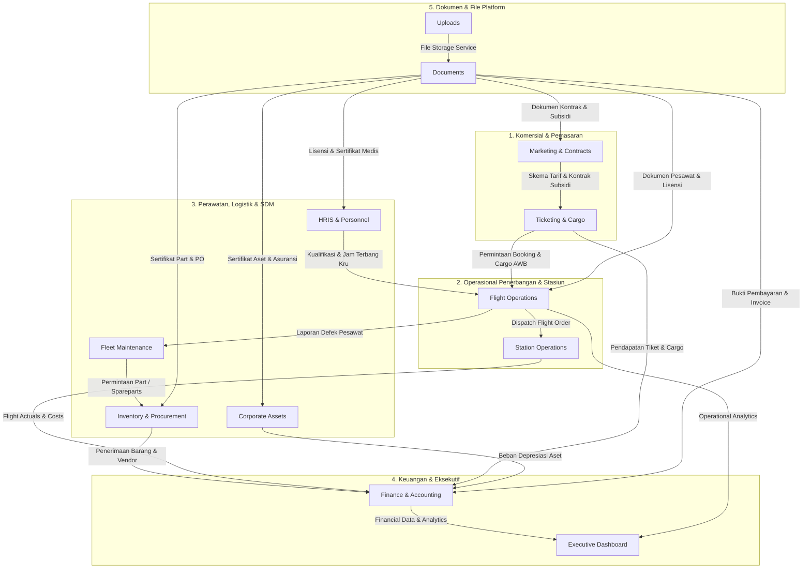
```mermaid
flowchart TD
    subgraph Commercial ["1. Komersial & Pemasaran"]
        M1["Marketing & Contracts"]
        M2["Ticketing & Cargo"]
    end

    subgraph FlightOps ["2. Operasional Penerbangan & Stasiun"]
        M3["Flight Operations"]
        M4["Station Operations"]
    end

    subgraph Support ["3. Perawatan, Logistik & SDM"]
        M5["Fleet Maintenance"]
        M6["Inventory & Procurement"]
        M7["HRIS & Personnel"]
        M8["Corporate Assets"]
    end

    subgraph Financial ["4. Keuangan & Eksekutif"]
        M9["Finance & Accounting"]
        M10["Executive Dashboard"]
    end

    subgraph DocPlatform ["5. Dokumen & File Platform"]
        M11["Documents"]
        M12["Uploads"]
    end

    %% Connections / Flow
    M1 -->|Skema Tarif & Kontrak Subsidi| M2
    M2 -->|Permintaan Booking & Cargo AWB| M3
    M7 -->|Kualifikasi & Jam Terbang Kru| M3
    M3 -->|Dispatch Flight Order| M4
    M3 -->|Laporan Defek Pesawat| M5
    M5 -->|Permintaan Part / Spareparts| M6
    M6 -->|Penerimaan Barang & Vendor| M9
    M4 -->|Flight Actuals & Costs| M9
    M2 -->|Pendapatan Tiket & Cargo| M9
    M8 -->|Beban Depresiasi Aset| M9
    M9 -->|Financial Data & Analytics| M10
    M3 -->|Operational Analytics| M10

    %% Documents & Uploads Connections
    M12 -->|File Storage Service| M11
    M11 -->|Dokumen Pesawat & Lisensi| M3
    M11 -->|Sertifikat Part & PO| M6
    M11 -->|Lisensi & Sertifikat Medis| M7
    M11 -->|Dokumen Kontrak & Subsidi| M1
    M11 -->|Bukti Pembayaran & Invoice| M9
    M11 -->|Sertifikat Aset & Asuransi| M8
```

### 0.1 Deskripsi Master Overview

- **Tujuan & Cakupan**: Diagram Master Overview memetakan keseluruhan ekosistem bisnis PT Associated Mission Aviation (AMA) ke dalam **12 modul** yang dikelompokkan dalam **5 klaster fungsional**. Diagram ini menjadi _single source of truth_ untuk memahami alur data end-to-end, dependensi antar-modul, dan titik integrasi kritis dalam operasional penerbangan STOL di Papua.

- **Klaster Fungsional**:

  | #   | Klaster                               | Modul                                                                          | Fungsi Inti                                                                                                                                                                                  |
  | --- | ------------------------------------- | ------------------------------------------------------------------------------ | -------------------------------------------------------------------------------------------------------------------------------------------------------------------------------------------- |
  | 1   | **Komersial & Pemasaran**             | Marketing & Contracts, Ticketing & Cargo                                       | Pengelolaan kontrak/subsidi pemerintah, penetapan tarif (_Rate Card_), reservasi tiket penumpang, dan penerbitan Air Waybill (AWB) kargo                                                     |
  | 2   | **Operasional Penerbangan & Stasiun** | Flight Operations, Station Operations                                          | Perencanaan & pelaksanaan penerbangan (flight request → flight order → closure), pengelolaan stasiun darat, manifes, fuel control, dan dual sign-off                                         |
  | 3   | **Perawatan, Logistik & SDM**         | Fleet Maintenance, Inventory & Procurement, HRIS & Personnel, Corporate Assets | Perawatan armada pesawat (work package, job card, release to service), pengadaan suku cadang (PR → PO → GR), manajemen SDM/lisensi pilot, dan aset korporat non-pesawat (GSE, kendaraan, IT) |
  | 4   | **Keuangan & Eksekutif**              | Finance & Accounting, Executive Dashboard                                      | Penerbitan invoice, pencatatan jurnal (_double-entry_), kalkulasi HPP penerbangan, trial balance, dan dashboard KPI eksekutif                                                                |
  | 5   | **Dokumen & File Platform**           | Documents, Uploads                                                             | Manajemen dokumen master terpusat (verifikasi, supersede, expiry tracking) untuk 19+ tipe entitas, serta layanan penyimpanan file (_file storage_)                                           |

- **Alur Integrasi Antar-Modul (Narasi)**:
  1. **Komersial → Operasional**: Modul _Marketing & Contracts_ menyuplai skema tarif dan kontrak subsidi rintis ke _Ticketing & Cargo_. Booking tiket/kargo yang telah diterbitkan akan mengalir sebagai permintaan penerbangan ke _Flight Operations_.
  2. **SDM → Operasional**: _HRIS & Personnel_ memvalidasi kualifikasi pilot (lisensi CPL/ATPL, Medical Class 1, jam terbang FDP) sebelum _Flight Operations_ dapat mengalokasikan kru penerbangan.
  3. **Operasional → Stasiun**: _Flight Operations_ men-dispatch Flight Order ke _Station Operations_ untuk eksekusi ground handling, verifikasi fisik muatan, dan dual sign-off pre-departure.
  4. **Operasional → Perawatan**: Laporan defek pesawat dari pilot (_pilot logbook entry_) di-handoff dari _Flight Operations_ ke _Fleet Maintenance_ untuk pembuatan Work Order perbaikan.
  5. **Perawatan → Logistik**: _Fleet Maintenance_ meminta pengeluaran suku cadang (_parts requisition_) dari _Inventory & Procurement_ untuk mendukung eksekusi perbaikan pesawat.
  6. **Multi-modul → Keuangan**: Transaksi dari _Ticketing_ (pendapatan tiket/kargo), _Station Operations_ (biaya operasional stasiun), _Inventory_ (penerimaan barang & vendor), dan _Corporate Assets_ (beban depresiasi) semuanya mengalir ke _Finance & Accounting_ untuk pencatatan jurnal dan laporan keuangan.
  7. **Keuangan & Operasional → Eksekutif**: Data analitik dari _Finance & Accounting_ dan _Flight Operations_ diagregasi ke _Executive Dashboard_ untuk pemantauan KPI real-time oleh jajaran direksi.
  8. **Dokumen → Seluruh Modul**: _Uploads_ menyediakan layanan penyimpanan file fisik, sedangkan _Documents_ mengelola metadata, verifikasi, dan lifecycle dokumen yang dibutuhkan oleh seluruh modul — mulai dari dokumen pesawat & lisensi pilot (Flight Ops, HRIS), sertifikat part & PO (Inventory), kontrak & subsidi (Marketing), bukti pembayaran (Finance), hingga sertifikat aset & asuransi (Corporate Assets).

- **Aktor Bisnis Lintas-Modul**:

  | Aktor                          | Modul Utama                           | Peran Kunci                                            |
  | ------------------------------ | ------------------------------------- | ------------------------------------------------------ |
  | Staff OCC / Flight Coordinator | Flight Operations, Station Operations | Perencanaan & pengawasan penerbangan                   |
  | Pilot in Command (PIC)         | Flight Operations, Station Operations | Eksekusi penerbangan, readiness check, defek reporting |
  | Chief Pilot                    | Flight Operations, HRIS               | Otorisasi alokasi kru & kualifikasi penerbang          |
  | Station Agent / Base Ops       | Station Operations                    | Ground handling & verifikasi fisik muatan              |
  | Counter Sales / Agensi         | Ticketing & Cargo                     | Reservasi, penerbitan tiket/AWB, pembayaran            |
  | Commercial Manager             | Ticketing, Marketing                  | Penetapan tarif, komisi agen, kontrak subsidi          |
  | Maintenance Engineer           | Fleet Maintenance, Inventory          | Perbaikan pesawat, permintaan part                     |
  | Quality Inspector              | Fleet Maintenance                     | Inspeksi independen & release to service               |
  | Petugas Gudang                 | Inventory & Procurement               | Stok management, penerimaan barang, cycle count        |
  | Procurement Manager            | Inventory & Procurement               | PR/PO management, negosiasi vendor                     |
  | HR Manager                     | HRIS & Personnel                      | Administrasi SDM, payroll, rekrutmen                   |
  | Crew Planning Officer          | HRIS, Flight Operations               | Jadwal kru, verifikasi jam terbang FDP                 |
  | Asset Manager                  | Corporate Assets                      | Registrasi, depresiasi, disposal aset non-pesawat      |
  | Staff Finance / Billing        | Finance & Accounting                  | Invoice, rekonsiliasi, jurnal posting                  |
  | CFO / Financial Controller     | Finance, Executive Dashboard          | Analisis keuangan, credit hold, penutupan buku         |
  | Direksi / CEO                  | Executive Dashboard                   | Keputusan strategis berdasarkan KPI                    |
  | Verifier / Compliance Officer  | Documents                             | Verifikasi keabsahan & kepatuhan dokumen               |

- **Alur Bisnis End-to-End (Workflow Makro)**:
  `Contract & Rate Setup (Marketing)` $\rightarrow$ `Booking & Ticketing (Commercial)` $\rightarrow$ `Flight Planning & Crew Assignment (Flight Ops + HRIS)` $\rightarrow$ `Document Readiness Check (Documents)` $\rightarrow$ `Ground Handling & Departure (Station Ops)` $\rightarrow$ `Flight Execution & Closure (Flight Ops)` $\rightarrow$ `Defect Handoff & Maintenance (Fleet Maintenance + Inventory)` $\rightarrow$ `Financial Posting & Invoicing (Finance)` $\rightarrow$ `Executive KPI Monitoring (Dashboard)`.

---

## 1. Modul Flight Operations (Operasional Penerbangan)

### 1.1 Diagram Business Use Case (Mermaid)

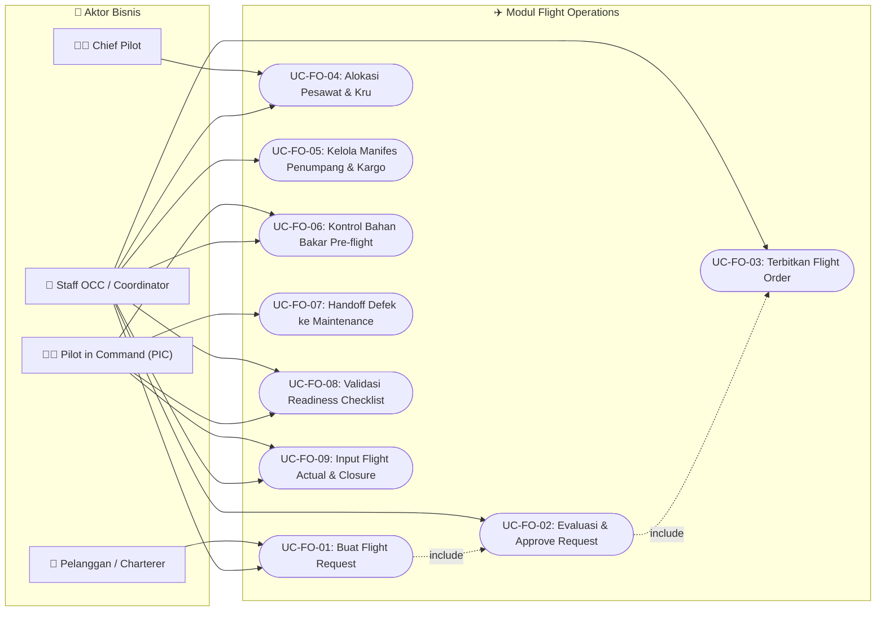
```mermaid
flowchart LR
    %% Actors
    subgraph Actors ["👥 Aktor Bisnis"]
        direction TB
        OCC["👤 Staff OCC / Coordinator"]
        Pilot["👨‍✈️ Pilot in Command (PIC)"]
        Charterer["🏢 Pelanggan / Charterer"]
        ChiefPilot["👨‍✈️ Chief Pilot"]
    end

    %% Module Boundary
    subgraph FlightOpsModule ["✈️ Modul Flight Operations"]
        direction TB
        UC1(["UC-FO-01: Buat Flight Request"])
        UC2(["UC-FO-02: Evaluasi & Approve Request"])
        UC3(["UC-FO-03: Terbitkan Flight Order"])
        UC4(["UC-FO-04: Alokasi Pesawat & Kru"])
        UC5(["UC-FO-05: Kelola Manifes Penumpang & Kargo"])
        UC6(["UC-FO-06: Kontrol Bahan Bakar Pre-flight"])
        UC7(["UC-FO-07: Handoff Defek ke Maintenance"])
        UC8(["UC-FO-08: Validasi Readiness Checklist"])
        UC9(["UC-FO-09: Input Flight Actual & Closure"])
    end

    %% Relationships
    Charterer --> UC1
    OCC --> UC1
    OCC --> UC2
    UC1 -.->|" include "| UC2
    OCC --> UC3
    UC2 -.->|" include "| UC3
    ChiefPilot --> UC4
    OCC --> UC4
    OCC --> UC5
    Pilot --> UC6
    OCC --> UC6
    Pilot --> UC7
    OCC --> UC8
    Pilot --> UC8
    Pilot --> UC9
    OCC --> UC9
```

### 1.2 Deskripsi Modul Flight Operations

- **Tujuan & Cakupan**: Mengelola seluruh siklus perencanaan penerbangan STOL (Short Take-Off and Landing), persetujuan rute, penjadwalan penerbangan charter/rutin/medevac, penugasan kru, pengelolaan manifes, hingga penutupan log operasional (_flight closure_).
- **Aktor Bisnis**:
  1. **Staff OCC / Flight Coordinator**: Membuat, mengesahkan flight request, menerbitkan flight order, dan memantau penerbangan.
  2. **Pilot in Command (PIC)**: Memeriksa readiness, menyetujui fuel control, melaporkan defek, dan mengonfirmasi flight actuals.
  3. **Chief Pilot**: Mengotorisasi alokasi kru dan kualifikasi penerbang.
  4. **Pelanggan / Charterer**: Mengajukan rute & kebutuhan penerbangan charter.
- **Daftar Business Use Cases**:
  - `UC-FO-01 [Buat Flight Request]`: Menginput pengajuan penerbangan baru melalui wizard 5 langkah (Rute, Jadwal, Muatan, Jenis Pesawat, Kontrak).
  - `UC-FO-02 [Evaluasi & Approve Request]`: Memeriksa kelayakan rute, kapasitas, dan status persetujuan operasional.
  - `UC-FO-03 [Terbitkan Flight Order]`: Mengubah request approved menjadi Flight Order resmi dengan nomor penerbangan unik.
  - `UC-FO-04 [Alokasi Pesawat & Kru]`: Menentukan registrasi pesawat (PK-...) dan penugasan PIC/FO sesuai jam terbang dan lisensi aktif.
  - `UC-FO-05 [Kelola Manifes Penumpang & Kargo]`: Mengkonsolidasi data tiket penumpang dan Air Waybill (AWB) kargo ke dalam manifes resmi penerbangan.
  - `UC-FO-06 [Kontrol Bahan Bakar Pre-flight]`: Menghitung dan mencatat fuel req, ramp fuel, dan burn fuel sesuai rute Papua.
  - `UC-FO-07 [Handoff Defek ke Maintenance]`: Mengirimkan laporan kerusahan/defek teknis hasil inspeksi pra-terbang ke tim teknik.
  - `UC-FO-08 [Validasi Readiness Checklist]`: Memastikan dokumen (NOTAM, Cuaca, Weight & Balance, Release) lengkap sebelum take-off.
  - `UC-FO-09 [Input Flight Actual & Closure]`: Mencatat jam block-off/block-on, airborne/landing, dan menutup siklus penerbangan.
- **Alur Bisnis (Workflow)**:
  `Flight Request Submitted` $\rightarrow$ `OCC Approval` $\rightarrow$ `Flight Order Generated` $\rightarrow$ `Crew/Aircraft Assignment` $\rightarrow$ `Manifest & Fuel Lock` $\rightarrow$ `Readiness Cleared` $\rightarrow$ `Flight Execution` $\rightarrow$ `Actual Log & Closure`.

---

## 2. Modul Station Operations (Operasional Stasiun Base)

### 2.1 Diagram Business Use Case (Mermaid)

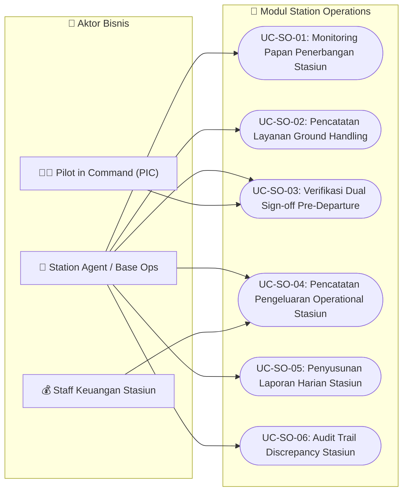
```mermaid
flowchart LR
    %% Actors
    subgraph Actors ["👥 Aktor Bisnis"]
        direction TB
        Agent["🏢 Station Agent / Base Ops"]
        Pilot["👨‍✈️ Pilot in Command (PIC)"]
        Finance["💰 Staff Keuangan Stasiun"]
    end

    %% Module Boundary
    subgraph StationOpsModule ["🛫 Modul Station Operations"]
        direction TB
        UC1(["UC-SO-01: Monitoring Papan Penerbangan Stasiun"])
        UC2(["UC-SO-02: Pencatatan Layanan Ground Handling"])
        UC3(["UC-SO-03: Verifikasi Dual Sign-off Pre-Departure"])
        UC4(["UC-SO-04: Pencatatan Pengeluaran Operational Stasiun"])
        UC5(["UC-SO-05: Penyusunan Laporan Harian Stasiun"])
        UC6(["UC-SO-06: Audit Trail Discrepancy Stasiun"])
    end

    %% Relationships
    Agent --> UC1
    Agent --> UC2
    Agent --> UC3
    Pilot --> UC3
    Agent --> UC4
    Finance --> UC4
    Agent --> UC5
    Agent --> UC6
```

### 2.2 Deskripsi Modul Station Operations

- **Tujuan & Cakupan**: Menangani operasional darat di stasiun/perintis (seperti Sentani, Wamena, Nabire, Timika, Dekai). Berfokus pada verifikasi keselamatan darat, _dual sign-off_ antara PIC dan Station Agent, layanan _ground handling_, serta pencatatan biaya kas kecil stasiun.
- **Aktor Bisnis**:
  1. **Station Agent / Base Ops**: Penanggung jawab operasional stasiun darat, bongkar muat, dan verifikasi fisik pesawat.
  2. **Pilot in Command (PIC)**: Melakukan pengecekan akhir di lapangan dan memberikan persetujuan bersama Station Agent.
  3. **Staff Keuangan Stasiun**: Mengelola kas kecil (_disbursements_) dan memverifikasi biaya penanganan lokal.
- **Daftar Business Use Cases**:
  - `UC-SO-01 [Monitoring Papan Penerbangan Stasiun]`: Memantau status kedatangan/keberangkatan pesawat di stasiun lokal secara real-time.
  - `UC-SO-02 [Pencatatan Layanan Ground Handling]`: Mencatat jasa penanganan darat (loading/unloading, catering, pembersihan, marshalling).
  - `UC-SO-03 [Verifikasi Dual Sign-off Pre-Departure]`: Eksekusi tanda tangan digital ganda (Pilot & Station Agent) yang mengesahkan berat muatan fisik sesuai manifes.
  - `UC-SO-04 [Pencatatan Pengeluaran Operational Stasiun]`: Menginput biaya lokal (retribusi bandara, landing fee, uang makan penanganan lokal).
  - `UC-SO-05 [Penyusunan Laporan Harian Stasiun]`: Mengompilasi ringkasan pergerakan pesawat, tonase kargo, dan jumlah penumpang harian.
  - `UC-SO-06 [Audit Trail Discrepancy Stasiun]`: Mengaudit selisih antara manifest rencana dengan realisasi fisik di stasiun.
- **Alur Bisnis (Workflow)**:
  `Flight Arrival at Station` $\rightarrow$ `Ground Handling Execution` $\rightarrow$ `Physical Cargo/Passenger Verification` $\rightarrow$ `Dual Sign-off Execution` $\rightarrow$ `Station Disbursement Logging` $\rightarrow$ `Daily Station Report Closure`.

---

## 3. Modul Ticketing & Commercial (Penjualan & Agen)

### 3.1 Diagram Business Use Case (Mermaid)

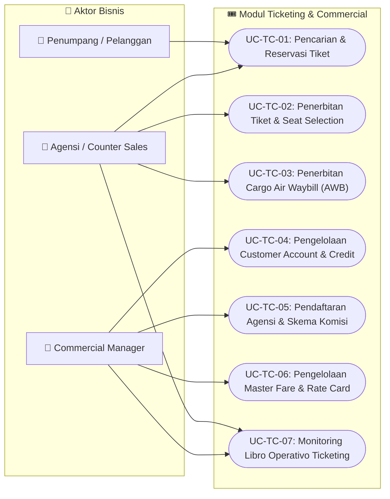
```mermaid
flowchart LR
    %% Actors
    subgraph Actors ["👥 Aktor Bisnis"]
        direction TB
        Customer["👤 Penumpang / Pelanggan"]
        Agent["🏢 Agensi / Counter Sales"]
        CommMgr["👔 Commercial Manager"]
    end

    %% Module Boundary
    subgraph TicketingModule ["🎟️ Modul Ticketing & Commercial"]
        direction TB
        UC1(["UC-TC-01: Pencarian & Reservasi Tiket"])
        UC2(["UC-TC-02: Penerbitan Tiket & Seat Selection"])
        UC3(["UC-TC-03: Penerbitan Cargo Air Waybill (AWB)"])
        UC4(["UC-TC-04: Pengelolaan Customer Account & Credit"])
        UC5(["UC-TC-05: Pendaftaran Agensi & Skema Komisi"])
        UC6(["UC-TC-06: Pengelolaan Master Fare & Rate Card"])
        UC7(["UC-TC-07: Monitoring Libro Operativo Ticketing"])
    end

    %% Relationships
    Customer --> UC1
    Agent --> UC1
    Agent --> UC2
    Agent --> UC3
    CommMgr --> UC4
    CommMgr --> UC5
    CommMgr --> UC6
    Agent --> UC7
    CommMgr --> UC7
```

### 3.2 Deskripsi Modul Ticketing & Commercial

- **Tujuan & Cakupan**: Mengelola seluruh alur komersial penerbangan, mulai dari reservasi tiket penumpang, penimbangan kargo & penerbitan AWB (Air Waybill), penetapan tarif dinamis (_Rate Cards_), manajemen akun pelanggan korporat, hingga perhitungan komisi agensi.
- **Aktor Bisnis**:
  1. **Penumpang / Pelanggan Korporat**: Mengajukan pembelian tiket atau pengiriman kargo.
  2. **Agensi / Counter Sales**: Menginput reservasi, mencetak tiket, menimbang kargo, dan mengumpulkan pembayaran.
  3. **Commercial Manager**: Menentukan struktur tarif, memverifikasi batas kredit pelanggan (_credit limit_), dan menyetujui komisi agen.
- **Daftar Business Use Cases**:
  - `UC-TC-01 [Pencarian & Reservasi Tiket]`: Mencari ketersediaan kursi penerbangan rutin dan membuat _booking reservation_.
  - `UC-TC-02 [Penerbitan Tiket & Seat Selection]`: Memproses pembayaran, memilih tempat duduk, dan menerbitkan e-ticket/boarding pass.
  - `UC-TC-03 [Penerbitan Cargo Air Waybill (AWB)]`: Mencatat dimensi, berat, kategori barang (termasuk _Dangerous Goods_), dan menerbitkan resi AWB kargo.
  - `UC-TC-04 [Pengelolaan Customer Account & Credit]`: Menetapkan _credit limit_, _payment terms_, dan pemantauan _credit-hold_ untuk akun korporat.
  - `UC-TC-05 [Pendaftaran Agensi & Skema Komisi]`: Mengatur profil agen penjualan, hak komisi (_commission rules_), dan status keaktifan channel.
  - `UC-TC-06 [Pengelolaan Master Fare & Rate Card]`: Mengonfigurasi matriks tarif penerbangan per rute, kelas, dan periode efektif.
  - `UC-TC-07 [Monitoring Libro Operativo Ticketing]`: Memantau rekapitulasi harian transaksi penjualan tiket/kargo per stasiun/pos.
- **Alur Bisnis (Workflow)**:
  `Customer Booking / Cargo Booking` $\rightarrow$ `Rate Card Calculation` $\rightarrow$ `Credit Limit / Cash Verification` $\rightarrow$ `Ticket / AWB Issuance` $\rightarrow$ `Manifest Aggregation` $\rightarrow$ `Commission & Finance Posting`.

---

## 4. Modul Marketing, Contracts & Subsidies (Pemasaran & Kontrak)

### 4.1 Diagram Business Use Case (Mermaid)

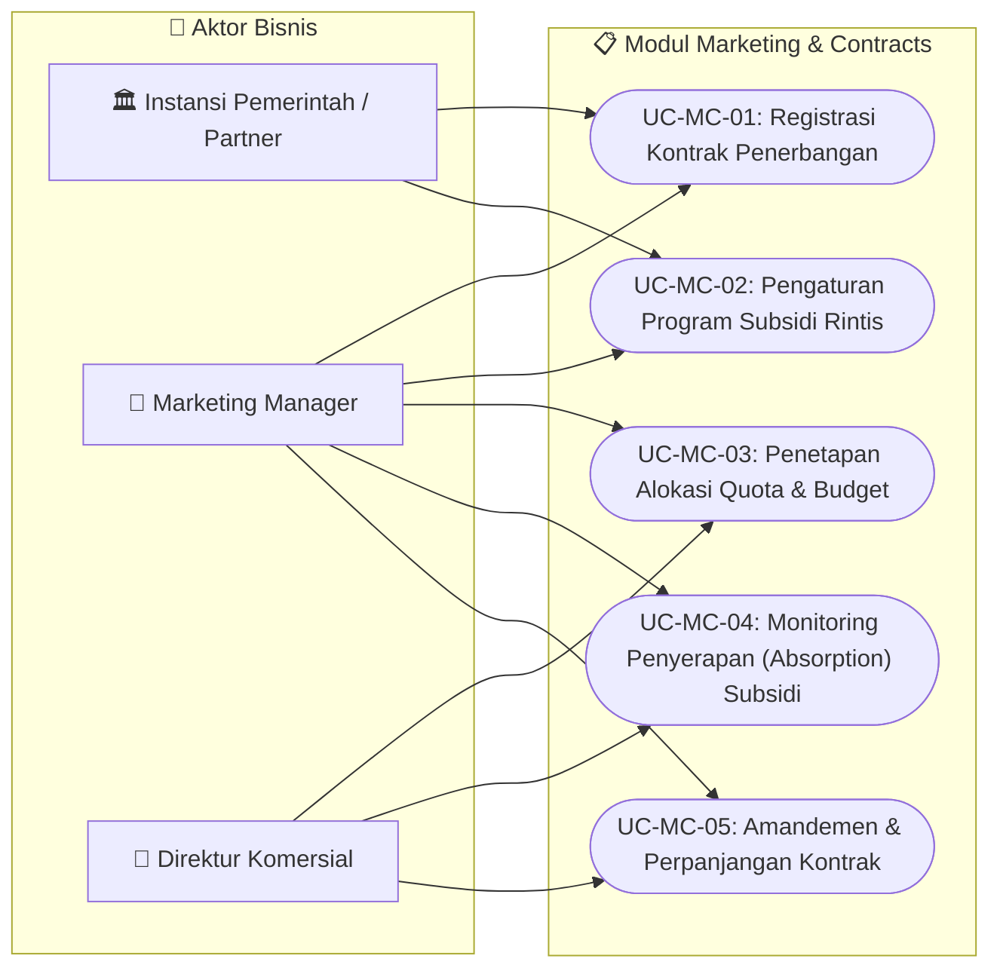
```mermaid
flowchart LR
    %% Actors
    subgraph Actors ["👥 Aktor Bisnis"]
        direction TB
        GovPartner["🏛️ Instansi Pemerintah / Partner"]
        MktgManager["👔 Marketing Manager"]
        DirCom["🏢 Direktur Komersial"]
    end

    %% Module Boundary
    subgraph MarketingModule ["📋 Modul Marketing & Contracts"]
        direction TB
        UC1(["UC-MC-01: Registrasi Kontrak Penerbangan"])
        UC2(["UC-MC-02: Pengaturan Program Subsidi Rintis"])
        UC3(["UC-MC-03: Penetapan Alokasi Quota & Budget"])
        UC4(["UC-MC-04: Monitoring Penyerapan (Absorption) Subsidi"])
        UC5(["UC-MC-05: Amandemen & Perpanjangan Kontrak"])
    end

    %% Relationships
    GovPartner --> UC1
    MktgManager --> UC1
    GovPartner --> UC2
    MktgManager --> UC2
    DirCom --> UC3
    MktgManager --> UC3
    MktgManager --> UC4
    DirCom --> UC4
    DirCom --> UC5
    MktgManager --> UC5
```

### 4.2 Deskripsi Modul Marketing, Contracts & Subsidies

- **Tujuan & Cakupan**: Memfasilitasi pengelolaan kontrak jangka panjang dengan pemerintah daerah/kementerian (seperti penerbangan subsidi rintis daerah terpencil) serta kontrak _charter_ korporat berulang.
- **Aktor Bisnis**:
  1. **Instansi Pemerintah / Partner**: Pihak pemberi kerja atau penyedia alokasi dana subsidi rintis.
  2. **Marketing Manager**: Menyusun draft kontrak, mengatur parameter program subsidi, dan memantau realisasi.
  3. **Direktur Komersial**: Mengotorisasi kontrak bernilai besar dan menyetujui perubahan adendum kontrak.
- **Daftar Business Use Cases**:
  - `UC-MC-01 [Registrasi Kontrak Penerbangan]`: Mencatat kontrak komersial baru, lampiran dokumen, cakupan rute, dan masa berlaku.
  - `UC-MC-02 [Pengaturan Program Subsidi Rintis]`: Menentukan aturan subsidi (potongan harga per penumpang/kargo yang ditanggung pemerintah).
  - `UC-MC-03 [Penetapan Alokasi Quota & Budget]`: Mengalokasikan plafon anggaran dan batas maksimum jam terbang/penerbangan yang disubsidi.
  - `UC-MC-04 [Monitoring Penyerapan (Absorption) Subsidi]`: Memantau secara real-time tingkat penyerapan anggaran subsidi dari penerbangan yang telah terealisasi.
  - `UC-MC-05 [Amandemen & Perpanjangan Kontrak]`: Memproses perpanjangan durasi atau perubahan klausul harga kontrak.
- **Alur Bisnis (Workflow)**:
  `Contract Agreement` $\rightarrow$ `Subsidy Program Setup` $\rightarrow$ `Budget Allocation` $\rightarrow$ `Flight Execution Linking` $\rightarrow$ `Subsidy Absorption Tracking` $\rightarrow$ `Government Billing Handoff`.

---

## 5. Modul Finance & Accounting (Keuangan & Akuntansi)

### 5.1 Diagram Business Use Case (Mermaid)

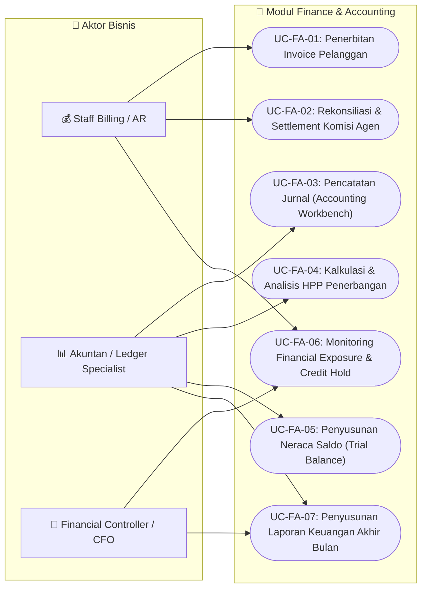
```mermaid
flowchart LR
    %% Actors
    subgraph Actors ["👥 Aktor Bisnis"]
        direction TB
        FinanceStaff["💰 Staff Billing / AR"]
        Accountant["📊 Akuntan / Ledger Specialist"]
        CFO["👔 Financial Controller / CFO"]
    end

    %% Module Boundary
    subgraph FinanceModule ["🏦 Modul Finance & Accounting"]
        direction TB
        UC1(["UC-FA-01: Penerbitan Invoice Pelanggan"])
        UC2(["UC-FA-02: Rekonsiliasi & Settlement Komisi Agen"])
        UC3(["UC-FA-03: Pencatatan Jurnal (Accounting Workbench)"])
        UC4(["UC-FA-04: Kalkulasi & Analisis HPP Penerbangan"])
        UC5(["UC-FA-05: Penyusunan Neraca Saldo (Trial Balance)"])
        UC6(["UC-FA-06: Monitoring Financial Exposure & Credit Hold"])
        UC7(["UC-FA-07: Penyusunan Laporan Keuangan Akhir Bulan"])
    end

    %% Relationships
    FinanceStaff --> UC1
    FinanceStaff --> UC2
    Accountant --> UC3
    Accountant --> UC4
    Accountant --> UC5
    FinanceStaff --> UC6
    CFO --> UC6
    CFO --> UC7
    Accountant --> UC7
```

### 5.2 Deskripsi Modul Finance & Accounting

- **Tujuan & Cakupan**: Mengelola seluruh siklus transaksi keuangan AMA, meliputi _Accounts Receivable (AR)_, _Accounts Payable (AP)_, pencatatan jurnal umum, perhitungan _Harga Pokok Penjualan (HPP)_ per penerbangan, neraca saldo (_Trial Balance_), hingga laporan rugi laba operasional.
- **Aktor Bisnis**:
  1. **Staff Billing / AR**: Membuat tagihan invoice, mencatat pelunasan, dan memantau piutang jatuh tempo.
  2. **Akuntan / Ledger Specialist**: Mengelola buku besar (_general ledger_), posting jurnal transaksi, dan perhitungan HPP.
  3. **Financial Controller / CFO**: Menganalisis kinerja keuangan, menyetujui _credit hold_, dan menutup buku akhir bulan.
- **Daftar Business Use Cases**:
  - `UC-FA-01 [Penerbitan Invoice Pelanggan]`: Menggenerate tagihan invoice otomatis dari penerbangan/booking yang telah selesai.
  - `UC-FA-02 [Rekonsiliasi & Settlement Komisi Agen]`: Memproses perhitungan dan pembayaran hutang komisi kepada agen komersial.
  - `UC-FA-03 [Pencatatan Jurnal (Accounting Workbench)]`: Menginput dan memverifikasi _double-entry journal postings_ (Debit/Kredit).
  - `UC-FA-04 [Kalkulasi & Analisis HPP Penerbangan]`: Menghitung HPP komprehensif (fuel, crew allowance, maintenance reserve, landing fee) per rute/jam terbang.
  - `UC-FA-05 [Penyusunan Neraca Saldo (Trial Balance)]`: Menampilkan saldo akhir seluruh akun perkiraan secara terstruktur.
  - `UC-FA-06 [Monitoring Financial Exposure & Credit Hold]`: Mengunci transaksi pelanggan secara otomatis apabila batas kredit atau piutang overdue terlampaui.
  - `UC-FA-07 [Penyusunan Laporan Keuangan Akhir Bulan]`: Mengompilasi Laporan Laba/Rugi, Neraca, dan Arus Kas.
- **Alur Bisnis (Workflow)**:
  `Flight Closure / Goods Receipt` $\rightarrow$ `Invoice & AP Generation` $\rightarrow$ `Ledger Journal Posting` $\rightarrow$ `HPP Allocation` $\rightarrow$ `Trial Balance Verification` $\rightarrow$ `Financial Reporting`.

---

## 6. Modul Inventory & Procurement (Pengadaan & Inventori)

### 6.1 Diagram Business Use Case (Mermaid)

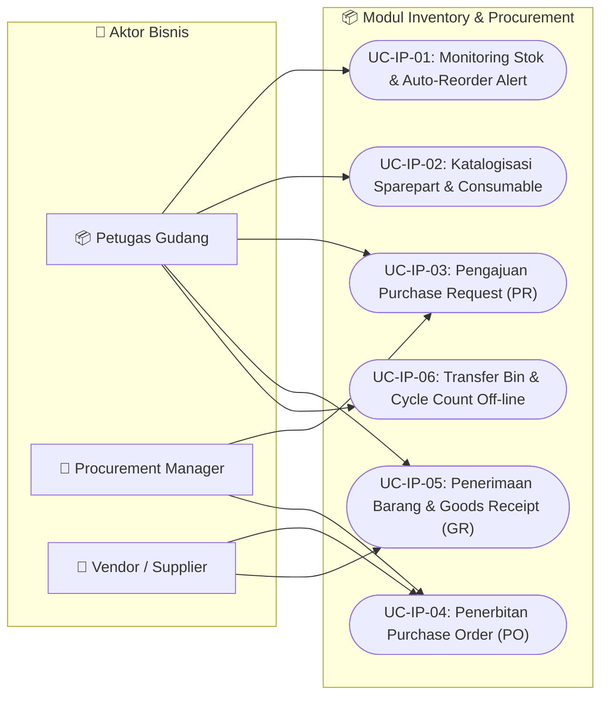
```mermaid
flowchart LR
    %% Actors
    subgraph Actors ["👥 Aktor Bisnis"]
        direction TB
        WarehouseKeeper["📦 Petugas Gudang"]
        ProcurementMgr["🛒 Procurement Manager"]
        Vendor["🏢 Vendor / Supplier"]
    end

    %% Module Boundary
    subgraph InventoryModule ["📦 Modul Inventory & Procurement"]
        direction TB
        UC1(["UC-IP-01: Monitoring Stok & Auto-Reorder Alert"])
        UC2(["UC-IP-02: Katalogisasi Sparepart & Consumable"])
        UC3(["UC-IP-03: Pengajuan Purchase Request (PR)"])
        UC4(["UC-IP-04: Penerbitan Purchase Order (PO)"])
        UC5(["UC-IP-05: Penerimaan Barang & Goods Receipt (GR)"])
        UC6(["UC-IP-06: Transfer Bin & Cycle Count Off-line"])
    end

    %% Relationships
    WarehouseKeeper --> UC1
    WarehouseKeeper --> UC2
    WarehouseKeeper --> UC3
    ProcurementMgr --> UC3
    ProcurementMgr --> UC4
    Vendor --> UC4
    WarehouseKeeper --> UC5
    Vendor --> UC5
    WarehouseKeeper --> UC6
```

### 6.2 Deskripsi Modul Inventory & Procurement

- **Tujuan & Cakupan**: Menjamin ketersediaan suku cadang pesawat (_aircraft spare parts_), komponen kritis, oli/pelumas, serta alat pendukung operasional stasiun di berbagai gudang (Sentani, Nabire, dll).
- **Aktor Bisnis**:
  1. **Petugas Gudang**: Menangani mutasi barang fisik, pemeriksaan penerimaan, dan penguncian lokasi bin.
  2. **Procurement Manager**: Mengelola vendor, negosiasi harga, dan menyetujui pemesanan pembelian.
  3. **Vendor / Supplier**: Penyedia suku cadang pesawat dan bahan konsumsi penerbangan.
- **Daftar Business Use Cases**:
  - `UC-IP-01 [Monitoring Stok & Auto-Reorder Alert]`: Memantau kuantitas suku cadang dan memicu notifikasi saat stok menyentuh _minimum safety stock_.
  - `UC-IP-02 [Katalogisasi Sparepart & Consumable]`: Mengelola master data item (Part Number, Serial Number, Batch, Expiry, Shelf Life).
  - `UC-IP-03 [Pengajuan Purchase Request (PR)]`: Mengajukan kebutuhan pembelian barang baru oleh unit gudang/teknik.
  - `UC-IP-04 [Penerbitan Purchase Order (PO)]`: Membuat dokumen PO resmi ke vendor berlisensi penerbangan.
  - `UC-IP-05 [Penerimaan Barang & Goods Receipt (GR)]`: Memeriksa kondisi fisik, sertifikat airworthiness (FORM 1/EASA/FAA), dan mencatat GR.
  - `UC-IP-06 [Transfer Bin & Cycle Count Off-line]`: Melakukan pemindahan barang antar-gudang stasiun dan stok opname berkala.
- **Alur Bisnis (Workflow)**:
  `Low Stock Alert` $\rightarrow$ `Purchase Request (PR)` $\rightarrow$ `PO Authorization` $\rightarrow$ `Vendor Shipment` $\rightarrow$ `Goods Receipt (GR) & Certificate Inspection` $\rightarrow$ `Bin Putaway & Inventory Update`.

---

## 7. Modul Fleet Maintenance & Repairables (Perawatan Pesawat)

### 7.1 Diagram Business Use Case (Mermaid)

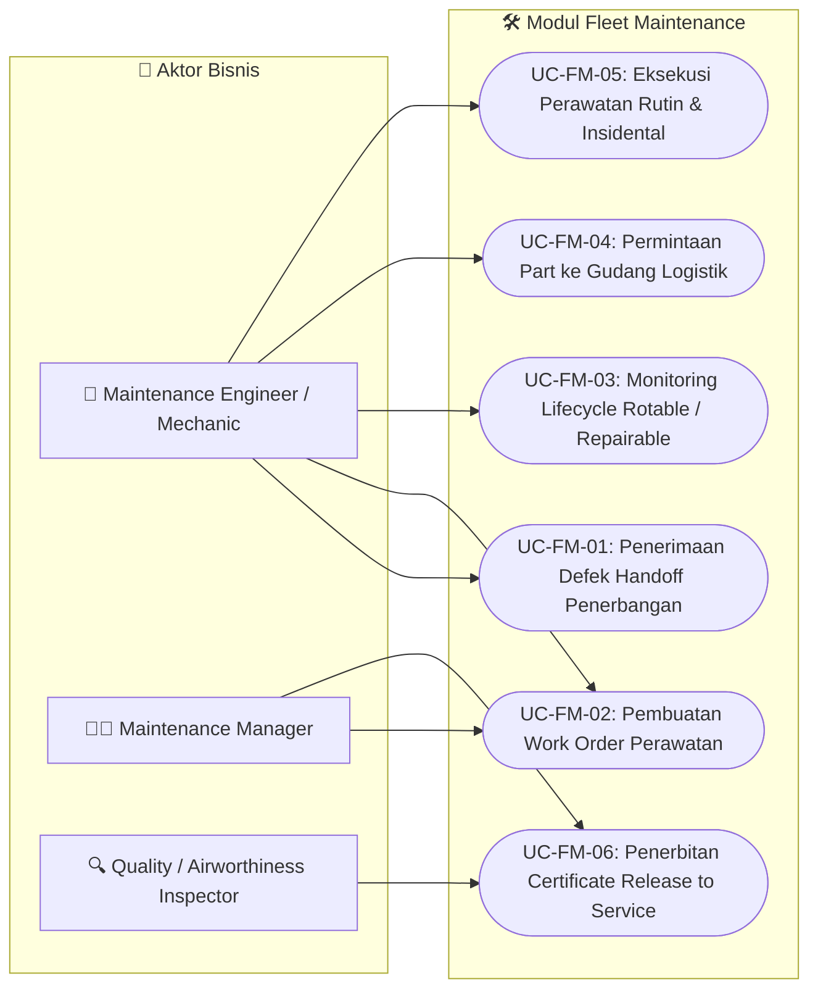
```mermaid
flowchart LR
    %% Actors
    subgraph Actors ["👥 Aktor Bisnis"]
        direction TB
        Engineer["🔧 Maintenance Engineer / Mechanic"]
        MaintMgr["👨‍✈️ Maintenance Manager"]
        Inspector["🔍 Quality / Airworthiness Inspector"]
    end

    %% Module Boundary
    subgraph MaintenanceModule ["🛠️ Modul Fleet Maintenance"]
        direction TB
        UC1(["UC-FM-01: Penerimaan Defek Handoff Penerbangan"])
        UC2(["UC-FM-02: Pembuatan Work Order Perawatan"])
        UC3(["UC-FM-03: Monitoring Lifecycle Rotable / Repairable"])
        UC4(["UC-FM-04: Permintaan Part ke Gudang Logistik"])
        UC5(["UC-FM-05: Eksekusi Perawatan Rutin & Insidental"])
        UC6(["UC-FM-06: Penerbitan Certificate Release to Service"])
    end

    %% Relationships
    Engineer --> UC1
    MaintMgr --> UC2
    Engineer --> UC2
    Engineer --> UC3
    Engineer --> UC4
    Engineer --> UC5
    Inspector --> UC6
    MaintMgr --> UC6
```

### 7.2 Deskripsi Modul Fleet Maintenance & Repairables

- **Tujuan & Cakupan**: Memastikan seluruh armada pesawat AMA (seperti Cessna Caravan 208B, Pilatus PC-6) selalu berada dalam kondisi laik terbang (_airworthy_), mengelola jadwal perawatan berkala (A-Check, C-Check), serta melacak siklus hidup komponen berharga (_rotable/repairable parts_).
- **Aktor Bisnis**:
  1. **Maintenance Engineer / Mechanic**: Pelaksana perbaikan, pencatat log teknis, dan pemasang komponen.
  2. **Maintenance Manager**: Perencana jadwal perawatan dan pengalokasi sumber daya bengkel/hangar.
  3. **Quality / Airworthiness Inspector**: Pengawas independen yang mengesahkan kelaikan terbang pesawat pasca-perawatan.
- **Daftar Business Use Cases**:
  - `UC-FM-01 [Penerimaan Defek Handoff Penerbangan]`: Menindaklanjuti catatan kerusakan (_pilot logbook entry_) dari tim flight operations.
  - `UC-FM-02 [Pembuatan Work Order Perawatan]`: Menerbitkan Perintah Kerja (WO) lengkap dengan instruksi langkah perbaikan teknis.
  - `UC-FM-03 [Monitoring Lifecycle Rotable / Repairable]`: Melacak status komponen yang dirombak (_overhaul_), di-repair, atau dikirim ke _workshop_ eksternal.
  - `UC-FM-04 [Permintaan Part ke Gudang Logistik]`: Meminta pengeluaran suku cadang dari inventori gudang untuk pemakaian perbaikan pesawat.
  - `UC-FM-05 [Eksekusi Perawatan Rutin & Insidental]`: Menginput tindakan perbaikan teknis yang telah dilakukan oleh teknisi.
  - `UC-FM-06 [Penerbitan Certificate Release to Service]`: Menandatangani rilis resmi bahwa pesawat siap dikembalikan ke siklus operasional terbang.
- **Alur Bisnis (Workflow)**:
  `Defect Logged / Flight Hours Limit Hit` $\rightarrow$ `Work Order Generated` $\rightarrow$ `Parts Requisition` $\rightarrow$ `Repair Execution` $\rightarrow$ `Quality Inspection` $\rightarrow$ `Release to Service Issued` $\rightarrow$ `Aircraft Status Active`.

---

## 8. Modul Corporate Assets (Aset Korporat Non-Pesawat)

### 8.1 Diagram Business Use Case (Mermaid)

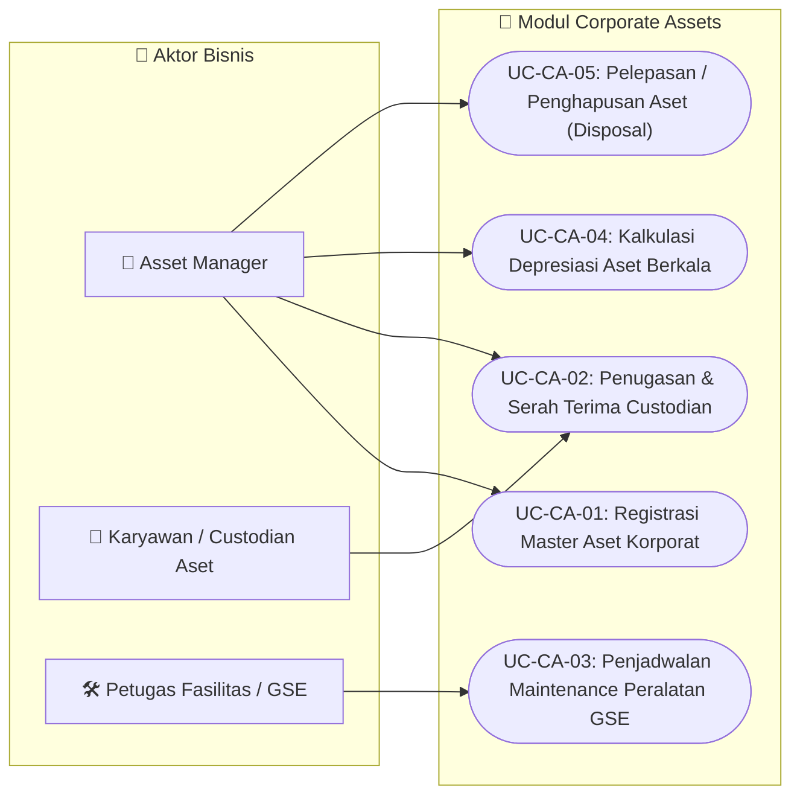
```mermaid
flowchart LR
    %% Actors
    subgraph Actors ["👥 Aktor Bisnis"]
        direction TB
        AssetMgr["🏢 Asset Manager"]
        Custodian["👤 Karyawan / Custodian Aset"]
        FacilityOfficer["🛠️ Petugas Fasilitas / GSE"]
    end

    %% Module Boundary
    subgraph AssetModule ["🏬 Modul Corporate Assets"]
        direction TB
        UC1(["UC-CA-01: Registrasi Master Aset Korporat"])
        UC2(["UC-CA-02: Penugasan & Serah Terima Custodian"])
        UC3(["UC-CA-03: Penjadwalan Maintenance Peralatan GSE"])
        UC4(["UC-CA-04: Kalkulasi Depresiasi Aset Berkala"])
        UC5(["UC-CA-05: Pelepasan / Penghapusan Aset (Disposal)"])
    end

    %% Relationships
    AssetMgr --> UC1
    AssetMgr --> UC2
    Custodian --> UC2
    FacilityOfficer --> UC3
    AssetMgr --> UC4
    AssetMgr --> UC5
```

### 8.2 Deskripsi Modul Corporate Assets

- **Tujuan & Cakupan**: Pengelolaan aset fisik non-pesawat milik perusahaan, seperti _Ground Support Equipment (GSE)_ (tug, GPU, loader), armada kendaraan darat stasiun, perangkat IT, serta fasilitas perkantoran & hangar.
- **Aktor Bisnis**:
  1. **Asset Manager**: Pengelola master inventaris aset, penanggung jawab nilai dan lokasi aset.
  2. **Karyawan / Custodian Aset**: Pengguna fisik yang bertanggung jawab atas aset yang ditugaskan.
  3. **Petugas Fasilitas / GSE**: Teknisi pemeliharaan sarana darat dan perbaikan aset non-pesawat.
- **Daftar Business Use Cases**:
  - `UC-CA-01 [Registrasi Master Aset Korporat]`: Menginput aset baru, tag nomor seri/barcode, nilai perolehan, dan lokasi stasiun.
  - `UC-CA-02 [Penugasan & Serah Terima Custodian]`: Mencatat pemindahtanganan tanggung jawab penggunaan aset ke karyawan/unit kerja.
  - `UC-CA-03 [Penjadwalan Maintenance Peralatan GSE]`: Mengatur servois berkala untuk peralatan pendukung darat penerbangan.
  - `UC-CA-04 [Kalkulasi Depresiasi Aset Berkala]`: Menghitung penyusutan nilai buku aset secara periodik untuk integrasi laporan keuangan.
  - `UC-CA-05 [Pelepasan / Penghapusan Aset (Disposal)]`: Memproses penjualan, pelelangan, atau pemusnahan aset yang telah habis masa pakainya.
- **Alur Bisnis (Workflow)**:
  `Asset Acquisition` $\rightarrow$ `Master Registration` $\rightarrow$ `Custodian Assignment` $\rightarrow$ `Periodic GSE Maintenance & Depreciation` $\rightarrow$ `Retirement / Disposal`.

---

## 9. Modul HRIS & Personnel (SDM & Kualifikasi Kru)

### 9.1 Diagram Business Use Case (Mermaid)

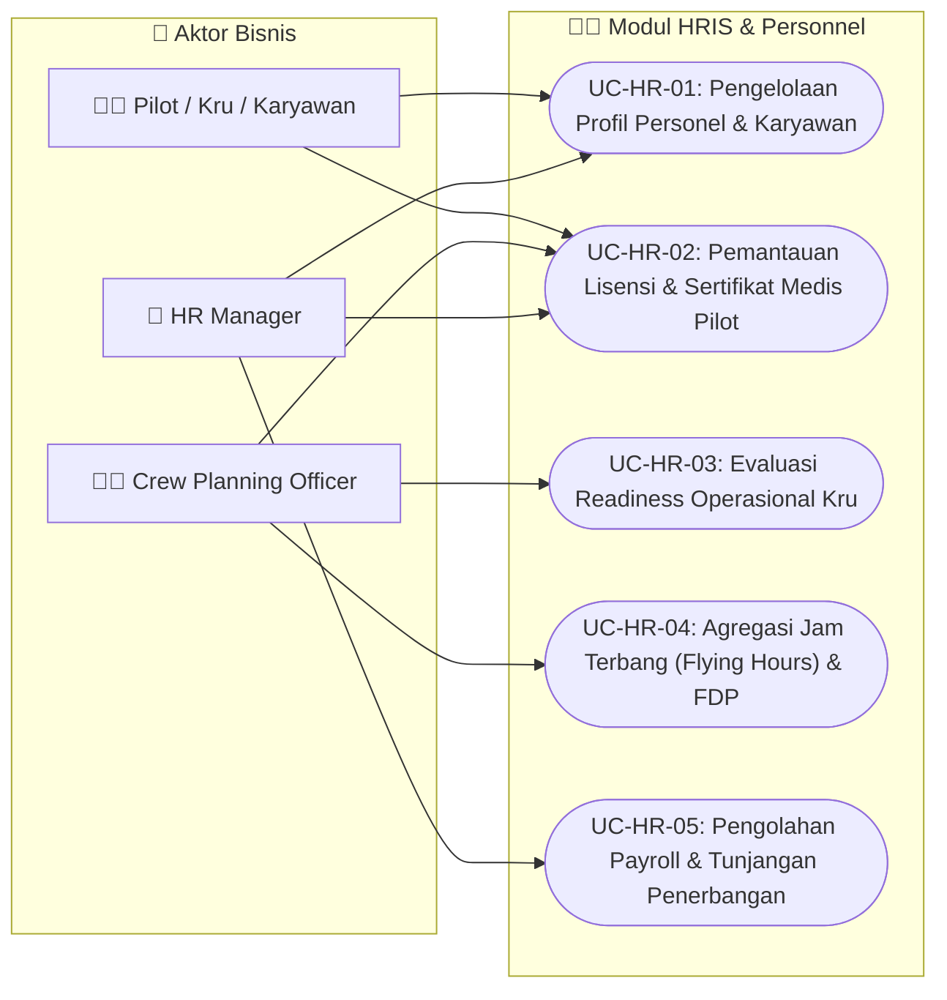
```mermaid
flowchart LR
    %% Actors
    subgraph Actors ["👥 Aktor Bisnis"]
        direction TB
        HRManager["👔 HR Manager"]
        CrewPlanner["👨‍✈️ Crew Planning Officer"]
        PersonnelUser["👨‍✈️ Pilot / Kru / Karyawan"]
    end

    %% Module Boundary
    subgraph HRISModule ["👨‍💼 Modul HRIS & Personnel"]
        direction TB
        UC1(["UC-HR-01: Pengelolaan Profil Personel & Karyawan"])
        UC2(["UC-HR-02: Pemantauan Lisensi & Sertifikat Medis Pilot"])
        UC3(["UC-HR-03: Evaluasi Readiness Operasional Kru"])
        UC4(["UC-HR-04: Agregasi Jam Terbang (Flying Hours) & FDP"])
        UC5(["UC-HR-05: Pengolahan Payroll & Tunjangan Penerbangan"])
    end

    %% Relationships
    HRManager --> UC1
    PersonnelUser --> UC1
    HRManager --> UC2
    CrewPlanner --> UC2
    PersonnelUser --> UC2
    CrewPlanner --> UC3
    CrewPlanner --> UC4
    HRManager --> UC5
```

### 9.2 Deskripsi Modul HRIS & Personnel

- **Tujuan & Cakupan**: Mengelola data induk SDM, melacak kepatuhan lisensi penerbang (_Type Ratings_, _First Class Medical Certificate_), mengagregasi jam terbang (_Flight Duty Period_) guna mencegah kelelahan (_fatigue_), dan memproses penggajian (_payroll_).
- **Aktor Bisnis**:
  1. **HR Manager**: Pengelola administrasi kepegawaian, kontrak kerja, dan penggajian karyawan.
  2. **Crew Planning Officer**: Perencana penugasan kru penerbangan yang memverifikasi jam terbang dan kesiapan lisensi.
  3. **Pilot / Kru / Karyawan**: Pemilik lisensi yang memperbarui dokumen dan menerima tunjangan penerbangan.
- **Daftar Business Use Cases**:
  - `UC-HR-01 [Pengelolaan Profil Personel & Karyawan]`: Memelihara data identitas, posisi, stasiun penugasan, dan status hubungan kerja.
  - `UC-HR-02 [Pemantauan Lisensi & Sertifikat Medis Pilot]`: Melacak tanggal kadaluarsa Lisensi (CPL/ATPL), Medical Class 1, dan Type Rating.
  - `UC-HR-03 [Evaluasi Readiness Operasional Kru]`: Menguji secara otomatis apakah seorang penerbang memenuhi syarat regulasi untuk ditugaskan terbang hari ini.
  - `UC-HR-04 [Agregasi Jam Terbang (Flying Hours) & FDP]`: Menghitung jam terbang akumulatif bulanan/tahunan dari data Flight Closure untuk menjaga batas regulasi FDP (_Flight Duty Period_).
  - `UC-HR-05 [Pengolahan Payroll & Tunjangan Penerbangan]`: Menghitung gaji pokok, tunjangan jam terbang (_flight pay_), dan insentif stasiun terpencil Papua.
- **Alur Bisnis (Workflow)**:
  `Employee Onboarding` $\rightarrow$ `License & Medical Record Entry` $\rightarrow$ `Flight Execution Jam Terbang Sync` $\rightarrow$ `Readiness Verification` $\rightarrow$ `Payroll & Allowance Calculation`.

---

## 10. Modul Executive Dashboard & Analytics (Pemantauan Eksekutif)

### 10.1 Diagram Business Use Case (Mermaid)

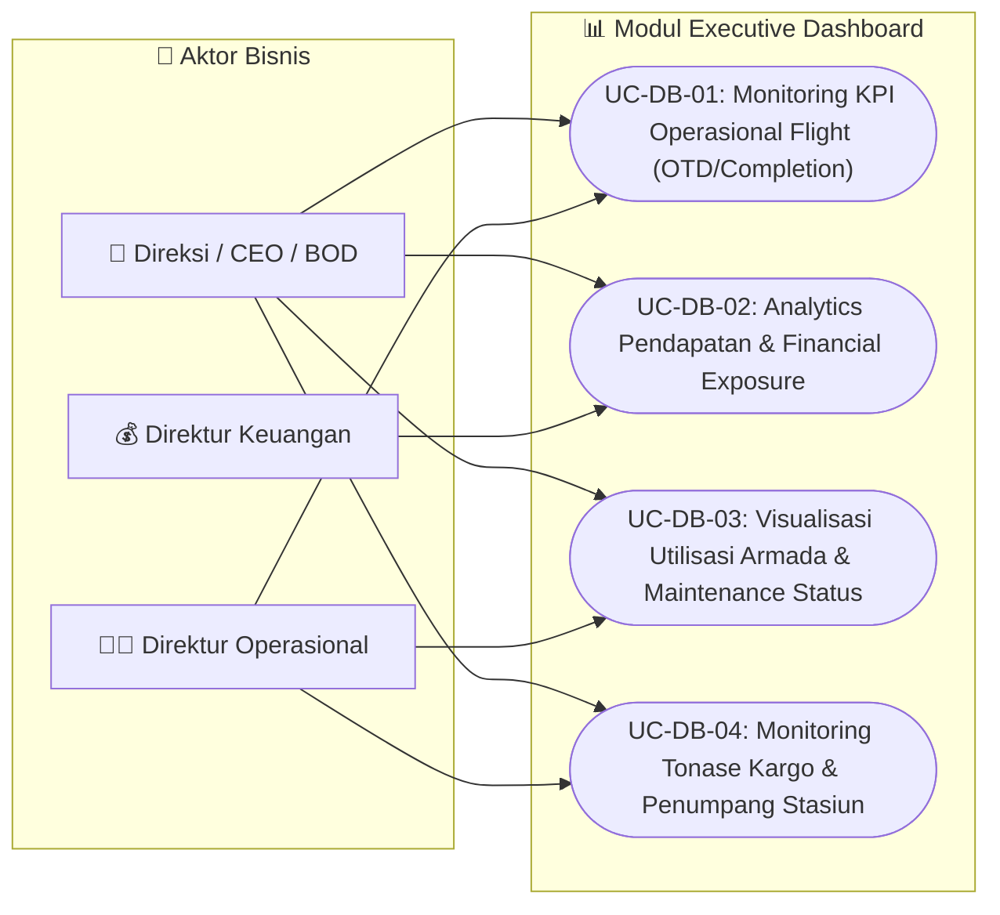
```mermaid
flowchart LR
    %% Actors
    subgraph Actors ["👥 Aktor Bisnis"]
        direction TB
        Executive["👔 Direksi / CEO / BOD"]
        OpsDirector["👨‍✈️ Direktur Operasional"]
        FinDirector["💰 Direktur Keuangan"]
    end

    %% Module Boundary
    subgraph DashboardModule ["📊 Modul Executive Dashboard"]
        direction TB
        UC1(["UC-DB-01: Monitoring KPI Operasional Flight (OTD/Completion)"])
        UC2(["UC-DB-02: Analytics Pendapatan & Financial Exposure"])
        UC3(["UC-DB-03: Visualisasi Utilisasi Armada & Maintenance Status"])
        UC4(["UC-DB-04: Monitoring Tonase Kargo & Penumpang Stasiun"])
    end

    %% Relationships
    Executive --> UC1
    OpsDirector --> UC1
    Executive --> UC2
    FinDirector --> UC2
    Executive --> UC3
    OpsDirector --> UC3
    Executive --> UC4
    OpsDirector --> UC4
```

### 10.2 Deskripsi Modul Executive Dashboard & Analytics

- **Tujuan & Cakupan**: Menyediakan tampilan agregat real-time (_Executive Control Center_) bagi jajaran manajemen puncak (_C-Level_) untuk memantau performa penerbangan, kesehatan keuangan, efisiensi armada, dan utilisasi rute di seluruh wilayah operasional Papua.
- **Aktor Bisnis**:
  1. **Direksi / CEO / BOD**: Pembuat keputusan strategis korporat.
  2. **Direktur Operasional**: Penanggung jawab ketercapaian target penerbangan (_On-Time Departure_, _Completion Rate_).
  3. **Direktur Keuangan**: Pemantau arus kas, realisasi pendapatan, dan _yield_ rute.
- **Daftar Business Use Cases**:
  - `UC-DB-01 [Monitoring KPI Operasional Flight (OTD/Completion)]`: Menyajikan metrik persentase ketepatan waktu penerbangan dan penerbangan yang terealisasi vs dibatalkan.
  - `UC-DB-02 [Analytics Pendapatan & Financial Exposure]`: Memantau akumulasi omset harian, piutang terikat (_exposure_), dan margin per rute.
  - `UC-DB-03 [Visualisasi Utilisasi Armada & Maintenance Status]`: Menampilkan status ketersediaan pesawat (Airworthy vs In-Maintenance) serta _flying hours_ tiap registrasi pesawat.
  - `UC-DB-04 [Monitoring Tonase Kargo & Penumpang Stasiun]`: Menganalisis statistik volume muatan kargo dan jumlah penumpang per rute/stasiun penerbangan.
- **Alur Bisnis (Workflow)**:
  `Transactional Modules Data Feed` $\rightarrow$ `Read Model Aggregation` $\rightarrow$ `Real-Time Dashboard Rendering` $\rightarrow$ `Executive Decision Making`.

---

## 11. Modul Documents (Manajemen Dokumen Master)

### 11.1 Diagram Business Use Case (Mermaid)

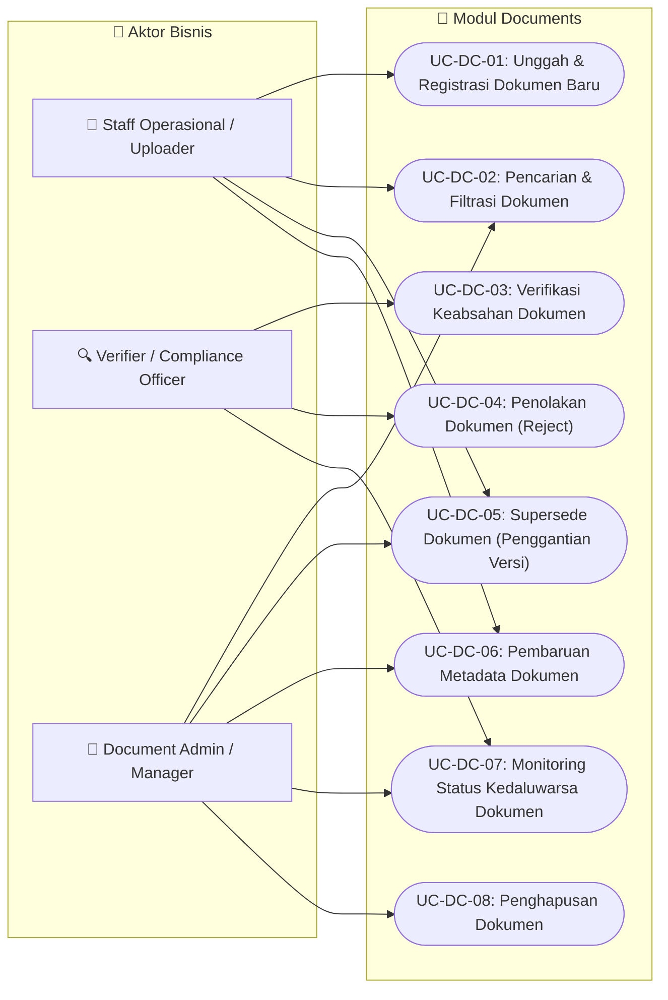
```mermaid
flowchart LR
    %% Actors
    subgraph Actors ["👥 Aktor Bisnis"]
        direction TB
        Uploader["👤 Staff Operasional / Uploader"]
        Verifier["🔍 Verifier / Compliance Officer"]
        DocAdmin["👔 Document Admin / Manager"]
    end

    %% Module Boundary
    subgraph DocumentsModule ["📄 Modul Documents"]
        direction TB
        UC1(["UC-DC-01: Unggah & Registrasi Dokumen Baru"])
        UC2(["UC-DC-02: Pencarian & Filtrasi Dokumen"])
        UC3(["UC-DC-03: Verifikasi Keabsahan Dokumen"])
        UC4(["UC-DC-04: Penolakan Dokumen (Reject)"])
        UC5(["UC-DC-05: Supersede Dokumen (Penggantian Versi)"])
        UC6(["UC-DC-06: Pembaruan Metadata Dokumen"])
        UC7(["UC-DC-07: Monitoring Status Kedaluwarsa Dokumen"])
        UC8(["UC-DC-08: Penghapusan Dokumen"])
    end

    %% Relationships
    Uploader --> UC1
    Uploader --> UC2
    DocAdmin --> UC2
    Verifier --> UC3
    Verifier --> UC4
    DocAdmin --> UC5
    Uploader --> UC5
    DocAdmin --> UC6
    Uploader --> UC6
    DocAdmin --> UC7
    Verifier --> UC7
    DocAdmin --> UC8
```

### 11.2 Deskripsi Modul Documents

- **Tujuan & Cakupan**: Menyediakan sistem manajemen dokumen master terpusat (_Document Management System_) untuk seluruh entitas bisnis AMA. Modul ini mengelola pengunggahan, verifikasi keabsahan, pelacakan versi, pemantauan kedaluwarsa, dan penggantian dokumen (_supersede_) untuk 19+ tipe pemilik (_owner types_) termasuk perusahaan, pesawat, personel, stasiun, vendor, pelanggan, agen komersial, rute, penerbangan, inventori, _purchase order_, aset korporat, dan lain-lain.
- **Aktor Bisnis**:
  1. **Staff Operasional / Uploader**: Mengunggah dokumen baru, memperbarui metadata, dan memantau status dokumen yang dimiliki unit kerjanya.
  2. **Verifier / Compliance Officer**: Meninjau keaslian dan kebenaran dokumen, serta menerbitkan keputusan verifikasi (_VERIFIED_) atau penolakan (_REJECTED_).
  3. **Document Admin / Manager**: Mengelola keseluruhan lifecycle dokumen, termasuk penggantian versi (_supersede_), pemantauan kedaluwarsa, dan penghapusan dokumen kadaluarsa.
- **Daftar Business Use Cases**:
  - `UC-DC-01 [Unggah & Registrasi Dokumen Baru]`: Mengunggah file dokumen melalui modul Uploads ke cloud object storage (AWS S3 / Cloudflare R2), kemudian meregistrasi metadata master dokumen termasuk tipe pemilik (_ownerType_: company, aircraft, personnel, station, vendor, customer, commercial_agent, rate_card, contract_subsidy, route, flight, inventory_part, inventory_lot, inventory_serial, purchase_order, goods_receipt, corporate_asset), nomor dokumen, penerbit (_issuer_), tanggal terbit, tanggal berlaku, tanggal kedaluwarsa, revisi, dan tingkat kerahasiaan (_visibility_: INTERNAL, CONFIDENTIAL, RESTRICTED). File disimpan di bucket cloud dengan object key unik dan diakses melalui _presigned URL_.
  - `UC-DC-02 [Pencarian & Filtrasi Dokumen]`: Mencari dokumen berdasarkan tipe pemilik, ID pemilik, status lifecycle (_ACTIVE, EXPIRING, EXPIRED, SUPERSEDED_), status verifikasi (_PENDING_VERIFICATION, VERIFIED, REJECTED_), tipe dokumen, dan jangka waktu kedaluwarsa (_expiringWithinDays_).
  - `UC-DC-03 [Verifikasi Keabsahan Dokumen]`: Petugas verifikator memeriksa keabsahan dan keaslian dokumen, kemudian menerbitkan status **VERIFIED**. Verifikasi ini memicu invalidasi readiness dokumen penerbangan terkait (_flight document readiness_).
  - `UC-DC-04 [Penolakan Dokumen (Reject)]`: Menolak dokumen yang tidak memenuhi persyaratan dengan mencantumkan alasan penolakan (_rejectionReason_). Dokumen ditandai **REJECTED** dan memicu re-evaluasi readiness penerbangan terkait.
  - `UC-DC-05 [Supersede Dokumen (Penggantian Versi)]`: Menggantikan dokumen lama dengan versi baru. Dokumen lama secara otomatis berubah status menjadi **SUPERSEDED** dan terhubung ke dokumen pengganti melalui relasi `replacesDocumentId` / `supersededByDocumentId`.
  - `UC-DC-06 [Pembaruan Metadata Dokumen]`: Memperbarui informasi dokumen yang telah ada (judul, nomor, tanggal berlaku, tanggal kedaluwarsa, catatan, tingkat kerahasiaan) tanpa mengganti file fisik.
  - `UC-DC-07 [Monitoring Status Kedaluwarsa Dokumen]`: Memantau dokumen yang mendekati masa kedaluwarsa (≤ 30 hari) dengan status **EXPIRING**, serta dokumen yang telah kedaluwarsa (**EXPIRED**), untuk memicu proses perpanjangan atau penggantian.
  - `UC-DC-08 [Penghapusan Dokumen]`: Menghapus dokumen yang tidak lagi diperlukan oleh sistem. Hanya dapat dilakukan oleh pengguna dengan hak akses (_permission_) yang sesuai terhadap tipe pemilik dokumen.
- **Alur Bisnis (Workflow)**:
  `File Upload to Cloud Storage (via Uploads Module → S3/R2)` $\rightarrow$ `Document Registration (ownerType + metadata + object key)` $\rightarrow$ `Pending Verification` $\rightarrow$ `Verification Decision (Verified / Rejected)` $\rightarrow$ `Active Usage (linked to entity, accessed via Presigned URL)` $\rightarrow$ `Expiry Monitoring` $\rightarrow$ `Supersede / Renewal or Archival`.

---

## 12. Modul Uploads (Manajemen File & Cloud Storage)

### 12.1 Diagram Business Use Case (Mermaid)

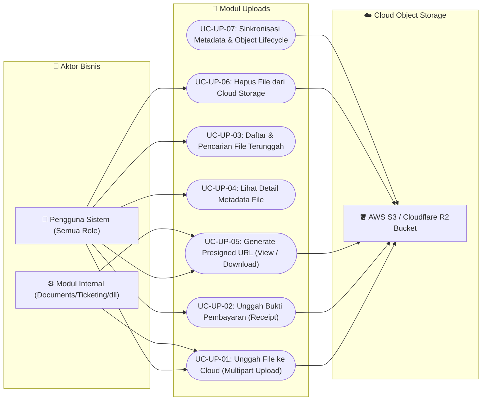
```mermaid
flowchart LR
    %% Actors
    subgraph Actors ["👥 Aktor Bisnis"]
        direction TB
        User["👤 Pengguna Sistem (Semua Role)"]
        SystemModule["⚙️ Modul Internal (Documents/Ticketing/dll)"]
    end

    %% Cloud Infrastructure
    subgraph CloudStorage ["☁️ Cloud Object Storage"]
        direction TB
        S3["🪣 AWS S3 / Cloudflare R2 Bucket"]
    end

    %% Module Boundary
    subgraph UploadsModule ["📁 Modul Uploads"]
        direction TB
        UC1(["UC-UP-01: Unggah File ke Cloud (Multipart Upload)"])
        UC2(["UC-UP-02: Unggah Bukti Pembayaran (Receipt)"])
        UC3(["UC-UP-03: Daftar & Pencarian File Terunggah"])
        UC4(["UC-UP-04: Lihat Detail Metadata File"])
        UC5(["UC-UP-05: Generate Presigned URL (View / Download)"])
        UC6(["UC-UP-06: Hapus File dari Cloud Storage"])
        UC7(["UC-UP-07: Sinkronisasi Metadata & Object Lifecycle"])
    end

    %% Relationships
    User --> UC1
    User --> UC2
    User --> UC3
    User --> UC4
    User --> UC5
    User --> UC6
    SystemModule --> UC1
    SystemModule --> UC5
    UC1 --> S3
    UC2 --> S3
    UC5 --> S3
    UC6 --> S3
    UC7 --> S3
```

### 12.2 Deskripsi Modul Uploads

- **Tujuan & Cakupan**: Menyediakan layanan penyimpanan file terpusat berbasis _cloud object storage_ (**AWS S3** atau **Cloudflare R2**) yang digunakan oleh seluruh modul AMA untuk mengunggah, menyimpan, dan mengakses file pendukung operasional. File diunggah ke _bucket_ cloud melalui server-side upload atau _presigned URL_, sementara metadata file (ID, object key, filename, size, content type, bucket name) disimpan di database aplikasi. Modul ini juga mendukung unggah bukti pembayaran (_receipt_) ke path khusus di bucket yang sama.
- **Arsitektur Penyimpanan Cloud**:
  - **Provider**: AWS S3 (primary) atau Cloudflare R2 (S3-compatible, zero egress fee) — dapat dikonfigurasi melalui environment variable.
  - **Bucket Structure**: `{bucket-name}/uploads/{entity-type}/{entity-id}/{timestamp}-{filename}` untuk file umum, `{bucket-name}/receipts/{year}/{month}/{filename}` untuk bukti pembayaran.
  - **Akses File**: Melalui _presigned URL_ dengan durasi terbatas (_time-limited signed URL_) untuk keamanan; file tidak dapat diakses secara publik langsung.
  - **Lifecycle Policy**: Object lifecycle rules dapat dikonfigurasi di level bucket untuk otomatis mengarsipkan (_Glacier/Infrequent Access_) atau menghapus file yang sudah melewati retensi tertentu.
- **Aktor Bisnis**:
  1. **Pengguna Sistem (Semua Role)**: Setiap pengguna yang memerlukan pengunggahan file untuk mendukung proses bisnis (dokumen, bukti pembayaran, lampiran teknis, dll).
  2. **Modul Internal (Documents/Ticketing/Maintenance/dll)**: Modul lain yang secara programatik memanfaatkan layanan upload untuk menyimpan dan mengambil file terkait entitas bisnis masing-masing.
- **Daftar Business Use Cases**:
  - `UC-UP-01 [Unggah File ke Cloud (Multipart Upload)]`: Mengunggah file melalui protokol multipart upload. Server menerima file, melakukan validasi (ukuran maksimum, tipe MIME yang diizinkan), kemudian menyimpan file ke _AWS S3_ atau _Cloudflare R2_ bucket dengan object key unik. Sistem mengembalikan metadata termasuk `id`, `objectKey`, `filename`, `size`, `contentType`, dan `bucketName`.
  - `UC-UP-02 [Unggah Bukti Pembayaran (Receipt)]`: Mengunggah file bukti pembayaran (_receipt_) melalui endpoint khusus. File disimpan ke path `receipts/` di cloud bucket dengan penamaan terstruktur berdasarkan tahun/bulan.
  - `UC-UP-03 [Daftar & Pencarian File Terunggah]`: Menampilkan seluruh file yang telah diunggah beserta metadata ringkasnya. Metadata disimpan di database, bukan di cloud storage, sehingga pencarian cepat tanpa _list objects_ ke bucket.
  - `UC-UP-04 [Lihat Detail Metadata File]`: Mengambil informasi detail satu file terunggah berdasarkan ID, termasuk nama file, ukuran, tipe konten, object key, bucket, dan status lifecycle di cloud.
  - `UC-UP-05 [Generate Presigned URL (View / Download)]`: Menghasilkan _presigned URL_ berdurasi terbatas (default: 15 menit) untuk mengakses file secara langsung dari cloud storage. Mendukung mode _inline view_ (Content-Disposition: inline) untuk pratinjau di browser atau _attachment download_ (Content-Disposition: attachment) untuk mengunduh file.
  - `UC-UP-06 [Hapus File dari Cloud Storage]`: Menghapus objek file dari bucket S3/R2 dan membersihkan metadata terkait di database. Proses penghapusan bersifat _soft-delete_ terlebih dahulu (menandai metadata sebagai deleted), kemudian background job melakukan _hard-delete_ objek dari cloud.
  - `UC-UP-07 [Sinkronisasi Metadata & Object Lifecycle]`: Menjalankan proses periodik untuk menyinkronkan status metadata di database dengan kondisi aktual objek di cloud bucket, termasuk mendeteksi file yatim (_orphaned objects_) dan memperbarui status lifecycle (aktif, diarsipkan, dihapus).
- **Alur Bisnis (Workflow)**:
  `User / System Module triggers Upload` $\rightarrow$ `Server-side Validation (size, MIME type)` $\rightarrow$ `PutObject to S3/R2 Bucket` $\rightarrow$ `Metadata Registration (DB: objectKey, bucket, size, contentType)` $\rightarrow$ `Presigned URL Generation for Access` $\rightarrow$ `Linked by Documents/Ticketing/Other Modules` $\rightarrow$ `Soft-Delete + Background Hard-Delete from Cloud`.

---

## 13. Role Map — Pemetaan Aktor, Peran Sistem, Izin & Aksi Kritis

### 13.1 Diagram Role Map (Mermaid)

Diagram berikut memetakan seluruh **aktor bisnis**, **peran sistem (_system roles_)**, **domain izin (_permission domains_)**, dan **aksi kritis (_critical actions_)** di platform AMA Ops Interface berdasarkan kode sumber aktual (`shared/types/roles.ts`).

> [!NOTE]
> Diagram ini merupakan versi lengkap yang diperkaya dari gambar referensi asli. Item bertanda 🆕 adalah modul/aktor/izin yang **tidak ada di gambar** tetapi **ada di codebase**.

### 13.2 Deskripsi Role Map

Role Map mendefinisikan hierarki otorisasi 4-lapis (_four-tier authorization hierarchy_) dari aktor bisnis hingga aksi kritis, memastikan setiap pengguna hanya dapat mengeksekusi operasi yang sesuai dengan tanggung jawab bisnisnya.

---

#### Layer 1 — Actors / Business → System Roles

| #   | Aktor Bisnis               | System Roles                                                                                 | Station Scope      |
| --- | -------------------------- | -------------------------------------------------------------------------------------------- | ------------------ |
| 1   | Management                 | Director                                                                                     | ALL                |
| 2   | Flight Operations          | OCC, OCC Checker, Station Admin, Station Admin Origin                                        | DJJ, WMX (scoped)  |
| 3   | Maintenance / MRO          | Maintenance Manager, Certifying Staff                                                        | DJJ / ALL          |
| 4   | Finance                    | Finance Reviewer                                                                             | ALL                |
| 5   | System Administration      | Demo Admin                                                                                   | ALL (wildcard `*`) |
| 6   | 🆕 Commercial / Ticketing  | OCC (commercial permissions), Station Admin (sales permissions)                              | DJJ, WMX           |
| 7   | 🆕 HRIS / Personnel        | HR Staff, HR Manager, Chief of Pilot, Employee                                               | ALL                |
| 8   | 🆕 Inventory / Procurement | Inventory Controller                                                                         | ALL                |
| 9   | 🆕 Documents & Compliance  | Director, OCC, Finance Reviewer, Maintenance Manager, Certifying Staff, Inventory Controller | ALL                |

---

#### Layer 2 — System Roles → Permission Domains (Detail)

| System Role              | Permission Domain       | Izin Utama                                                                                                                                                                                                         |
| ------------------------ | ----------------------- | ------------------------------------------------------------------------------------------------------------------------------------------------------------------------------------------------------------------ |
| **Director**             | Management & Reporting  | `platform.dashboard.view`, `flight.read`, `flight_request.approve`, `flight.approve`                                                                                                                               |
| **Director**             | Finance (read + post)   | `finance.invoice.read`, `finance.accounting.read`, `finance.accounting.post`, `finance.payment.record`                                                                                                             |
| **Director**             | Commercial (read)       | `ticketing.refund.decide`, `customer.*` (read), `agent.*` (read), `rate.*` (read), `commercial.contract.read`                                                                                                      |
| **Director**             | Documents               | `document.read`, `document.verify`                                                                                                                                                                                 |
| **OCC**                  | Flight Operations       | `flight_request.create`, `flight.create.direct`, `flight.schedule`, `flight.readiness.evaluate`, `flight.movement.update`, `flight.manifest.*`, `flight.fuel.update`, `flight.departure.*`                         |
| **OCC**                  | Commercial & Ticketing  | `ticketing.sales.open`, `ticketing.operation.update`, `customer.*` (manage), `agent.*` (manage), `rate.*` (manage)                                                                                                 |
| **OCC**                  | Station Operations      | `station.task.view`, `station.signoff.approve`, `readiness.*`, `aircraft.defect.report`, `aircraft.lifecycle.manage`                                                                                               |
| **OCC**                  | Documents               | `document.read`, `document.upload`                                                                                                                                                                                 |
| **OCC Checker**          | Flight Readiness        | `flight.readiness.evaluate`, `flight.readiness.approve`, `station.task.view`, `readiness.view`                                                                                                                     |
| **Station Admin**        | Station Operations      | `station.task.*`, `station.evidence.add`, `station.origin.signoff`, `station.destination.signoff`, `flight.manifest.*`, `flight.checkin.close`                                                                     |
| **Station Admin**        | Asset Management        | `asset.read`, `asset.assign`, `asset.move`                                                                                                                                                                         |
| **Station Admin**        | Commercial (read)       | `customer.read`, `agent.*` (read), `rate.*` (read), `commercial.contract.read`                                                                                                                                     |
| **Station Admin**        | Documents               | `document.read`, `document.upload`                                                                                                                                                                                 |
| **Station Admin Origin** | Station Operations      | Sama dengan Station Admin, scope stasiun DJJ                                                                                                                                                                       |
| **Finance Reviewer**     | Finance                 | `finance.invoice.*`, `finance.accounting.*`, `finance.payment.record`, `finance.handoff.process`, `station.cost.approve`                                                                                           |
| **Finance Reviewer**     | Customer Finance        | `customer.financial.read`, `customer.credit.manage`, `customer.sensitive.read`, `agent.commission.financial.read`                                                                                                  |
| **Finance Reviewer**     | Documents               | `document.read`, `document.verify`                                                                                                                                                                                 |
| **Maintenance Manager**  | Maintenance / MRO       | `maintenance.package.plan`, `maintenance.jobcard.*`, `maintenance.release.request`, `maintenance.financial.claim`, `maintenance.defect.assess`                                                                     |
| **Maintenance Manager**  | Aircraft & Inventory    | `aircraft.defect.*`, `aircraft.deferment.manage`, `inventory.issue`, `inventory.repair.manage`, `asset.maintenance.manage`                                                                                         |
| **Maintenance Manager**  | Documents               | `document.read`, `document.verify`                                                                                                                                                                                 |
| **Certifying Staff**     | Maintenance Release     | `maintenance.jobcard.inspect`, `maintenance.release.issue`, `aircraft.release.certify`, `aircraft.airworthiness.read`                                                                                              |
| **Certifying Staff**     | Documents               | `document.read`, `document.verify`                                                                                                                                                                                 |
| **Inventory Controller** | Inventory & Procurement | `inventory.catalog.manage`, `inventory.procurement.*`, `inventory.receive`, `inventory.transfer`, `inventory.adjust`, `inventory.count`, `inventory.issue`, `inventory.repair.manage`, `inventory.valuation.read`  |
| **Inventory Controller** | Documents               | `document.read`, `document.upload`                                                                                                                                                                                 |
| **HR Staff**             | HRIS                    | `hris.employee.*`, `hris.attendance.*`, `hris.leave.*`, `hris.overtime.approve`, `hris.certification.*`, `hris.schedule.*`, `hris.payroll.read`, `hris.payroll.calculate`, `hris.recruitment.manage`, `hris.kpi.*` |
| **HR Manager**           | HRIS (full)             | Semua izin HR Staff + `hris.payroll.approve`, `hris.payroll.journal`, `hris.kpi.assess`, `finance.accounting.read`                                                                                                 |
| **Chief of Pilot**       | HRIS / Crew             | `hris.certification.*`, `hris.schedule.*`, `hris.kpi.*`, `hris.leave.approve`, `hris.overtime.approve`, `flight.read`                                                                                              |
| **Employee**             | Self-Service            | `hris.self_service.read`, `hris.leave.request`, `hris.overtime.request`, `hris.attendance.checkin`                                                                                                                 |
| **Demo Admin**           | Platform Administration | `*` (wildcard — akses penuh ke seluruh permission tanpa batasan)                                                                                                                                                   |

---

#### Layer 3 — Permission Domains → Critical Actions

| #   | Permission Domain         | Jumlah Izin | Critical Actions                                                                                                                                                                                      |
| --- | ------------------------- | ----------- | ----------------------------------------------------------------------------------------------------------------------------------------------------------------------------------------------------- |
| 1   | Management & Reporting    | ~5          | Review Operational & Management Information, Approve Flight Requests                                                                                                                                  |
| 2   | Flight Operations         | ~25         | Create Flight / Flight Request, Assign Aircraft & Crew, Release Flight, Record Departure / Arrival, Lock/Review Manifest, Close Flight                                                                |
| 3   | Station Operations        | ~15         | Assign Task, Start/Verify/Reject Task, Add Evidence, Origin/Destination Sign-Off, Prepare/Submit Manifest, Close Check-In                                                                             |
| 4   | Maintenance / MRO         | ~12         | Assess Defects (GROUND/DEFER/NO_IMPACT), Plan Work Package, Mechanic Sign-Off, Independent Inspection, Re-Inspection (Rework), Technical Release                                                      |
| 5   | Finance                   | ~8          | Approve Station Cost, Approve Invoice, Process Finance Handoff, Post Journal, Record Payment, Financial Period Control                                                                                |
| 6   | Platform Administration   | 1 (`*`)     | Create / Disable User, Assign Role, Manage Access, Manage Master Data, Maintain Configuration                                                                                                         |
| 7   | 🆕 Commercial & Ticketing | ~20         | Open Ticket Sales, Issue Passenger Ticket, Issue Cargo AWB, Process Refund Request, Manage Rate Cards, Manage Customer/Agent, Manage Customer Credit Hold                                             |
| 8   | 🆕 HRIS & Personnel       | ~25         | Manage Employee Data, Manage Certifications/License, Approve Leave/Overtime, Manage Crew Schedule, Calculate & Approve Payroll, Assess KPI, Manage Recruitment                                        |
| 9   | 🆕 Inventory & Assets     | ~15         | Manage Part Catalog, Create Purchase Request, Approve Purchase Order, Receive Goods (GR), Issue Parts to Maintenance, Conduct Cycle Count, Manage Repair Orders, Register/Move/Audit Corporate Assets |
| 10  | 🆕 Documents              | 3           | Upload & Register Document, Verify Document, Reject Document, Supersede Document, Monitor Expiry                                                                                                      |

---

#### Ringkasan — Perbandingan Gambar Referensi vs Codebase Aktual

| Aspek              | Gambar Asli | Codebase Aktual | Selisih                                                                                                                            |
| ------------------ | ----------- | --------------- | ---------------------------------------------------------------------------------------------------------------------------------- |
| Aktor Bisnis       | 5 kelompok  | 9 kelompok      | **+4** (Commercial, HRIS, Inventory, Documents)                                                                                    |
| System Roles       | ~5 role     | 14 role         | **+9** (OCC Checker, Station Admin Origin, Certifying Staff, Inventory Controller, HR Staff, HR Manager, Chief of Pilot, Employee) |
| Permission Domains | 5 domain    | 10 domain       | **+5** (Station Ops dipisah, Commercial, HRIS, Inventory, Documents)                                                               |
| Critical Actions   | ~20 aksi    | ~50+ aksi       | **+30** aksi baru di domain tambahan                                                                                               |

---

## 14. System Use Case & Kebutuhan Pengguna (User Requirements)

Bagian ini menjelaskan kebutuhan proses otomatis dari sudut pandang pengguna, melengkapi baseline template dengan seluruh modul dan use case yang teridentifikasi dari codebase AMA Ops Interface.

> [!NOTE]
> Item bertanda 🆕 adalah use case yang **belum ada di template baseline** tetapi **ada di codebase**.

---

### 14.1 Diagram System Use Case (Mermaid)

#### A. Flight Operations

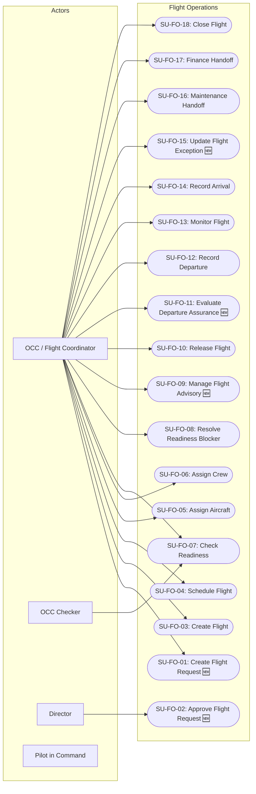
```mermaid
flowchart LR
    subgraph Actors
        OCC["OCC / Flight Coordinator"]
        Checker["OCC Checker"]
        Director["Director"]
        PIC["Pilot in Command"]
    end

    subgraph FlightOps ["Flight Operations"]
        UC01(["SU-FO-01: Create Flight Request 🆕"])
        UC02(["SU-FO-02: Approve Flight Request 🆕"])
        UC03(["SU-FO-03: Create Flight"])
        UC04(["SU-FO-04: Schedule Flight"])
        UC05(["SU-FO-05: Assign Aircraft"])
        UC06(["SU-FO-06: Assign Crew"])
        UC07(["SU-FO-07: Check Readiness"])
        UC08(["SU-FO-08: Resolve Readiness Blocker"])
        UC09(["SU-FO-09: Manage Flight Advisory 🆕"])
        UC10(["SU-FO-10: Release Flight"])
        UC11(["SU-FO-11: Evaluate Departure Assurance 🆕"])
        UC12(["SU-FO-12: Record Departure"])
        UC13(["SU-FO-13: Monitor Flight"])
        UC14(["SU-FO-14: Record Arrival"])
        UC15(["SU-FO-15: Update Flight Exception 🆕"])
        UC16(["SU-FO-16: Maintenance Handoff"])
        UC17(["SU-FO-17: Finance Handoff"])
        UC18(["SU-FO-18: Close Flight"])
    end

    OCC --> UC01
    Director --> UC02
    OCC --> UC03
    OCC --> UC04
    OCC --> UC05
    OCC --> UC06
    OCC --> UC07
    Checker --> UC07
    OCC --> UC08
    OCC --> UC09
    OCC --> UC10
    OCC --> UC11
    OCC --> UC12
    OCC --> UC13
    OCC --> UC14
    OCC --> UC15
    OCC --> UC16
    OCC --> UC17
    OCC --> UC18
```

#### B. Station Operations 🆕

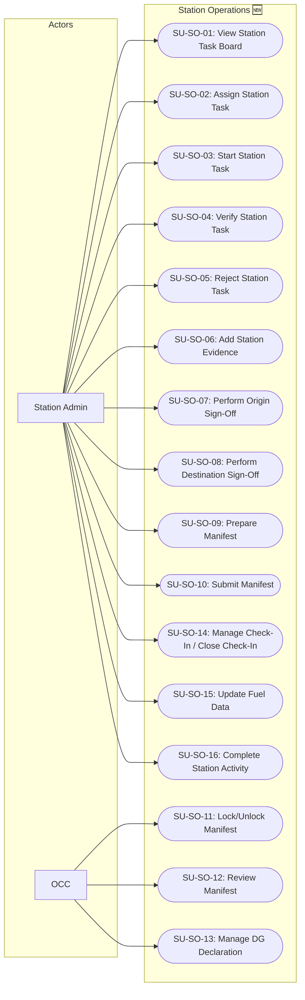
```mermaid
flowchart LR
    subgraph Actors
        StationAdmin["Station Admin"]
        OCC["OCC"]
    end

    subgraph StationOps ["Station Operations 🆕"]
        UC01(["SU-SO-01: View Station Task Board"])
        UC02(["SU-SO-02: Assign Station Task"])
        UC03(["SU-SO-03: Start Station Task"])
        UC04(["SU-SO-04: Verify Station Task"])
        UC05(["SU-SO-05: Reject Station Task"])
        UC06(["SU-SO-06: Add Station Evidence"])
        UC07(["SU-SO-07: Perform Origin Sign-Off"])
        UC08(["SU-SO-08: Perform Destination Sign-Off"])
        UC09(["SU-SO-09: Prepare Manifest"])
        UC10(["SU-SO-10: Submit Manifest"])
        UC11(["SU-SO-11: Lock/Unlock Manifest"])
        UC12(["SU-SO-12: Review Manifest"])
        UC13(["SU-SO-13: Manage DG Declaration"])
        UC14(["SU-SO-14: Manage Check-In / Close Check-In"])
        UC15(["SU-SO-15: Update Fuel Data"])
        UC16(["SU-SO-16: Complete Station Activity"])
    end

    StationAdmin --> UC01
    StationAdmin --> UC02
    StationAdmin --> UC03
    StationAdmin --> UC04
    StationAdmin --> UC05
    StationAdmin --> UC06
    StationAdmin --> UC07
    StationAdmin --> UC08
    StationAdmin --> UC09
    StationAdmin --> UC10
    OCC --> UC11
    OCC --> UC12
    OCC --> UC13
    StationAdmin --> UC14
    StationAdmin --> UC15
    StationAdmin --> UC16
```

#### C. Maintenance / MRO

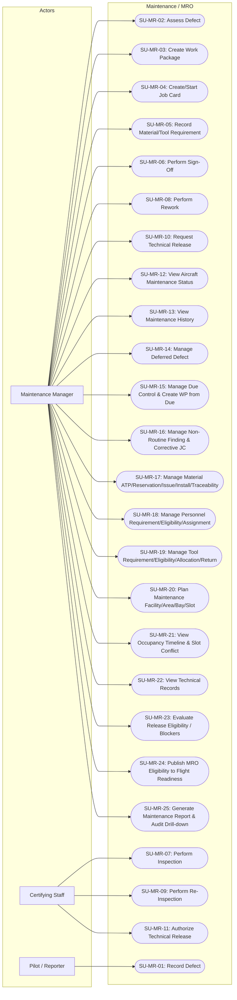
```mermaid
flowchart LR
    subgraph Actors
        MaintMgr["Maintenance Manager"]
        Certifier["Certifying Staff"]
        PIC["Pilot / Reporter"]
    end

    subgraph MRO ["Maintenance / MRO"]
        UC01(["SU-MR-01: Record Defect"])
        UC02(["SU-MR-02: Assess Defect"])
        UC03(["SU-MR-03: Create Work Package"])
        UC04(["SU-MR-04: Create/Start Job Card"])
        UC05(["SU-MR-05: Record Material/Tool Requirement"])
        UC06(["SU-MR-06: Perform Sign-Off"])
        UC07(["SU-MR-07: Perform Inspection"])
        UC08(["SU-MR-08: Perform Rework"])
        UC09(["SU-MR-09: Perform Re-Inspection"])
        UC10(["SU-MR-10: Request Technical Release"])
        UC11(["SU-MR-11: Authorize Technical Release"])
        UC12(["SU-MR-12: View Aircraft Maintenance Status"])
        UC13(["SU-MR-13: View Maintenance History"])
        UC14(["SU-MR-14: Manage Deferred Defect"])
        UC15(["SU-MR-15: Manage Due Control & Create WP from Due"])
        UC16(["SU-MR-16: Manage Non-Routine Finding & Corrective JC"])
        UC17(["SU-MR-17: Manage Material ATP/Reservation/Issue/Install/Traceability"])
        UC18(["SU-MR-18: Manage Personnel Requirement/Eligibility/Assignment"])
        UC19(["SU-MR-19: Manage Tool Requirement/Eligibility/Allocation/Return"])
        UC20(["SU-MR-20: Plan Maintenance Facility/Area/Bay/Slot"])
        UC21(["SU-MR-21: View Occupancy Timeline & Slot Conflict"])
        UC22(["SU-MR-22: View Technical Records"])
        UC23(["SU-MR-23: Evaluate Release Eligibility / Blockers"])
        UC24(["SU-MR-24: Publish MRO Eligibility to Flight Readiness"])
        UC25(["SU-MR-25: Generate Maintenance Report & Audit Drill-down"])
    end

    PIC --> UC01
    MaintMgr --> UC02
    MaintMgr --> UC03
    MaintMgr --> UC04
    MaintMgr --> UC05
    MaintMgr --> UC06
    Certifier --> UC07
    MaintMgr --> UC08
    Certifier --> UC09
    MaintMgr --> UC10
    Certifier --> UC11
    MaintMgr --> UC12
    MaintMgr --> UC13
    MaintMgr --> UC14
    MaintMgr --> UC15
    MaintMgr --> UC16
    MaintMgr --> UC17
    MaintMgr --> UC18
    MaintMgr --> UC19
    MaintMgr --> UC20
    MaintMgr --> UC21
    MaintMgr --> UC22
    MaintMgr --> UC23
    MaintMgr --> UC24
    MaintMgr --> UC25
```

#### D. Commercial / Ticketing 🆕

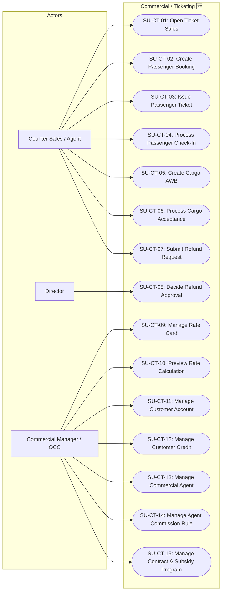
```mermaid
flowchart LR
    subgraph Actors
        Sales["Counter Sales / Agent"]
        CommMgr["Commercial Manager / OCC"]
        Director["Director"]
    end

    subgraph Commercial ["Commercial / Ticketing 🆕"]
        UC01(["SU-CT-01: Open Ticket Sales"])
        UC02(["SU-CT-02: Create Passenger Booking"])
        UC03(["SU-CT-03: Issue Passenger Ticket"])
        UC04(["SU-CT-04: Process Passenger Check-In"])
        UC05(["SU-CT-05: Create Cargo AWB"])
        UC06(["SU-CT-06: Process Cargo Acceptance"])
        UC07(["SU-CT-07: Submit Refund Request"])
        UC08(["SU-CT-08: Decide Refund Approval"])
        UC09(["SU-CT-09: Manage Rate Card"])
        UC10(["SU-CT-10: Preview Rate Calculation"])
        UC11(["SU-CT-11: Manage Customer Account"])
        UC12(["SU-CT-12: Manage Customer Credit"])
        UC13(["SU-CT-13: Manage Commercial Agent"])
        UC14(["SU-CT-14: Manage Agent Commission Rule"])
        UC15(["SU-CT-15: Manage Contract & Subsidy Program"])
    end

    Sales --> UC01
    Sales --> UC02
    Sales --> UC03
    Sales --> UC04
    Sales --> UC05
    Sales --> UC06
    Sales --> UC07
    Director --> UC08
    CommMgr --> UC09
    CommMgr --> UC10
    CommMgr --> UC11
    CommMgr --> UC12
    CommMgr --> UC13
    CommMgr --> UC14
    CommMgr --> UC15
```

#### E. Finance

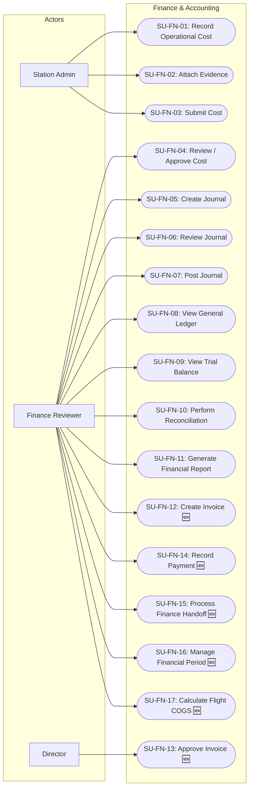
```mermaid
flowchart LR
    subgraph Actors
        StationAdmin["Station Admin"]
        FinReviewer["Finance Reviewer"]
        Director["Director"]
    end

    subgraph Finance ["Finance & Accounting"]
        UC01(["SU-FN-01: Record Operational Cost"])
        UC02(["SU-FN-02: Attach Evidence"])
        UC03(["SU-FN-03: Submit Cost"])
        UC04(["SU-FN-04: Review / Approve Cost"])
        UC05(["SU-FN-05: Create Journal"])
        UC06(["SU-FN-06: Review Journal"])
        UC07(["SU-FN-07: Post Journal"])
        UC08(["SU-FN-08: View General Ledger"])
        UC09(["SU-FN-09: View Trial Balance"])
        UC10(["SU-FN-10: Perform Reconciliation"])
        UC11(["SU-FN-11: Generate Financial Report"])
        UC12(["SU-FN-12: Create Invoice 🆕"])
        UC13(["SU-FN-13: Approve Invoice 🆕"])
        UC14(["SU-FN-14: Record Payment 🆕"])
        UC15(["SU-FN-15: Process Finance Handoff 🆕"])
        UC16(["SU-FN-16: Manage Financial Period 🆕"])
        UC17(["SU-FN-17: Calculate Flight COGS 🆕"])
    end

    StationAdmin --> UC01
    StationAdmin --> UC02
    StationAdmin --> UC03
    FinReviewer --> UC04
    FinReviewer --> UC05
    FinReviewer --> UC06
    FinReviewer --> UC07
    FinReviewer --> UC08
    FinReviewer --> UC09
    FinReviewer --> UC10
    FinReviewer --> UC11
    FinReviewer --> UC12
    Director --> UC13
    FinReviewer --> UC14
    FinReviewer --> UC15
    FinReviewer --> UC16
    FinReviewer --> UC17
```

#### F. HRIS & Personnel 🆕

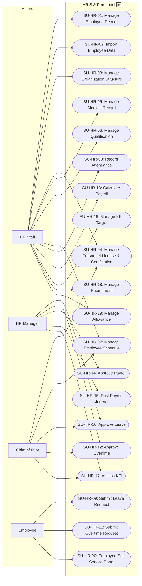
```mermaid
flowchart LR
    subgraph Actors
        HRStaff["HR Staff"]
        HRMgr["HR Manager"]
        ChiefPilot["Chief of Pilot"]
        Employee["Employee"]
    end

    subgraph HRIS ["HRIS & Personnel 🆕"]
        UC01(["SU-HR-01: Manage Employee Record"])
        UC02(["SU-HR-02: Import Employee Data"])
        UC03(["SU-HR-03: Manage Organization Structure"])
        UC04(["SU-HR-04: Manage Personnel License & Certification"])
        UC05(["SU-HR-05: Manage Medical Record"])
        UC06(["SU-HR-06: Manage Qualification"])
        UC07(["SU-HR-07: Manage Employee Schedule"])
        UC08(["SU-HR-08: Record Attendance"])
        UC09(["SU-HR-09: Submit Leave Request"])
        UC10(["SU-HR-10: Approve Leave"])
        UC11(["SU-HR-11: Submit Overtime Request"])
        UC12(["SU-HR-12: Approve Overtime"])
        UC13(["SU-HR-13: Calculate Payroll"])
        UC14(["SU-HR-14: Approve Payroll"])
        UC15(["SU-HR-15: Post Payroll Journal"])
        UC16(["SU-HR-16: Manage KPI Target"])
        UC17(["SU-HR-17: Assess KPI"])
        UC18(["SU-HR-18: Manage Recruitment"])
        UC19(["SU-HR-19: Manage Allowance"])
        UC20(["SU-HR-20: Employee Self-Service Portal"])
    end

    HRStaff --> UC01
    HRStaff --> UC02
    HRStaff --> UC03
    HRStaff --> UC04
    ChiefPilot --> UC04
    HRStaff --> UC05
    HRStaff --> UC06
    HRStaff --> UC07
    ChiefPilot --> UC07
    HRStaff --> UC08
    Employee --> UC09
    HRMgr --> UC10
    ChiefPilot --> UC10
    Employee --> UC11
    HRMgr --> UC12
    ChiefPilot --> UC12
    HRStaff --> UC13
    HRMgr --> UC14
    HRMgr --> UC15
    HRStaff --> UC16
    HRMgr --> UC17
    ChiefPilot --> UC17
    HRStaff --> UC18
    HRStaff --> UC19
    Employee --> UC20
```

#### G. Inventory & Procurement 🆕

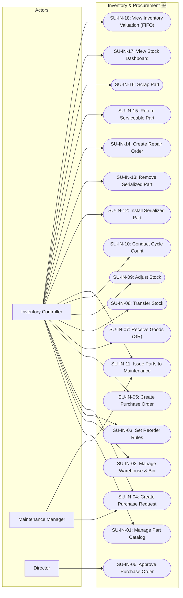
```mermaid
flowchart LR
    subgraph Actors
        InvCtrl["Inventory Controller"]
        MaintMgr["Maintenance Manager"]
        Director["Director"]
    end

    subgraph Inventory ["Inventory & Procurement 🆕"]
        UC01(["SU-IN-01: Manage Part Catalog"])
        UC02(["SU-IN-02: Manage Warehouse & Bin"])
        UC03(["SU-IN-03: Set Reorder Rules"])
        UC04(["SU-IN-04: Create Purchase Request"])
        UC05(["SU-IN-05: Create Purchase Order"])
        UC06(["SU-IN-06: Approve Purchase Order"])
        UC07(["SU-IN-07: Receive Goods (GR)"])
        UC08(["SU-IN-08: Transfer Stock"])
        UC09(["SU-IN-09: Adjust Stock"])
        UC10(["SU-IN-10: Conduct Cycle Count"])
        UC11(["SU-IN-11: Issue Parts to Maintenance"])
        UC12(["SU-IN-12: Install Serialized Part"])
        UC13(["SU-IN-13: Remove Serialized Part"])
        UC14(["SU-IN-14: Create Repair Order"])
        UC15(["SU-IN-15: Return Serviceable Part"])
        UC16(["SU-IN-16: Scrap Part"])
        UC17(["SU-IN-17: View Stock Dashboard"])
        UC18(["SU-IN-18: View Inventory Valuation (FIFO)"])
    end

    InvCtrl --> UC01
    InvCtrl --> UC02
    InvCtrl --> UC03
    InvCtrl --> UC04
    MaintMgr --> UC04
    InvCtrl --> UC05
    Director --> UC06
    InvCtrl --> UC07
    InvCtrl --> UC08
    InvCtrl --> UC09
    InvCtrl --> UC10
    InvCtrl --> UC11
    MaintMgr --> UC11
    InvCtrl --> UC12
    InvCtrl --> UC13
    InvCtrl --> UC14
    InvCtrl --> UC15
    InvCtrl --> UC16
    InvCtrl --> UC17
    InvCtrl --> UC18
```

#### H. Corporate Assets 🆕

```mermaid
flowchart LR
    subgraph Actors
        AssetMgr["Asset Manager / Station Admin"]
        MaintMgr["Maintenance Manager"]
        FinReviewer["Finance Reviewer"]
    end

    subgraph Assets ["Corporate Assets 🆕"]
        UC01(["SU-CA-01: Register Asset"])
        UC02(["SU-CA-02: Update Asset"])
        UC03(["SU-CA-03: Assign Asset Custodian"])
        UC04(["SU-CA-04: Move Asset Location"])
        UC05(["SU-CA-05: Create Maintenance Work Order"])
        UC06(["SU-CA-06: Complete Asset Maintenance"])
        UC07(["SU-CA-07: Request Maintenance Parts"])
        UC08(["SU-CA-08: Conduct Asset Audit"])
        UC09(["SU-CA-09: Reconcile Asset"])
        UC10(["SU-CA-10: Manage Asset Insurance"])
        UC11(["SU-CA-11: Retire / Dispose Asset"])
        UC12(["SU-CA-12: View Asset Overview"])
    end

    AssetMgr --> UC01
    AssetMgr --> UC02
    AssetMgr --> UC03
    AssetMgr --> UC04
    MaintMgr --> UC05
    MaintMgr --> UC06
    MaintMgr --> UC07
    AssetMgr --> UC08
    AssetMgr --> UC09
    FinReviewer --> UC10
    AssetMgr --> UC11
    AssetMgr --> UC12
```

#### I. Documents 🆕

```mermaid
flowchart LR
    subgraph Actors
        Uploader["Staff Operasional"]
        Verifier["Verifier / Compliance"]
        DocAdmin["Document Admin"]
    end

    subgraph Documents ["Documents 🆕"]
        UC01(["SU-DC-01: Upload & Register Document"])
        UC02(["SU-DC-02: Search & Filter Documents"])
        UC03(["SU-DC-03: Verify Document"])
        UC04(["SU-DC-04: Reject Document"])
        UC05(["SU-DC-05: Supersede Document"])
        UC06(["SU-DC-06: Update Document Metadata"])
        UC07(["SU-DC-07: Monitor Document Expiry"])
        UC08(["SU-DC-08: Delete Document"])
    end

    Uploader --> UC01
    Uploader --> UC02
    DocAdmin --> UC02
    Verifier --> UC03
    Verifier --> UC04
    DocAdmin --> UC05
    Uploader --> UC06
    DocAdmin --> UC07
    DocAdmin --> UC08
```

#### J. Shared / Platform

```mermaid
flowchart LR
    subgraph Actors
        Admin["System Administrator"]
        AllUsers["All Users"]
    end

    subgraph Shared ["Shared / Platform"]
        UC01(["SU-SH-01: Manage User"])
        UC02(["SU-SH-02: Manage Role & Permission"])
        UC03(["SU-SH-03: Manage Master Data"])
        UC04(["SU-SH-04: Upload Attachment"])
        UC05(["SU-SH-05: View Audit Trail"])
        UC06(["SU-SH-06: Receive Notification"])
        UC07(["SU-SH-07: Generate Report"])
        UC08(["SU-SH-08: View Executive Dashboard 🆕"])
        UC09(["SU-SH-09: Switch Demo Role 🆕"])
        UC10(["SU-SH-10: Manage Configuration 🆕"])
    end

    Admin --> UC01
    Admin --> UC02
    Admin --> UC03
    AllUsers --> UC04
    AllUsers --> UC05
    AllUsers --> UC06
    AllUsers --> UC07
    AllUsers --> UC08
    AllUsers --> UC09
    Admin --> UC10
```

---

### 14.2 Daftar System Use Case (Lengkap)

Tabel berikut merangkum seluruh System Use Case yang telah teridentifikasi dari codebase, dilengkapi dengan status (Baseline / 🆕 Baru).

#### A. Flight Operations

| ID       | Use Case                     | Aktor Utama        | Deskripsi                                                                                                 | Status   |
| -------- | ---------------------------- | ------------------ | --------------------------------------------------------------------------------------------------------- | -------- |
| SU-FO-01 | Create Flight Request        | OCC                | Membuat permintaan penerbangan baru dengan rute, jadwal, tipe layanan, dan catatan operasional            | 🆕       |
| SU-FO-02 | Approve Flight Request       | Director           | Meninjau dan menyetujui/menolak permintaan penerbangan sebelum dikonversi menjadi flight order            | 🆕       |
| SU-FO-03 | Create Flight                | OCC                | Membuat flight order langsung (tanpa melalui flight request) dengan detail rute, jadwal, dan tipe pesawat | Baseline |
| SU-FO-04 | Schedule Flight              | OCC                | Menjadwalkan penerbangan pada tanggal/waktu tertentu, mengatur slot departure dan arrival                 | Baseline |
| SU-FO-05 | Assign Aircraft              | OCC                | Menugaskan registrasi pesawat tertentu ke penerbangan berdasarkan ketersediaan dan tipe                   | Baseline |
| SU-FO-06 | Assign Crew                  | OCC                | Menugaskan kru penerbangan (PIC, SIC) berdasarkan kualifikasi, lisensi, dan jam terbang FDP               | Baseline |
| SU-FO-07 | Check Readiness              | OCC, OCC Checker   | Mengevaluasi readiness penerbangan: pesawat, kru, dokumen, izin, cuaca, bahan bakar                       | Baseline |
| SU-FO-08 | Resolve Readiness Blocker    | OCC                | Menyelesaikan blocker readiness yang terdeteksi (lisensi expired, medical lapsed, dokumen belum verified) | Baseline |
| SU-FO-09 | Manage Flight Advisory       | OCC                | Membuat, memperbarui, atau menghapus advisory operasional terkait penerbangan (cuaca, NOTAM, pembatasan)  | 🆕       |
| SU-FO-10 | Release Flight               | OCC                | Melepas penerbangan untuk eksekusi setelah seluruh readiness check terpenuhi                              | Baseline |
| SU-FO-11 | Evaluate Departure Assurance | OCC                | Melakukan evaluasi akhir sebelum departure: manifest locked, fuel loaded, sign-off complete               | 🆕       |
| SU-FO-12 | Record Departure             | OCC, Station Admin | Mencatat waktu departure aktual (ATD), termasuk delay reason jika terjadi keterlambatan                   | Baseline |
| SU-FO-13 | Monitor Flight               | OCC                | Memantau status penerbangan aktif secara real-time dari dashboard operasional                             | Baseline |
| SU-FO-14 | Record Arrival               | OCC, Station Admin | Mencatat waktu arrival aktual (ATA) dan status pendaratan                                                 | Baseline |
| SU-FO-15 | Update Flight Exception      | OCC                | Mencatat kejadian luar biasa selama penerbangan (diversion, return to base, delay)                        | 🆕       |
| SU-FO-16 | Maintenance Handoff          | OCC                | Menyerahkan defek pesawat yang dilaporkan PIC ke modul Maintenance untuk tindak lanjut                    | Baseline |
| SU-FO-17 | Finance Handoff              | OCC                | Menyerahkan data biaya operasional penerbangan ke modul Finance untuk proses invoicing                    | Baseline |
| SU-FO-18 | Close Flight                 | OCC                | Menutup penerbangan setelah seluruh proses handoff selesai, mengunci data untuk pelaporan                 | Baseline |

#### B. Station Operations 🆕

| ID       | Use Case                         | Aktor Utama   | Deskripsi                                                                                         | Status   |
| -------- | -------------------------------- | ------------- | ------------------------------------------------------------------------------------------------- | -------- |
| SU-SO-01 | View Station Task Board          | Station Admin | Melihat daftar tugas stasiun yang terkait dengan penerbangan (pre-departure, post-arrival)        | 🆕       |
| SU-SO-02 | Assign Station Task              | Station Admin | Menugaskan petugas untuk mengerjakan task tertentu (loading, fueling, security check)             | 🆕       |
| SU-SO-03 | Start Station Task               | Station Admin | Memulai eksekusi task stasiun dan mencatat waktu mulai                                            | 🆕       |
| SU-SO-04 | Verify Station Task              | Station Admin | Memverifikasi penyelesaian task stasiun setelah petugas selesai mengerjakan                       | 🆕       |
| SU-SO-05 | Reject Station Task              | Station Admin | Menolak hasil task yang tidak memenuhi standar, mengembalikan ke petugas untuk pengerjaan ulang   | 🆕       |
| SU-SO-06 | Add Station Evidence             | Station Admin | Mengunggah bukti foto/dokumen untuk mendukung verifikasi penyelesaian task                        | 🆕       |
| SU-SO-07 | Perform Origin Sign-Off          | Station Admin | Melakukan sign-off di stasiun asal (origin) sebagai konfirmasi kesiapan keberangkatan             | 🆕       |
| SU-SO-08 | Perform Destination Sign-Off     | Station Admin | Melakukan sign-off di stasiun tujuan setelah pesawat tiba dan proses post-arrival selesai         | 🆕       |
| SU-SO-09 | Prepare Manifest                 | Station Admin | Menyiapkan manifes penerbangan dengan data penumpang, kargo, dan bahan berbahaya (DG)             | 🆕       |
| SU-SO-10 | Submit Manifest                  | Station Admin | Mengirimkan manifes yang telah disiapkan untuk review dan persetujuan OCC                         | 🆕       |
| SU-SO-11 | Lock/Unlock Manifest             | OCC           | Mengunci manifes setelah disetujui agar tidak dapat diubah, atau membuka kunci jika perlu koreksi | 🆕       |
| SU-SO-12 | Review Manifest                  | OCC           | Meninjau isi manifes untuk validasi weight & balance, passenger count, dan DG compliance          | 🆕       |
| SU-SO-13 | Manage DG Declaration            | OCC           | Mengelola deklarasi Dangerous Goods untuk penerbangan yang mengangkut bahan berbahaya             | 🆕       |
| SU-SO-14 | Manage Check-In / Close Check-In | Station Admin | Melakukan proses check-in penumpang dan menutup check-in sebelum departure                        | 🆕       |
| SU-SO-15 | Update Fuel Data                 | Station Admin | Mencatat data bahan bakar (fuel uplift, fuel on board, fuel used) untuk penerbangan               | 🆕       |
| SU-SO-16 | Complete Station Activity        | Station Admin | Menyelesaikan seluruh aktivitas stasiun dan menandai penerbangan sebagai selesai di sisi ground   | Baseline |

#### C. Maintenance / MRO

| ID       | Use Case                                                   | Aktor Utama               | Deskripsi                                                                                                       | Status   |
| -------- | ---------------------------------------------------------- | ------------------------- | --------------------------------------------------------------------------------------------------------------- | -------- |
| SU-MR-01 | Record Defect                                              | PIC / Maintenance Manager | Mencatat defek pesawat yang ditemukan selama penerbangan atau inspeksi di darat                                 | Baseline |
| SU-MR-02 | Assess Defect                                              | Maintenance Manager       | Menilai tingkat dampak defek: GROUND (tidak boleh terbang), DEFER (ditunda), NO_IMPACT (aman terbang)           | Baseline |
| SU-MR-03 | Create Work Package                                        | Maintenance Manager       | Membuat paket kerja perawatan yang berisi satu atau lebih job card untuk perbaikan terencana                    | Baseline |
| SU-MR-04 | Create/Start Job Card                                      | Maintenance Manager       | Membuat kartu kerja detail untuk setiap item perbaikan dalam work package dan memulai eksekusi                  | Baseline |
| SU-MR-05 | Record Material/Tool Requirement                           | Maintenance Manager       | Mencatat kebutuhan material (suku cadang) dan alat kerja untuk setiap job card                                  | Baseline |
| SU-MR-06 | Perform Sign-Off                                           | Maintenance Manager       | Teknisi menandatangani penyelesaian pekerjaan pada job card (mechanic sign-off)                                 | Baseline |
| SU-MR-07 | Perform Inspection                                         | Certifying Staff          | Inspektur independen memeriksa hasil pekerjaan teknisi untuk validasi kualitas                                  | Baseline |
| SU-MR-08 | Perform Rework                                             | Maintenance Manager       | Mengulang pekerjaan yang ditolak oleh inspektur, dengan catatan perbaikan                                       | Baseline |
| SU-MR-09 | Perform Re-Inspection                                      | Certifying Staff          | Inspeksi ulang setelah rework untuk memastikan perbaikan telah memenuhi standar                                 | Baseline |
| SU-MR-10 | Request Technical Release                                  | Maintenance Manager       | Mengajukan permintaan pelepasan teknis pesawat setelah seluruh job card selesai                                 | Baseline |
| SU-MR-11 | Authorize Technical Release                                | Certifying Staff          | Menerbitkan sertifikat release to service (CRS) yang mengotorisasi pesawat layak terbang                        | Baseline |
| SU-MR-12 | View Aircraft Maintenance Status                           | Maintenance Manager       | Melihat status keseluruhan perawatan per registrasi pesawat (open WP, pending JC, deferred defects)             | Baseline |
| SU-MR-13 | View Maintenance History                                   | Maintenance Manager       | Melihat riwayat lengkap perawatan pesawat termasuk WP, JC, dan CRS yang telah diterbitkan                       | Baseline |
| SU-MR-14 | Manage Deferred Defect                                     | Maintenance Manager       | Mengelola defek yang ditunda (MEL/CDL): tracking batas waktu, follow-up, dan closure                            | Baseline |
| SU-MR-15 | Manage Due Control & Create WP from Due                    | Maintenance Manager       | Memantau item perawatan berkala (A-check, C-check, AD/SB) dan auto-generate work package                        | Baseline |
| SU-MR-16 | Manage Non-Routine Finding & Corrective JC                 | Maintenance Manager       | Mencatat temuan non-rutin selama inspeksi dan membuat job card korektif                                         | Baseline |
| SU-MR-17 | Manage Material ATP/Reservation/Issue/Install/Traceability | Maintenance Manager       | Mengelola ketersediaan material, reservasi dari inventory, penerbitan, pemasangan, dan traceability             | Baseline |
| SU-MR-18 | Manage Personnel Requirement/Eligibility/Assignment        | Maintenance Manager       | Mengelola kebutuhan personel, verifikasi eligibility (sertifikasi), dan penugasan ke job card                   | Baseline |
| SU-MR-19 | Manage Tool Requirement/Eligibility/Allocation/Return      | Maintenance Manager       | Mengelola kebutuhan alat kerja, alokasi, custody tracking, dan pengembalian setelah selesai                     | Baseline |
| SU-MR-20 | Plan Maintenance Facility/Area/Bay/Slot                    | Maintenance Manager       | Merencanakan penggunaan fasilitas perawatan (hangar, bay, slot waktu) untuk work package                        | Baseline |
| SU-MR-21 | View Occupancy Timeline & Slot Conflict                    | Maintenance Manager       | Melihat timeline okupansi fasilitas dan mendeteksi konflik penjadwalan                                          | Baseline |
| SU-MR-22 | View Technical Records                                     | Maintenance Manager       | Mengakses catatan teknis pesawat (logbook, service bulletin compliance, AD status)                              | Baseline |
| SU-MR-23 | Evaluate Release Eligibility / Blockers                    | Certifying Staff          | Mengevaluasi kelengkapan dan eligibilitas untuk release: semua JC selesai, inspeksi lulus, material ter-install | Baseline |
| SU-MR-24 | Publish MRO Eligibility to Flight Readiness                | Certifying Staff          | Mempublikasikan status kelayakan teknis pesawat ke sistem Flight Readiness untuk evaluasi OCC                   | Baseline |
| SU-MR-25 | Generate Maintenance Report & Audit Drill-down             | Maintenance Manager       | Menghasilkan laporan perawatan dan audit trail dengan kemampuan drill-down ke detail job card                   | Baseline |

#### D. Commercial / Ticketing 🆕

| ID       | Use Case                          | Aktor Utama        | Deskripsi                                                                                               | Status |
| -------- | --------------------------------- | ------------------ | ------------------------------------------------------------------------------------------------------- | ------ |
| SU-CT-01 | Open Ticket Sales                 | OCC / Sales        | Membuka penjualan tiket untuk penerbangan tertentu setelah validasi blocker (kru, pesawat, rute)        | 🆕     |
| SU-CT-02 | Create Passenger Booking          | Sales / Agent      | Membuat reservasi penumpang dengan data identitas, rute, tarif, dan tipe penumpang (adult/child/infant) | 🆕     |
| SU-CT-03 | Issue Passenger Ticket            | Sales / Agent      | Menerbitkan tiket setelah pembayaran dikonfirmasi, generate nomor tiket unik                            | 🆕     |
| SU-CT-04 | Process Passenger Check-In        | Station Admin      | Melakukan check-in penumpang di konter: verifikasi identitas, alokasi seat weight, cetak boarding       | 🆕     |
| SU-CT-05 | Create Cargo AWB                  | Sales / Agent      | Membuat Air Waybill untuk pengiriman kargo dengan data shipper, consignee, berat, dimensi, dan tarif    | 🆕     |
| SU-CT-06 | Process Cargo Acceptance          | Station Admin      | Menerima kargo di warehouse: verifikasi berat aktual, screening DG, dan penerbitan receipt              | 🆕     |
| SU-CT-07 | Submit Refund Request             | Sales / Agent      | Mengajukan permintaan refund untuk tiket/kargo yang dibatalkan atau diubah                              | 🆕     |
| SU-CT-08 | Decide Refund Approval            | Director           | Meninjau dan memutuskan persetujuan/penolakan permintaan refund berdasarkan kebijakan                   | 🆕     |
| SU-CT-09 | Manage Rate Card                  | Commercial Manager | Membuat, memperbarui, mengaktifkan/menonaktifkan, dan menduplikasi tarif (rate card) per rute/layanan   | 🆕     |
| SU-CT-10 | Preview Rate Calculation          | Commercial Manager | Mensimulasikan kalkulasi tarif berdasarkan parameter (rute, tanggal, customer, agent, berat kargo)      | 🆕     |
| SU-CT-11 | Manage Customer Account           | Commercial Manager | Mengelola akun pelanggan: registrasi, lifecycle (active/suspended/archived), kontak, catatan            | 🆕     |
| SU-CT-12 | Manage Customer Credit            | Finance Reviewer   | Mengelola limit kredit, credit hold, dan monitoring eksposur finansial pelanggan                        | 🆕     |
| SU-CT-13 | Manage Commercial Agent           | Commercial Manager | Mengelola data agen komersial: registrasi, lifecycle (draft→active→suspended→archived), kontak          | 🆕     |
| SU-CT-14 | Manage Agent Commission Rule      | Commercial Manager | Mengatur aturan komisi agen: tipe (percentage/fixed/hybrid), basis, periode efektif, prioritas          | 🆕     |
| SU-CT-15 | Manage Contract & Subsidy Program | Commercial Manager | Mengelola kontrak komersial dan program subsidi pemerintah: budget, absorpsi, renewal                   | 🆕     |

#### E. Finance

| ID       | Use Case                  | Aktor Utama      | Deskripsi                                                                                   | Status   |
| -------- | ------------------------- | ---------------- | ------------------------------------------------------------------------------------------- | -------- |
| SU-FN-01 | Record Operational Cost   | Station Admin    | Mencatat biaya operasional penerbangan (fuel, ground handling, landing fee, catering)       | Baseline |
| SU-FN-02 | Attach Evidence           | Station Admin    | Melampirkan bukti pendukung (kwitansi, invoice vendor) untuk setiap item biaya              | Baseline |
| SU-FN-03 | Submit Cost               | Station Admin    | Mengirimkan laporan biaya untuk review oleh Finance                                         | Baseline |
| SU-FN-04 | Review / Approve Cost     | Finance Reviewer | Meninjau dan menyetujui/menolak laporan biaya operasional dari stasiun                      | Baseline |
| SU-FN-05 | Create Journal            | Finance Reviewer | Membuat jurnal akuntansi (double-entry: debit & credit) untuk transaksi keuangan            | Baseline |
| SU-FN-06 | Review Journal            | Finance Reviewer | Meninjau jurnal yang dibuat sebelum diposting ke general ledger                             | Baseline |
| SU-FN-07 | Post Journal              | Finance Reviewer | Memposting jurnal ke general ledger, mengunci entri agar tidak dapat diubah                 | Baseline |
| SU-FN-08 | View General Ledger       | Finance Reviewer | Melihat buku besar (general ledger) dengan filter akun, periode, dan entitas                | Baseline |
| SU-FN-09 | View Trial Balance        | Finance Reviewer | Melihat neraca saldo (trial balance) per periode untuk validasi keseimbangan debit-credit   | Baseline |
| SU-FN-10 | Perform Reconciliation    | Finance Reviewer | Melakukan rekonsiliasi antara data operasional dan catatan keuangan                         | Baseline |
| SU-FN-11 | Generate Financial Report | Finance Reviewer | Menghasilkan laporan keuangan (income statement, balance sheet, cost analysis)              | Baseline |
| SU-FN-12 | Create Invoice            | Finance Reviewer | Membuat invoice untuk pelanggan/agen berdasarkan transaksi penerbangan                      | 🆕       |
| SU-FN-13 | Approve Invoice           | Director         | Menyetujui invoice sebelum dikirim ke pelanggan                                             | 🆕       |
| SU-FN-14 | Record Payment            | Finance Reviewer | Mencatat penerimaan pembayaran dari pelanggan/agen terhadap invoice yang diterbitkan        | 🆕       |
| SU-FN-15 | Process Finance Handoff   | Finance Reviewer | Memproses handoff data keuangan dari modul operasional ke modul akuntansi                   | 🆕       |
| SU-FN-16 | Manage Financial Period   | Finance Reviewer | Membuka/menutup periode keuangan (month-end, year-end closing)                              | 🆕       |
| SU-FN-17 | Calculate Flight COGS     | Finance Reviewer | Menghitung HPP (Harga Pokok Penjualan) per penerbangan berdasarkan biaya operasional aktual | 🆕       |

#### F. HRIS & Personnel 🆕

| ID       | Use Case                                 | Aktor Utama                | Deskripsi                                                                                     | Status |
| -------- | ---------------------------------------- | -------------------------- | --------------------------------------------------------------------------------------------- | ------ |
| SU-HR-01 | Manage Employee Record                   | HR Staff                   | Mengelola data karyawan: informasi pribadi, jabatan, departemen, status kepegawaian           | 🆕     |
| SU-HR-02 | Import Employee Data                     | HR Staff                   | Mengimpor data karyawan secara massal dari file eksternal                                     | 🆕     |
| SU-HR-03 | Manage Organization Structure            | HR Staff                   | Mengelola struktur organisasi: departemen, jabatan, hierarki                                  | 🆕     |
| SU-HR-04 | Manage Personnel License & Certification | HR Staff, Chief of Pilot   | Mencatat, memperbarui, dan memantau lisensi (CPL/ATPL), type rating, dan sertifikasi karyawan | 🆕     |
| SU-HR-05 | Manage Medical Record                    | HR Staff                   | Mencatat dan memantau sertifikat medis (Medical Class 1/2), tanggal berlaku, dan renewal      | 🆕     |
| SU-HR-06 | Manage Qualification                     | HR Staff                   | Mengelola kualifikasi tambahan karyawan (training, endorsement, competency check)             | 🆕     |
| SU-HR-07 | Manage Employee Schedule                 | HR Staff, Chief of Pilot   | Membuat dan mengelola jadwal kerja karyawan, termasuk jadwal kru penerbangan (roster)         | 🆕     |
| SU-HR-08 | Record Attendance                        | HR Staff, Employee         | Mencatat kehadiran harian karyawan (check-in/check-out), termasuk employee self check-in      | 🆕     |
| SU-HR-09 | Submit Leave Request                     | Employee                   | Mengajukan permintaan cuti melalui portal self-service                                        | 🆕     |
| SU-HR-10 | Approve Leave                            | HR Manager, Chief of Pilot | Meninjau dan menyetujui/menolak permintaan cuti karyawan                                      | 🆕     |
| SU-HR-11 | Submit Overtime Request                  | Employee                   | Mengajukan permintaan lembur melalui portal self-service                                      | 🆕     |
| SU-HR-12 | Approve Overtime                         | HR Manager, Chief of Pilot | Meninjau dan menyetujui/menolak permintaan lembur                                             | 🆕     |
| SU-HR-13 | Calculate Payroll                        | HR Staff                   | Menghitung gaji: gaji pokok + tunjangan penerbangan + insentif stasiun − potongan             | 🆕     |
| SU-HR-14 | Approve Payroll                          | HR Manager                 | Menyetujui hasil perhitungan payroll sebelum diproses                                         | 🆕     |
| SU-HR-15 | Post Payroll Journal                     | HR Manager                 | Memposting jurnal payroll ke modul Finance/Accounting                                         | 🆕     |
| SU-HR-16 | Manage KPI Target                        | HR Staff                   | Menetapkan target KPI untuk setiap karyawan per periode evaluasi                              | 🆕     |
| SU-HR-17 | Assess KPI                               | HR Manager, Chief of Pilot | Menilai pencapaian KPI karyawan berdasarkan data aktual                                       | 🆕     |
| SU-HR-18 | Manage Recruitment                       | HR Staff                   | Mengelola proses rekrutmen: lowongan, kandidat, seleksi, offering                             | 🆕     |
| SU-HR-19 | Manage Allowance                         | HR Staff                   | Mengelola jenis dan besaran tunjangan karyawan (remote station, flight hours)                 | 🆕     |
| SU-HR-20 | Employee Self-Service Portal             | Employee                   | Akses mandiri: lihat slip gaji, ajukan cuti/lembur, lihat jadwal, check-in kehadiran          | 🆕     |

#### G. Inventory & Procurement 🆕

| ID       | Use Case                        | Aktor Utama                               | Deskripsi                                                                                                 | Status |
| -------- | ------------------------------- | ----------------------------------------- | --------------------------------------------------------------------------------------------------------- | ------ |
| SU-IN-01 | Manage Part Catalog             | Inventory Controller                      | Mengelola katalog suku cadang: part number, manufacturer, tracking type (quantity/lot/serial), shelf life | 🆕     |
| SU-IN-02 | Manage Warehouse & Bin          | Inventory Controller                      | Mengelola struktur gudang dan bin penyimpanan (usable, quarantine, repair, transit) per stasiun           | 🆕     |
| SU-IN-03 | Set Reorder Rules               | Inventory Controller                      | Mengatur parameter reorder: minimum qty, reorder point, maximum qty, lead time per part per warehouse     | 🆕     |
| SU-IN-04 | Create Purchase Request         | Inventory Controller, Maintenance Manager | Membuat permintaan pembelian (PR) untuk suku cadang yang dibutuhkan                                       | 🆕     |
| SU-IN-05 | Create Purchase Order           | Inventory Controller                      | Membuat pesanan pembelian (PO) dari PR yang disetujui, termasuk vendor, harga, dan mata uang              | 🆕     |
| SU-IN-06 | Approve Purchase Order          | Director                                  | Menyetujui/menolak PO sebelum dikirim ke vendor                                                           | 🆕     |
| SU-IN-07 | Receive Goods (GR)              | Inventory Controller                      | Mencatat penerimaan barang: verifikasi qty, lot/serial, sertifikat, penempatan ke bin                     | 🆕     |
| SU-IN-08 | Transfer Stock                  | Inventory Controller                      | Memindahkan stok antar bin/gudang (usable→quarantine, antar stasiun)                                      | 🆕     |
| SU-IN-09 | Adjust Stock                    | Inventory Controller                      | Melakukan adjustment kuantitas stok dengan alasan (damage, discrepancy, correction)                       | 🆕     |
| SU-IN-10 | Conduct Cycle Count             | Inventory Controller                      | Melakukan stock opname (cycle count): membuat count sheet, input counted qty, posting variance            | 🆕     |
| SU-IN-11 | Issue Parts to Maintenance      | Inventory Controller, Maintenance Manager | Mengeluarkan suku cadang dari gudang untuk maintenance pesawat atau aset korporat                         | 🆕     |
| SU-IN-12 | Install Serialized Part         | Inventory Controller                      | Mencatat pemasangan part berseri ke pesawat: posisi, hours/cycles at install, work order reference        | 🆕     |
| SU-IN-13 | Remove Serialized Part          | Inventory Controller                      | Mencatat pelepasan part berseri dari pesawat ke bin karantina dengan alasan removal                       | 🆕     |
| SU-IN-14 | Create Repair Order             | Inventory Controller                      | Mengirim part yang rusak ke vendor untuk perbaikan (repair shop)                                          | 🆕     |
| SU-IN-15 | Return Serviceable Part         | Inventory Controller                      | Menerima kembali part yang telah diperbaiki dengan sertifikat serviceability                              | 🆕     |
| SU-IN-16 | Scrap Part                      | Inventory Controller                      | Menghapus part yang sudah tidak dapat diperbaiki (beyond economic repair) dari inventori                  | 🆕     |
| SU-IN-17 | View Stock Dashboard            | Inventory Controller                      | Melihat ringkasan stok: jumlah part aktif, low stock alerts, expiring lots, quarantine items              | 🆕     |
| SU-IN-18 | View Inventory Valuation (FIFO) | Inventory Controller                      | Melihat valuasi inventori berdasarkan metode FIFO (First In First Out) per part per warehouse             | 🆕     |

#### H. Corporate Assets 🆕

| ID       | Use Case                      | Aktor Utama         | Deskripsi                                                                                                   | Status |
| -------- | ----------------------------- | ------------------- | ----------------------------------------------------------------------------------------------------------- | ------ |
| SU-CA-01 | Register Asset                | Asset Manager       | Mendaftarkan aset baru: nama, kategori (GSE/VEHICLE/IT/MACHINERY/FACILITY/FURNITURE), serial number, lokasi | 🆕     |
| SU-CA-02 | Update Asset                  | Asset Manager       | Memperbarui data aset termasuk kondisi (serviceable/limited/under_maintenance/unserviceable)                | 🆕     |
| SU-CA-03 | Assign Asset Custodian        | Asset Manager       | Menugaskan karyawan sebagai custodian (penanggung jawab) aset dengan alasan dan tanggal efektif             | 🆕     |
| SU-CA-04 | Move Asset Location           | Asset Manager       | Memindahkan aset antar stasiun/departemen/lokasi dengan catatan alasan perpindahan                          | 🆕     |
| SU-CA-05 | Create Maintenance Work Order | Maintenance Manager | Membuat work order perawatan aset: tipe (preventive/corrective/emergency), prioritas, jadwal                | 🆕     |
| SU-CA-06 | Complete Asset Maintenance    | Maintenance Manager | Menyelesaikan perawatan aset: hasil perbaikan, bukti referensi, kondisi sesudah perawatan                   | 🆕     |
| SU-CA-07 | Request Maintenance Parts     | Maintenance Manager | Meminta pengeluaran suku cadang dari inventory untuk perawatan aset korporat                                | 🆕     |
| SU-CA-08 | Conduct Asset Audit           | Asset Manager       | Melakukan audit fisik aset: verifikasi keberadaan, kondisi, dan kesesuaian data vs aktual                   | 🆕     |
| SU-CA-09 | Reconcile Asset               | Asset Manager       | Merekonsiliasi data aset setelah audit: memperbarui lokasi, kondisi, dan status berdasarkan temuan          | 🆕     |
| SU-CA-10 | Manage Asset Insurance        | Finance Reviewer    | Mengelola data asuransi aset: polis, premi, coverage, tanggal efektif, status                               | 🆕     |
| SU-CA-11 | Retire / Dispose Asset        | Asset Manager       | Menonaktifkan aset dengan status RETIRED, DISPOSED, atau LOST                                               | 🆕     |
| SU-CA-12 | View Asset Overview           | Asset Manager       | Melihat ringkasan seluruh aset: per kategori, per stasiun, status lifecycle, nilai depresiasi               | 🆕     |

#### I. Documents 🆕

| ID       | Use Case                   | Aktor Utama              | Deskripsi                                                                                                 | Status |
| -------- | -------------------------- | ------------------------ | --------------------------------------------------------------------------------------------------------- | ------ |
| SU-DC-01 | Upload & Register Document | Staff Operasional        | Mengunggah file ke cloud storage (S3/R2) dan meregistrasi metadata dokumen dengan ownerType (19+ entitas) | 🆕     |
| SU-DC-02 | Search & Filter Documents  | All Users                | Mencari dokumen berdasarkan ownerType, ownerId, lifecycle status, verification status, expiry range       | 🆕     |
| SU-DC-03 | Verify Document            | Verifier                 | Memeriksa dan menerbitkan status VERIFIED untuk dokumen yang memenuhi persyaratan                         | 🆕     |
| SU-DC-04 | Reject Document            | Verifier                 | Menolak dokumen dengan mencantumkan rejectionReason, memicu re-evaluasi flight readiness                  | 🆕     |
| SU-DC-05 | Supersede Document         | Document Admin           | Menggantikan dokumen lama dengan versi baru, otomatis menandai dokumen lama sebagai SUPERSEDED            | 🆕     |
| SU-DC-06 | Update Document Metadata   | Staff Operasional        | Memperbarui judul, nomor, tanggal berlaku, tanggal kedaluwarsa, visibility tanpa mengganti file           | 🆕     |
| SU-DC-07 | Monitor Document Expiry    | Document Admin, Verifier | Memantau dokumen EXPIRING (≤30 hari) dan EXPIRED untuk memicu renewal atau penggantian                    | 🆕     |
| SU-DC-08 | Delete Document            | Document Admin           | Menghapus dokumen yang tidak diperlukan, hanya oleh pengguna dengan akses ke ownerType terkait            | 🆕     |

#### J. Shared / Platform

| ID       | Use Case                 | Aktor Utama          | Deskripsi                                                                                     | Status   |
| -------- | ------------------------ | -------------------- | --------------------------------------------------------------------------------------------- | -------- |
| SU-SH-01 | Manage User              | System Administrator | Membuat, menonaktifkan, dan mengelola akun pengguna sistem                                    | Baseline |
| SU-SH-02 | Manage Role & Permission | System Administrator | Mengelola role dan mapping permission ke setiap role (14 role × 120+ permission)              | Baseline |
| SU-SH-03 | Manage Master Data       | System Administrator | Mengelola data referensi: stasiun, rute, tipe pesawat, mata uang, pajak, vendor, payment term | Baseline |
| SU-SH-04 | Upload Attachment        | All Users            | Mengunggah file ke cloud storage melalui modul Uploads (multipart upload ke S3/R2)            | Baseline |
| SU-SH-05 | View Audit Trail         | All Users            | Melihat riwayat perubahan data (who, what, when) untuk setiap entitas bisnis                  | Baseline |
| SU-SH-06 | Receive Notification     | All Users            | Menerima notifikasi sistem terkait perubahan status, approval, dan peringatan                 | Baseline |
| SU-SH-07 | Generate Report          | All Users            | Menghasilkan laporan operasional dan manajerial sesuai role dan permission                    | Baseline |
| SU-SH-08 | View Executive Dashboard | Director             | Melihat dashboard KPI eksekutif: OTD, completion rate, revenue, fleet utilization             | 🆕       |
| SU-SH-09 | Switch Demo Role         | All Users            | Mengganti role demo aktif untuk testing dan demo sistem (14 role tersedia)                    | 🆕       |
| SU-SH-10 | Manage Configuration     | System Administrator | Mengelola konfigurasi platform: feature flags, parameter operasional, integrasi               | 🆕       |

---

### 14.3 Ringkasan Statistik Use Case

| Modul                   | Baseline | 🆕 Ditambahkan | Total   |
| ----------------------- | -------- | -------------- | ------- |
| Flight Operations       | 14       | 4              | **18**  |
| Station Operations      | 1        | 15             | **16**  |
| Maintenance / MRO       | 25       | 0              | **25**  |
| Commercial / Ticketing  | 0        | 15             | **15**  |
| Finance                 | 11       | 6              | **17**  |
| HRIS & Personnel        | 0        | 20             | **20**  |
| Inventory & Procurement | 0        | 18             | **18**  |
| Corporate Assets        | 0        | 12             | **12**  |
| Documents               | 0        | 8              | **8**   |
| Shared / Platform       | 7        | 3              | **10**  |
| **TOTAL**               | **58**   | **101**        | **159** |

---

## 15. Detail Spesifikasi System Use Case (High & Medium Risk)

Pada fase Inisiasi, hanya deskripsi singkat use case yang disediakan. Pada fase Discovery, template berikut diisi untuk setiap use case berisiko menengah hingga tinggi. Use case berisiko rendah dapat dijelaskan secara informal. Template ini juga dapat digunakan untuk mendokumentasikan business use case yang telah dicantumkan sebelumnya dalam BRD.

---

### 15.1 UC-FO-01 — Mengelola Flight Operational Lifecycle

- **Perspektif**: System Use Case
- **Tipe**: Base Use Case
- **Prioritas**: P0 (Kritis)
- **Ringkasan**: Pengguna berwenang membuat flight, menentukan informasi operasional yang diperlukan, melakukan readiness check, menjalankan departure/arrival workflow, melakukan handoff yang diperlukan, kemudian menutup flight setelah seluruh proses mandatory selesai.
- **Tujuan dan Manfaat Bisnis**: Memberikan satu lifecycle flight yang dapat ditelusuri dan mengurangi kondisi di mana status flight tidak mencerminkan pekerjaan aktual yang masih tertunda.
- **Aktor Primer**: Flight Coordinator / Operations Role yang ditentukan PT AMA (OCC Role).
- **Aktor Sekunder**: Pilot-related role, OCC/Flight Following, Ground Handling/Station, Maintenance, Finance.
- **Pemicu**: Flight baru perlu direncanakan atau scheduled flight perlu diproses.
- **Prasyarat**: Master data minimum yang dibutuhkan (stasiun, rute, tipe pesawat, akun pengguna) telah tersedia dalam sistem.
- **Pasca-Kondisi Berhasil**: Flight memiliki status akhir yang valid (`CLOSED`), seluruh blocker mandatory terselesaikan, audit trail tersimpan, dan handoff ke MRO & Finance tereksekusi.
- **Pasca-Kondisi Gagal**: Flight tetap berada pada status terakhir yang valid dan alasan kegagalan/blocker dapat dilihat pada dashboard readiness.
- **Alur Dasar**:
  1. Pengguna membuat atau memilih flight order dalam sistem.
  2. Sistem memvalidasi informasi minimum (stasiun asal/tujuan, jadwal ETD/ETA, tipe penerbangan).
  3. Aircraft dan crew (PIC & SIC) ditentukan untuk penerbangan tersebut.
  4. Sistem menghitung readiness berdasarkan rule aktif dari backend source of truth, termasuk MRO technical eligibility apabila aircraft memiliki maintenance blocker/release state yang relevan.
  5. Pengguna menyelesaikan blocker yang terdeteksi (seperti kelengkapan dokumen, lisensi kru, atau fuel calculation).
  6. Flight memperoleh authorization/release apabila diperlukan (`RELEASED`).
  7. Departure dicatat dengan menginput ATD (Actual Time of Departure) dan fuel on board.
  8. Flight dimonitor selama fase in-flight via flight following.
  9. Arrival dicatat dengan menginput ATA (Actual Time of Arrival) dan status pendaratan.
  10. Aktivitas station diselesaikan (ground handling, passenger unloading, cargo receipt).
  11. Maintenance/Finance handoff dilakukan jika diperlukan; setelah perubahan state MRO, Flight Readiness harus dievaluasi ulang dan tidak boleh mempertahankan status READY yang sudah stale.
  12. Sistem mengevaluasi closure requirement (seluruh sign-off dan handoff selesai).
  13. Flight ditutup (`CLOSED`).
- **Alur Alternatif**:
  - _Flight Delayed_: Pengguna memasukkan alasan keterlambatan (delay code) dan estimasi jadwal baru (ETD baru); sistem memperbarui readiness dan berdampak pada flight following.
  - _Aircraft Diganti_: Pengguna melakukan re-assignment pesawat; sistem memicu re-evaluasi kelaikan teknis MRO untuk pesawat baru.
  - _Crew Diganti_: Pengguna memasukkan kru pengganti; sistem memicu re-evaluasi lisensi, sertifikat medis, dan batas FDP/rest period kru baru.
  - _Flight Cancelled_: Pengguna membatalkan penerbangan dengan alasan pembatalan; sistem melepaskan alokasi pesawat & kru serta membatalkan tugas stasiun terkait.
  - _Maintenance Blocker Ditemukan_: Jika MRO mendeteksi defek NO-GO, status readiness penerbangan otomatis berubah menjadi `BLOCKED_BY_MRO` dan penerbangan tidak dapat di-release.
  - _Station Activity Belum Selesai_: Sistem menahan penutupan flight hingga stasiun menyelesaikan sign-off dan pengunggahan bukti.
  - _Cost/Evidence Mandatory Belum Selesai_: Finance handoff tertahan hingga bukti biaya operasional diunggah dan disetujui.
- **Kebutuhan Khusus & Aturan Bisnis**:
  - Perubahan status harus memiliki audit trail (_who, what, when_).
  - Sistem tidak boleh _silently_ melewati mandatory blocker.
  - Status Flight `READY` dan MRO `READY/eligible` harus berasal dari evaluasi authoritative backend, bukan snapshot UI.
  - Apabila MRO `BLOCKED`, Flight tidak dapat dinyatakan `READY`.
  - Re-evaluation diperlukan setelah defect, deferment, due/compliance, resource, Technical Record, atau Technical Release berubah.

---

### 15.2 UC-MRO-01 — Defect to Technical Release

- **Perspektif**: System Use Case
- **Tipe**: Base Use Case
- **Prioritas**: P0 (Kritis)
- **Ringkasan**: Use case mengelola lifecycle maintenance dari defect atau maintenance due requirement sampai Technical Release, Technical Records, compliance/next-due update, dan publikasi technical eligibility aircraft ke Flight Operations.
- **Tujuan dan Manfaat Bisnis**: Memastikan maintenance activity memiliki traceability terhadap defect, pekerjaan, personel, inspection, evidence, dan release untuk menjamin kelaikan udara penerbangan STOL.
- **Aktor Primer**: Maintenance personnel yang memiliki permission sesuai aktivitas (Maintenance Manager / Mechanic).
- **Aktor Sekunder**: Inspector, Maintenance Planner, Certifying/Airworthiness Role (Certifying Staff), Operations (OCC).
- **Pemicu**: Defect, deferred rectification, non-routine finding, atau maintenance requirement Calendar/FH/FC teridentifikasi.
- **Prasyarat**: Aircraft, station, maintenance requirement, personnel/licence/company authorization, inventory/material, tool master/calibration, serta facility planning master yang relevan tersedia sesuai kebutuhan proses.
- **Pasca-Kondisi Berhasil**: Pekerjaan mandatory telah selesai, Technical Records dan traceability tersedia, seluruh blocker release terselesaikan, Technical Release dilakukan oleh role yang berhak, compliance/next due diperbarui bila applicable, dan technical eligibility aircraft tersedia untuk dikonsumsi Flight Readiness.
- **Pasca-Kondisi Gagal**: Pesawat tetap berstatus `GROUNDED` atau `MAINTENANCE_REQUIRED`, Technical Release tidak dapat diterbitkan, dan MRO technical eligibility mempublikasikan status `BLOCKED` ke Flight Operations.
- **Alur Dasar**:
  1. Defect dicatat oleh PIC atau teknisi.
  2. Defect dinilai sebagai `NO-GO`, `DEFER` (sesuai MEL/CDL), atau `NO IMPACT`; atau due requirement ditinjau oleh maintenance planner.
  3. Work Package dibuat/ditentukan dari defect, deferred rectification, non-routine follow-up, atau due requirement; source traceability disimpan.
  4. Maintenance slot/facility direncanakan bila diperlukan; personnel, tools, dan material requirement disiapkan; Job Card dibuat.
  5. Job Card dikerjakan oleh teknisi.
  6. Material readiness diverifikasi melalui ATP $\rightarrow$ reservation $\rightarrow$ issue $\rightarrow$ install; personnel dan tool readiness dievaluasi ulang terhadap licence/authorization, schedule, serviceability/calibration, allocation/custody, dan current state.
  7. Mechanic/technician melakukan sign-off pekerjaan.
  8. Inspection dilakukan oleh Certifying Staff / Inspector apabila diwajibkan oleh prosedur.
  9. Jika inspection lulus, pekerjaan dapat menuju closure/release.
  10. Jika inspection gagal, rework dibuat dan ditugaskan kembali.
  11. Rework selesai dan teknisi melakukan sign-off ulang.
  12. Re-inspection dilakukan oleh inspektur.
  13. Technical Records dan evidence diverifikasi; Technical Release diminta oleh Maintenance Manager.
  14. Sistem mengevaluasi unified release eligibility dan seluruh blocker mandatory dari backend source of truth.
  15. Authorized role (Certifying Staff) melakukan Technical Release; release bersifat _idempotent/immutable_, scheduled requirement menjadi _complied_ dan _next due_ dihitung bila applicable, lalu MRO technical eligibility dipublikasikan untuk Flight Readiness.
- **Kebutuhan Khusus & Aturan Bisnis**:
  - Self-inspection harus dibatasi apabila business rule mengharuskan independent inspection (teknisi yang mengeksekusi tidak boleh menginspeksi pekerjaannya sendiri).
  - Exact authorization requirement mengikuti authority matrix PT AMA yang telah divalidasi.
  - Assignment personnel tidak menggantikan licence/company authorization.
  - Allocation tool tidak sama dengan custody (harus ada pencatatan penyerahan dan pengembalian fisik).
  - Status `READY` pada UI harus berasal dari evaluasi backend authoritative.
  - Technical eligibility MRO merupakan satu dimensi Flight Readiness dan tidak boleh di-bypass oleh status Flight yang lebih longgar.

---

### 15.3 UC-FIN-01 — Operational Cost to Posted Journal

- **Perspektif**: System Use Case
- **Tipe**: Base Use Case
- **Prioritas**: P0 (Kritis)
- **Ringkasan**: Mengelola proses pencatatan biaya operasional penerbangan dari entri awal oleh stasiun, verifikasi bukti pembayaran, persetujuan keuangan, pembuatan jurnal akuntansi, hingga pembukuan (_posting_) ke General Ledger.
- **Tujuan dan Manfaat Bisnis**: Menghubungkan biaya operasional dengan accounting tanpa kehilangan referensi sumber transaksi (_source transaction traceability_) dan memastikan integritas laporan keuangan.
- **Aktor Primer**: Finance Reviewer / Station Admin.
- **Aktor Sekunder**: Director, System Accountant, Station Operational Staff.
- **Pemicu**: Transaksi operasional penerbangan menghasilkan kebutuhan pencatatan biaya (_operational cost event_).
- **Prasyarat**: Master chart of accounts (COA), variabel biaya stasiun, serta periode keuangan terbuka tersedia dalam sistem.
- **Pasca-Kondisi Berhasil**: Jurnal akuntansi ter-posting di General Ledger, terhubung langsung ke ID transaksi operasional asal, dan mempengaruhi neraca saldo (_trial balance_).
- **Pasca-Kondisi Gagal**: Transaksi biaya tetap berstatus `DRAFT` atau `REJECTED`, tidak ada entri jurnal yang dibuat di General Ledger, dan alasan penolakan tercatat.
- **Alur Dasar**:
  1. Operational event menghasilkan cost requirement (misal: pengeluaran bahan bakar, landing fee stasiun).
  2. Cost dibuat sebagai entri `DRAFT` oleh Station Admin.
  3. Actual amount dan bukti pendukung (_receipt/evidence file_) diunggah dan dicatat.
  4. Cost diajukan (_SUBMITTED_) ke bagian Keuangan.
  5. Authorized Finance role (Finance Reviewer) melakukan review terhadap keabsahan dokumen dan nominal.
  6. Cost disetujui (`APPROVED`) atau dikembalikan (`REJECTED`) dengan catatan perbaikan.
  7. Approved transaction menghasilkan _accounting handoff_.
  8. Jurnal akuntansi (debit & credit) otomatis/manual dibuat berbasis aturan pemetaan COA.
  9. Jurnal diverifikasi oleh Finance Reviewer / Manager.
  10. Jurnal diposting (`POSTED`) ke General Ledger.
  11. Posted journal tampil di General Ledger, Trial Balance, dan laporan keuangan perusahaan.
- **Alur Alternatif**:
  - _Evidence Tidak Valid_: Finance Reviewer menolak pengajuan biaya; Station Admin menerima notifikasi untuk mengunggah ulang bukti yang benar.
  - _Penyimpangan Anggaran (Cost Discrepancy)_: Jika nilai biaya melebihi toleransi batas persetujuan, persetujuan diekskalasi ke Director (`REQUIRE_DIRECTOR_APPROVE`).
  - _Revisi Pasca-Posting_: Jika terjadi kesalahan setelah jurnal diposting, sistem mewajibkan entri pembatalan/penyesuaian (_reversing journal entry_); entri lama tidak boleh dihapus secara langsung.
- **Kebutuhan Khusus & Aturan Bisnis**:
  - Entri status `DRAFT` tidak dianggap sebagai transaksi finansial final.
  - User tidak boleh melakukan approval terhadap transaksi sendiri apabila _Segregation of Duties_ (SoD) mewajibkan pemisahan (misal: pembuatan entri biaya dan approval harus oleh pengguna berbeda).
  - _Posted transaction_ tidak boleh diubah secara langsung tanpa mekanisme akuntansi yang sesuai (_reversing/adjustment journal_).
  - Jurnal harus dapat ditelusuri kembali secara akurat ke transaksi sumber (_audit trail to source transaction_).

---

### 15.4 UC-SMS-01 — Pre-Flight Risk Assessment & Fatigue Check

- **Perspektif**: System Use Case
- **Tipe**: Base Use Case
- **Prioritas**: P0 (Kritis)
- **Ringkasan**: Melakukan evaluasi risiko pra-penerbangan berbasis kondisi operasional, faktor lingkungan Papua, dan tingkat kelelahan kru (Flight Duty Period & Rest Period) sebelum penerbangan diberikan izin rilis.
- **Tujuan dan Manfaat Bisnis**: Mencegah penerbangan berisiko tinggi diterbitkan tanpa mitigasi/approval yang memadai demi menjamin keselamatan penerbangan STOL.
- **Aktor Primer**: Pilot in Command (PIC) / Copilot.
- **Aktor Sekunder**: Chief Pilot, Safety Manager, System Backend (HRIS & Safety Engine).
- **Pemicu**: Penerbangan memasuki fase pre-flight preparation (persiapan keberangkatan).
- **Prasyarat**: Data jam penerbangan & waktu istirahat kru sudah tercatat di modul HRIS; status kelaikan pesawat (Technical Release) dari MRO sudah `CLEARED`.
- **Pasca-Kondisi Berhasil**: Status readiness keselamatan menjadi `READY FOR DEPARTURE`, skor dan formulir FRAT (_Flight Risk Assessment Tool_) tersimpan permanen di database.
- **Pasca-Kondisi Gagal**: Status penerbangan menjadi `BLOCKED_BY_SAFETY`, rilis penerbangan dikunci (_hard lock_), dan notifikasi eskalasi terkirim ke Chief Pilot/Safety Manager.
- **Alur Dasar**:
  1. Pilot memilih Flight ID di aplikasi EFB / Ops Interface.
  2. Sistem otomatis menarik _Crew Fatigue Score_ dan sisa _Flight Duty Period_ (FDP) dari engine HRIS.
  3. Pilot memasukkan parameter kondisi operasional: jenis airstrip (STOL runway rating), cuaca (VFR/IFR, crosswind), dan beban muatan (payload margin).
  4. Sistem menghitung total skor matriks risiko (FRAT Score).
  5. Jika skor $\le$ Threshold Aman (Green Zone), sistem memperbarui readiness keselamatan menjadi `READY`.
- **Alur Alternatif (Blocking & Escalation)**:
  - _Fatigue Score Critical / High Risk_: Jika Crew Fatigue Score bertanda `CRITICAL` atau skor FRAT masuk zona `HIGH/RED`, sistem langsung mengunci status rilis penerbangan (_Hard Lock_).
  - _Eskalasi Notifikasi_: Sistem mengirimkan notifikasi instan (WhatsApp/Email/System Advisory) ke Chief Pilot dan Safety Manager.
  - _Evaluasi Mitigasi Chief Pilot_: Chief Pilot meninjau kasus dan memilih tindakan mitigasi:
    - **Replace Crew**: Menugaskan kru pengganti yang memiliki nilai fatigue aman.
    - **Special Sign-Off**: Memberikan persetujuan khusus dengan syarat mitigasi tambahan (misal: pengurangan beban muatan atau penyesuaian rute).
- **Kebutuhan Khusus & Aturan Bisnis**:
  - Hasil kalkulasi FRAT dan FDP bersifat _immutable_ dan wajib diarsipkan untuk keperluan audit DGCA.
  - Sistem tidak mengizinkan bypass penilaian FRAT secara lokal tanpa persetujuan elektronik resmi dari Chief Pilot.

---

### 15.5 UC-SO-01 — Station Ground Handling & Manifest Lock 🆕

- **Perspektif**: System Use Case
- **Tipe**: Base Use Case
- **Prioritas**: P1 (Tinggi)
- **Ringkasan**: Mengelola seluruh alur kerja stasiun ground darat (origin dan destination), mulai dari eksekusi task stasiun, pengunggahan bukti fisik, penyusunan manifes penumpang & kargo, deklarasi Dangerous Goods, hingga _Manifest Lock_ dan _Sign-Off_ stasiun.
- **Tujuan dan Manfaat Bisnis**: Memastikan kepatuhan operasional darat, keakuratan data muatan (weight & balance), serta ketersediaan bukti audit sebelum penerbangan diizinkan lepas landas.
- **Aktor Primer**: Station Admin (Origin & Destination).
- **Aktor Sekunder**: OCC / Flight Coordinator, Ramp Officer, Passenger Check-In Staff.
- **Pemicu**: Flight order memasuki jendela waktu persiapan keberangkatan stasiun (T-2 jam).
- **Prasyarat**: Flight order berstatus `SCHEDULED` atau `READY_FOR_GROUND`, master data stasiun dan tarif muatan tersedia.
- **Pasca-Kondisi Berhasil**: Manifes terkunci (`LOCKED`), seluruh task stasiun ter-verify, sign-off stasiun selesai, dan data muatan terkirim ke Flight Operations.
- **Pasca-Kondisi Gagal**: Ground readiness berstatus `INCOMPLETE`, penerbangan tidak dapat di-release oleh OCC.
- **Alur Dasar**:
  1. Station Admin mengakses _Station Task Board_ untuk penerbangan terkait.
  2. Petugas darat melaksanakan task stasiun (passenger check-in, cargo loading, fueling, security sweep).
  3. Station Admin memperbarui status task (`START` $\rightarrow$ `VERIFY`) dan mengunggah foto bukti (_evidence_).
  4. Station Admin menyusun manifes penerbangan (daftar penumpang, berat bagasi, manifest kargo, AWB).
  5. Jika terdapat bahan berbahaya, deklarasi Dangerous Goods (DG) diinput dan divalidasi.
  6. Station Admin mengirimkan manifes (`SUBMIT_MANIFEST`) ke OCC.
  7. OCC meninjau keakuratan weight & balance dan mengunci manifes (`LOCK_MANIFEST`).
  8. Station Admin melakukan _Origin Sign-Off_ sebagai pernyataan kesiapan darat.
- **Alur Alternatif**:
  - _Discrepancy Berat Muatan_: Jika timbangan aktual kargo berbeda dari booking, Station Admin memperbarui nilai berat; sistem menghitung ulang total payload dan memicu warning jika _Overweight_.
  - _Revisi Manifes Pasca-Lock_: Jika terjadi perubahan darurat penumpang/kargo, OCC harus melepaskan kunci (`UNLOCK_MANIFEST`), memperbarui data, dan melakukan _Lock_ ulang.
- **Kebutuhan Khusus & Aturan Bisnis**:
  - Sign-off stasiun wajib dilampiri bukti foto penimbangan dan pemuatan kargo.
  - Manifes yang sudah terkunci (`LOCKED`) tidak dapat diubah tanpa otoritas khusus dari OCC.

---

### 15.6 UC-CT-01 — Passenger Booking to Ticket & AWB Issuance 🆕

- **Perspektif**: System Use Case
- **Tipe**: Base Use Case
- **Prioritas**: P1 (Tinggi)
- **Ringkasan**: Mengelola proses penjualan tiket penerbangan dan penerbitan surat muatan udara (Air Waybill / AWB) kargo, mulai dari cek ketersediaan alokasi muatan, perhitungan tarif otomatis (Rate Card), hingga pembekuan inventori dan penerbitan dokumen komersial.
- **Tujuan dan Manfaat Bisnis**: Memaksimalkan pendapatan penerbangan (_flight revenue_), mencegah _overbooking_ pada armada kecil STOL, serta memberikan kepastian dokumen perjalanan bagi pelanggan dan agen komersial.
- **Aktor Primer**: Counter Sales Staff / Commercial Agent.
- **Aktor Sekunder**: Commercial Manager, Finance Reviewer, Passenger/Shipper.
- **Pemicu**: Pelanggan atau agen mengajukan pembelian tiket atau pengiriman kargo.
- **Prasyarat**: Penerbangan berstatus _Open for Sales_, Rate Card aktif untuk rute terkait tersedia dalam sistem.
- **Pasca-Kondisi Berhasil**: Tiket atau AWB terbit dengan nomor unik, alokasi kapasitas penerbangan terpotong, dan entri piutang/kas tercatat.
- **Pasca-Kondisi Gagal**: Transaksi dibatalkan, kapasitas tidak terpotong, dan pesan kesalahan tarif/kapasitas ditampilkan.
- **Alur Dasar**:
  1. Pengguna mencari ketersediaan penerbangan berdasarkan rute dan tanggal.
  2. Sistem menampilkan sisa alokasi kursi penumpang dan kuota berat kargo.
  3. Pengguna memasukkan data identitas penumpang atau data pengirim/penerima kargo beserta rincian barang.
  4. Sistem menghitung total biaya secara otomatis berdasarkan Rate Card aktif (termasuk pajak, insentif agen, dan biaya tambahan).
  5. Pengguna mengonfirmasi metode pembayaran (Cash, Pre-paid Credit Agent, atau Corporate Account).
  6. Sistem memvalidasi kecukupan limit kredit (untuk agen/korporasi) atau penerimaan kas.
  7. Tiket atau AWB diterbitkan (`ISSUED`), generate nomor unik dan QR code.
- **Alur Alternatif**:
  - _Kredit Agen Tidak Mencukupi_: Sistem menolak penerbitan tiket dan menampilkan status `CREDIT_HOLD` hingga Finance melakukan top-up atau approval khusus.
  - _Pengajuan Refund_: Pelanggan membatalkan tiket; pengajuan refund diajukan (`SUBMIT_REFUND`) dan memerlukan approval Director/Finance sebelum dana dikembalikan.
- **Kebutuhan Khusus & Aturan Bisnis**:
  - Perhitungan tarif kargo menggunakan nilai tertinggi antara berat aktual (_actual weight_) dan berat volumetrik (_volumetric weight_).
  - Batas maksimum berat per koli mengikuti batasan kapasitas pintu kargo pesawat armada AMA (misal: Cessna Caravan / Pilatus Porter).

---

### 15.7 UC-HR-01 — Personnel License, Medical & Duty Period (FDP) Compliance 🆕

- **Perspektif**: System Use Case
- **Tipe**: Base Use Case
- **Prioritas**: P1 (Tinggi)
- **Ringkasan**: Memantau dan mengevaluasi secara otomatis kualifikasi personel (lisensi pilot, sertifikat medis Class 1/2, type rating, masa berlaku) serta menghitung batas jam terbang kumulatif (_Flight Duty Period_ / FDP) untuk menentukan _readiness_ penerbang.
- **Tujuan dan Manfaat Bisnis**: Memastikan kepatuhan 100% terhadap regulasi penerbangan sipil (CASR/DGCA) dan mencegah penugasan kru yang tidak qualified atau mengalami kelelahan (_over-fatigue_).
- **Aktor Primer**: HR Staff / Chief of Pilot.
- **Aktor Sekunder**: Flight Coordinator (OCC), System Evaluator Engine.
- **Pemicu**: Pembaharuan data lisensi/medis kru, atau penugasan kru baru pada flight order.
- **Prasyarat**: Data dasar karyawan, dokumen lisensi, dan log penerbangan terdahulu tercatat di HRIS.
- **Pasca-Kondisi Berhasil**: Status kelayakan kru terbarui (`ELIGIBLE`), data jam terbang FDP ter-kalkulasi, dan penugasan kru pada penerbangan divalidasi aman.
- **Pasca-Kondisi Gagal**: Status kru menjadi `INELIGIBLE` / `EXPIRED_LICENSE` / `FDP_EXCEEDED`, dan sistem mengunci penugasan kru tersebut pada seluruh penerbangan.
- **Alur Dasar**:
  1. HR Staff memasukkan atau memperbarui data lisensi, sertifikat medis, atau hasil check-ride kru.
  2. Sistem memeriksa tanggal kedaluwarsa dokumen terhadap tanggal operasi penerbangan yang direncanakan.
  3. Sistem menarik data historis jam terbang dari Flight Closure (30 hari dan 365 hari terakhir).
  4. Engine FDP menghitung total akumulasi jam kerja dan sisa waktu istirahat mandatory kru.
  5. Jika seluruh lisensi aktif dan akumulasi FDP di bawah threshold regulasi, sistem menetapkan status kru = `READY_FOR_FLIGHT`.
- **Alur Alternatif**:
  - _Lisensi / Medical Expiring Soon ($\le$ 30 Hari)_: Sistem memberikan notifikasi peringatan warna kuning di dashboard HR dan OCC untuk memicu jadwal perpanjangan/medical checkup.
  - _Pelanggaran FDP Limit_: Jika penugasan penerbangan menyebabkan jam terbang bulanan melampaui batas CASR, sistem menerbitkan _Hard Blocker_ penugasan kru.
- **Kebutuhan Khusus & Aturan Bisnis**:
  - Validasi kelaikan kru dilakukan secara otomatis _real-time_ setiap kali ada perubahan jadwal penerbangan.
  - HR Manager dan Chief Pilot menerima laporan mingguan mengenai kru yang mendekati batas expired dokumen.

---

### 15.8 UC-IN-01 — Procurement, Goods Receipt (GR) & Parts Traceability 🆕

- **Perspektif**: System Use Case
- **Tipe**: Base Use Case
- **Prioritas**: P1 (Tinggi)
- **Ringkasan**: Mengelola rantai pasok suku cadang penerbangan dari pembuatan Purchase Request (PR), penerbitan Purchase Order (PO), penerimaan barang di gudang (Goods Receipt / GR) dengan verifikasi sertifikat kelaikan (Form 1 / FAA 8130), hingga alokasi dan penelusuran part berseri (_parts traceability_).
- **Tujuan dan Manfaat Bisnis**: Memastikan ketersediaan suku cadang penerbangan tepat waktu, mencegah penggunaan part tidak berijin (_unapproved parts_), dan menjaga nilai akuntansi inventori berbasis FIFO.
- **Aktor Primer**: Inventory Controller / Maintenance Manager.
- **Aktor Sekunder**: Director (PO Approver), Vendor, Quality Inspector.
- **Pemicu**: Stok part mencapai reorder point, atau kebutuhan part khusus untuk Work Package maintenance.
- **Prasyarat**: Master katalog part, master vendor terverifikasi, dan struktur gudang/bin tersedia.
- **Pasca-Kondisi Berhasil**: Part diterima di gudang, sertifikat kelaikan terverifikasi, stok bertambah di bin yang sesuai, dan penelusuran serial number aktif.
- **Pasca-Kondisi Gagal**: Barang ditolak (`REJECTED_AT_GR`), dimasukkan ke bin Karantina (`QUARANTINE_BIN`), dan PO tetap berstatus terbuka.
- **Alur Dasar**:
  1. Maintenance Manager atau Inventory Controller membuat Purchase Request (PR) untuk part yang dibutuhkan.
  2. Inventory Controller mengonversi PR menjadi Purchase Order (PO) dengan menentukan vendor, harga, dan tanggal pengiriman.
  3. Director meninjau dan menyetujui PO (`APPROVE_PO`).
  4. Saat barang tiba, Inventory Controller mencatat Goods Receipt (GR): memeriksa kondisi fisik, mencocokkan part number, kuantitas, dan lot/serial number.
  5. Pengguna mengunggah dan memverifikasi sertifikat kelaikan udara part (misal: EASA Form 1 / FAA 8130-3).
  6. Jika lulus verifikasi, part dimasukkan ke bin Usable; sistem memperbarui nilai stok dan memposting entri inventori.
- **Alur Alternatif**:
  - _Sertifikat MRO Tidak Lengkap / Rusak_: Part otomatis dipindahkan ke bin Karantina (`QUARANTINE`) dan tidak dapat dikeluarkan (_issue_) ke perawatan sampai sertifikat asli diverifikasi.
  - _Pemasangan Part Berseri ke Pesawat_: Saat part dipasang pada pesawat (`INSTALL_PART`), sistem mencatat jam terbang pesawat (_aircraft hours/cycles_) pada saat pemasangan untuk tracking sisa umur pakai (_life-limited part_).
- **Kebutuhan Khusus & Aturan Bisnis**:
  - Setiap pengeluaran part berseri (_serialized part_) wajib mencantumkan referensi Work Package / Job Card perawatan yang sah.
  - Valuasi stok inventori dihitung otomatis menggunakan metode FIFO (First-In, First-Out).

---

### 15.9 UC-CA-01 — Corporate Asset Lifecycle & Maintenance Custody 🆕

- **Perspektif**: System Use Case
- **Tipe**: Base Use Case
- **Prioritas**: P1 (Tinggi)
- **Ringkasan**: Mengelola lifecycle aset fisik korporat PT AMA (GSE/Ground Support Equipment, kendaraan operasional, peralatan IT, hangar, dan fasilitas stasiun) dari registrasi awal, penunjukan _custodian_, pemindahan lokasi, perawatan berkala, audit fisik, hingga pensiun/penghapusan aset.
- **Tujuan dan Manfaat Bisnis**: Memastikan seluruh aset pendukung penerbangan dalam kondisi siap pakai (_serviceable_), mencegah kehilangan aset di stasiun terpencil, serta menyajikan nilai buku akuntansi dan jadwal penyusutan (_depreciation_).
- **Aktor Primer**: Asset Manager / Station Admin.
- **Aktor Sekunder**: Maintenance Manager (untuk perbaikan GSE/kendaraan), Finance Reviewer.
- **Pemicu**: Pembelian aset baru, kebutuhan perawatan aset, pemindahan aset antar stasiun, atau siklus audit tahunan.
- **Prasyarat**: Master kategori aset, struktur lokasi stasiun, dan master karyawan tersedia.
- **Pasca-Kondisi Berhasil**: Metadata aset terbarui, histori perpindahan/perawatan tercatat lengkap, dan status fisik aset terverifikasi.
- **Pasca-Kondisi Gagal**: Perubahan lokasi/status ditolak, dan audit aset mencatat temuan selisih (_discrepancy_).
- **Alur Dasar**:
  1. Asset Manager mendaftarkan aset baru (`REGISTER_ASSET`) dengan mencatat nama, kategori, serial number, stasiun awal, dan penanggung jawab (_custodian_).
  2. Saat aset dipindahkan ke stasiun lain, Asset Manager membuat entri perpindahan (`MOVE_ASSET`) yang memerlukan konfirmasi penerimaan oleh Station Admin tujuan.
  3. Jika aset membutuhkan perawatan (misal: servis genset/Tug tractor), Maintenance Manager membuat Work Order perawatan aset (`CREATE_ASSET_WO`).
  4. Teknisi melakukan perbaikan, mencatat suku cadang yang digunakan dari inventori, dan mengunggah bukti hasil servis.
  5. Asset Manager memperbarui status kondisi aset menjadi `SERVICEABLE`.
- **Alur Alternatif**:
  - _Audit Fisik Selisih (Asset Discrepancy)_: Jika saat audit fisik aset tidak ditemukan di stasiun yang tercatat, status aset diubah menjadi `UNDER_AUDIT_INVESTIGATION` sebelum diputuskan pensiun/hilang (`DISPOSED/LOST`).
- **Kebutuhan Khusus & Aturan Bisnis**:
  - Pemindahan aset antar stasiun wajib menyertakan berita acara serah terima (_custody transfer record_).
  - Aset kategori GSE berisiko tinggi wajib memiliki jadwal _Preventive Maintenance_ rutin.

---

### 15.10 UC-DC-01 — Document Verification, Expiry & Supersede Lifecycle 🆕

- **Perspektif**: System Use Case
- **Tipe**: Base Use Case
- **Prioritas**: P1 (Tinggi)
- **Ringkasan**: Mengelola sistem manajemen dokumen terpusat (_Document Management System_) untuk seluruh entitas bisnis AMA (19+ owner types), mencakup pengunggahan file ke cloud storage (S3/R2), verifikasi keabsahan oleh compliance officer, pemantauan kedaluwarsa otomatis, dan mekanisme _supersede_ versi dokumen.
- **Tujuan dan Manfaat Bisnis**: Menjamin bahwa seluruh dokumen operasional, lisensi perusahaan, sertifikat kelaikan pesawat, dan kontrak komersial yang digunakan sistem berada dalam status _VERIFIED_ dan belum kedaluwarsa.
- **Aktor Primer**: Staff Operasional (Uploader) / Document Admin.
- **Aktor Sekunder**: Verifier / Compliance Officer, System Expiry Cron Job.
- **Pemicu**: Dokumen baru diunggah, dokumen mendekati masa kedaluwarsa, atau ada versi revisi dokumen baru.
- **Prasyarat**: Layanan cloud storage (AWS S3 / Cloudflare R2) aktif, ownerType entitas tersedia.
- **Pasca-Kondisi Berhasil**: Dokumen terverifikasi (`VERIFIED`), terhubung ke entitas pemilik, dan presigned URL siap diakses; atau dokumen lama berhasil di-supersede oleh dokumen baru.
- **Pasca-Kondisi Gagal**: Dokumen ditolak (`REJECTED`) dengan alasan penolakan, memicu re-evaluasi _readiness_ entitas terkait (misal: pesawat/kru/stasiun menjadi blocked).
- **Alur Dasar**:
  1. Staff Operasional mengunggah file dokumen melalui modul Uploads ke cloud storage S3/R2 dan memasukkan metadata (nomor, penerbit, tanggal berlaku, tanggal kedaluwarsa, ownerType, ownerId).
  2. Dokumen tersimpan dengan status verifikasi `PENDING_VERIFICATION` dan status lifecycle `ACTIVE`.
  3. Verifier / Compliance Officer meninjau keaslian fisik dokumen melalui _presigned URL_.
  4. Jika dokumen sah dan sesuai, Verifier memberikan keputusan `VERIFY_DOCUMENT` $\rightarrow$ status menjadi `VERIFIED`.
  5. Apabila ada dokumen pengganti (revisi baru), Document Admin memilih fungsi _Supersede_: mengunggah dokumen baru dan menghubungkannya via `replacesDocumentId`. Dokumen lama otomatis berubah status menjadi `SUPERSEDED`.
  6. Cron job sistem setiap hari memantau tanggal kedaluwarsa dokumen: dokumen dengan sisa masa berlaku $\le 30$ hari berubah status lifecycle menjadi `EXPIRING`, dan dokumen yang melewati tanggal kedaluwarsa berubah menjadi `EXPIRED`.
- **Alur Alternatif**:
  - _Dokumen Ditolak (Rejected)_: Verifier memilih `REJECT_DOCUMENT` dan memasukkan catatan penolakan (_rejectionReason_). Sistem memperbarui status menjadi `REJECTED` dan secara otomatis memicu invalidasi readiness entitas terkait (misal: penerbangan yang menggunakan dokumen tersebut otomatis ter-block).
- **Kebutuhan Khusus & Aturan Bisnis**:
  - Dokumen fisik disimpan secara permanen di cloud storage dengan penamaan _object key_ unik dan tidak dapat diakses publik secara langsung (wajib via time-limited presigned URL).
  - Dokumen berstatus `SUPERSEDED` tetap disimpan di sistem sebagai histori/arsip dan tidak boleh dihapus secara permanen.

---

## 16. Aturan Bisnis (Business Rules)

Tabel berikut merangkum seluruh **Aturan Bisnis (Business Rules)** terpusat yang mengatur integritas data, kelaikan operasional, kepatuhan keselamatan penerbangan STOL, tata kelola keuangan, dan kontrol akses pada platform AMA Ops Interface.

> [!IMPORTANT]
> Seluruh aturan bisnis bertanda 🆕 adalah aturan tambahan yang di-derive dari arsitektur modul dan kebutuhan regulasi penerbangan di codebase.

| Kode       | Kategori / Scope             | Business Rule (Aturan Bisnis)                                                                                                                                                                                                                            | Status          |
| ---------- | ---------------------------- | -------------------------------------------------------------------------------------------------------------------------------------------------------------------------------------------------------------------------------------------------------- | --------------- |
| **BR-001** | Security & Auth              | Hanya pengguna yang memiliki permission sesuai role yang dapat melakukan aktivitas tertentu.                                                                                                                                                             | Asli            |
| **BR-002** | Governance                   | Aktivitas approval kritikal harus mengikuti authority matrix PT AMA.                                                                                                                                                                                     | Asli            |
| **BR-003** | Audit Trail                  | Sistem harus menyimpan actor dan timestamp pada perubahan status kritikal.                                                                                                                                                                               | Asli            |
| **BR-004** | Flight Operations            | Flight tidak dapat berpindah ke state berikutnya apabila mandatory blocker belum terselesaikan. Dapat mencakup FRAT/Fatigue lock: Blocker ini secara alami sudah mencakup high risk score atau kelelahan kru.                                            | Asli            |
| **BR-005** | Flight Operations            | Aircraft yang tidak memenuhi readiness rule tidak boleh ditampilkan sebagai ready tanpa exception/override yang sah.                                                                                                                                     | Asli            |
| **BR-006** | Maintenance / MRO            | Maintenance sign-off hanya dapat dilakukan oleh personel yang memenuhi requirement authority yang dikonfigurasi.                                                                                                                                         | Asli            |
| **BR-007** | Maintenance / MRO            | Inspection independen tidak dapat dilakukan oleh actor yang sama apabila business rule mensyaratkan segregation.                                                                                                                                         | Asli            |
| **BR-008** | Maintenance / MRO            | Technical Release hanya dapat dilakukan oleh role/personel yang berhak.                                                                                                                                                                                  | Asli            |
| **BR-009** | Maintenance / MRO            | Failed inspection tidak menghapus inspection sebelumnya; histori harus tetap tersedia.                                                                                                                                                                   | Asli            |
| **BR-010** | Maintenance / MRO            | Rework harus dapat ditelusuri ke inspection/defect yang menyebabkannya.                                                                                                                                                                                  | Asli            |
| **BR-011** | Inventory & MRO              | Stock availability tidak boleh dianggap reservation. Jika material reservation diterapkan, reservation harus merujuk pada quantity/material yang dialokasikan ke kebutuhan tertentu sehingga stok yang sama tidak dapat diklaim secara tidak terkendali. | Asli            |
| **BR-012** | Finance & Accounting         | Approved financial transaction tidak dapat dimodifikasi secara langsung tanpa proses koreksi yang disetujui.                                                                                                                                             | Asli            |
| **BR-013** | Finance & Accounting         | Journal Draft belum dianggap bagian final General Ledger.                                                                                                                                                                                                | Asli            |
| **BR-014** | Finance & Accounting         | Financial report final hanya menggunakan transaksi dengan status accounting yang memenuhi rule laporan.                                                                                                                                                  | Asli            |
| **BR-015** | Finance & Accounting         | Source transaction harus dapat ditelusuri dari journal dan sebaliknya.                                                                                                                                                                                   | Asli            |
| **BR-016** | System / Platform            | Audit record tidak boleh dapat dihapus melalui aktivitas pengguna normal.                                                                                                                                                                                | Asli            |
| **BR-017** | System / Attachments         | Attachment/evidence harus memiliki reference terhadap business object yang relevan.                                                                                                                                                                      | Asli            |
| **BR-018** | Master Data                  | Master data kritikal tidak boleh diubah oleh seluruh pengguna.                                                                                                                                                                                           | Asli            |
| **BR-019** | Governance & Override        | Override atas blocker kritikal, apabila diperbolehkan, wajib mencatat actor, alasan, waktu, dan authority.                                                                                                                                               | Asli            |
| **BR-020** | Compliance & Safety          | Business rules yang terkait keselamatan atau regulatory requirement tidak boleh ditetapkan hanya berdasarkan asumsi tim pengembang dan harus divalidasi PT AMA.                                                                                          | Asli            |
| **BR-021** | Readiness Engine             | Status READY pada UI harus berasal dari evaluasi backend authoritative; error/loading/unknown tidak boleh diubah menjadi false READY.                                                                                                                    | Asli            |
| **BR-022** | Flight Readiness & MRO       | MRO BLOCKED harus menyebabkan aircraft tidak dapat dinyatakan READY pada Flight Readiness. MRO eligible hanya memenuhi dimensi maintenance dan tidak menghapus blocker Flight lainnya.                                                                   | Asli            |
| **BR-023** | Maintenance / MRO            | Keputusan DEFER harus membentuk controlled deferment; deferred record tidak boleh otomatis hilang hanya karena Work Package dibuat atau rectification dimulai.                                                                                           | Asli            |
| **BR-024** | Maintenance / MRO            | Maintenance Due dan planning status harus dipisahkan. Membuat Work Package tidak berarti requirement telah complied dan tidak menghapus status overdue.                                                                                                  | Asli            |
| **BR-025** | Maintenance / MRO            | Scheduled maintenance dianggap complied pada boundary yang disepakati setelah successful Technical Release; repeated release tidak boleh memajukan next due lebih dari satu kali.                                                                        | Asli            |
| **BR-026** | Maintenance / MRO            | Open blocking Non-Routine Finding, unresolved rework, atau required re-inspection harus mencegah Technical Release.                                                                                                                                      | Asli            |
| **BR-027** | Inventory & MRO              | Material requirement dianggap terpenuhi hanya berdasarkan lifecycle yang disepakati sampai installation/traceability; availability, reservation, atau issue saja tidak boleh dianggap installed.                                                         | Asli            |
| **BR-028** | HRIS & Flight Readiness      | Personnel readiness harus mengevaluasi current licence, expiry, crew fatigue/duty time limits, PT AMA company authorization, scope, station, dan schedule conflict. Assignment tidak memberikan authority sign-off/inspection secara otomatis.           | Asli            |
| **BR-029** | MRO & Tooling                | Tool readiness harus mengevaluasi current type, serviceability, calibration, allocation, schedule conflict, dan custody. Allocation bukan custody; return hanya valid dari lifecycle custody yang sesuai.                                                | Asli            |
| **BR-030** | MRO & Facilities             | Maintenance slot overlap untuk bay atau aircraft harus ditolak backend. Ketiadaan slot tidak boleh menghasilkan klaim schedule-validated readiness apabila workflow membutuhkan validasi schedule.                                                       | Asli            |
| **BR-031** | Technical Records            | Technical Records harus dapat menelusuri release ke Work Package, Job Card, sign-off, inspection/reinspection, rework, non-routine finding, material installation, resource evidence, attachment, dan audit event yang relevan.                          | Asli            |
| **BR-032** | Maintenance / MRO            | Unified release eligibility harus menjadi sumber blocker MRO yang konsisten untuk UI, Technical Release, Aircraft Maintenance Status, dan integrasi Flight Readiness.                                                                                    | Asli            |
| **BR-033** | Maintenance / MRO            | Technical Release harus idempotent dan tidak boleh menghasilkan duplicate release record, duplicate compliance, atau duplicate next-due advancement.                                                                                                     | Asli            |
| **BR-034** | Safety / FRAT                | Pre-Flight Risk Assessment (FRAT) wajib diselesaikan sebelum rilis penerbangan; skor risiko tinggi atau kondisi Crew Fatigue yang melebihi batas toleransi secara otomatis memblokir perubahan status menjadi READY (Hard Lock).                         | Asli            |
| **BR-035** | Safety / Offline Sync        | Data penilaian risiko pra-penerbangan dan pelaporan bahaya (Hazard/Occurrence Report) yang diinput dalam moda offline wajib tersinkronisasi secara otomatis ke server backend begitu perangkat terhubung kembali ke jaringan.                            | Asli            |
| **BR-036** | Station Operations 🆕        | Sign-off stasiun keberangkatan (_Origin Sign-Off_) wajib dilampiri bukti foto/dokumen penimbangan muatan dan fueling; ketiadaan bukti foto memblokir penerbitan status ground ready.                                                                     | **Ditambahkan** |
| **BR-037** | Station Operations 🆕        | Manifes penerbangan yang telah disetujui dan dikunci (_Locked Manifest_) tidak dapat diubah oleh Stasiun tanpa tindakan _Unlock_ resmi dari OCC.                                                                                                         | **Ditambahkan** |
| **BR-038** | Commercial & Ticketing 🆕    | Penjualan tiket dan kargo tidak boleh melebihi kapasitas beban maksimum pesawat (_Max Payload / MTOW limit_); sistem otomatis menolak booking jika beban melebihi alokasi aman.                                                                          | **Ditambahkan** |
| **BR-039** | Commercial & Ticketing 🆕    | Agen komersial dengan status _Credit Hold_ atau tunggakan melebihi limit kredit tidak diizinkan menerbitkan tiket baru sebelum pembayaran diselesaikan.                                                                                                  | **Ditambahkan** |
| **BR-040** | Commercial & Ticketing 🆕    | Kalkulasi tarif kargo wajib menggunakan nilai tertinggi antara berat aktual (_actual weight_) dan berat volumetrik (_volumetric weight_).                                                                                                                | **Ditambahkan** |
| **BR-041** | HRIS & Personnel 🆕          | Penugasan penerbangan yang menyebabkan akumulasi jam terbang kru melampaui batas CASR (30 hari / 365 hari) wajib diblokir secara otomatis oleh FDP Engine.                                                                                               | **Ditambahkan** |
| **BR-042** | HRIS & Personnel 🆕          | Permohonan cuti dan lembur karyawan harus melalui skema persetujuan bertingkat (_multi-level approval_) dari Atasan Langsung dan HR Manager sebelum diproses ke Payroll.                                                                                 | **Ditambahkan** |
| **BR-043** | Inventory & Logistics 🆕     | Suku cadang tanpa sertifikat kelaikan (EASA Form 1 / FAA 8130-3 / DGCA Form 21-18) otomatis ditempatkan di bin Karantina dan diblokir dari penerbitan (_issue_) ke pesawat.                                                                              | **Ditambahkan** |
| **BR-044** | Inventory & Logistics 🆕     | Pemasangan dan pelepasan part berseri (_serialized & life-limited parts_) wajib mencatat jam terbang pesawat (_aircraft FH/FC_) saat transaksi dilakukan untuk kepentingan _traceability_ umur komponen.                                                 | **Ditambahkan** |
| **BR-045** | Corporate Assets 🆕          | Pemindahan lokasi aset korporat (GSE/penerbangan) antar-stasiun wajib menyertakan dokumen Berita Acara Serah Terima (_Custody Transfer Record_) yang disetujui kedua stasiun.                                                                            | **Ditambahkan** |
| **BR-046** | Corporate Assets 🆕          | Aset pendukung darat (GSE) yang berstatus _UNDER_MAINTENANCE_ atau _UNSERVICEABLE_ tidak boleh diajukan untuk mendukung kesiapan penerbangan.                                                                                                            | **Ditambahkan** |
| **BR-047** | Documents & Compliance 🆕    | Seluruh dokumen fisik dalam modul Documents wajib disimpan pada Cloud Object Storage (S3/R2) dan hanya dapat diakses melalui _time-limited presigned URL_ (maksimum 15 menit).                                                                           | **Ditambahkan** |
| **BR-048** | Documents & Compliance 🆕    | Penolakan (_REJECTED_) atau kedaluwarsa (_EXPIRED_) pada dokumen master pesawat/kru/stasiun secara otomatis memicu re-evaluasi readiness dan memblokir penerbangan terkait.                                                                              | **Ditambahkan** |
| **BR-049** | Documents & Compliance 🆕    | Dokumen dengan status _SUPERSEDED_ tidak boleh dihapus secara permanen dari sistem untuk menjaga histori audit compliance.                                                                                                                               | **Ditambahkan** |
| **BR-050** | Security & Access Control 🆕 | Pengguna dengan _Station Scope_ terbatas (misal: stasiun WMX) hanya dapat mengakses dan mengelola transaksi operasional di stasiun hak aksesnya, kecuali peran eksekutif dengan scope ALL.                                                               | **Ditambahkan** |

---

## 17. Kebutuhan State (State Requirements)

Bagian ini mendefinisikan aturan kontrol status objek (_object state management_), pembatasan alur transisi status (_state transition rules_), pemisahan lingkungan pengujian (_testing state_), serta penanganan kondisi layanan tidak tersedia (_disabled/degraded state_).

---

### 17.1 Kontrol Aksi Berbasis Status (State-Driven Action Control)

Sistem wajib mengaktifkan atau menonaktifkan aksi operasional berdasarkan status terverifikasi (_authoritative state_) dari objek bisnis. Transisi status yang tidak valid **wajib ditolak oleh backend**, bukan hanya disembunyikan pada antarmuka pengguna (UI).

#### A. Tabel Matriks Kontrol Status Objek Utama

| Modul / Entitas            | Status Objek (State)           | Aksi yang Diizinkan (_Allowed Actions_)                                  | Aksi yang Dilarang (_Blocked Actions_)                                 | Status Transisi Valid                          |
| -------------------------- | ------------------------------ | ------------------------------------------------------------------------ | ---------------------------------------------------------------------- | ---------------------------------------------- |
| **Flight Operations**      | `PLANNED` / `DRAFT`            | Assign Aircraft, Assign Crew, Edit Schedule, Cancel Flight               | Release Flight, Record Departure, Record Arrival, Close Flight         | $\rightarrow$ `SCHEDULED`, `CANCELLED`         |
| **Flight Operations**      | `RELEASED`                     | Record Departure, Flight Advisory, Update Delay Reason                   | Re-assign Aircraft, Re-assign Crew, Edit Schedule, Re-evaluate FRAT    | $\rightarrow$ `DEPARTED`, `CANCELLED`          |
| **Flight Operations**      | `DEPARTED`                     | In-Flight Monitoring, Record Exception (Diversion/RTB), Record Arrival   | Edit Pre-flight Readiness, Change Crew, Change Payload                 | $\rightarrow$ `ARRIVED`                        |
| **Flight Operations**      | `CLOSED`                       | View Audit Trail, View Flight Log, Finance Handoff View                  | Edit Operational Data, Update ATD/ATA, Add Crew, Re-open Flight        | Status Final (_Immutable_)                     |
| **Maintenance / MRO**      | `OPEN_DEFECT`                  | Assess Defect (GO/DEFER/NO-GO), Create Work Package                      | Technical Release, Perform Sign-off, Delete Defect                     | $\rightarrow$ `DEFERRED`, `IN_WORK_PACKAGE`    |
| **Maintenance / MRO**      | `WORK_PACKAGE_IN_PROGRESS`     | Start Job Card, Issue Material, Mechanic Sign-Off, Inspector Inspection  | Technical Release, Delete Work Package, Re-assign Aircraft             | $\rightarrow$ `PENDING_TECHNICAL_RELEASE`      |
| **Maintenance / MRO**      | `RELEASED_CRS`                 | View Technical Records, Export CRS Certificate, Sync to Flight Readiness | Edit Job Card, Perform Rework, Modify Material Usage, Re-issue Release | Status Final (_Idempotent/Immutable_)          |
| **Finance & Accounting**   | `DRAFT_COST` / `DRAFT_JOURNAL` | Edit Nominal, Attach Receipt, Submit for Approval, Delete Draft          | Post to General Ledger, Reconcile, Export Financial Statement          | $\rightarrow$ `SUBMITTED`, `CANCELLED`         |
| **Finance & Accounting**   | `POSTED_JOURNAL`               | View Ledger Detail, Generate Financial Report, Audit Drill-Down          | Edit Journal Entry, Delete Journal, Direct Amount Modification         | Status Final (_Reversing Entry Required_)      |
| **Commercial / Ticketing** | `TICKET_ISSUED`                | Passenger Check-In, Process Refund Request, View E-Ticket                | Edit Passenger Name, Change Route, Direct Price Modification           | $\rightarrow$ `CHECKED_IN`, `REFUNDED`, `VOID` |
| **Commercial / Ticketing** | `MANIFEST_LOCKED`              | Export Manifest PDF, Transmit to OCC, Origin Sign-Off                    | Add Passenger, Edit Cargo Weight, Remove AWB (w/o Unlock)              | $\rightarrow$ `SIGN_OFF_COMPLETE`, `UNLOCKED`  |
| **Documents & Compliance** | `PENDING_VERIFICATION`         | Preview via Presigned URL, Verify Document, Reject Document              | Link to Mandatory Flight Readiness, Mark Expiry Complete               | $\rightarrow$ `VERIFIED`, `REJECTED`           |
| **Documents & Compliance** | `SUPERSEDED`                   | View Archival History, Download Historical Copy                          | Set as Active Document, Edit Expiry Date, Delete Physical Record       | Status Final (_Archival_)                      |

#### B. Aturan Spesifik Transisi Status

1. **Penyekatan State Penutupan (Flight Closed State)**: Flight dengan status `CLOSED` tidak boleh menerima perubahan operasional rutin (ATD/ATA, bahan bakar, manifest, crew). Semua penyesuaian pasca-closure wajib melalui prosedur koreksi administratif khusus.
2. **Kekekalan Jurnal Pembukuan (Journal Posted State)**: Journal dengan status `POSTED` tidak boleh diedit atau dihapus seperti jurnal `DRAFT`. Perubahan wajib dilakukan melalui _Reversing Journal Entry_ (Jurnal Pembalik/Penyesuaian) resmi.
3. **Idempotensi Pelepasan Teknis (Technical Release State)**: Technical Release yang telah diterbitkan (`RELEASED_CRS`) tidak boleh diperlakukan seperti draft maintenance activity. Penerbitan ulang (_repeated release_) tidak boleh memajukan _next due_ maintenance lebih dari satu kali.
4. **Penolakan Backend (Backend Enforcement)**: Percobaan transisi status yang tidak sah via Direct API Call wajib mengembalikan HTTP status code `400 Bad Request` atau `422 Unprocessable Entity` beserta rincian _invalid state transition_.

---

### 17.2 State Pengujian (Testing State & Environment Isolation)

Sistem wajib memberikan proteksi dan penandaan tegas antara lingkungan pengujian (Development / Staging / UAT) dan lingkungan produksi (Production).

1. **Isolasi Data Pengujian (Data Segregation)**: Data pada environment development/UAT tidak boleh dianggap atau dicampur dengan data produksi. Transaksi finansial, log penerbangan, dan rekaman maintenance di UAT bersifat _non-binding_.
2. **Pengalihan Integrasi & Notifikasi (Integration Redirection)**: Notification (Email, WhatsApp, SMS Advisory) atau integrasi API pihak ketiga (Cloud Storage, Payment Gateway, DGCA Portal) pada UAT wajib diarahkan ke sandbox / configuration khusus testing (misal: _mock-receipts_, S3 bucket staging).
3. **Indikator Visual Environment (Visual Banner Indicator)**: Pengguna wajib dapat mengidentifikasi dengan jelas bahwa mereka sedang berada pada environment non-production melalui:
   - Banner khusus di bagian atas layar UI (_header banner_) bertuliskan **"NON-PRODUCTION / DEMO ENVIRONMENT"**.
   - Indikator warna mencolok (misal: Amber/Orange header) pada dashboard.
   - Fitur **Demo Role Switcher** yang memungkinkan simulasi 14 peran sistem secara aman tanpa mempengaruhi database produksi.

---

### 17.3 State Nonaktif & Degradasi Layanan (Disabled & Degraded Service State)

Saat _dependent service_ (seperti Cloud Storage AWS/R2, HRIS Engine, Maintenance Readiness Evaluator, atau koneksi satelit stasiun terpencil Papua) tidak tersedia atau mengalami kegagalan (_offline/outage_):

1. **Larangan _False Success_ (No False Success)**: Sistem **tidak boleh** menghasilkan respon _false success_ (seolah-olah sukses padahal layanan gagal menyimpan/memproses data).
2. **Informasi Status Transparan (Clear Status Information)**: Pengguna wajib diberi informasi status yang jelas pada UI (misal: _"Cloud Storage Unavailable — File Upload Temporarily Paused"_).
3. **Keberlangsungan Aktivitas Non-Mandatory (Graceful Degradation)**: Aktivitas yang aman dapat tetap berjalan jika dependency tersebut tidak _mandatory_ (misal: pencatatan draf laporan stasiun lokal tetap dapat diinput).
4. **Pemblokiran Aktivitas Berisiko (Risk Mitigation Blocking)**: Aktivitas yang berisiko menghasilkan data inkonsisten atau pelanggaran keselamatan **wajib diblokir** (misal: rilis penerbangan **wajib diblokir** jika HRIS Engine tidak dapat memverifikasi status FDP/Fatigue kru, atau MRO Evaluator tidak dapat memberikan kepastian kelaikan pesawat).
5. **Mekanisme _Retry_ & Rekonsiliasi Otomatis (Retry & Reconciliation)**:
   - Penginputan data keselamatan pada moda _offline_ (misal: FRAT mobile app di airstrip terpencil) wajib disimpan di penampungan lokal aman (_local encrypted storage_).
   - _Retry queue_ atau rekonsiliasi otomatis wajib dijalankan begitu _service_ terhubung kembali ke jaringan backend.

---

## 18. Model Struktural (Structural Model)

Model struktural menjelaskan konsep bisnis, entitas data, kategori objek bisnis yang dilacak oleh PT Associated Mission Aviation (AMA), serta aturan struktural (_structural business rules_) dan relasi kardinalitas antar-entitas dalam solusi platform AMA Ops Interface.

---

### 18.1 Domain 1: Organization & Identity

| Entitas Data             | Deskripsi & Properti Utama                                                                                                                                       | Relasi & Kardinalitas                                                                               | Aturan Struktural (Business Rules)                                 |
| ------------------------ | ---------------------------------------------------------------------------------------------------------------------------------------------------------------- | --------------------------------------------------------------------------------------------------- | ------------------------------------------------------------------ |
| **Organization**         | Entitas badan hukum / unit korporat (PT AMA). Properties: `id`, `name`, `code`, `taxId`, `address`.                                                              | $1 \rightarrow N$ Station, $1 \rightarrow N$ Employee                                               | Single root organization entity dalam sistem.                      |
| **User**                 | Akun pengguna sistem yang terautentikasi. Properties: `id`, `username`, `email`, `activeRole`, `status`.                                                         | $1 \rightarrow 1$ Employee (optional), $N \rightarrow N$ Role                                       | Satu User dapat memiliki satu profil Employee yang terhubung.      |
| **Employee / Personnel** | Data induk karyawan (pilot, teknisi, admin stasiun, staf HR, direksi). Properties: `id`, `nip`, `fullName`, `department`, `position`.                            | $1 \rightarrow N$ Personnel Licence, $1 \rightarrow N$ Crew Assignment                              | Karyawan dapat ditugaskan ke berbagai peran operasional.           |
| **Role**                 | Peran sistem yang menentukan scope wewenang (14 demo roles). Properties: `id`, `roleName`, `stationScope` (`ALL` / `WMX` / `DJJ`).                               | $N \rightarrow N$ Permission, $1 \rightarrow N$ User                                                | Satu Role dapat mengelompokkan banyak Permission.                  |
| **Permission**           | Hak akses atomik (120+ permissions). Properties: `id`, `permissionCode` (misal: `flight.create`, `document.verify`).                                             | $N \rightarrow N$ Role                                                                              | Di-grant ke Role; wildcard `*` memberikan seluruh permission.      |
| **Authorization**        | Catatan persetujuan/wewenang formal untuk transaksi bernilai/berisiko tinggi. Properties: `id`, `approverId`, `thresholdAmount`, `scope`.                        | $1 \rightarrow N$ Approval Event                                                                    | Mengikuti _Authority Matrix_ PT AMA.                               |
| **Station**              | Pangkalan stasiun operasional penerbangan Papua (DJJ, WMX, ENA, ILL, KMA, NAB, TIM, ZRI, BVI, KVG). Properties: `id`, `code`, `name`, `runwayType`, `elevation`. | $1 \rightarrow N$ Warehouse, $1 \rightarrow N$ Station Task, $1 \rightarrow N$ Flight (Origin/Dest) | Satu stasiun dapat mengelola gudang, tugas darat, dan penerbangan. |

---

### 18.2 Domain 2: Aircraft & Flight

| Entitas Data            | Deskripsi & Properti Utama                                                                                                                                                                | Relasi & Kardinalitas                                                                                                                   | Aturan Struktural (Business Rules)                                              |
| ----------------------- | ----------------------------------------------------------------------------------------------------------------------------------------------------------------------------------------- | --------------------------------------------------------------------------------------------------------------------------------------- | ------------------------------------------------------------------------------- |
| **Aircraft**            | Pesawat fisik milik armada AMA (Cessna Caravan, Pilatus Porter). Properties: `id`, `registration` (PK-AMA), `serialNumber`, `airframeHours`, `airframeCycles`, `status`.                  | $1 \rightarrow N$ Flight Assignment, $1 \rightarrow N$ Work Package, $1 \rightarrow N$ Technical Release                                | Satu registrasi pesawat memiliki satu histori maintenance dan penerbangan unik. |
| **Aircraft Type**       | Kategori/tipe pesawat (C208B, PC-6). Properties: `id`, `typeCode`, `manufacturer`, `maxPayload`, `maxPassengers`, `fuelCapacity`.                                                         | $1 \rightarrow N$ Aircraft                                                                                                              | Mendefinisikan kapasitas payload dan batasan STOL.                              |
| **Airport / Airstrip**  | Bandara / lapangan terbang perintis Papua. Properties: `id`, `icaoIataCode`, `name`, `surfaceType`, `slope`, `stuckRiskRating`.                                                           | $1 \rightarrow N$ Route (Origin/Dest)                                                                                                   | Digunakan sebagai referensi rute dan penaksiran risiko FRAT.                    |
| **Route**               | Rute penerbangan dari stasiun origin ke destination. Properties: `id`, `originStationId`, `destStationId`, `flightTimeMinutes`, `distanceNm`.                                             | $1 \rightarrow N$ Flight, $1 \rightarrow N$ Rate Card                                                                                   | Rute menghubungkan dua stasiun/airstrip.                                        |
| **Flight**              | Transaksi penerbangan (_Flight Order_). Properties: `id`, `flightNumber`, `scheduledDate`, `etd`, `eta`, `atd`, `ata`, `status` (`PLANNED`, `RELEASED`, `DEPARTED`, `ARRIVED`, `CLOSED`). | $1 \rightarrow 1$ Aircraft Assignment, $1 \rightarrow N$ Crew Assignment, $1 \rightarrow 1$ Readiness Check, $1 \rightarrow 1$ Manifest | Satu flight memiliki satu lifecycle lengkap dari planning hingga closure.       |
| **Flight Assignment**   | Penugasan registrasi pesawat ke flight order tertentu. Properties: `id`, `flightId`, `aircraftId`, `assignedAt`.                                                                          | $N \rightarrow 1$ Flight, $N \rightarrow 1$ Aircraft                                                                                    | Memvalidasi kelaikan teknis pesawat via MRO Eligibility.                        |
| **Crew Assignment**     | Penugasan kru (PIC, SIC) ke flight. Properties: `id`, `flightId`, `employeeId`, `roleOnFlight` (PIC/SIC), `fatigueScoreAtAssign`.                                                         | $N \rightarrow 1$ Flight, $N \rightarrow 1$ Employee                                                                                    | Memvalidasi FDP limit, lisensi, dan sertifikat medis kru.                       |
| **Flight Status Event** | Catatan log perubahan status penerbangan. Properties: `id`, `flightId`, `fromStatus`, `toStatus`, `timestamp`, `actorId`.                                                                 | $N \rightarrow 1$ Flight                                                                                                                | Menjamin audit trail perubahan status penerbangan.                              |
| **Readiness Check**     | Evaluasi komprehensif kesiapan penerbangan. Properties: `id`, `flightId`, `isAircraftReady`, `isCrewReady`, `isDocsReady`, `isGroundReady`, `overallStatus`.                              | $1 \rightarrow 1$ Flight                                                                                                                | Authoritative source of truth untuk tombol rilis penerbangan.                   |
| **Operational Service** | Tipe layanan penerbangan (Scheduled Passenger, Cargo Charter, Medical Evacuation, Government Subsidy). Properties: `id`, `serviceName`, `billingCategory`.                                | $1 \rightarrow N$ Flight                                                                                                                | Menentukan skema komersial dan penagihan finance.                               |
| **Flight Handoff**      | Penyerahan data penerbangan ke MRO (defek) dan Finance (biaya operasional). Properties: `id`, `flightId`, `handoffType` (`MRO`/`FINANCE`), `status`, `completedAt`.                       | $1 \rightarrow N$ Flight                                                                                                                | Memastikan tidak ada penerbangan yang ditutup sebelum handoff selesai.          |

---

### 18.3 Domain 3: Maintenance, Repair & Overhaul (MRO)

| Entitas Data                                                         | Deskripsi & Properti Utama                                                                                                                                                          | Relasi & Kardinalitas                                                                            | Aturan Struktural (Business Rules)                                             |
| -------------------------------------------------------------------- | ----------------------------------------------------------------------------------------------------------------------------------------------------------------------------------- | ------------------------------------------------------------------------------------------------ | ------------------------------------------------------------------------------ |
| **Defect**                                                           | Temuan kerusakan/keraguan fisik pada pesawat. Properties: `id`, `aircraftId`, `reportedBy`, `description`, `reportedAt`, `severity`.                                                | $1 \rightarrow 1$ Defect Assessment, $N \rightarrow 1$ Aircraft                                  | Menjadi dasar pembuatan Work Package atau Deferment.                           |
| **Defect Assessment**                                                | Keputusan penilaian defek oleh Maintenance Manager. Properties: `id`, `defectId`, `decision` (`NO_GO`, `DEFER`, `NO_IMPACT`), `melReference`, `assessedAt`.                         | $1 \rightarrow 1$ Defect, $0..1 \rightarrow 1$ Deferred Defect                                   | Defek `NO_GO` otomatis memblokir kesiapan pesawat (_MRO Blocked_).             |
| **Work Package**                                                     | Paket pekerjaan perawatan terencana. Properties: `id`, `packageNumber`, `aircraftId`, `stationId`, `status` (`DRAFT`, `IN_PROGRESS`, `CLOSED`).                                     | $1 \rightarrow N$ Job Card, $N \rightarrow 1$ Aircraft                                           | Mengelompokkan kartu kerja perawatan pesawat.                                  |
| **Job Card**                                                         | Kartu kerja detail instruksi perbaikan. Properties: `id`, `workPackageId`, `taskDescription`, `requiredSkill`, `status` (`PENDING`, `SIGN_OFF`, `INSPECTED`).                       | $1 \rightarrow N$ Sign-Off, $1 \rightarrow N$ Inspection, $1 \rightarrow N$ Material Requirement | Satu Job Card berisi langkah pengerjaan teknis spesifik.                       |
| **Sign-Off**                                                         | Pernyataan teknisi bahwa pekerjaan telah selesai dikerjakan. Properties: `id`, `jobCardId`, `technicianId`, `signedAt`, `notes`.                                                    | $N \rightarrow 1$ Job Card, $N \rightarrow 1$ Employee                                           | Dilakukan oleh teknisi yang memiliki company authorization.                    |
| **Inspection**                                                       | Inspeksi independen oleh Certifying Staff/Inspector. Properties: `id`, `jobCardId`, `inspectorId`, `result` (`PASSED`, `FAILED`), `inspectedAt`.                                    | $N \rightarrow 1$ Job Card, $0..1 \rightarrow N$ Rework                                          | Self-inspection dilarang apabila prosedur mengharuskan independent inspection. |
| **Rework**                                                           | Instruksi pengerjaan ulang jika inspeksi gagal. Properties: `id`, `inspectionId`, `reworkDescription`, `assignedTechnicianId`, `status`.                                            | $1 \rightarrow 1$ Inspection, $1 \rightarrow 1$ Corrective Job Card                              | Menghubungkan kegagalan inspeksi dengan perbaikan ulang.                       |
| **Technical Release (CRS)**                                          | Sertifikat pelepasan kelaikan udara pesawat (_Certificate of Release to Service_). Properties: `id`, `aircraftId`, `workPackageId`, `certifierId`, `releasedAt`, `isIdempotent`.    | $1 \rightarrow 1$ Work Package, $1 \rightarrow N$ Next Due Advancement                           | Bersifat _immutable & idempotent_, mengotorisasi pesawat layak terbang.        |
| **Material Requirement**                                             | Kebutuhan suku cadang per Job Card. Properties: `id`, `jobCardId`, `partCatalogId`, `requiredQty`, `unit`.                                                                          | $N \rightarrow 1$ Job Card, $N \rightarrow 1$ Part Catalog                                       | Menjadi dasar permintaan dan pengeluaran barang dari gudang.                   |
| **Material Reservation**                                             | Alokasi fisik stok di gudang untuk material requirement tertentu. Properties: `id`, `materialRequirementId`, `warehouseBinId`, `reservedQty`, `reservedAt`.                         | $1 \rightarrow 1$ Material Requirement, $N \rightarrow 1$ Warehouse Bin                          | Mencegah klaim ganda atas stok yang sama.                                      |
| **Tool Requirement**                                                 | Kebutuhan alat kerja terkalibrasi per Job Card. Properties: `id`, `jobCardId`, `toolMasterId`, `requiredCalibrationStatus`.                                                         | $N \rightarrow 1$ Job Card, $N \rightarrow 1$ Tool Master                                        | Memverifikasi ketersediaan dan status kalibrasi alat.                          |
| **Personnel Authorization**                                          | Otorisasi resmi perusahaan untuk melakukan sign-off/inspeksi komponen tertentu. Properties: `id`, `employeeId`, `scopeTag`, `validUntil`.                                           | $N \rightarrow 1$ Employee                                                                       | Menentukan eligibilitas teknisi/inspektur.                                     |
| **Maintenance Evidence**                                             | Bukti foto/dokumen fisik penyelesaian pekerjaan perawatan. Properties: `id`, `jobCardId`, `fileAttachmentId`, `uploadedAt`.                                                         | $N \rightarrow 1$ Job Card, $N \rightarrow 1$ Attachment                                         | Menyimpan referensi file bukti visual perbaikan.                               |
| **Deferred Defect / Deferment**                                      | Penundaan perbaikan defek berdasarkan MEL/CDL. Properties: `id`, `defectId`, `melCode`, `dueDate`, `maxFlightHours`, `status` (`OPEN`, `RECTIFIED`).                                | $1 \rightarrow 1$ Defect                                                                         | Memantau batas waktu penundaan defek yang diizinkan.                           |
| **Maintenance Requirement**                                          | Persyaratan perawatan berkala (Calendar / Flight Hours / Flight Cycles). Properties: `id`, `aircraftTypeId`, `title`, `intervalFh`, `intervalFc`, `intervalDays`.                   | $1 \rightarrow N$ Maintenance Due Evaluation                                                     | Menjadi dasar perhitungan jatuh tempo (Due Control).                           |
| **Aircraft Utilization (FH/FC/Date)**                                | Log penggunaan jam terbang dan siklus pendaratan pesawat. Properties: `id`, `aircraftId`, `date`, `dailyHours`, `dailyCycles`, `totalHoursAcc`, `totalCyclesAcc`.                   | $N \rightarrow 1$ Aircraft                                                                       | Diperbarui otomatis dari Flight Closure untuk menghitung next due.             |
| **Maintenance Due Evaluation**                                       | Hasil evaluasi sisa waktu jatuh tempo perawatan pesawat. Properties: `id`, `aircraftId`, `requirementId`, `remainingFh`, `remainingFc`, `remainingDays`, `isOverdue`.               | $N \rightarrow 1$ Aircraft, $N \rightarrow 1$ Maintenance Requirement                            | Memproduksi warning atau auto-generate Work Package dari Due.                  |
| **Maintenance Compliance Record / Next Due**                         | Catatan kepatuhan perawatan yang telah diselesaikan beserta jadwal next due baru. Properties: `id`, `aircraftId`, `technicalReleaseId`, `compliedAtFh`, `nextDueFh`, `nextDueDate`. | $N \rightarrow 1$ Technical Release                                                              | Memajukan parameter next due pesawat setelah release.                          |
| **Non-Routine Finding**                                              | Temuan masalah tak terduga saat pelaksanaan Work Package. Properties: `id`, `workPackageId`, `findingDescription`, `discoveredBy`, `requiresJobCard`.                               | $N \rightarrow 1$ Work Package                                                                   | Meminta pembuatan Corrective Job Card tambahan.                                |
| **Corrective Job Card**                                              | Job Card tambahan untuk menindaklanjuti Non-Routine Finding atau Rework. Properties: `id`, `nonRoutineFindingId`, `parentJobCardId`, `correctiveAction`.                            | $1 \rightarrow 1$ Non-Routine Finding                                                            | Harus diselesaikan sebelum Technical Release diizinkan.                        |
| **Material ATP / Reservation / Issue / Installation / Traceability** | Lifecycle lengkap pergerakan material dari persetujuan hingga pemasangan. Properties: `id`, `partSerialId`, `jobCardId`, `installedAtFh`, `removedFromAircraftId`.                  | $1 \rightarrow 1$ Serialized Part Tracking                                                       | Melacak histori pemasangan part berseri pada pesawat.                          |
| **Personnel Licence / Company Authorization**                        | Lisensi penerbangan sipil (CASR 65/121) dan sertifikasi medis. Properties: `id`, `employeeId`, `licenceNumber`, `ratings`, `expiredDate`, `isVerified`.                             | $N \rightarrow 1$ Employee                                                                       | Menjadi syarat utama evaluasi _Personnel Readiness_.                           |
| **Personnel Requirement / Assignment / Confirmation**                | Alokasi dan konfirmasi kehadiran personel pada Job Card. Properties: `id`, `jobCardId`, `employeeId`, `assignedShift`, `confirmationStatus`.                                        | $N \rightarrow 1$ Job Card                                                                       | Memastikan jadwal personel aman dari konflik.                                  |
| **Tool Master / Calibration Record**                                 | Master alat kerja dan rekaman sertifikat kalibrasi. Properties: `id`, `toolCode`, `serialNo`, `lastCalibratedAt`, `nextCalibrationDue`, `isServiceable`.                            | $1 \rightarrow N$ Tool Custody Event                                                             | Mengunci alat kerja yang telah kedaluwarsa kalibrasinya.                       |
| **Tool Requirement / Allocation / Custody Event**                    | Pencatatan penyerahan (_issue_) dan pengembalian (_return_) alat kerja ke teknisi. Properties: `id`, `toolMasterId`, `technicianId`, `issuedAt`, `returnedAt`, `custodyStatus`.     | $N \rightarrow 1$ Tool Master, $N \rightarrow 1$ Employee                                        | Allocation tidak sama dengan Custody; return wajib diverifikasi.               |
| **Maintenance Facility / Area / Bay / Slot**                         | Fasilitas hangar dan slot area perawatan pesawat. Properties: `id`, `stationId`, `bayCode`, `capacityType`.                                                                         | $1 \rightarrow N$ Maintenance Slot Event                                                         | Merencanakan lokasi fisik eksekusi Work Package.                               |
| **Maintenance Slot Event / Occupancy**                               | Jadwal okupansi slot hangar per pesawat. Properties: `id`, `facilityBayId`, `aircraftId`, `startTime`, `endTime`, `hasConflict`.                                                    | $N \rightarrow 1$ Maintenance Facility                                                           | Menolak klaim jadwal jika terjadi _slot overlap_.                              |
| **Technical Record**                                                 | Arsip data teknis kelaikan udara pesawat (Logbook, AD/SB Compliance). Properties: `id`, `aircraftId`, `recordType`, `referenceNo`, `archivedAt`.                                    | $N \rightarrow 1$ Aircraft                                                                       | Menyediakan rekam jejak audit kelaikan teknis komprehensif.                    |
| **Release Eligibility / Release Blocker**                            | Evaluasi blocker pelepasan teknis pesawat. Properties: `id`, `workPackageId`, `openJobCardCount`, `unresolvedReworkCount`, `unverifiedMaterialCount`, `isEligible`.                 | $1 \rightarrow 1$ Work Package                                                                   | Memastikan seluruh syarat mandatory terpenuhi sebelum release.                 |
| **MRO Technical Eligibility Snapshot / Flight Readiness Reference**  | Status kelaikan teknis MRO yang dipublikasikan untuk dikonsumsi Flight Operations. Properties: `id`, `aircraftId`, `status` (`ELIGIBLE` / `BLOCKED`), `blockerReason`, `updatedAt`. | $1 \rightarrow 1$ Aircraft                                                                       | Sumber terpercaya (_source of truth_) untuk Flight Readiness Check.            |

---

### 18.4 Domain 4: Commercial & Ticketing 🆕

| Entitas Data                      | Deskripsi & Properti Utama                                                                                                                                                                     | Relasi & Kardinalitas                                                     | Aturan Struktural (Business Rules)                                           |
| --------------------------------- | ---------------------------------------------------------------------------------------------------------------------------------------------------------------------------------------------- | ------------------------------------------------------------------------- | ---------------------------------------------------------------------------- |
| **Customer Account (CRM)**        | Akun pelanggan individual/korporasi. Properties: `id`, `accountCode`, `name`, `customerType` (`INDIVIDUAL`/`CORPORATE`), `creditLimit`, `creditStatus`.                                        | $1 \rightarrow N$ Ticket Booking, $1 \rightarrow N$ Cargo AWB             | Memiliki limit kredit dan riwayat saldo piutang.                             |
| **Commercial Agent**              | Agen penjualan tiket/kargo mitra PT AMA. Properties: `id`, `agentCode`, `agencyName`, `commissionType`, `prepaidBalance`, `status` (`ACTIVE`/`CREDIT_HOLD`).                                   | $1 \rightarrow N$ Ticket Booking, $1 \rightarrow N$ Agent Commission Rule | Agen berstatus `CREDIT_HOLD` dilarang menerbitkan tiket baru.                |
| **Rate Card / Rate Rule**         | Master struktur tarif rute dan layanan. Properties: `id`, `routeId`, `passengerFare`, `cargoPerKgRate`, `charterRatePerHour`, `effectiveDate`, `status`.                                       | $N \rightarrow 1$ Route                                                   | Menjadi dasar kalkulasi harga otomatis saat booking.                         |
| **Ticket Booking**                | Reservasi penerbangan penumpang. Properties: `id`, `bookingCode`, `flightId`, `customerId`, `totalFare`, `paymentStatus`, `bookingStatus`.                                                     | $N \rightarrow 1$ Flight, $1 \rightarrow N$ Passenger Ticket              | Mengunci alokasi tempat duduk pesawat.                                       |
| **Passenger Ticket**              | Tiket fisik/elektronik per penumpang. Properties: `id`, `ticketNumber`, `bookingId`, `passengerName`, `passengerType`, `seatWeightKg`, `ticketStatus`.                                         | $N \rightarrow 1$ Ticket Booking                                          | Memiliki nomor tiket unik dan QR code validasi.                              |
| **Air Waybill (AWB / Cargo)**     | Surat muatan udara untuk pengiriman kargo. Properties: `id`, `awbNumber`, `flightId`, `shipperId`, `consigneeName`, `actualWeightKg`, `volumetricWeightKg`, `chargeableWeightKg`, `rateTotal`. | $N \rightarrow 1$ Flight, $N \rightarrow 1$ Customer Account              | Chargeable weight dihitung dari nilai tertinggi antara actual vs volumetric. |
| **Agent Commission Rule**         | Aturan perhitungan komisi agen. Properties: `id`, `agentId`, `commissionBasis` (`PERCENTAGE`/`FIXED`), `rateValue`, `priority`.                                                                | $N \rightarrow 1$ Commercial Agent                                        | Diaplikasikan otomatis pada entri pendapatan penerbangan.                    |
| **Commercial Contract / Subsidy** | Kontrak komersial atau program subsidi penerbangan perintis pemerintah. Properties: `id`, `contractNo`, `programName`, `allocatedBudget`, `absorbedBudget`, `expiryDate`.                      | $1 \rightarrow N$ Flight                                                  | Mengelola kuota anggaran subsidi penerbangan daerah terpencil.               |
| **Refund Request**                | Pengajuan pengembalian dana tiket/kargo. Properties: `id`, `ticketId`, `reason`, `requestedAmount`, `approvedAmount`, `status` (`SUBMITTED`/`APPROVED`/`REJECTED`).                            | $1 \rightarrow 1$ Passenger Ticket                                        | Memerlukan persetujuan Director / Finance sebelum pembayaran refund.         |

---

### 18.5 Domain 5: Finance & Accounting

| Entitas Data                        | Deskripsi & Properti Utama                                                                                                                                                                         | Relasi & Kardinalitas                                                | Aturan Struktural (Business Rules)                                  |
| ----------------------------------- | -------------------------------------------------------------------------------------------------------------------------------------------------------------------------------------------------- | -------------------------------------------------------------------- | ------------------------------------------------------------------- |
| **Chart of Account (COA)**          | Daftar akun pembukuan akuntansi terstruktur. Properties: `id`, `accountCode`, `accountName`, `accountType` (`ASSET`/`LIABILITY`/`EQUITY`/`REVENUE`/`EXPENSE`), `isHeader`.                         | $1 \rightarrow N$ Journal Line                                       | Struktur hierarki akun pembukuan utama perusahaan.                  |
| **Journal**                         | Transaksi jurnal akuntansi (Header). Properties: `id`, `journalNo`, `journalDate`, `sourceType` (`FLIGHT_COST`/`PAYROLL`/`INVOICE`), `sourceId`, `status` (`DRAFT`, `POSTED`).                     | $1 \rightarrow N$ Journal Line, $1 \rightarrow 1$ Source Transaction | Menyimpan transaksi keuangan bersumber dari operasional.            |
| **Journal Line**                    | Baris rincian debit dan kueri kredit dalam jurnal. Properties: `id`, `journalId`, `accountId`, `debitAmount`, `creditAmount`, `memo`.                                                              | $N \rightarrow 1$ Journal, $N \rightarrow 1$ Chart of Account        | Total debit wajib sama dengan total credit (Double-Entry Balanced). |
| **Accounting Period**               | Periode pembukuan keuangan (Month-end / Year-end). Properties: `id`, `periodName`, `startDate`, `endDate`, `status` (`OPEN`, `CLOSED`).                                                            | $1 \rightarrow N$ Journal                                            | Jurnal dilarang diposting ke periode yang telah `CLOSED`.           |
| **Operational Cost**                | Catatan biaya operasional harian penerbangan stasiun. Properties: `id`, `flightId`, `stationId`, `costCategory` (`FUEL`/`HANDLING`/`CATERING`/`LANDING`), `amount`, `status` (`DRAFT`/`APPROVED`). | $N \rightarrow 1$ Flight, $1 \rightarrow N$ Attachment               | Wajib dilampiri bukti kwitansi pendukung (_attachment evidence_).   |
| **Expense**                         | Pengeluaran biaya operasional umum stasiun/kantor. Properties: `id`, `stationId`, `submittedBy`, `amount`, `description`, `status`.                                                                | $N \rightarrow 1$ Station                                            | Memerlukan approval keuangan sesuai threshold wewenang.             |
| **Approval Event**                  | Log persetujuan transaksi keuangan/operasional. Properties: `id`, `transactionId`, `approverId`, `approvalStatus` (`APPROVED`/`REJECTED`), `notes`, `approvedAt`.                                  | $N \rightarrow 1$ User                                               | Menyimpan jejak audit persetujuan mengikuti authority matrix.       |
| **General Ledger (GL)**             | Buku besar gabungan seluruh entri jurnal ter-posting. Properties: `id`, `accountId`, `postingDate`, `journalLineId`, `runningBalance`.                                                             | $N \rightarrow 1$ Chart of Account, $N \rightarrow 1$ Journal Line   | Menjadi sumber penyusunan Laporan Keuangan resmi.                   |
| **Financial Transaction / Invoice** | Tagihan formal untuk pelanggan/agen atau dari vendor. Properties: `id`, `invoiceNo`, `customerId`, `totalAmount`, `dueDate`, `paymentStatus` (`UNPAID`/`PARTIAL`/`PAID`).                          | $1 \rightarrow N$ Journal                                            | Menghasilkan entri piutang/hutang di General Ledger.                |
| **Reconciliation**                  | Proses pencocokan transaksi operasional vs pencatatan bank/kas. Properties: `id`, `periodId`, `statementBalance`, `ledgerBalance`, `varianceAmount`, `reconciledAt`.                               | $N \rightarrow 1$ Accounting Period                                  | Memastikan keseimbangan saldo kas/bank perusahaan.                  |

---

### 18.6 Domain 6: HRIS & Personnel 🆕

| Entitas Data                          | Deskripsi & Properti Utama                                                                                                                                                          | Relasi & Kardinalitas                                         | Aturan Struktural (Business Rules)                                   |
| ------------------------------------- | ----------------------------------------------------------------------------------------------------------------------------------------------------------------------------------- | ------------------------------------------------------------- | -------------------------------------------------------------------- |
| **Employee Record**                   | Profil lengkap SDM perusahaan. Properties: `id`, `employeeCode`, `fullName`, `employmentStatus` (`PERMANENT`/`CONTRACT`), `joinDate`, `baseStationId`.                              | $1 \rightarrow N$ Attendance, $1 \rightarrow N$ Leave Request | Menjadi entitas induk seluruh aktivitas karyawan.                    |
| **Personnel Licence & Rating**        | Lisensi penerbangan (CPL/ATPL/AME) dan endorsement type rating. Properties: `id`, `employeeId`, `licenceType`, `ratings`, `issueDate`, `expiryDate`, `verificationStatus`.          | $N \rightarrow 1$ Employee Record                             | Lisensi kedaluwarsa otomatis memblokir penugasan kru.                |
| **Medical Record**                    | Sertifikat kesehatan penerbangan (Class 1 / Class 2 Medical). Properties: `id`, `employeeId`, `medicalClass`, `issuedDate`, `expiryDate`, `restrictions`.                           | $N \rightarrow 1$ Employee Record                             | Sertifikat medis aktif menjadi syarat wajib _Personnel Readiness_.   |
| **Duty Period Log (FDP Accumulator)** | Jam terbang kumulatif dan catatan waktu istirahat kru. Properties: `id`, `employeeId`, `flightId`, `dutyStartTime`, `dutyEndTime`, `flightHoursAcc30Days`, `flightHoursAcc365Days`. | $N \rightarrow 1$ Employee Record, $N \rightarrow 1$ Flight   | Engine FDP memblokir penugasan jika melampaui batas regulasi CASR.   |
| **Attendance Record**                 | Log kehadiran harian karyawan (Check-In / Check-Out). Properties: `id`, `employeeId`, `checkInTime`, `checkOutTime`, `locationGeo`, `attendanceStatus`.                             | $N \rightarrow 1$ Employee Record                             | Mendukung pencatatan insentif stasiun dan payroll.                   |
| **Leave Request**                     | Pengajuan cuti karyawan. Properties: `id`, `employeeId`, `leaveType`, `startDate`, `endDate`, `reason`, `approvalStatus` (`SUBMITTED`/`APPROVED`/`REJECTED`).                       | $N \rightarrow 1$ Employee Record                             | Memerlukan approval bertingkat dari Atasan & HR Manager.             |
| **Overtime Request**                  | Pengajuan kerja lembur karyawan. Properties: `id`, `employeeId`, `overtimeDate`, `hoursDuration`, `taskDescription`, `status`.                                                      | $N \rightarrow 1$ Employee Record                             | Menjadi komponen penambah kalkulasi gaji bulanan.                    |
| **Payroll Record**                    | Slip gaji bulanan karyawan. Properties: `id`, `employeeId`, `periodMonthYear`, `baseSalary`, `flightPayAllowance`, `remoteStationAllowance`, `deductions`, `netPay`, `status`.      | $N \rightarrow 1$ Employee Record, $1 \rightarrow 1$ Journal  | Hasil kalkulasi payroll otomatis memicu pembentukan jurnal keuangan. |
| **KPI Assessment**                    | Evaluasi kinerja periodik karyawan. Properties: `id`, `employeeId`, `periodId`, `targetScore`, `achievedScore`, `evaluatorId`, `reviewNotes`.                                       | $N \rightarrow 1$ Employee Record                             | Menjadi dasar pemberian bonus dan promosi jabatan.                   |

---

### 18.7 Domain 7: Inventory & Procurement 🆕

| Entitas Data                     | Deskripsi & Properti Utama                                                                                                                                                                                                      | Relasi & Kardinalitas                                                         | Aturan Struktural (Business Rules)                                      |
| -------------------------------- | ------------------------------------------------------------------------------------------------------------------------------------------------------------------------------------------------------------------------------- | ----------------------------------------------------------------------------- | ----------------------------------------------------------------------- |
| **Part Catalog**                 | Master katalog suku cadang & komponen penerbangan. Properties: `id`, `partNumber`, `description`, `manufacturer`, `trackingType` (`QTY`/`LOT`/`SERIAL`), `minStockQty`, `reorderPoint`.                                         | $1 \rightarrow N$ Warehouse Bin Stock, $1 \rightarrow N$ Material Requirement | Mendefinisikan aturan pelacakan dan batas reorder barang.               |
| **Warehouse & Bin**              | Gudang dan bin lokasi fisik penyimpanan barang per stasiun. Properties: `id`, `stationId`, `warehouseName`, `binCode`, `binType` (`USABLE`/`QUARANTINE`/`REPAIR`/`TRANSIT`).                                                    | $1 \rightarrow N$ Part Catalog Stock, $N \rightarrow 1$ Station               | Barang di bin `QUARANTINE` dilarang dikeluarkan ke pesawat.             |
| **Serialized Part Tracking**     | Tracking per komponen berseri (_life-limited part_). Properties: `id`, `partCatalogId`, `serialNumber`, `currentStatus` (`IN_STOCK`/`INSTALLED`/`REPAIR`/`SCRAPPED`), `totalFhAcc`, `totalFcAcc`, `airworthinessCertificateNo`. | $N \rightarrow 1$ Part Catalog, $0..1 \rightarrow 1$ Aircraft                 | Mencatat riwayat pemasangan, pencopotan, dan sisa jam terbang komponen. |
| **Purchase Request (PR)**        | Pengajuan kebutuhan pembelian suku cadang. Properties: `id`, `prNumber`, `requesterId`, `stationId`, `requestedDate`, `status` (`DRAFT`/`APPROVED`).                                                                            | $1 \rightarrow N$ Purchase Order                                              | Dibuat oleh Inventory Controller atau Maintenance Manager.              |
| **Purchase Order (PO)**          | Pesanan pembelian suku cadang resmi ke vendor. Properties: `id`, `poNumber`, `vendorId`, `totalAmount`, `currency`, `status` (`OPEN`/`APPROVED`/`CLOSED`).                                                                      | $1 \rightarrow N$ Goods Receipt, $N \rightarrow 1$ Purchase Request           | Memerlukan persetujuan Director sebelum dikirim ke vendor.              |
| **Goods Receipt (GR)**           | Penerimaan fisik barang di gudang dari vendor. Properties: `id`, `grNumber`, `poId`, `receivedDate`, `inspectorId`, `certificateVerified` (`YES`/`NO`).                                                                         | $N \rightarrow 1$ Purchase Order                                              | Part tanpa sertifikat kelaikan otomatis masuk bin Karantina.            |
| **Stock Transfer**               | Transfer suku cadang antar-stasiun / antar-gudang. Properties: `id`, `transferNo`, `fromStationId`, `toStationId`, `shippedDate`, `receivedDate`, `status`.                                                                     | $N \rightarrow 1$ Station (Origin/Dest)                                       | Mengelola log distribusi logistik antar-pangkalan Papua.                |
| **Cycle Count Sheet**            | Lembar kerja audit opname stok fisik inventori. Properties: `id`, `countNo`, `warehouseId`, `countDate`, `systemQty`, `countedQty`, `varianceQty`, `status`.                                                                    | $1 \rightarrow N$ Part Catalog Stock                                          | Memicu transaksi adjustment jika ditemukan selisih stok.                |
| **Repair Order (Vendor Repair)** | Pengiriman suku cadang rusak ke bengkel perbaikan luar (Vendor MRO). Properties: `id`, `roNumber`, `vendorId`, `partSerialId`, `sentDate`, `estimatedReturnDate`, `repairCost`.                                                 | $N \rightarrow 1$ Serialized Part Tracking                                    | Melacak status komponen yang sedang diperbaiki di vendor.               |
| **Stock Valuation Layer (FIFO)** | Layering nilai akuisisi stok untuk kalkulasi FIFO. Properties: `id`, `partCatalogId`, `grId`, `unitCost`, `initialQty`, `remainingQty`, `receivedDate`.                                                                         | $N \rightarrow 1$ Goods Receipt                                               | Menghitung HPP/Valuasi persediaan berbasis metode FIFO otomatis.        |

---

### 18.8 Domain 8: Corporate Assets 🆕

| Entitas Data                     | Deskripsi & Properti Utama                                                                                                                                                                                | Relasi & Kardinalitas                                                                | Aturan Struktural (Business Rules)                                               |
| -------------------------------- | --------------------------------------------------------------------------------------------------------------------------------------------------------------------------------------------------------- | ------------------------------------------------------------------------------------ | -------------------------------------------------------------------------------- |
| **Asset Master**                 | Master register aset fisik korporat PT AMA (GSE, kendaraan, IT, hangar). Properties: `id`, `assetCode`, `name`, `assetCategory`, `serialNumber`, `acquisitionDate`, `acquisitionCost`, `conditionStatus`. | $1 \rightarrow N$ Asset Custodian Assignment, $1 \rightarrow N$ Asset Maintenance WO | Aset berstatus `UNSERVICEABLE` dilarang digunakan untuk operasional penerbangan. |
| **Asset Custodian Assignment**   | Penunjukan penanggung jawab (_custodian_) aset. Properties: `id`, `assetId`, `custodianEmployeeId`, `effectiveDate`, `notes`.                                                                             | $N \rightarrow 1$ Asset Master, $N \rightarrow 1$ Employee                           | Menjamin akuntabilitas penguasaan fisik aset perusahaan.                         |
| **Asset Movement Log**           | Log mutasi perpindahan lokasi aset antar-stasiun. Properties: `id`, `assetId`, `fromStationId`, `toStationId`, `transferRecordNo`, `movedAt`.                                                             | $N \rightarrow 1$ Asset Master, $N \rightarrow 1$ Station                            | Wajib melampirkan Berita Acara Serah Terima Aset.                                |
| **Asset Maintenance Work Order** | Perintah kerja perawatan/perbaikan aset korporat (GSE/fasilitas). Properties: `id`, `woNumber`, `assetId`, `maintenanceType` (`PREVENTIVE`/`CORRECTIVE`), `costAmount`, `status`.                         | $N \rightarrow 1$ Asset Master                                                       | Mencatat riwayat servis dan penggunaan sparepart aset.                           |
| **Asset Audit Record**           | Catatan hasil sanksi fisik audit aset periodik. Properties: `id`, `assetId`, `auditDate`, `auditorId`, `physicalCondition`, `isMatchedWithSystem`.                                                        | $N \rightarrow 1$ Asset Master                                                       | Menemukan selisih keberadaan aset di stasiun terpencil.                          |

---

### 18.9 Domain 9: Documents & Cloud Storage 🆕

| Entitas Data                   | Deskripsi & Properti Utama                                                                                                                                                                                                                              | Relasi & Kardinalitas                                                          | Aturan Struktural (Business Rules)                                             |
| ------------------------------ | ------------------------------------------------------------------------------------------------------------------------------------------------------------------------------------------------------------------------------------------------------- | ------------------------------------------------------------------------------ | ------------------------------------------------------------------------------ |
| **Document Master**            | Metadata dokumen master terpusat (_Document Management System_). Properties: `id`, `documentNumber`, `title`, `ownerType` (19+ tipe entitas), `ownerId`, `issuer`, `issueDate`, `effectiveDate`, `expiryDate`, `verificationStatus`, `lifecycleStatus`. | $1 \rightarrow N$ Document Version, $1 \rightarrow 1$ Cloud Storage Object Key | Terhubung ke 19+ entitas pemilik (company, aircraft, personnel, station, dll). |
| **Document Version**           | Catatan versi dan pelacakan penggantian dokumen (_Supersede_). Properties: `id`, `documentMasterId`, `versionNo`, `replacesDocumentId`, `supersededByDocumentId`, `uploadedBy`, `createdAt`.                                                            | $N \rightarrow 1$ Document Master                                              | Dokumen `SUPERSEDED` tetap disimpan permanen sebagai histori audit.            |
| **Cloud Storage Object Key**   | Referensi file fisik di AWS S3 / Cloudflare R2 bucket. Properties: `id`, `provider` (`AWS_S3`/`CLOUDFLARE_R2`), `bucketName`, `objectKey`, `fileSizeBytes`, `mimeType`.                                                                                 | $1 \rightarrow 1$ Document Master, $1 \rightarrow 1$ Attachment                | Menyimpan path fisik file di cloud object storage.                             |
| **Presigned URL Access Token** | Token akses sementara yang dihasilkan server untuk pratinjau/unduh file. Properties: `id`, `objectKeyId`, `generatedUrl`, `expiresAt` (durasi 15 menit), `requestedBy`.                                                                                 | $N \rightarrow 1$ Cloud Storage Object Key                                     | File tidak dapat diakses publik langsung tanpa presigned URL valid.            |

---

### 18.10 Domain 10: Shared / Platform

| Entitas Data       | Deskripsi & Properti Utama                                                                                                                                                                          | Relasi & Kardinalitas                      | Aturan Struktural (Business Rules)                                        |
| ------------------ | --------------------------------------------------------------------------------------------------------------------------------------------------------------------------------------------------- | ------------------------------------------ | ------------------------------------------------------------------------- |
| **Attachment**     | File fisik pendukung transaksi (kwitansi, bukti foto, sertifikat). Properties: `id`, `entityType`, `entityId`, `cloudObjectKeyId`, `uploadedBy`, `uploadedAt`.                                      | $N \rightarrow 1$ Cloud Storage Object Key | Menghubungkan file pendukung ke objek bisnis transaksi.                   |
| **Audit Log**      | Rekam jejak audit aktivitas pengguna (_Immutable Audit Trail_). Properties: `id`, `actorId`, `actionCode`, `entityType`, `entityId`, `beforeStateJson`, `afterStateJson`, `ipAddress`, `timestamp`. | $N \rightarrow 1$ User                     | Audit log bersifat _read-only_ dan dilarang dihapus oleh pengguna normal. |
| **Notification**   | Pesan notifikasi sistem dan peringatan eskalasi. Properties: `id`, `recipientUserId`, `title`, `message`, `channel` (`IN_APP`/`EMAIL`/`WHATSAPP`), `isRead`, `createdAt`.                           | $N \rightarrow 1$ User                     | Mengirimkan warning kedaluwarsa dokumen, FDP, dan approval request.       |
| **Comment / Note** | Catatan diskusi dan masukan pada transaksi operasional. Properties: `id`, `entityType`, `entityId`, `authorId`, `noteText`, `createdAt`.                                                            | $N \rightarrow 1$ User                     | Memfasilitasi komunikasi kolaboratif tim OCC, MRO, dan Stasiun.           |
| **Workflow Event** | Log kejadian alur kerja sistem (_State Machine Event_). Properties: `id`, `workflowName`, `entityId`, `eventType`, `triggeredBy`, `eventPayloadJson`, `timestamp`.                                  | $N \rightarrow 1$ User                     | Memicu otomatisasi proses bisnis lintas-modul.                            |

---

## 19. Class Diagram & Dokumentasi Entity Class

Bagian ini menyajikan **Class Diagram** objek bisnis utama beserta **Dokumentasi Entity Class** pendukung berbasis analisis risiko untuk memberikan kejelasan desain berorientasi objek (_Object-Oriented Design_) pada platform AMA Ops Interface.

---

### 19.1 Class Diagram (Mermaid)

```mermaid
classDiagram
    %% Core Domain Classes & Relationships

    class Flight {
        +String flightId
        +String flightNumber
        +Date scheduledDate
        +Time etd
        +Time eta
        +Time atd
        +Time ata
        +FlightStatus status
        +createFlight()
        +assignAircraft(aircraftId)
        +assignCrew(picId, sicId)
        +evaluateReadiness() ReadinessResult
        +releaseFlight() Boolean
        +recordDeparture(atd, fuel)
        +recordArrival(ata)
        +closeFlight()
    }

    class Aircraft {
        +String aircraftId
        +String registration
        +String serialNumber
        +Float airframeHours
        +Integer airframeCycles
        +AircraftStatus status
        +updateUtilization(hours, cycles)
        +checkAirworthiness() Boolean
        +getMroEligibility() MroEligibilityResult
    }

    class ReadinessCheck {
        +String checkId
        +String flightId
        +Boolean isAircraftReady
        +Boolean isCrewReady
        +Boolean isDocsReady
        +Boolean isGroundReady
        +ReadinessStatus overallStatus
        +calculateOverallReadiness()
        +getBlockerList() List~String~
    }

    class WorkPackage {
        +String packageId
        +String packageNumber
        +String aircraftId
        +String stationId
        +PackageStatus status
        +addJobCard(jobCard)
        +checkReleaseEligibility() Boolean
        +closePackage()
    }

    class JobCard {
        +String jobCardId
        +String workPackageId
        +String taskDescription
        +JobCardStatus status
        +signOff(technicianId)
        +inspect(inspectorId, result)
        +requestRework(notes)
    }

    class TechnicalRelease {
        +String releaseId
        +String workPackageId
        +String certifierId
        +DateTime releasedAt
        +Boolean isIdempotent
        +issueCRS()
        +publishEligibilityToFlightReadiness()
    }

    class Journal {
        +String journalId
        +String journalNo
        +Date journalDate
        +SourceType sourceType
        +String sourceId
        +JournalStatus status
        +postToGeneralLedger()
        +reverseJournal(reason)
    }

    class JournalLine {
        +String lineId
        +String journalId
        +String accountId
        +Decimal debitAmount
        +Decimal creditAmount
        +String memo
    }

    class PreFlightRiskAssessment {
        +String fratId
        +String flightId
        +String picId
        +Integer fatigueScore
        +Integer riskMatrixScore
        +FratZone riskZone
        +Boolean isHardLocked
        +calculateFratScore()
        +applyHardLock()
        +grantSpecialSignOff(chiefPilotId)
    }

    class CustomerBooking {
        +String bookingId
        +String bookingCode
        +String flightId
        +String customerId
        +Decimal totalFare
        +BookingStatus status
        +issueTicket()
        +processRefund()
    }

    class SerializedPartTracking {
        +String serialId
        +String partCatalogId
        +String serialNumber
        +Float totalFhAcc
        +PartStatus status
        +installToAircraft(aircraftId, fh)
        +removeFromAircraft(aircraftId, fh, reason)
    }

    class DocumentMaster {
        +String documentId
        +String documentNumber
        +String ownerType
        +String ownerId
        +Date expiryDate
        +VerificationStatus verificationStatus
        +verifyDocument(verifierId)
        +rejectDocument(reason)
        +supersedeDocument(newDocId)
    }

    %% Relationships
    Flight "1" -- "1" Aircraft : assignedTo
    Flight "1" -- "1" ReadinessCheck : evaluatedBy
    Flight "1" -- "1" PreFlightRiskAssessment : validatedBy
    Flight "1" -- "*" CustomerBooking : contains
    Aircraft "1" -- "*" WorkPackage : maintainedBy
    WorkPackage "1" -- "*" JobCard : contains
    WorkPackage "1" -- "1" TechnicalRelease : generates
    Journal "1" -- "*" JournalLine : contains
    JobCard "*" -- "*" SerializedPartTracking : utilizes
    Aircraft "1" -- "*" DocumentMaster : governedBy
```

---

### 19.2 Dokumentasi Entity Class (High Risk & Core Domain Classes)

Berikut adalah dokumentasi rincian atribut dan spesifikasi untuk 8 _entity class_ berisiko tinggi dan paling kritis pada sistem.

---

#### 1. Nama Kelas: Flight

- **Alias**: Order Penerbangan, Flight Order, Perintah Terbang, Leg Flight.
- **Deskripsi**: Objek bisnis utama yang merepresentasikan transaksi dan lifecycle satu leg penerbangan dari stasiun keberangkatan hingga kedatangan, memuat jadwal, alokasi pesawat, kru, manifes, dan kesiapan operasional.
- **Contoh**: Flight ID `FLT-2026-0815-001` (Rute DJJ $\rightarrow$ WMX, ETD 07:00, Aircraft PK-AMA, PIC Capt. John Doe).

##### Tabel Atribut: Flight

| Atribut                 | Turunan? | Derivasi                           | Tipe    | Format              | Panjang | Rentang                                                                          | Dependensi                    |
| ----------------------- | -------- | ---------------------------------- | ------- | ------------------- | ------- | -------------------------------------------------------------------------------- | ----------------------------- |
| `flightId`              | Tidak    | -                                  | String  | `FLT-YYYY-MMDD-XXX` | 20 char | Unique ID                                                                        | Primary Key                   |
| `flightNumber`          | Tidak    | -                                  | String  | `AMA-XXX`           | 10 char | Alphanumeric                                                                     | -                             |
| `scheduledDate`         | Tidak    | -                                  | Date    | `YYYY-MM-DD`        | 10 char | Valid Date                                                                       | -                             |
| `etd`                   | Tidak    | -                                  | Time    | `HH:mm`             | 5 char  | 00:00 – 23:59                                                                    | -                             |
| `eta`                   | Tidak    | -                                  | Time    | `HH:mm`             | 5 char  | 00:00 – 23:59                                                                    | `etd`                         |
| `atd`                   | Tidak    | -                                  | Time    | `HH:mm`             | 5 char  | 00:00 – 23:59                                                                    | -                             |
| `ata`                   | Tidak    | -                                  | Time    | `HH:mm`             | 5 char  | 00:00 – 23:59                                                                    | `atd`                         |
| `flightDurationMinutes` | **Ya**   | `ata` - `atd` (atau `eta` - `etd`) | Integer | Numeric             | 4 digit | 15 – 480 min                                                                     | `atd`, `ata`, `etd`, `eta`    |
| `aircraftRegistration`  | Tidak    | -                                  | String  | `PK-XXX`            | 6 char  | Master Aircraft                                                                  | FK to `Aircraft.registration` |
| `picEmployeeId`         | Tidak    | -                                  | String  | `USR-XXX`           | 15 char | Master Personnel                                                                 | FK to `Employee.id`           |
| `status`                | Tidak    | -                                  | Enum    | String              | 15 char | `PLANNED`, `SCHEDULED`, `RELEASED`, `DEPARTED`, `ARRIVED`, `CLOSED`, `CANCELLED` | State Machine Control         |

---

#### 2. Nama Kelas: TechnicalRelease

- **Alias**: Certificate of Release to Service (CRS), Pelepasan Teknis Pesawat, Technical Clearance.
- **Deskripsi**: Objek sertifikasi resmi yang diterbitkan oleh Certifying Staff setelah Work Package selesai, mengotorisasi bahwa pesawat berada dalam kondisi laik udara (_airworthy_) dan aman untuk diterbangkan.
- **Contoh**: Technical Release ID `CRS-PKAMA-WP-2026-08` (Diterbitkan oleh Certifying Staff USR-CERT-01 pada 15-Aug-2026 06:00 UTC).

##### Tabel Atribut: TechnicalRelease

| Atribut                   | Turunan? | Derivasi | Tipe     | Format                | Panjang | Rentang          | Dependensi                             |
| ------------------------- | -------- | -------- | -------- | --------------------- | ------- | ---------------- | -------------------------------------- |
| `releaseId`               | Tidak    | -        | String   | `CRS-YYYY-XXXX`       | 20 char | Unique ID        | Primary Key                            |
| `workPackageId`           | Tidak    | -        | String   | `WP-YYYY-XXXX`        | 20 char | Unique WP        | FK to `WorkPackage.packageId`          |
| `aircraftId`              | Tidak    | -        | String   | `AC-XXX`              | 10 char | Master Aircraft  | FK to `Aircraft.aircraftId`            |
| `certifierEmployeeId`     | Tidak    | -        | String   | `USR-XXX`             | 15 char | Certifying Staff | FK to `Employee.id` (Requires License) |
| `releasedAt`              | Tidak    | -        | DateTime | `YYYY-MM-DD HH:mm:ss` | 19 char | Valid Timestamp  | -                                      |
| `airframeHoursAtRelease`  | Tidak    | -        | Float    | `#####.#`             | 7 digit | $\ge 0.0$        | Read from `Aircraft.airframeHours`     |
| `airframeCyclesAtRelease` | Tidak    | -        | Integer  | `#####`               | 6 digit | $\ge 0$          | Read from `Aircraft.airframeCycles`    |
| `isIdempotent`            | Tidak    | -        | Boolean  | `true/false`          | 5 char  | `true`           | Idempotency Rule Enforcement           |

---

#### 3. Nama Kelas: Journal

- **Alias**: Jurnal Akuntansi, Jurnal Keuangan, Journal Entry, Accounting Header.
- **Deskripsi**: Objek transaksi akuntansi yang mengelompokkan entri debit dan kredit berpasangan (_double-entry_) dari transaksi operasional penerbangan, biaya stasiun, payroll, atau invoice.
- **Contoh**: Journal ID `JRN-2026-08-0042` (Sumber: Operational Cost `COST-DJJ-019`, Status `POSTED`, Total Debit = Total Kredit = Rp 15.500.000).

##### Tabel Atribut: Journal

| Atribut       | Turunan? | Derivasi                        | Tipe    | Format             | Panjang    | Rentang                                                       | Dependensi                  |
| ------------- | -------- | ------------------------------- | ------- | ------------------ | ---------- | ------------------------------------------------------------- | --------------------------- |
| `journalId`   | Tidak    | -                               | String  | `JRN-YYYY-MM-XXXX` | 20 char    | Unique ID                                                     | Primary Key                 |
| `journalNo`   | Tidak    | -                               | String  | `JN/YYMM/XXXX`     | 15 char    | Sequential                                                    | -                           |
| `journalDate` | Tidak    | -                               | Date    | `YYYY-MM-DD`       | 10 char    | Open Period                                                   | FK to `AccountingPeriod`    |
| `sourceType`  | Tidak    | -                               | Enum    | String             | 20 char    | `FLIGHT_COST`, `TICKETING`, `CARGO_AWB`, `PAYROLL`, `INVOICE` | Traceability Source         |
| `sourceId`    | Tidak    | -                               | String  | Varies             | 25 char    | Valid Source ID                                               | FK to Source Transaction    |
| `totalDebit`  | **Ya**   | `SUM(JournalLine.debitAmount)`  | Decimal | Currency           | 15,2 digit | $\ge 0.00$                                                    | `JournalLine.debitAmount`   |
| `totalCredit` | **Ya**   | `SUM(JournalLine.creditAmount)` | Decimal | Currency           | 15,2 digit | $\ge 0.00$                                                    | `JournalLine.creditAmount`  |
| `isBalanced`  | **Ya**   | `totalDebit == totalCredit`     | Boolean | `true/false`       | 5 char     | `true`                                                        | `totalDebit`, `totalCredit` |
| `status`      | Tidak    | -                               | Enum    | String             | 10 char    | `DRAFT`, `SUBMITTED`, `POSTED`, `REVERSED`                    | Accounting State Rules      |

---

#### 4. Nama Kelas: PreFlightRiskAssessment

- **Alias**: FRAT (Flight Risk Assessment Tool), Matriks Risiko Pre-Flight, Fatigue & Safety Check.
- **Deskripsi**: Objek penilaian risiko pra-penerbangan yang mengevaluasi skor kelelahan kru (FDP), tantangan cuaca, kondisi airstrip perintis Papua, dan payload margin untuk menghasilkan keputusan rilis keselamatan.
- **Contoh**: FRAT ID `FRAT-2026-0815-09` (Flight ID `FLT-001`, Fatigue Score 12, Risk Score 38 - Zona `GREEN_LOW_RISK`, Status `APPROVED`).

##### Tabel Atribut: PreFlightRiskAssessment

| Atribut               | Turunan? | Derivasi                                                            | Tipe    | Format              | Panjang | Rentang                  | Dependensi                         |
| --------------------- | -------- | ------------------------------------------------------------------- | ------- | ------------------- | ------- | ------------------------ | ---------------------------------- |
| `fratId`              | Tidak    | -                                                                   | String  | `FRAT-YYYY-MMDD-XX` | 20 char | Unique ID                | Primary Key                        |
| `flightId`            | Tidak    | -                                                                   | String  | `FLT-YYYY-MMDD-XXX` | 20 char | Unique Flight            | FK to `Flight.flightId`            |
| `picEmployeeId`       | Tidak    | -                                                                   | String  | `USR-XXX`           | 15 char | Pilot ID                 | FK to `Employee.id`                |
| `crewFatigueScore`    | Tidak    | -                                                                   | Integer | Numeric             | 3 digit | 0 – 100                  | Pulled from HRIS Engine            |
| `weatherRiskScore`    | Tidak    | -                                                                   | Integer | Numeric             | 2 digit | 0 – 25                   | Operational Input                  |
| `airstripRatingScore` | Tidak    | -                                                                   | Integer | Numeric             | 2 digit | 0 – 25                   | Airstrip Master Data               |
| `totalRiskScore`      | **Ya**   | `crewFatigueScore + weatherRiskScore + airstripRatingScore`         | Integer | Numeric             | 3 digit | 0 – 150                  | Component risk scores              |
| `riskZone`            | **Ya**   | IF score $\le 40$ `GREEN`, IF $\le 75$ `YELLOW`, ELSE `RED`         | Enum    | String              | 10 char | `GREEN`, `YELLOW`, `RED` | `totalRiskScore`                   |
| `isHardLocked`        | **Ya**   | IF `riskZone == RED` OR `crewFatigueScore > 75` `true` ELSE `false` | Boolean | `true/false`        | 5 char  | `true/false`             | `riskZone`, `crewFatigueScore`     |
| `specialSignoffBy`    | Tidak    | -                                                                   | String  | `USR-CHIEF-PILOT`   | 15 char | Chief Pilot ID           | Required if `isHardLocked == true` |

---

#### 5. Nama Kelas: CustomerBooking

- **Alias**: PNR Booking, Reservasi Penumpang/Kargo, Sales Booking Order.
- **Deskripsi**: Objek reservasi komersial yang mengunci alokasi tempat duduk atau kapasitas kargo pada penerbangan tertentu, mencakup detail penumpang/pengirim, perhitungan tarif, dan status pembayaran.
- **Contoh**: Booking Code `AMA-PNR-8841` (Pelanggan: Agent PT Papua Logistics, 4 Pax Seat, Total Fare Rp 12.000.000, Status `ISSUED`).

##### Tabel Atribut: CustomerBooking

| Atribut          | Turunan? | Derivasi | Tipe    | Format              | Panjang    | Rentang                                           | Dependensi                                   |
| ---------------- | -------- | -------- | ------- | ------------------- | ---------- | ------------------------------------------------- | -------------------------------------------- |
| `bookingId`      | Tidak    | -        | String  | `BKG-YYYY-MM-XXXX`  | 20 char    | Unique ID                                         | Primary Key                                  |
| `bookingCode`    | Tidak    | -        | String  | `PNR-XXXXXX`        | 10 char    | Alphanumeric                                      | -                                            |
| `flightId`       | Tidak    | -        | String  | `FLT-YYYY-MMDD-XXX` | 20 char    | Valid Flight                                      | FK to `Flight.flightId`                      |
| `customerId`     | Tidak    | -        | String  | `CUST-XXX`          | 15 char    | Master Customer                                   | FK to `CustomerAccount.id`                   |
| `passengerCount` | Tidak    | -        | Integer | Numeric             | 2 digit    | 1 – 12 pax                                        | Must not exceed `AircraftType.maxPassengers` |
| `totalWeightKg`  | Tidak    | -        | Float   | `###.#`             | 5 digit    | 0.0 – 1500.0 kg                                   | Must not exceed `AircraftType.maxPayload`    |
| `totalFare`      | Tidak    | -        | Decimal | Currency            | 12,2 digit | $\ge 0.00$                                        | Calculated from `RateCard`                   |
| `paymentStatus`  | Tidak    | -        | Enum    | String              | 15 char    | `UNPAID`, `PREPAID_CREDIT`, `PAID`, `CREDIT_HOLD` | Checked against `CommercialAgent`            |
| `bookingStatus`  | Tidak    | -        | Enum    | String              | 12 char    | `DRAFT`, `CONFIRMED`, `ISSUED`, `CANCELLED`       | -                                            |

---

#### 6. Nama Kelas: DutyPeriodLog

- **Alias**: FDP Log, Flight Duty Period Accumulator, Catatan Jam Terbang Kru.
- **Deskripsi**: Objek pelacak akumulasi jam penerbangan dan jam kerja kru penerbangan untuk menghitung sisa batas regulasi CASR (30 hari dan 365 hari) dan mengevaluasi _fatigue readiness_.
- **Contoh**: FDP Log `FDP-PILOT-007` (Kru Capt. Jane Smith, Jam Terbang 30 Hari: 78.5 jam dari batas 100 jam, Status `ELIGIBLE`).

##### Tabel Atribut: DutyPeriodLog

| Atribut               | Turunan? | Derivasi                                                        | Tipe     | Format             | Panjang | Rentang          | Dependensi                                  |
| --------------------- | -------- | --------------------------------------------------------------- | -------- | ------------------ | ------- | ---------------- | ------------------------------------------- |
| `fdpLogId`            | Tidak    | -                                                               | String   | `FDP-YYYY-XXXX`    | 20 char | Unique ID        | Primary Key                                 |
| `employeeId`          | Tidak    | -                                                               | String   | `USR-XXX`          | 15 char | Pilot/Crew ID    | FK to `Employee.id`                         |
| `dutyDate`            | Tidak    | -                                                               | Date     | `YYYY-MM-DD`       | 10 char | Valid Date       | -                                           |
| `dutyStartUtc`        | Tidak    | -                                                               | DateTime | `YYYY-MM-DD HH:mm` | 16 char | Valid Timestamp  | -                                           |
| `dutyEndUtc`          | Tidak    | -                                                               | DateTime | `YYYY-MM-DD HH:mm` | 16 char | Valid Timestamp  | `dutyStartUtc`                              |
| `accHoursLast30Days`  | **Ya**   | `SUM(FlightHours)` dalam 30 hari terakhir                       | Float    | `###.#`            | 5 digit | 0.0 – 100.0 hrs  | CASR Limit = 100 hrs                        |
| `accHoursLast365Days` | **Ya**   | `SUM(FlightHours)` dalam 365 hari terakhir                      | Float    | `####.#`           | 6 digit | 0.0 – 1000.0 hrs | CASR Limit = 1000 hrs                       |
| `isFdpCompliant`      | **Ya**   | `accHoursLast30Days <= 100.0 AND accHoursLast365Days <= 1000.0` | Boolean  | `true/false`       | 5 char  | `true/false`     | `accHoursLast30Days`, `accHoursLast365Days` |

---

#### 7. Nama Kelas: SerializedPartTracking

- **Alias**: Rotable Part Tracking, Life-Limited Part (LLP) Traceability, Komponen Berseri.
- **Deskripsi**: Objek pelacak riwayat individual untuk suku cadang bernomor seri (_rotable / life-limited component_), mencatat accumulative jam terbang (_FH_), siklus (_FC_), status kelaikan, dan lokasi pemasangan pada armada.
- **Contoh**: Serial Part ID `SER-ENG-8821` (Part: Engine PT6A-114A, Serial S/N 8821, Akumulasi FH 3420.5 jam, Status `INSTALLED` di PK-AMA).

##### Tabel Atribut: SerializedPartTracking

| Atribut               | Turunan? | Derivasi | Tipe    | Format           | Panjang | Rentang                                                     | Dependensi                      |
| --------------------- | -------- | -------- | ------- | ---------------- | ------- | ----------------------------------------------------------- | ------------------------------- |
| `serialId`            | Tidak    | -        | String  | `SER-YYYY-XXXX`  | 20 char | Unique ID                                                   | Primary Key                     |
| `partCatalogId`       | Tidak    | -        | String  | `PART-XXX`       | 15 char | Master Part                                                 | FK to `PartCatalog.id`          |
| `serialNumber`        | Tidak    | -        | String  | S/N Alphanumeric | 30 char | Unique per Part                                             | -                               |
| `airworthinessCertNo` | Tidak    | -        | String  | `FORM1-XXXX`     | 25 char | FAA/EASA/DGCA                                               | FK to `DocumentMaster`          |
| `totalFhAcc`          | Tidak    | -        | Float   | `#####.#`        | 7 digit | $\ge 0.0$ hrs                                               | Updated on `INSTALL` / `REMOVE` |
| `totalFcAcc`          | Tidak    | -        | Integer | `#####`          | 6 digit | $\ge 0$ cycles                                              | Updated on `INSTALL` / `REMOVE` |
| `installedAircraftId` | Tidak    | -        | String  | `AC-XXX`         | 10 char | Master Aircraft                                             | Nullable if `IN_STOCK`          |
| `currentBinId`        | Tidak    | -        | String  | `BIN-XXX`        | 15 char | Warehouse Bin                                               | FK to `WarehouseBin.id`         |
| `status`              | Tidak    | -        | Enum    | String           | 15 char | `IN_STOCK`, `INSTALLED`, `QUARANTINE`, `REPAIR`, `SCRAPPED` | Inventory Rules                 |

---

#### 8. Nama Kelas: DocumentMaster

- **Alias**: Master Dokumen, Document Record, Control Document Item.
- **Deskripsi**: Objek metadata terpusat untuk mengelola dokumen fisik/elektronik perusahaan (lisensi pilot, sertifikat STCL pesawat, kontrak, lisensi stasiun), status verifikasi, dan tautan _cloud storage_.
- **Contoh**: Document ID `DOC-AC-PKAMA-STC` (Owner: Aircraft PK-AMA, Tipe: `aircraft`, Tanggal Expired: 2027-12-31, Verification: `VERIFIED`, Cloud Key: `uploads/aircraft/pk-ama/stc.pdf`).

##### Tabel Atribut: DocumentMaster

| Atribut              | Turunan? | Derivasi                          | Tipe    | Format           | Panjang  | Rentang                                                    | Dependensi                    |
| -------------------- | -------- | --------------------------------- | ------- | ---------------- | -------- | ---------------------------------------------------------- | ----------------------------- |
| `documentId`         | Tidak    | -                                 | String  | `DOC-YYYY-XXXX`  | 20 char  | Unique ID                                                  | Primary Key                   |
| `documentNumber`     | Tidak    | -                                 | String  | Official Doc No  | 30 char  | Alphanumeric                                               | -                             |
| `title`              | Tidak    | -                                 | String  | Free Text        | 100 char | Text                                                       | -                             |
| `ownerType`          | Tidak    | -                                 | Enum    | String           | 25 char  | 19+ Owner Types (`aircraft`, `personnel`, `company`, etc.) | Domain Model Target           |
| `ownerId`            | Tidak    | -                                 | String  | Target Entity ID | 25 char  | Valid Entity ID                                            | FK to Target Owner Entity     |
| `effectiveDate`      | Tidak    | -                                 | Date    | `YYYY-MM-DD`     | 10 char  | Valid Date                                                 | -                             |
| `expiryDate`         | Tidak    | -                                 | Date    | `YYYY-MM-DD`     | 10 char  | Valid Date                                                 | `effectiveDate`               |
| `isExpiringSoon`     | **Ya**   | `expiryDate - TODAY() <= 30 days` | Boolean | `true/false`     | 5 char   | `true/false`                                               | `expiryDate`, System Date     |
| `cloudObjectKey`     | Tidak    | -                                 | String  | `uploads/...`    | 150 char | Valid S3 Key                                               | FK to `CloudStorageObjectKey` |
| `verificationStatus` | Tidak    | -                                 | Enum    | String           | 20 char  | `PENDING_VERIFICATION`, `VERIFIED`, `REJECTED`             | Verification Workflow         |
| `lifecycleStatus`    | Tidak    | -                                 | Enum    | String           | 15 char  | `ACTIVE`, `EXPIRING`, `EXPIRED`, `SUPERSEDED`              | Expiry Cron Engine            |

---

## 20. Database Diagram (Format DBML & ERD)

Bagian ini menyajikan arsitektur basis data fisik (_Physical Database Schema_) yang diselaraskan 100% dengan skema Drizzle ORM / SQLite di codebase (`server/db/schema/*.ts`) serta seluruh kebutuhan alur _Business Use Cases_ PT AMA.

> [!NOTE]
> Diagram dan skema ini mencakup 9 kelompok modul basis data utama: **Flight Operations & Ground Readiness**, **Aircraft MRO & Airworthiness**, **Commercial CRM & Rate Cards**, **Ticketing & Cargo Bookings**, **Invoicing & Billing**, **Finance & Accounting**, **HRIS & Crew Duty (FDP)**, **Inventory & Logistics**, serta **Corporate Assets, Documents & Master Data**.

---

### 20.1 DBML Schema Script (Format DBML)

Salin blok kode DBML berikut ke [dbdiagram.io](https://dbdiagram.io) untuk menghasilkan diagram skema basis data interaktif:

```dbml
// ==========================================
// Database Schema Script - AMA Ops Interface
// Complete Production Alignment (server/db/schema/*.ts)
// ==========================================

// ------------------------------------------
// 1. MASTER & IDENTITY MODULE
// ------------------------------------------

Table stations {
  id varchar [pk]
  code varchar [unique, not null] // DJJ, WMX, ENA, ILL, etc.
  name varchar [not null]
  runway_type varchar
  elevation_ft integer
  is_active boolean [default: true]
  created_at timestamp
  updated_at timestamp
}

Table users {
  id varchar [pk]
  username varchar [unique, not null]
  email varchar [unique, not null]
  active_role varchar [not null]
  status varchar [not null] // ACTIVE, SUSPENDED
  created_at timestamp
  updated_at timestamp
}

Table employees {
  id varchar [pk]
  user_id varchar [ref: - users.id]
  nip varchar [unique, not null]
  full_name varchar [not null]
  department varchar [not null]
  position varchar [not null]
  base_station_id varchar [ref: > stations.id]
  created_at timestamp
  updated_at timestamp
}

// ------------------------------------------
// 2. FLIGHT OPERATIONS & GROUND READINESS
// ------------------------------------------

Table aircraft {
  id varchar [pk]
  registration varchar [unique, not null] // PK-AMA
  serial_number varchar [not null]
  aircraft_type varchar [not null] // C208B, PC-6
  max_payload_kg float [not null]
  max_passengers integer [not null]
  airframe_hours float [default: 0.0]
  airframe_cycles integer [default: 0]
  status varchar [not null] // SERVICEABLE, MAINTENANCE, GROUNDED
  created_at timestamp
  updated_at timestamp
}

Table routes {
  id varchar [pk]
  origin_station_id varchar [ref: > stations.id]
  destination_station_id varchar [ref: > stations.id]
  flight_time_minutes integer [not null]
  distance_nm float [not null]
  is_active boolean [default: true]
}

Table flight_operations {
  id varchar [pk]
  flight_number varchar [not null]
  scheduled_date date [not null]
  route_id varchar [ref: > routes.id]
  aircraft_id varchar [ref: > aircraft.id]
  etd varchar [not null]
  eta varchar [not null]
  atd varchar
  ata varchar
  pic_employee_id varchar [ref: > employees.id]
  sic_employee_id varchar [ref: > employees.id]
  status varchar [not null] // PLANNED, SCHEDULED, RELEASED, DEPARTED, ARRIVED, CLOSED, CANCELLED
  created_at timestamp
  updated_at timestamp
}

Table flight_readiness_checks {
  id varchar [pk]
  flight_id varchar [ref: - flight_operations.id]
  is_aircraft_ready boolean [default: false]
  is_crew_ready boolean [default: false]
  is_docs_ready boolean [default: false]
  is_ground_ready boolean [default: false]
  frat_risk_score integer
  is_frat_locked boolean [default: false]
  overall_status varchar [not null] // READY, BLOCKED
  updated_at timestamp
}

Table flight_station_tasks {
  id varchar [pk]
  flight_id varchar [ref: > flight_operations.id]
  station_id varchar [ref: > stations.id]
  task_type varchar [not null] // CHECKIN, FUELING, CARGO_LOADING, SECURITY
  status varchar [not null] // PENDING, IN_PROGRESS, VERIFIED, REJECTED
  assigned_to varchar [ref: > employees.id]
  verified_at timestamp
}

Table flight_manifests {
  id varchar [pk]
  flight_id varchar [ref: - flight_operations.id]
  manifest_number varchar [unique, not null]
  total_passenger_weight float [default: 0.0]
  total_cargo_weight float [default: 0.0]
  total_payload_weight float [default: 0.0]
  is_locked boolean [default: false]
  locked_by varchar [ref: > users.id]
  locked_at timestamp
}

Table flight_manifest_passengers {
  id varchar [pk]
  manifest_id varchar [ref: > flight_manifests.id]
  passenger_name varchar [not null]
  seat_number varchar
  weight_kg float [not null]
  ticket_number varchar
}

Table flight_manifest_cargo_items {
  id varchar [pk]
  manifest_id varchar [ref: > flight_manifests.id]
  awb_number varchar [not null]
  item_description text [not null]
  weight_kg float [not null]
  is_dangerous_goods boolean [default: false]
}

// ------------------------------------------
// 3. AIRCRAFT MRO & AIRWORTHINESS
// ------------------------------------------

Table aircraft_defects {
  id varchar [pk]
  aircraft_id varchar [ref: > aircraft.id]
  reported_by varchar [ref: > employees.id]
  description text [not null]
  severity varchar [not null] // NO_GO, DEFER, NO_IMPACT
  status varchar [not null] // OPEN, IN_WORK_PACKAGE, RECTIFIED
  reported_at timestamp [not null]
}

Table aircraft_deferments {
  id varchar [pk]
  defect_id varchar [ref: - aircraft_defects.id]
  mel_reference varchar [not null]
  due_date date
  max_flight_hours float
  status varchar [not null] // OPEN, CLOSED
}

Table work_packages {
  id varchar [pk]
  package_number varchar [unique, not null]
  aircraft_id varchar [ref: > aircraft.id]
  station_id varchar [ref: > stations.id]
  status varchar [not null] // DRAFT, IN_PROGRESS, CLOSED
  created_at timestamp
  closed_at timestamp
}

Table job_cards {
  id varchar [pk]
  work_package_id varchar [ref: > work_packages.id]
  task_description text [not null]
  status varchar [not null] // PENDING, SIGNED_OFF, INSPECTED
  technician_id varchar [ref: > employees.id]
  inspector_id varchar [ref: > employees.id]
  signed_off_at timestamp
  inspected_at timestamp
}

Table aircraft_maintenance_releases {
  id varchar [pk]
  work_package_id varchar [ref: - work_packages.id]
  aircraft_id varchar [ref: > aircraft.id]
  certifier_id varchar [ref: > employees.id]
  release_certificate_no varchar [unique, not null]
  released_at timestamp [not null]
  is_idempotent boolean [default: true]
}

// ------------------------------------------
// 4. COMMERCIAL CRM & RATE CARDS
// ------------------------------------------

Table customers {
  id varchar [pk]
  account_code varchar [unique, not null]
  account_name varchar [not null]
  account_type varchar [not null] // INDIVIDUAL, CORPORATE
  credit_limit decimal(12,2) [default: 0.00]
  credit_status varchar [default: 'NORMAL'] // NORMAL, CREDIT_HOLD
  is_active boolean [default: true]
}

Table commercial_agents {
  id varchar [pk]
  agent_code varchar [unique, not null]
  agency_name varchar [not null]
  prepaid_balance decimal(12,2) [default: 0.00]
  credit_status varchar [default: 'ACTIVE']
}

Table rate_cards {
  id varchar [pk]
  route_id varchar [ref: > routes.id]
  passenger_fare decimal(10,2) [not null]
  cargo_per_kg_rate decimal(10,2) [not null]
  effective_date date [not null]
  is_active boolean [default: true]
}

// ------------------------------------------
// 5. TICKETING, CARGO & BILLING
// ------------------------------------------

Table ticketing_sales {
  id varchar [pk]
  booking_code varchar [unique, not null]
  flight_id varchar [ref: > flight_operations.id]
  customer_id varchar [ref: > customers.id]
  total_fare decimal(12,2) [not null]
  payment_status varchar [not null] // UNPAID, PAID, CREDIT_HOLD
  created_at timestamp
}

Table passenger_tickets {
  id varchar [pk]
  booking_id varchar [ref: > ticketing_sales.id]
  ticket_number varchar [unique, not null]
  passenger_name varchar [not null]
  seat_weight_kg float [not null]
  status varchar [not null] // ISSUED, CHECKED_IN, REFUNDED, VOID
}

Table cargo_bookings {
  id varchar [pk]
  awb_number varchar [unique, not null]
  flight_id varchar [ref: > flight_operations.id]
  shipper_customer_id varchar [ref: > customers.id]
  consignee_name varchar [not null]
  actual_weight_kg float [not null]
  volumetric_weight_kg float [not null]
  chargeable_weight_kg float [not null]
  rate_total decimal(12,2) [not null]
  status varchar [not null] // ACCEPTED, MANIFESTED, DELIVERED
}

Table invoices {
  id varchar [pk]
  invoice_number varchar [unique, not null]
  customer_id varchar [ref: > customers.id]
  total_amount decimal(15,2) [not null]
  due_date date [not null]
  status varchar [not null] // DRAFT, ISSUED, PAID, OVERDUE
  created_at timestamp
}

Table payments {
  id varchar [pk]
  invoice_id varchar [ref: > invoices.id]
  payment_number varchar [unique, not null]
  amount decimal(15,2) [not null]
  payment_date date [not null]
  payment_method varchar [not null]
}

// ------------------------------------------
// 6. FINANCE & ACCOUNTING MODULE
// ------------------------------------------

Table chart_of_accounts {
  id varchar [pk]
  account_code varchar [unique, not null]
  account_name varchar [not null]
  account_type varchar [not null] // ASSET, LIABILITY, EQUITY, REVENUE, EXPENSE
  is_active boolean [default: true]
}

Table journal_entries {
  id varchar [pk]
  journal_no varchar [unique, not null]
  journal_date date [not null]
  source_type varchar [not null] // FLIGHT_COST, PAYROLL, INVOICE
  source_id varchar [not null]
  status varchar [not null] // DRAFT, SUBMITTED, POSTED, REVERSED
  created_at timestamp
}

Table journal_lines {
  id varchar [pk]
  journal_id varchar [ref: > journal_entries.id]
  account_id varchar [ref: > chart_of_accounts.id]
  debit_amount decimal(15,2) [default: 0.00]
  credit_amount decimal(15,2) [default: 0.00]
}

// ------------------------------------------
// 7. HRIS & CREW DUTY (FDP) MODULE
// ------------------------------------------

Table employee_certifications {
  id varchar [pk]
  employee_id varchar [ref: > employees.id]
  certification_type varchar [not null] // CPL, ATPL, AME, MEDICAL_CLASS_1
  certificate_number varchar [not null]
  issue_date date [not null]
  expiry_date date [not null]
  is_verified boolean [default: false]
}

Table hris_crew_schedules {
  id varchar [pk]
  employee_id varchar [ref: > employees.id]
  flight_id varchar [ref: > flight_operations.id]
  duty_start timestamp [not null]
  duty_end timestamp [not null]
  acc_hours_30_days float [not null]
  acc_hours_365_days float [not null]
  is_fdp_compliant boolean [default: true]
}

// ------------------------------------------
// 8. INVENTORY & LOGISTICS MODULE
// ------------------------------------------

Table inventory_parts {
  id varchar [pk]
  part_number varchar [unique, not null]
  part_name varchar [not null]
  manufacturer varchar [not null]
  tracking_type varchar [not null] // QTY, LOT, SERIAL
  min_stock_qty real [default: 0]
  reorder_point real [default: 0]
}

Table inventory_warehouses {
  id varchar [pk]
  station_id varchar [ref: > stations.id]
  warehouse_code varchar [unique, not null]
  warehouse_name varchar [not null]
}

Table inventory_bins {
  id varchar [pk]
  warehouse_id varchar [ref: > inventory_warehouses.id]
  bin_code varchar [not null]
  bin_type varchar [not null] // USABLE, QUARANTINE, REPAIR
}

Table serialized_items {
  id varchar [pk]
  part_id varchar [ref: > inventory_parts.id]
  serial_number varchar [not null]
  bin_id varchar [ref: > inventory_bins.id]
  installed_aircraft_id varchar [ref: > aircraft.id]
  total_fh float [default: 0.0]
  status varchar [not null] // IN_STOCK, INSTALLED, QUARANTINE, REPAIR
}

Table purchase_orders {
  id varchar [pk]
  po_number varchar [unique, not null]
  vendor_name varchar [not null]
  total_amount decimal(12,2) [not null]
  status varchar [not null] // OPEN, APPROVED, CLOSED
}

Table goods_receipts {
  id varchar [pk]
  gr_number varchar [unique, not null]
  po_id varchar [ref: > purchase_orders.id]
  received_date date [not null]
  certificate_verified boolean [default: false]
}

// ------------------------------------------
// 9. DOCUMENTS & CLOUD STORAGE MODULE
// ------------------------------------------

Table document_masters {
  id varchar [pk]
  document_number varchar [not null]
  title varchar [not null]
  owner_type varchar [not null] // 19+ owner types
  owner_id varchar [not null]
  effective_date date
  expiry_date date
  cloud_object_key varchar [not null]
  verification_status varchar [not null] // PENDING, VERIFIED, REJECTED
  lifecycle_status varchar [not null] // ACTIVE, EXPIRING, EXPIRED, SUPERSEDED
  created_at timestamp
}
```

---

### 20.2 Diagram ERD / Entity-Relationship Diagram (Mermaid)

```mermaid
erDiagram
    %% Core System Relationships

    STATIONS ||--o{ EMPLOYEES : "base_station"
    STATIONS ||--o{ ROUTES : "origin_station"
    STATIONS ||--o{ ROUTES : "dest_station"
    STATIONS ||--o{ INVENTORY_WAREHOUSES : "houses"

    AIRCRAFT ||--o{ FLIGHT_OPERATIONS : "assigned_aircraft"
    ROUTES ||--o{ FLIGHT_OPERATIONS : "flight_route"
    EMPLOYEES ||--o{ FLIGHT_OPERATIONS : "pic_pilot"
    EMPLOYEES ||--o{ FLIGHT_OPERATIONS : "sic_pilot"

    FLIGHT_OPERATIONS ||--|| FLIGHT_READINESS_CHECKS : "evaluated_by"
    FLIGHT_OPERATIONS ||--o{ FLIGHT_STATION_TASKS : "station_work"
    FLIGHT_OPERATIONS ||--|| FLIGHT_MANIFESTS : "has_manifest"
    FLIGHT_MANIFESTS ||--o{ FLIGHT_MANIFEST_PASSENGERS : "pax_list"
    FLIGHT_MANIFESTS ||--o{ FLIGHT_MANIFEST_CARGO_ITEMS : "cargo_list"

    AIRCRAFT ||--o{ AIRCRAFT_DEFECTS : "reported_defects"
    AIRCRAFT_DEFECTS ||--|| AIRCRAFT_DEFERMENTS : "controlled_deferment"
    AIRCRAFT ||--o{ WORK_PACKAGES : "undergoes_mro"
    WORK_PACKAGES ||--o{ JOB_CARDS : "contains_tasks"
    EMPLOYEES ||--o{ JOB_CARDS : "executes_technician"
    WORK_PACKAGES ||--|| AIRCRAFT_MAINTENANCE_RELEASES : "certified_crs"
    EMPLOYEES ||--o{ AIRCRAFT_MAINTENANCE_RELEASES : "certifies"

    CUSTOMERS ||--o{ TICKETING_SALES : "buys_tickets"
    FLIGHT_OPERATIONS ||--o{ TICKETING_SALES : "flight_sales"
    TICKETING_SALES ||--o{ PASSENGER_TICKETS : "issues"
    CUSTOMERS ||--o{ CARGO_BOOKINGS : "ships_cargo"
    FLIGHT_OPERATIONS ||--o{ CARGO_BOOKINGS : "flight_cargo"
    ROUTES ||--o{ RATE_CARDS : "governs_pricing"

    CUSTOMERS ||--o{ INVOICES : "billed_by"
    INVOICES ||--o{ PAYMENTS : "paid_by"
    JOURNAL_ENTRIES ||--o{ JOURNAL_LINES : "contains"
    CHART_OF_ACCOUNTS ||--o{ JOURNAL_LINES : "posts_to"

    EMPLOYEES ||--o{ EMPLOYEE_CERTIFICATIONS : "holds_licenses"
    EMPLOYEES ||--o{ HRIS_CREW_SCHEDULES : "duty_fdp_log"

    INVENTORY_WAREHOUSES ||--o{ INVENTORY_BINS : "subdivides"
    INVENTORY_PARTS ||--o{ SERIALIZED_ITEMS : "catalog_items"
    INVENTORY_BINS ||--o{ SERIALIZED_ITEMS : "stored_in"
    AIRCRAFT ||--o{ SERIALIZED_ITEMS : "installed_on"
    PURCHASE_ORDERS ||--o{ GOODS_RECEIPTS : "fulfilled_by"

    DOCUMENT_MASTERS }|--|| CLOUD_STORAGE_OBJECTS : "links_to_s3_r2"
```

---

## 21. Rencana Pengujian (Test Plan)

Testing harus dapat membuktikan bahwa seluruh requirement **P0** berfungsi sesuai _acceptance criteria_ yang didefinisikan pada dokumen BRD ini. Rencana pengujian ini bersifat **requirements-driven** — setiap skenario diturunkan dari Business Use Case (UC), Business Rule (BR), dan kebutuhan state yang telah didokumentasikan, bukan berdasarkan mock/demo yang ada di codebase saat ini.

> [!IMPORTANT]
> Codebase saat ini merupakan **prototype / demo interface**. Rencana pengujian di bawah ini mendefinisikan **kebutuhan pengujian produksi** yang harus dipenuhi sebelum sistem dianggap siap operasional oleh PT AMA.

---

### 21.1 Layer 1: Developer / Technical Testing

#### 21.1.1 Unit Testing

Setiap modul bisnis harus memiliki unit test yang mengisolasi fungsi logika inti dari dependensi eksternal (database, API pihak ketiga, file system).

**A. Flight Operations**

| Test ID   | Komponen yang Diuji                 | Skenario                                                                                     | Expected Result                                                                         | BR/UC Ref                     |
| --------- | ----------------------------------- | -------------------------------------------------------------------------------------------- | --------------------------------------------------------------------------------------- | ----------------------------- |
| UT-FO-001 | Flight Lifecycle State Machine      | Transisi `PLANNED → APPROVED → SCHEDULED → RELEASED → DEPARTED → ARRIVED → CLOSED` berurutan | Setiap transisi menghasilkan status yang benar dan mencatat actor + timestamp           | UC-FO-01 s/d UC-FO-09, BR-003 |
| UT-FO-002 | Flight Lifecycle — Rejection        | Transisi dari `CLOSED` ke state manapun                                                      | Ditolak dengan error "Invalid state transition"                                         | BR-004                        |
| UT-FO-003 | Readiness Evaluator                 | Evaluasi 4 dimensi: Aircraft, Crew, Docs, Ground                                             | Menghasilkan `READY` hanya jika keempat dimensi `true`                                  | UC-FO-08, BR-021              |
| UT-FO-004 | Readiness Evaluator — Unknown/Error | Salah satu dimensi menghasilkan error/timeout                                                | Keseluruhan status TIDAK boleh menjadi `READY`; harus `BLOCKED` atau `UNKNOWN`          | BR-021                        |
| UT-FO-005 | FRAT Score Calculator               | Input skor fatigue, cuaca, airstrip → output total risk score dan risk zone                  | Zone `GREEN` (≤40), `YELLOW` (41-75), `RED` (>75)                                       | BR-034                        |
| UT-FO-006 | FRAT Hard Lock                      | Skor risiko RED atau fatigue > batas toleransi                                               | `isHardLocked = true`; flight tidak dapat di-release tanpa special sign-off Chief Pilot | BR-034                        |
| UT-FO-007 | Manifest Weight Calculator          | Hitung total passenger weight + cargo weight → payload weight                                | Total payload ≤ aircraft max payload (MTOW)                                             | UC-FO-05, BR-038              |
| UT-FO-008 | Manifest Lock/Unlock                | Manifest locked oleh OCC → attempt edit oleh Station                                         | Edit ditolak; hanya OCC dapat unlock                                                    | BR-037                        |
| UT-FO-009 | Flight Duration Derivation          | `ata - atd` menghasilkan durasi menit                                                        | Durasi valid (15-480 menit); error jika `ata < atd`                                     | UC-FO-09                      |
| UT-FO-010 | Cancellation Logic                  | Cancel flight dari `PLANNED`, `APPROVED`, atau `SCHEDULED`                                   | Status → `CANCELLED`; cancel dari `DEPARTED`/`ARRIVED`/`CLOSED` ditolak                 | UC-FO-01                      |

**B. MRO (Maintenance, Repair & Overhaul)**

| Test ID    | Komponen yang Diuji               | Skenario                                                                  | Expected Result                                                                        | BR/UC Ref         |
| ---------- | --------------------------------- | ------------------------------------------------------------------------- | -------------------------------------------------------------------------------------- | ----------------- |
| UT-MRO-001 | Defect Severity Assessment        | Input severity `NO_GO`                                                    | Aircraft status → `GROUNDED`; flight readiness → `BLOCKED`                             | UC-MRO-01, BR-022 |
| UT-MRO-002 | Defect Severity Assessment        | Input severity `DEFER`                                                    | Deferment record tercipta dengan MEL ref, due date, FH limit                           | UC-MRO-02, BR-023 |
| UT-MRO-003 | Sign-Off Authority Validator      | Technician tanpa authorization yang dikonfigurasi mencoba sign-off        | Ditolak: "Insufficient authority"                                                      | BR-006            |
| UT-MRO-004 | Inspection Segregation            | Actor yang sama melakukan sign-off DAN inspection pada job card yang sama | Ditolak: "Inspector must differ from technician"                                       | BR-007            |
| UT-MRO-005 | Failed Inspection Preservation    | Inspection FAIL dicatat                                                   | Record inspection sebelumnya tetap tersedia; rework chain terbentuk                    | BR-009, BR-010    |
| UT-MRO-006 | Release Eligibility Checker       | Cek eligibility dengan open non-routine finding                           | Release ditolak dengan daftar blocker eksplisit                                        | BR-026, BR-032    |
| UT-MRO-007 | Release Eligibility Checker       | Cek eligibility dengan semua job cards inspected PASS                     | Release eligible                                                                       | BR-032            |
| UT-MRO-008 | Technical Release Idempotency     | Issue CRS dua kali pada WP yang sama                                      | Hanya 1 CRS record; request kedua mengembalikan CRS yang sudah ada                     | BR-033            |
| UT-MRO-009 | Compliance & Next Due Calculation | CRS issued → hitung next due berdasarkan interval                         | Next due dihitung sekali; repeated release tidak memajukan next due dua kali           | BR-025, BR-033    |
| UT-MRO-010 | Deferment Lifecycle               | WP dibuat untuk rectification → deferment record                          | Deferment TIDAK hilang otomatis saat WP dibuat; closed hanya setelah rectification CRS | BR-023            |
| UT-MRO-011 | Maintenance Due Evaluator         | Evaluasi due berdasarkan Calendar, FH, dan FC threshold                   | Due item terflag dengan benar; creating WP tidak menghapus status overdue              | BR-024            |

**C. Finance & Accounting**

| Test ID    | Komponen yang Diuji            | Skenario                                      | Expected Result                                                                         | BR/UC Ref         |
| ---------- | ------------------------------ | --------------------------------------------- | --------------------------------------------------------------------------------------- | ----------------- |
| UT-FIN-001 | Double-Entry Balance Validator | Journal dengan total debit ≠ total credit     | Posting ditolak: "Journal not balanced"                                                 | UC-FIN-03, BR-013 |
| UT-FIN-002 | Journal State Machine          | `DRAFT → SUBMITTED → POSTED → REVERSED`       | Setiap transisi valid; `POSTED` tidak dapat di-edit                                     | BR-012            |
| UT-FIN-003 | Source Traceability            | Journal dari source `FLIGHT_COST`             | Journal ↔ Source Transaction dapat ditelusuri bidirectional                             | BR-015            |
| UT-FIN-004 | Accounting Period Guard        | Posting journal ke periode yang sudah ditutup | Ditolak: "Accounting period closed"                                                     | BR-014            |
| UT-FIN-005 | Reversal Journal Creator       | Reverse posted journal                        | Reversal journal tercipta otomatis (debit ↔ credit swap); original journal → `REVERSED` | UC-FIN-03         |

**D. Commercial & Ticketing**

| Test ID   | Komponen yang Diuji          | Skenario                                                    | Expected Result                                                  | BR/UC Ref |
| --------- | ---------------------------- | ----------------------------------------------------------- | ---------------------------------------------------------------- | --------- |
| UT-CT-001 | Payload Capacity Guard       | Booking 5 pax + 300kg cargo pada C208B (max 1088kg payload) | Jika total melebihi limit → booking ditolak                      | BR-038    |
| UT-CT-002 | Credit Hold Enforcement      | Agent dengan status `CREDIT_HOLD` mencoba issue ticket      | Ditolak: "Agent credit hold active"                              | BR-039    |
| UT-CT-003 | Chargeable Weight Calculator | Actual weight 50kg, volumetric weight 75kg                  | Chargeable weight = 75kg (ambil yang lebih tinggi)               | BR-040    |
| UT-CT-004 | Refund Calculator            | Refund ticket yang sudah `ISSUED`                           | Refund amount dihitung sesuai refund policy; ticket → `REFUNDED` | UC-CT-01  |
| UT-CT-005 | Seat Availability Counter    | Flight dengan 9 seat; 7 sudah booked                        | Available = 2; booking 3 pax ditolak                             | UC-CT-01  |

**E. HRIS & Crew Duty**

| Test ID   | Komponen yang Diuji           | Skenario                                                              | Expected Result                                                  | BR/UC Ref      |
| --------- | ----------------------------- | --------------------------------------------------------------------- | ---------------------------------------------------------------- | -------------- |
| UT-HR-001 | FDP 30-Day Accumulator        | Kru dengan 95 jam terbang dalam 30 hari terakhir + assignment 6 jam   | Ditolak: "FDP 30-day limit exceeded (101h > 100h CASR limit)"    | BR-041, BR-028 |
| UT-HR-002 | FDP 365-Day Accumulator       | Kru dengan 998 jam terbang dalam 365 hari terakhir + assignment 3 jam | Ditolak: "FDP 365-day limit exceeded (1001h > 1000h CASR limit)" | BR-041         |
| UT-HR-003 | Licence Expiry Checker        | Pilot dengan licence expired                                          | Crew readiness → `NOT_READY`; assignment ditolak                 | BR-028         |
| UT-HR-004 | Medical Certificate Checker   | Pilot dengan Medical Class 1 expired                                  | Crew readiness → `NOT_READY`                                     | BR-028         |
| UT-HR-005 | Leave/Overtime Approval Chain | Leave request submitted → approval workflow                           | Requires Atasan Langsung + HR Manager approval sequential        | BR-042         |

**F. Inventory & Logistics**

| Test ID   | Komponen yang Diuji            | Skenario                                                     | Expected Result                                                      | BR/UC Ref |
| --------- | ------------------------------ | ------------------------------------------------------------ | -------------------------------------------------------------------- | --------- |
| UT-IN-001 | Serialized Part Install        | Install part ke aircraft                                     | Aircraft FH/FC saat install tercatat; part status → `INSTALLED`      | BR-044    |
| UT-IN-002 | Serialized Part Remove         | Remove part dari aircraft                                    | Aircraft FH/FC saat remove tercatat; part → `IN_STOCK` atau `REPAIR` | BR-044    |
| UT-IN-003 | Certificate Quarantine Guard   | Part tanpa EASA Form 1 / FAA 8130-3                          | Part otomatis di-bin QUARANTINE; issue ke aircraft diblokir          | BR-043    |
| UT-IN-004 | Shelf Life Expiry Guard        | Part dengan shelf life expired                               | Issue ke aircraft diblokir: "Material shelf life expired"            | BR-043    |
| UT-IN-005 | Reservation vs Availability    | 5 unit available; WP-A reserve 3; WP-B reserve 3             | WP-B ditolak: "Insufficient unreserved quantity"                     | BR-011    |
| UT-IN-006 | Serial Reservation Exclusivity | Serial part S/N-001 reserved oleh WP-A; WP-B reserve S/N-001 | WP-B ditolak: "Serial already reserved"                              | BR-011    |

**G. Station Operations**

| Test ID   | Komponen yang Diuji        | Skenario                                       | Expected Result                                   | BR/UC Ref |
| --------- | -------------------------- | ---------------------------------------------- | ------------------------------------------------- | --------- |
| UT-SO-001 | Dual Sign-Off Validator    | Sign-off oleh Pilot + Station Agent            | Kedua tanda tangan harus ada sebelum ground ready | UC-SO-03  |
| UT-SO-002 | Evidence Requirement Guard | Sign-off tanpa lampiran bukti foto/penimbangan | Ground ready diblokir: "Evidence required"        | BR-036    |

**H. Documents & Compliance**

| Test ID   | Komponen yang Diuji            | Skenario                                      | Expected Result                                        | BR/UC Ref        |
| --------- | ------------------------------ | --------------------------------------------- | ------------------------------------------------------ | ---------------- |
| UT-DC-001 | Document Expiry Monitor        | Dokumen dengan expiry ≤ 30 hari dari sekarang | `isExpiringSoon = true`; status lifecycle → `EXPIRING` | UC-DC-07         |
| UT-DC-002 | Document Verification Workflow | Dokumen di-verify oleh Verifier               | Status → `VERIFIED`                                    | UC-DC-03         |
| UT-DC-003 | Document Rejection             | Dokumen di-reject oleh Verifier               | Status → `REJECTED`; readiness terkait di-re-evaluate  | UC-DC-04, BR-048 |
| UT-DC-004 | Document Supersede             | Dokumen baru menggantikan dokumen lama        | Dokumen lama → `SUPERSEDED`; tidak dihapus             | UC-DC-05, BR-049 |
| UT-DC-005 | Presigned URL Expiry           | Presigned URL diakses setelah 15 menit        | Akses ditolak (expired)                                | BR-047           |

**I. Corporate Assets**

| Test ID   | Komponen yang Diuji        | Skenario                                                            | Expected Result                               | BR/UC Ref |
| --------- | -------------------------- | ------------------------------------------------------------------- | --------------------------------------------- | --------- |
| UT-CA-001 | Custody Transfer Validator | Transfer aset tanpa Berita Acara Serah Terima                       | Ditolak: "Custody transfer document required" | BR-045    |
| UT-CA-002 | GSE Serviceability Guard   | GSE dengan status `UNDER_MAINTENANCE` diajukan untuk ground support | Ditolak: "Asset unserviceable"                | BR-046    |

---

#### 21.1.2 Integration Testing

Pengujian integrasi memverifikasi kolaborasi antar-modul melalui skenario yang melibatkan lebih dari satu domain bisnis.

| Test ID | Modul Terintegrasi    | Skenario                                                                | Expected Result                                                                  | BR/UC Ref        |
| ------- | --------------------- | ----------------------------------------------------------------------- | -------------------------------------------------------------------------------- | ---------------- |
| IT-001  | Flight ↔ MRO          | MRO status `BLOCKED` (open WP) → evaluasi flight readiness              | Aircraft readiness = `NOT_READY`; flight tidak dapat di-release                  | BR-022           |
| IT-002  | Flight ↔ MRO          | CRS diterbitkan → re-evaluasi flight readiness                          | Aircraft readiness = `READY`; blocker flight lainnya tetap dievaluasi independen | BR-022, BR-032   |
| IT-003  | Flight ↔ HRIS         | Crew assignment → FDP engine mengevaluasi akumulasi jam                 | Crew yang melebihi CASR limit diblokir dari assignment                           | BR-028, BR-041   |
| IT-004  | Flight ↔ Documents    | Dokumen aircraft/crew expired → readiness check                         | Docs readiness = `NOT_READY`                                                     | BR-048           |
| IT-005  | Flight ↔ Commercial   | Booking payload exceeds MTOW → manifest builder                         | Manifest menolak kelebihan payload                                               | BR-038           |
| IT-006  | MRO ↔ Inventory       | Material requirement → reservation → issue → install → traceability     | Part terinstal dengan FH/FC tercatat; traceability chain lengkap                 | BR-027, BR-044   |
| IT-007  | MRO ↔ HRIS            | Technician sign-off → licence & authorization validation                | Sign-off ditolak jika licence expired atau authorization tidak valid             | BR-006, BR-028   |
| IT-008  | Finance ↔ Flight      | Flight operational cost → journal auto-generation                       | Journal tercipta dari sumber flight cost; source traceable                       | BR-015           |
| IT-009  | Finance ↔ Ticketing   | Ticket/AWB sale → revenue journal generation                            | Revenue journal tercipta otomatis; balance debit = credit                        | BR-013           |
| IT-010  | Finance ↔ Inventory   | Material issue → inventory cost journal                                 | Cost journal menggunakan FIFO valuation layer                                    | BR-015           |
| IT-011  | Station ↔ Flight      | Ground handling completion + dual sign-off → flight departure clearance | Departure diblokir jika ground readiness belum terpenuhi                         | UC-SO-03, BR-036 |
| IT-012  | Documents ↔ Inventory | Part tanpa airworthiness certificate → quarantine                       | Part otomatis ke bin QUARANTINE; issue diblokir                                  | BR-043           |
| IT-013  | FRAT ↔ Flight         | FRAT score RED → flight release                                         | Release diblokir; memerlukan special sign-off Chief Pilot                        | BR-034           |

---

#### 21.1.3 Database Constraint Testing

Sistem harus memvalidasi integritas data pada level database, tidak hanya pada level aplikasi.

| Test ID | Constraint Type       | Skenario                                                                         | Expected Result                                               |
| ------- | --------------------- | -------------------------------------------------------------------------------- | ------------------------------------------------------------- |
| DB-001  | Foreign Key           | Insert flight dengan `aircraft_id` yang tidak ada di tabel `aircraft`            | REJECTED oleh DB constraint                                   |
| DB-002  | Foreign Key           | Insert crew assignment dengan `employee_id` yang tidak ada                       | REJECTED oleh DB constraint                                   |
| DB-003  | Unique                | Insert dua flight dengan `flight_number` + `scheduled_date` identik              | REJECTED: unique constraint violation                         |
| DB-004  | Unique                | Insert dua part dengan `serial_number` identik dalam `part_catalog_id` yang sama | REJECTED: unique constraint violation                         |
| DB-005  | NOT NULL              | Insert journal tanpa `journal_no`                                                | REJECTED: NOT NULL violation                                  |
| DB-006  | NOT NULL              | Insert document tanpa `owner_type`                                               | REJECTED: NOT NULL violation                                  |
| DB-007  | Cascade Delete        | Delete Work Package → job cards terkait                                          | Job cards harus ter-cascade delete atau di-block oleh policy  |
| DB-008  | Check Constraint      | Insert `airframe_hours` dengan nilai negatif                                     | REJECTED jika check constraint diterapkan                     |
| DB-009  | Referential Integrity | Delete aircraft yang masih memiliki active flight                                | REJECTED: referential integrity violation                     |
| DB-010  | Index Performance     | Query flight berdasarkan `scheduled_date` range                                  | Index pada `scheduled_date` harus mengembalikan hasil < 100ms |

---

#### 21.1.4 API Testing

Setiap API endpoint yang melayani operasi bisnis harus diuji untuk request/response conformance, error handling, dan input validation.

**A. Flight Operations API**

| Test ID    | HTTP Method | Endpoint                     | Skenario                                       | Expected Response                  | BR/UC Ref        |
| ---------- | ----------- | ---------------------------- | ---------------------------------------------- | ---------------------------------- | ---------------- |
| API-FO-001 | POST        | `/api/flights`               | Create flight dengan data lengkap dan valid    | 201 Created + flight object        | UC-FO-01         |
| API-FO-002 | POST        | `/api/flights`               | Create flight tanpa `routeId` (required field) | 400 Bad Request + validation error | Input Validation |
| API-FO-003 | PATCH       | `/api/flights/:id/release`   | Release flight dengan semua readiness PASS     | 200 OK + status `RELEASED`         | UC-FO-08, BR-004 |
| API-FO-004 | PATCH       | `/api/flights/:id/release`   | Release flight dengan readiness BLOCKED        | 400 Bad Request + blocker list     | BR-004           |
| API-FO-005 | GET         | `/api/flights/:id/readiness` | Get readiness check result                     | 200 OK + 4 dimensi readiness       | UC-FO-08         |
| API-FO-006 | PATCH       | `/api/flights/:id/close`     | Close flight yang sudah `ARRIVED`              | 200 OK + status `CLOSED`           | UC-FO-09         |

**B. MRO API**

| Test ID     | HTTP Method | Endpoint                           | Skenario                                         | Expected Response                         | BR/UC Ref         |
| ----------- | ----------- | ---------------------------------- | ------------------------------------------------ | ----------------------------------------- | ----------------- |
| API-MRO-001 | POST        | `/api/defects`                     | Record defect dengan severity `NO_GO`            | 201 Created; aircraft status → `GROUNDED` | UC-MRO-01         |
| API-MRO-002 | POST        | `/api/work-packages`               | Create WP untuk aircraft dengan defect           | 201 Created + WP object                   | UC-MRO-03         |
| API-MRO-003 | POST        | `/api/work-packages/:id/job-cards` | Add job card ke WP                               | 201 Created + job card object             | UC-MRO-04         |
| API-MRO-004 | PATCH       | `/api/job-cards/:id/sign-off`      | Sign-off dengan technician yang tidak authorized | 403 Forbidden                             | BR-006            |
| API-MRO-005 | PATCH       | `/api/job-cards/:id/inspect`       | Inspection oleh actor yang sama dengan sign-off  | 400 Bad Request: segregation violation    | BR-007            |
| API-MRO-006 | POST        | `/api/work-packages/:id/release`   | Issue CRS dengan semua requirements met          | 201 Created + CRS object                  | UC-MRO-06, BR-008 |
| API-MRO-007 | POST        | `/api/work-packages/:id/release`   | Duplicate CRS request                            | 200 OK + existing CRS (idempotent)        | BR-033            |

**C. Finance API**

| Test ID     | HTTP Method | Endpoint                    | Skenario                               | Expected Response              | BR/UC Ref         |
| ----------- | ----------- | --------------------------- | -------------------------------------- | ------------------------------ | ----------------- |
| API-FIN-001 | POST        | `/api/journals`             | Create journal dengan balanced entries | 201 Created + journal `DRAFT`  | UC-FIN-01         |
| API-FIN-002 | PATCH       | `/api/journals/:id/post`    | Post balanced journal                  | 200 OK + status `POSTED`       | UC-FIN-03, BR-012 |
| API-FIN-003 | PATCH       | `/api/journals/:id`         | Edit posted journal                    | 400 Bad Request: immutable     | BR-012            |
| API-FIN-004 | POST        | `/api/journals/:id/reverse` | Reverse posted journal                 | 201 Created + reversal journal | UC-FIN-03         |

**D. Ticketing & Cargo API**

| Test ID    | HTTP Method | Endpoint         | Skenario                       | Expected Response                     | BR/UC Ref |
| ---------- | ----------- | ---------------- | ------------------------------ | ------------------------------------- | --------- |
| API-CT-001 | POST        | `/api/bookings`  | Create booking valid           | 201 Created + booking object          | UC-CT-01  |
| API-CT-002 | POST        | `/api/bookings`  | Booking melebihi payload limit | 400 Bad Request: payload exceeds MTOW | BR-038    |
| API-CT-003 | POST        | `/api/cargo/awb` | Create AWB dengan DG cargo     | 201 Created + AWB object + DG flag    | UC-CT-03  |
| API-CT-004 | POST        | `/api/bookings`  | Booking oleh agent CREDIT_HOLD | 400 Bad Request: credit hold active   | BR-039    |

**E. Inventory API**

| Test ID    | HTTP Method | Endpoint                           | Skenario                     | Expected Response                     | BR/UC Ref |
| ---------- | ----------- | ---------------------------------- | ---------------------------- | ------------------------------------- | --------- |
| API-IN-001 | POST        | `/api/inventory/parts/:id/reserve` | Reserve serialized part      | 200 OK + reservation record           | BR-011    |
| API-IN-002 | POST        | `/api/inventory/parts/:id/reserve` | Double reserve same serial   | 409 Conflict: already reserved        | BR-011    |
| API-IN-003 | POST        | `/api/inventory/parts/:id/issue`   | Issue part tanpa certificate | 400 Bad Request: certificate required | BR-043    |
| API-IN-004 | POST        | `/api/inventory/parts/:id/install` | Install with FH/FC tracking  | 200 OK + traceability recorded        | BR-044    |

**F. HRIS API**

| Test ID    | HTTP Method | Endpoint                  | Skenario                                     | Expected Response                           | BR/UC Ref |
| ---------- | ----------- | ------------------------- | -------------------------------------------- | ------------------------------------------- | --------- |
| API-HR-001 | GET         | `/api/crew/:id/fdp`       | Get FDP accumulation                         | 200 OK + 30d/365d hours + compliance status | BR-041    |
| API-HR-002 | POST        | `/api/leave-requests`     | Submit leave request                         | 201 Created + pending approval              | BR-042    |
| API-HR-003 | GET         | `/api/crew/:id/readiness` | Check crew readiness (licence, medical, FDP) | 200 OK + readiness detail                   | BR-028    |

**G. Documents API**

| Test ID    | HTTP Method | Endpoint                      | Skenario                         | Expected Response                                       | BR/UC Ref        |
| ---------- | ----------- | ----------------------------- | -------------------------------- | ------------------------------------------------------- | ---------------- |
| API-DC-001 | POST        | `/api/documents`              | Upload document ke cloud storage | 201 Created + cloud object key                          | UC-DC-01, BR-047 |
| API-DC-002 | GET         | `/api/documents/:id/download` | Generate presigned URL           | 200 OK + URL dengan expiry 15 menit                     | BR-047           |
| API-DC-003 | PATCH       | `/api/documents/:id/verify`   | Verify document                  | 200 OK + status `VERIFIED`                              | UC-DC-03         |
| API-DC-004 | DELETE      | `/api/documents/:id`          | Delete superseded document       | 400 Bad Request: superseded documents cannot be deleted | BR-049           |

---

#### 21.1.5 Permission Testing

Setiap aksi bisnis harus memvalidasi bahwa hanya role/permission yang sah yang dapat mengaksesnya. Pengujian mencakup 14 system roles × 10+ permission domains × station scope.

| Test ID  | Aksi Bisnis                                   | Role yang Dibolehkan                                  | Role yang Ditolak                                        | Station Scope                  | BR Ref         |
| -------- | --------------------------------------------- | ----------------------------------------------------- | -------------------------------------------------------- | ------------------------------ | -------------- |
| PERM-001 | Create Flight Request                         | OCC, Demo Admin                                       | Employee, Finance Reviewer, HR Staff                     | Sesuai station scope user      | BR-001         |
| PERM-002 | Approve Flight Request                        | Director, OCC Checker                                 | OCC (yang membuat request — self-approval)               | ALL                            | BR-001, BR-002 |
| PERM-003 | Release Flight                                | OCC, OCC Checker                                      | Station Admin, Employee                                  | Sesuai station scope           | BR-001         |
| PERM-004 | Sign-Off Job Card                             | Certifying Staff (with valid authorization)           | Maintenance Manager (tanpa sign-off authority), Employee | Sesuai authorization scope     | BR-006         |
| PERM-005 | Issue Technical Release (CRS)                 | Certifying Staff (with CRS authority + valid licence) | Maintenance Manager, OCC                                 | Sesuai aircraft type/reg scope | BR-008         |
| PERM-006 | Approve Journal/Expense                       | Finance Reviewer                                      | Station Admin, OCC, Employee                             | ALL                            | BR-001, BR-002 |
| PERM-007 | Post Journal to GL                            | Finance Reviewer                                      | Station Admin, HR Staff                                  | ALL                            | BR-001, BR-012 |
| PERM-008 | Issue Material to Aircraft                    | Inventory Controller                                  | HR Staff, Station Admin                                  | Warehouse station scope        | BR-001         |
| PERM-009 | Approve Leave Request                         | HR Manager                                            | HR Staff (insufficient level), Employee                  | ALL                            | BR-042         |
| PERM-010 | Verify Document                               | Verifier / Compliance Officer                         | Uploader (pembuat dokumen sendiri)                       | Sesuai domain scope            | UC-DC-03       |
| PERM-011 | Manage Master Data (route, aircraft, station) | Demo Admin, Director                                  | Station Admin, Employee                                  | ALL                            | BR-018         |
| PERM-012 | Access WMX station data                       | Station Admin (WMX), roles with scope ALL             | Station Admin (DJJ), Station Admin Origin (DJJ)          | WMX only                       | BR-050         |
| PERM-013 | Override FRAT Hard Lock                       | Chief of Pilot                                        | OCC, Director, Maintenance Manager                       | ALL                            | BR-034         |
| PERM-014 | Delete Audit Log                              | NONE (no role permitted)                              | Demo Admin, Director, all roles                          | N/A                            | BR-016         |

---

#### 21.1.6 State-Transition Testing

Sistem harus menolak transisi state yang tidak valid pada backend (bukan hanya menyembunyikan pada UI).

**A. Flight Operations State Machine**

```mermaid
stateDiagram-v2
    [*] --> PLANNED
    PLANNED --> APPROVED : approve()
    APPROVED --> SCHEDULED : schedule()
    SCHEDULED --> RELEASED : release()
    RELEASED --> DEPARTED : recordDeparture()
    DEPARTED --> ARRIVED : recordArrival()
    ARRIVED --> CLOSED : closeFlight()
    PLANNED --> CANCELLED : cancel()
    APPROVED --> CANCELLED : cancel()
    SCHEDULED --> CANCELLED : cancel()
```

| Test ID   | From State  | Action              | To State    | Precondition                          | Validasi                                     | BR Ref           |
| --------- | ----------- | ------------------- | ----------- | ------------------------------------- | -------------------------------------------- | ---------------- |
| ST-FLT-01 | `PLANNED`   | `approve()`         | `APPROVED`  | Approval authority valid              | Status updated; actor & timestamp recorded   | BR-002, BR-003   |
| ST-FLT-02 | `APPROVED`  | `schedule()`        | `SCHEDULED` | Aircraft & crew assigned              | Aircraft allocated; crew FDP validated       | UC-FO-04, BR-028 |
| ST-FLT-03 | `SCHEDULED` | `release()`         | `RELEASED`  | All 4 readiness PASS; FRAT not locked | Manifest locked; departure clearance granted | BR-004, BR-034   |
| ST-FLT-04 | `RELEASED`  | `recordDeparture()` | `DEPARTED`  | ATD recorded                          | Block-off time recorded; fuel data captured  | UC-FO-09         |
| ST-FLT-05 | `DEPARTED`  | `recordArrival()`   | `ARRIVED`   | ATA recorded                          | Block-on time recorded; FH/FC updated        | UC-FO-09         |
| ST-FLT-06 | `ARRIVED`   | `closeFlight()`     | `CLOSED`    | All handoffs complete                 | Flight immutable; no further edits           | UC-FO-09         |
| ST-FLT-07 | `CLOSED`    | any mutation        | ❌ REJECTED | -                                     | "Flight is closed and immutable"             | BR-004           |
| ST-FLT-08 | `DEPARTED`  | `cancel()`          | ❌ REJECTED | -                                     | "Cannot cancel departed flight"              | UC-FO-01         |
| ST-FLT-09 | `SCHEDULED` | `release()`         | ❌ REJECTED | Readiness has blocker                 | Blocker list returned                        | BR-004           |

**B. Work Package State Machine**

| Test ID  | From State        | Action             | To State          | Precondition                      | Validasi                            | BR Ref            |
| -------- | ----------------- | ------------------ | ----------------- | --------------------------------- | ----------------------------------- | ----------------- |
| ST-WP-01 | `DRAFT`           | `open()`           | `IN_PROGRESS`     | ≥1 job card attached              | WP operational                      | UC-MRO-03         |
| ST-WP-02 | `IN_PROGRESS`     | `requestRelease()` | `PENDING_RELEASE` | All JCs signed-off & inspected    | Release eligibility evaluated       | BR-026, BR-032    |
| ST-WP-03 | `PENDING_RELEASE` | `issueCRS()`       | `CLOSED`          | Authorized certifier; no blockers | CRS issued; aircraft → SERVICEABLE  | BR-008, UC-MRO-06 |
| ST-WP-04 | `IN_PROGRESS`     | `issueCRS()`       | ❌ REJECTED       | Open job cards                    | "Open job cards found"              | BR-026            |
| ST-WP-05 | `CLOSED`          | `reopen()`         | ❌ REJECTED       | CRS already issued                | "CRS already issued; cannot reopen" | BR-033            |

**C. Journal State Machine**

| Test ID   | From State  | Action      | To State    | Precondition                  | Validasi                           | BR Ref    |
| --------- | ----------- | ----------- | ----------- | ----------------------------- | ---------------------------------- | --------- |
| ST-JRN-01 | `DRAFT`     | `submit()`  | `SUBMITTED` | Debit == Credit               | Balance validated                  | BR-013    |
| ST-JRN-02 | `SUBMITTED` | `post()`    | `POSTED`    | Approved by Finance Reviewer  | GL updated; journal immutable      | BR-012    |
| ST-JRN-03 | `POSTED`    | `reverse()` | `REVERSED`  | Reversal journal auto-created | Reversal entries swap debit/credit | UC-FIN-03 |
| ST-JRN-04 | `POSTED`    | `edit()`    | ❌ REJECTED | -                             | "Posted journal is immutable"      | BR-012    |
| ST-JRN-05 | `DRAFT`     | `post()`    | ❌ REJECTED | Not submitted                 | "Journal must be submitted first"  | BR-013    |

**D. Document Lifecycle State Machine**

| Test ID   | From State             | Action         | To State     | Precondition              | Validasi                                        | BR Ref           |
| --------- | ---------------------- | -------------- | ------------ | ------------------------- | ----------------------------------------------- | ---------------- |
| ST-DOC-01 | `PENDING_VERIFICATION` | `verify()`     | `VERIFIED`   | Verifier role             | Document valid for readiness                    | UC-DC-03         |
| ST-DOC-02 | `PENDING_VERIFICATION` | `reject()`     | `REJECTED`   | Verifier role with reason | Readiness re-evaluated; linked entities blocked | UC-DC-04, BR-048 |
| ST-DOC-03 | `ACTIVE`               | expiry reached | `EXPIRED`    | System cron               | Readiness re-evaluated; notification sent       | UC-DC-07, BR-048 |
| ST-DOC-04 | `ACTIVE`               | `supersede()`  | `SUPERSEDED` | New version uploaded      | Old doc preserved (not deleted); new doc ACTIVE | UC-DC-05, BR-049 |
| ST-DOC-05 | `SUPERSEDED`           | `delete()`     | ❌ REJECTED  | -                         | "Superseded documents cannot be deleted"        | BR-049           |

**E. Ticket/Booking State Machine**

| Test ID   | From State  | Action      | To State    | Precondition                        | Validasi                                | BR Ref   |
| --------- | ----------- | ----------- | ----------- | ----------------------------------- | --------------------------------------- | -------- |
| ST-TKT-01 | `DRAFT`     | `confirm()` | `CONFIRMED` | Payment verified or credit approved | Seat/capacity reserved                  | UC-CT-01 |
| ST-TKT-02 | `CONFIRMED` | `issue()`   | `ISSUED`    | Flight still available              | E-ticket generated; manifest updated    | UC-CT-02 |
| ST-TKT-03 | `ISSUED`    | `refund()`  | `REFUNDED`  | Refund policy criteria met          | Refund amount calculated; ticket voided | UC-CT-01 |
| ST-TKT-04 | `REFUNDED`  | `issue()`   | ❌ REJECTED | -                                   | "Refunded ticket cannot be reissued"    | UC-CT-01 |

---

### 21.2 Layer 2: Requirements-Based Testing

Setiap requirement P0 memiliki minimal satu test scenario yang dapat dilacak melalui **Requirement ID**.

#### Requirement Traceability Matrix (RTM) — Seluruh P0 Use Cases

| Req ID    | Module             | Requirement Description                    | Test Scenario ID(s) | Test Type                  | Prioritas |
| --------- | ------------------ | ------------------------------------------ | ------------------- | -------------------------- | --------- |
| UC-FO-01  | Flight Operations  | Buat Flight Request                        | TC-FO-001           | API + E2E                  | P0        |
| UC-FO-02  | Flight Operations  | Evaluasi & Approve Request                 | TC-FO-002           | Permission + State         | P0        |
| UC-FO-03  | Flight Operations  | Terbitkan Flight Order                     | TC-FO-003           | State + API                | P0        |
| UC-FO-04  | Flight Operations  | Alokasi Pesawat & Kru                      | TC-FO-004           | Integration (HRIS)         | P0        |
| UC-FO-05  | Flight Operations  | Kelola Manifes Penumpang & Kargo           | TC-FO-005           | Unit + E2E                 | P0        |
| UC-FO-06  | Flight Operations  | Kontrol Bahan Bakar Pre-flight             | TC-FO-006           | Unit                       | P1        |
| UC-FO-07  | Flight Operations  | Handoff Defek ke Maintenance               | TC-FO-007           | Integration (MRO)          | P0        |
| UC-FO-08  | Flight Operations  | Validasi Readiness Checklist               | TC-FO-008           | Integration (multi-module) | P0        |
| UC-FO-09  | Flight Operations  | Input Flight Actual & Closure              | TC-FO-009           | State + Unit               | P0        |
| UC-SO-01  | Station Operations | Monitoring Papan Penerbangan Stasiun       | TC-SO-001           | E2E                        | P1        |
| UC-SO-02  | Station Operations | Pencatatan Layanan Ground Handling         | TC-SO-002           | API                        | P0        |
| UC-SO-03  | Station Operations | Verifikasi Dual Sign-off Pre-Departure     | TC-SO-003           | Unit + Integration         | P0        |
| UC-SO-04  | Station Operations | Pencatatan Pengeluaran Operational Stasiun | TC-SO-004           | API                        | P1        |
| UC-CT-01  | Ticketing          | Pencarian & Reservasi Tiket                | TC-CT-001           | API + E2E                  | P0        |
| UC-CT-02  | Ticketing          | Penerbitan Tiket & Seat Selection          | TC-CT-002           | State + API                | P0        |
| UC-CT-03  | Ticketing          | Penerbitan Cargo Air Waybill (AWB)         | TC-CT-003           | API + Unit                 | P0        |
| UC-CT-04  | Ticketing          | Pengelolaan Customer Account & Credit      | TC-CT-004           | Unit + API                 | P0        |
| UC-MRO-01 | MRO                | Record Defect                              | TC-MRO-001          | API + Integration          | P0        |
| UC-MRO-02 | MRO                | Assess Defect (NO-GO / DEFER)              | TC-MRO-002          | State + Unit               | P0        |
| UC-MRO-03 | MRO                | Create Work Package                        | TC-MRO-003          | API                        | P0        |
| UC-MRO-04 | MRO                | Execute Job Card & Sign-Off                | TC-MRO-004          | Permission + Unit          | P0        |
| UC-MRO-05 | MRO                | Perform Inspection                         | TC-MRO-005          | Permission + Unit          | P0        |
| UC-MRO-06 | MRO                | Issue Technical Release (CRS)              | TC-MRO-006          | Integration + State        | P0        |
| UC-FIN-01 | Finance            | Record Operational Cost                    | TC-FIN-001          | API                        | P0        |
| UC-FIN-02 | Finance            | Submit & Approve Expense                   | TC-FIN-002          | Permission + State         | P0        |
| UC-FIN-03 | Finance            | Post Journal to GL                         | TC-FIN-003          | Integration + Unit         | P0        |
| UC-HR-01  | HRIS               | FDP Accumulation & Compliance              | TC-HR-001           | Unit + Integration         | P0        |
| UC-HR-02  | HRIS               | Licence & Medical Monitoring               | TC-HR-002           | Unit                       | P0        |
| UC-IN-01  | Inventory          | Part Master & Stock Movement               | TC-IN-001           | API                        | P0        |
| UC-IN-02  | Inventory          | Serialized Part Install/Remove             | TC-IN-002           | Unit + Integration         | P0        |
| UC-DC-01  | Documents          | Document Upload & Registration             | TC-DC-001           | API + E2E                  | P0        |
| UC-DC-03  | Documents          | Document Verification                      | TC-DC-003           | Permission + State         | P0        |
| UC-DC-07  | Documents          | Monitoring Status Kedaluwarsa              | TC-DC-007           | Unit (cron)                | P0        |
| UC-CA-01  | Corporate Assets   | Registrasi & Lifecycle Aset                | TC-CA-001           | API                        | P1        |

#### Business Rule Traceability Matrix (BRTM) — Seluruh 50 Business Rules

| BR Code | Domain            | Business Rule                                    | Test Scenario ID(s)                | Expected Behavior                                                           |
| ------- | ----------------- | ------------------------------------------------ | ---------------------------------- | --------------------------------------------------------------------------- |
| BR-001  | Security          | Permission-based access control                  | TC-BR-001, PERM-001 s/d PERM-014   | Unauthorized → HTTP 403                                                     |
| BR-002  | Governance        | Authority matrix approval                        | TC-BR-002                          | Self-approval ditolak; approval oleh authority valid                        |
| BR-003  | Audit             | Actor + timestamp pada perubahan status kritikal | TC-BR-003                          | Setiap state change memiliki `actorId` dan `timestamp`                      |
| BR-004  | Flight Ops        | Mandatory blocker mencegah state transition      | TC-BR-004                          | `release()` ditolak jika ada blocker                                        |
| BR-005  | Flight Ops        | Aircraft readiness rule enforcement              | TC-BR-005                          | Aircraft NOT READY tanpa exception tidak ditampilkan READY                  |
| BR-006  | MRO               | Sign-off authority requirement                   | TC-BR-006, UT-MRO-003              | Unauthorized sign-off ditolak                                               |
| BR-007  | MRO               | Independent inspection segregation               | TC-BR-007, UT-MRO-004              | Same actor sign-off + inspect ditolak                                       |
| BR-008  | MRO               | CRS authority requirement                        | TC-BR-008                          | Non-certifier CRS ditolak                                                   |
| BR-009  | MRO               | Failed inspection preservation                   | TC-BR-009, UT-MRO-005              | Histori inspection tetap tersedia                                           |
| BR-010  | MRO               | Rework traceability                              | TC-BR-010                          | Rework terhubung ke inspection/defect penyebab                              |
| BR-011  | Inventory/MRO     | Reservation ≠ availability                       | TC-BR-011, UT-IN-005, UT-IN-006    | Double reservation ditolak                                                  |
| BR-012  | Finance           | Approved financial immutable                     | TC-BR-012, ST-JRN-04               | POSTED journal edit ditolak                                                 |
| BR-013  | Finance           | Draft journal bukan final GL                     | TC-BR-013, ST-JRN-05               | DRAFT tidak masuk GL                                                        |
| BR-014  | Finance           | Report menggunakan status accounting valid       | TC-BR-014                          | Report hanya menghitung transaksi qualified                                 |
| BR-015  | Finance           | Source transaction traceability                  | TC-BR-015, UT-FIN-003              | Journal ↔ Source bidirectional                                              |
| BR-016  | System            | Audit record immutable                           | TC-BR-016                          | Audit log tidak dapat dihapus oleh role manapun                             |
| BR-017  | System            | Attachment reference required                    | TC-BR-017                          | Evidence wajib terhubung ke business object                                 |
| BR-018  | Master Data       | Critical master data access control              | TC-BR-018                          | Hanya authorized roles yang dapat modify                                    |
| BR-019  | Governance        | Override blocker kritikal wajib tercatat         | TC-BR-019                          | Override mencatat actor, alasan, waktu, authority                           |
| BR-020  | Compliance        | Safety rules validated by PT AMA                 | TC-BR-020                          | Rules dikonfigurasi sesuai regulasi, bukan asumsi developer                 |
| BR-021  | Readiness         | READY harus dari evaluasi backend                | TC-BR-021, UT-FO-004               | Error/unknown tidak boleh menjadi false READY                               |
| BR-022  | Flight/MRO        | MRO BLOCKED → aircraft NOT READY                 | TC-BR-022, IT-001                  | Flight readiness fails saat MRO blocked                                     |
| BR-023  | MRO               | Controlled deferment lifecycle                   | TC-BR-023, UT-MRO-010              | Deferment tidak hilang otomatis saat WP dibuat                              |
| BR-024  | MRO               | Due ≠ WP creation                                | TC-BR-024, UT-MRO-011              | WP tidak menghapus overdue status                                           |
| BR-025  | MRO               | CRS compliance single advancement                | TC-BR-025, UT-MRO-009              | Repeated release tidak advance next due >1x                                 |
| BR-026  | MRO               | Open blocker prevents release                    | TC-BR-026, UT-MRO-006              | Release ditolak dengan blocker list                                         |
| BR-027  | Inventory/MRO     | Material lifecycle to installation               | TC-BR-027, IT-006                  | Availability/reservation/issue ≠ installed                                  |
| BR-028  | HRIS/Flight       | Personnel readiness evaluation                   | TC-BR-028, UT-HR-001 s/d UT-HR-004 | Licence, medical, FDP, authorization, scope dievaluasi                      |
| BR-029  | MRO/Tooling       | Tool readiness evaluation                        | TC-BR-029                          | Calibration, serviceability, allocation, schedule, custody dievaluasi       |
| BR-030  | MRO/Facilities    | Maintenance slot overlap rejection               | TC-BR-030                          | Overlapping slot ditolak backend                                            |
| BR-031  | Technical Records | Traceability chain completeness                  | TC-BR-031                          | Release → WP → JC → sign-off → inspection → material → attachment traceable |
| BR-032  | MRO               | Unified release eligibility                      | TC-BR-032                          | Konsisten di UI, CRS, aircraft status, flight readiness                     |
| BR-033  | MRO               | CRS idempotent                                   | TC-BR-033, UT-MRO-008              | No duplicate release/compliance/next-due                                    |
| BR-034  | Safety/FRAT       | FRAT hard lock                                   | TC-BR-034, UT-FO-006               | High risk score → release blocked                                           |
| BR-035  | Safety/Offline    | Offline sync requirement                         | TC-BR-035                          | Data offline wajib sync saat online                                         |
| BR-036  | Station Ops       | Evidence mandatory for ground ready              | TC-BR-036, UT-SO-002               | Ground ready blocked tanpa evidence                                         |
| BR-037  | Station Ops       | Locked manifest immutable                        | TC-BR-037, UT-FO-008               | Manifest edit blocked tanpa OCC unlock                                      |
| BR-038  | Commercial        | Payload limit enforcement                        | TC-BR-038, UT-CT-001               | Booking exceeding MTOW ditolak                                              |
| BR-039  | Commercial        | Credit hold blocks ticket                        | TC-BR-039, UT-CT-002               | Agent CREDIT_HOLD tidak dapat issue ticket                                  |
| BR-040  | Commercial        | Chargeable weight calculation                    | TC-BR-040, UT-CT-003               | MAX(actual, volumetric) digunakan                                           |
| BR-041  | HRIS              | FDP CASR auto-block                              | TC-BR-041, UT-HR-001, UT-HR-002    | Crew exceeding limit diblokir dari assignment                               |
| BR-042  | HRIS              | Multi-level leave/OT approval                    | TC-BR-042, UT-HR-005               | Sequential approval: Atasan → HR Manager                                    |
| BR-043  | Inventory         | Uncertified part quarantined                     | TC-BR-043, UT-IN-003, UT-IN-004    | Part tanpa cert → QUARANTINE; issue blocked                                 |
| BR-044  | Inventory         | FH/FC tracking on install/remove                 | TC-BR-044, UT-IN-001, UT-IN-002    | Aircraft FH/FC tercatat saat transaksi                                      |
| BR-045  | Corporate Assets  | Custody transfer document required               | TC-BR-045, UT-CA-001               | Transfer tanpa Berita Acara ditolak                                         |
| BR-046  | Corporate Assets  | Unserviceable GSE blocked                        | TC-BR-046, UT-CA-002               | UNDER_MAINTENANCE GSE tidak untuk ground support                            |
| BR-047  | Documents         | Presigned URL 15-min expiry                      | TC-BR-047, UT-DC-005               | URL expired → access denied                                                 |
| BR-048  | Documents         | Rejected/Expired doc triggers re-evaluation      | TC-BR-048, UT-DC-003               | Readiness re-evaluated; entity blocked                                      |
| BR-049  | Documents         | Superseded doc preserved                         | TC-BR-049, UT-DC-004               | SUPERSEDED doc cannot be deleted                                            |
| BR-050  | Security          | Station scope enforcement                        | TC-BR-050, PERM-012                | DJJ-scoped user cannot access WMX                                           |

---

### 21.3 Layer 3: Workflow Testing (End-to-End Scenarios)

#### 21.3.1 Flight Lifecycle E2E

**Skenario:** Planning → Readiness → Release → Departure → Arrival → Station Completion → Closure

| Step | Aksi                                        | Actor                | Precondition                                                  | Expected Result                                       | BR/UC Ref                |
| ---- | ------------------------------------------- | -------------------- | ------------------------------------------------------------- | ----------------------------------------------------- | ------------------------ |
| 1    | Create Flight Request (rute DJJ → WMX)      | OCC                  | Route aktif; aircraft available                               | Flight tercipta status `PLANNED`                      | UC-FO-01                 |
| 2    | Approve Flight Request                      | Director             | Flight `PLANNED`; approval authority valid                    | Status → `APPROVED`; actor & timestamp tercatat       | UC-FO-02, BR-002, BR-003 |
| 3    | Assign Aircraft (PK-AMA) & Crew (PIC + SIC) | OCC                  | Aircraft serviceable; crew licence valid; FDP compliant       | Status → `SCHEDULED`; crew FDP tervalidasi            | UC-FO-04, BR-028, BR-041 |
| 4    | Build Manifest (3 pax + 200kg cargo)        | OCC                  | Ticket & AWB issued                                           | Manifest tercipta; total payload ≤ MTOW pesawat       | UC-FO-05, BR-038         |
| 5    | Evaluate Readiness (4 dimensi)              | System               | Aircraft serviceable; crew eligible; docs valid; ground ready | Overall status `READY` jika 4 dimensi PASS            | UC-FO-08, BR-004, BR-021 |
| 6    | Complete FRAT Assessment                    | PIC                  | Fatigue score, weather, airstrip evaluated                    | Risk score ≤ 40 → GREEN zone → `isHardLocked = false` | BR-034                   |
| 7    | Release Flight                              | OCC Checker          | Readiness `READY`; FRAT not locked                            | Status → `RELEASED`; manifest locked otomatis         | BR-004, BR-037           |
| 8    | Record Departure (ATD, fuel)                | Station Admin Origin | Evidence foto penimbangan dilampirkan                         | Status → `DEPARTED`; fuel data tercatat               | UC-FO-09, BR-036         |
| 9    | Record Arrival (ATA)                        | Station Admin Dest   | -                                                             | Status → `ARRIVED`; FH/FC aircraft ter-update         | UC-FO-09                 |
| 10   | Complete Station Activities                 | Station Admin        | Ground handling tasks; dual sign-off pilot + station          | Semua tasks `VERIFIED`; evidence terlampir            | UC-SO-03, BR-036         |
| 11   | Maintenance Handoff (jika ada defect)       | OCC                  | Defect report dari pilot/crew                                 | Defect tercatat di MRO module; linked ke flight       | UC-FO-07                 |
| 12   | Finance Handoff (biaya operasional)         | OCC                  | Cost evidence terlampir                                       | Operational cost submitted untuk approval             | UC-FIN-01, BR-017        |
| 13   | Close Flight                                | OCC                  | Semua handoff selesai; no mandatory pending                   | Status → `CLOSED`; flight immutable                   | UC-FO-09, BR-004         |

---

#### 21.3.2 MRO Scenario A — Scheduled Maintenance

**Skenario:** Maintenance Due (Calendar/FH/FC) → Planner Review → Work Package → Slot/Resources → Execute → Technical Records → Technical Release → Compliance → Next Due

| Step | Aksi                                                        | Actor                                            | Expected Result                                                                                   | BR/UC Ref                 |
| ---- | ----------------------------------------------------------- | ------------------------------------------------ | ------------------------------------------------------------------------------------------------- | ------------------------- |
| 1    | System evaluates maintenance due (Calendar/FH/FC threshold) | System (cron)                                    | Due item flagged; aircraft maintenance status updated; creating WP belum menghapus overdue        | BR-024                    |
| 2    | Planner reviews due list dan creates Work Package           | Maintenance Manager                              | WP tercipta status `DRAFT`; linked ke maintenance requirement                                     | UC-MRO-03                 |
| 3    | Assign bay slot, personnel, dan tool resources              | Maintenance Manager                              | No overlapping slot pada bay/aircraft yang sama; personnel schedule valid; tool calibration valid | BR-029, BR-030            |
| 4    | Open Work Package dan create Job Cards                      | Maintenance Manager                              | WP → `IN_PROGRESS`; job cards tercipta status `PENDING`                                           | UC-MRO-04                 |
| 5    | Technician executes dan signs off job cards                 | Certifying Staff (authorized)                    | Job card → `SIGNED_OFF`; actor, licence, authorization, timestamp tercatat                        | BR-006, BR-003            |
| 6    | Independent inspection oleh inspector berbeda               | Inspector (≠ technician)                         | Job card → `INSPECTED`; segregation enforced (BR-007); inspector ≠ signer validated               | BR-007, UC-MRO-05         |
| 7    | System generates Technical Records                          | System                                           | Traceability chain: release → WP → JC → sign-off → inspection → material → attachment → audit     | BR-031                    |
| 8    | Issue Technical Release (CRS)                               | Certifying Staff (CRS authority + valid licence) | CRS issued; WP → `CLOSED`; aircraft → `SERVICEABLE`; release idempotent                           | UC-MRO-06, BR-008, BR-033 |
| 9    | System records compliance dan calculates next due           | System                                           | Compliance record created; next due advanced **exactly once** (tidak ganda meskipun CRS di-retry) | BR-025, BR-033            |

---

#### 21.3.3 MRO Scenario B — Deferred Defect

| Step | Aksi                                                         | Actor                        | Expected Result                                                                                    | BR/UC Ref         |
| ---- | ------------------------------------------------------------ | ---------------------------- | -------------------------------------------------------------------------------------------------- | ----------------- |
| 1    | Record defect pada aircraft                                  | Maintenance Manager / Pilot  | Defect tercipta status `OPEN`                                                                      | UC-MRO-01         |
| 2    | Assess defect sebagai `DEFER`                                | Maintenance Manager          | Controlled deferment record tercipta: MEL reference, due date, max FH limit, restriction           | UC-MRO-02, BR-023 |
| 3    | System applies operational restriction                       | System                       | Aircraft operable with restriction; deferment target tracked; readiness mempertimbangkan deferment | BR-023            |
| 4    | Create rectification Work Package sebelum expiry             | Maintenance Manager          | WP linked ke deferred defect; deferment record TIDAK hilang otomatis                               | BR-024, BR-023    |
| 5    | Execute rectification, sign-off, inspection, dan release CRS | Certifying Staff + Inspector | Defect → `RECTIFIED`; deferment → `CLOSED`; aircraft restriction removed                           | BR-023, UC-MRO-06 |

---

#### 21.3.4 MRO Scenario C — NO-GO + Material

| Step | Aksi                                                  | Actor                                   | Expected Result                                                                                                          | BR/UC Ref              |
| ---- | ----------------------------------------------------- | --------------------------------------- | ------------------------------------------------------------------------------------------------------------------------ | ---------------------- |
| 1    | Record defect severity `NO_GO`                        | Maintenance Manager                     | Aircraft → `GROUNDED`; semua flight terkait: readiness → `BLOCKED`                                                       | UC-MRO-01, BR-022      |
| 2    | Assess defect → create WP dengan material requirement | Maintenance Manager                     | WP tercipta; material requirement dicantumkan (part number, qty, serial jika applicable)                                 | UC-MRO-02, UC-MRO-03   |
| 3    | Check material ATP (Available to Promise)             | Inventory Controller                    | Part tersedia di bin `USABLE` dengan certificate valid (Form 1 / 8130-3) dan shelf life belum expired                    | BR-043                 |
| 4    | Create hard reservation pada serialized/quantity part | Inventory Controller                    | Reservation berhasil; stok yang sama tidak dapat diklaim oleh WP lain                                                    | BR-011                 |
| 5    | Issue material ke Work Package                        | Inventory Controller                    | Part status → `ISSUED`; bin qty decremented; issue record mencatat traceability                                          | BR-027                 |
| 6    | Install material pada aircraft                        | Certifying Staff                        | Part status → `INSTALLED`; aircraft FH/FC saat install tercatat; **availability/reservation/issue saja BUKAN installed** | BR-027, BR-044         |
| 7    | Sign-off dan independent inspection                   | Certifying Staff + Inspector (≠ signer) | Segregation enforced; traceability chain lengkap dari part → install → sign-off → inspection                             | BR-006, BR-007, BR-031 |
| 8    | Issue Technical Release (CRS)                         | Certifying Staff                        | CRS issued; aircraft → `SERVICEABLE`; flight readiness re-evaluated otomatis                                             | UC-MRO-06, BR-032      |

---

#### 21.3.5 MRO Scenario D — Failed Inspection

| Step | Aksi                                                           | Actor               | Expected Result                                                                                  | BR/UC Ref      |
| ---- | -------------------------------------------------------------- | ------------------- | ------------------------------------------------------------------------------------------------ | -------------- |
| 1    | Technician signs off job card                                  | Certifying Staff    | Job card → `SIGNED_OFF`                                                                          | BR-006         |
| 2    | Inspector menemukan deficiency → Inspection FAIL               | Inspector           | Result `FAILED`; inspection **record asli tetap tersedia** (tidak dihapus/overwrite)             | BR-009         |
| 3    | Rework initiated dengan link ke inspection yang gagal          | Maintenance Manager | Rework job card tercipta; traceable ke inspection dan defect penyebab                            | BR-010         |
| 4    | Corrective sign-off pada rework                                | Certifying Staff    | Rework job card → `SIGNED_OFF`                                                                   | BR-006         |
| 5    | Re-inspection oleh inspector (bisa ≠ inspector pertama) → PASS | Inspector           | Re-inspection `PASSED`; release eligibility updated; **histori inspection FAIL tetap tersimpan** | BR-007, BR-009 |
| 6    | Issue Technical Release                                        | Certifying Staff    | CRS issued successfully                                                                          | UC-MRO-06      |

---

#### 21.3.6 MRO Scenario E — Blocked Release

| Step | Aksi                                                | Actor                        | Expected Result                                                          | BR/UC Ref         |
| ---- | --------------------------------------------------- | ---------------------------- | ------------------------------------------------------------------------ | ----------------- |
| 1    | Attempt release dengan open non-routine finding     | Certifying Staff             | ❌ REJECTED dengan blocker message: "Open non-routine finding: [NRF-ID]" | BR-026, BR-032    |
| 2    | Resolve non-routine finding (sign-off + inspection) | Certifying Staff + Inspector | Blocker resolved                                                         | BR-026            |
| 3    | Attempt release dengan unresolved rework            | Certifying Staff             | ❌ REJECTED: "Unresolved rework: [RW-ID]"                                | BR-026            |
| 4    | Complete rework (sign-off + re-inspection PASS)     | Certifying Staff + Inspector | Rework resolved                                                          | BR-010            |
| 5    | Attempt release dengan missing technical record     | Certifying Staff             | ❌ REJECTED: "Technical records incomplete: [missing items]"             | BR-031            |
| 6    | Complete technical records                          | System/Maintenance Manager   | All records traceable                                                    | BR-031            |
| 7    | Issue Technical Release                             | Certifying Staff             | ✅ CRS issued successfully; semua blocker cleared                        | UC-MRO-06, BR-032 |

---

#### 21.3.7 Flight ↔ MRO Integration

| Test ID   | Skenario                                                    | Precondition                             | Expected Behavior                                                                                  | BR Ref         |
| --------- | ----------------------------------------------------------- | ---------------------------------------- | -------------------------------------------------------------------------------------------------- | -------------- |
| WF-INT-01 | MRO status `BLOCKED` → evaluasi flight readiness            | Aircraft memiliki open WP belum CRS      | Aircraft readiness = `NOT_READY`; flight tidak dapat di-release                                    | BR-022         |
| WF-INT-02 | MRO releases CRS → re-evaluasi flight readiness             | CRS baru saja diterbitkan                | Aircraft readiness = `READY`; blocker flight lain (crew, docs, ground) tetap dievaluasi independen | BR-022, BR-032 |
| WF-INT-03 | Flight `SCHEDULED` + MRO CRS available + semua dimensi PASS | 4 dimensi readiness terlewati            | Flight dapat proceed ke `RELEASED`                                                                 | BR-004         |
| WF-INT-04 | MRO CRS available TAPI crew FDP exceeded                    | CRS valid tetapi kru melebihi CASR limit | Flight TETAP `NOT_READY` — MRO eligible tidak menghapus blocker Flight lainnya                     | BR-022, BR-028 |

---

#### 21.3.8 MRO Resource / Concurrency

| Test ID   | Skenario Konkurensi                                              | Precondition                            | Expected Behavior                                                        | BR Ref |
| --------- | ---------------------------------------------------------------- | --------------------------------------- | ------------------------------------------------------------------------ | ------ |
| WF-CON-01 | Two WPs claim same serialized material simultaneously            | Part S/N-001 available qty=1            | Second reservation REJECTED: "Serial already reserved by WP-A"           | BR-011 |
| WF-CON-02 | Quantity material: 5 available, WP-A reserves 3, WP-B reserves 3 | Available=5; WP-A=3 → unreserved=2      | WP-B REJECTED: "Insufficient unreserved quantity (need 3, available 2)"  | BR-011 |
| WF-CON-03 | Same person assigned to overlapping job cards (same time window) | Person A assigned to JC-1 (08:00-12:00) | Assignment JC-2 (10:00-14:00) REJECTED: "Schedule conflict for person A" | BR-028 |
| WF-CON-04 | Same serialized tool claimed by two concurrent WPs               | Tool T-001 in custody WP-A              | WP-B custody claim REJECTED: "Tool T-001 in active custody by WP-A"      | BR-029 |
| WF-CON-05 | Same bay/aircraft overlapping maintenance slot                   | Bay B1 occupied by WP-A (Mon-Wed)       | WP-B slot (Tue-Thu) on B1 REJECTED: "Bay slot overlap detected"          | BR-030 |

---

#### 21.3.9 Finance Workflow E2E

**Skenario:** Operational Cost → Evidence → Submit → Approve → Journal → Post → GL

| Step | Aksi                                                      | Actor             | Expected Result                                                                                | BR/UC Ref         |
| ---- | --------------------------------------------------------- | ----------------- | ---------------------------------------------------------------------------------------------- | ----------------- |
| 1    | Record operational cost (fuel, handling fee, landing fee) | Station Admin     | Cost record tercipta; linked ke flight ID                                                      | UC-FIN-01         |
| 2    | Attach evidence (kwitansi, foto receipt, invoice vendor)  | Station Admin     | Evidence file uploaded ke cloud storage; linked ke cost record                                 | BR-017, BR-047    |
| 3    | Submit cost untuk approval                                | Station Admin     | Cost status → `SUBMITTED`                                                                      | UC-FIN-02         |
| 4    | Approve cost                                              | Finance Reviewer  | Cost → `APPROVED`; journal auto-generated sebagai `DRAFT` (debit cost account, credit payable) | UC-FIN-02, BR-002 |
| 5    | Review journal balance (debit = credit validation)        | Finance Reviewer  | Balance valid; journal → `SUBMITTED`                                                           | BR-013            |
| 6    | Post journal ke General Ledger                            | Finance Reviewer  | Journal → `POSTED`; GL updated; journal **immutable** — edit selanjutnya ditolak               | UC-FIN-03, BR-012 |
| 7    | Verify source traceability                                | Auditor / Finance | Journal → Source Transaction traceable bidirectional; cost → journal → GL chain intact         | BR-015            |

---

### 21.4 Layer 4: Negative Testing

Testing harus membuktikan bahwa sistem **menolak** aktivitas yang tidak diperbolehkan. Seluruh penolakan harus terjadi di **backend** (bukan hanya hidden/disabled di UI).

| Test ID | Negative Scenario                                                         | Expected System Response                                                 | BR Ref         |
| ------- | ------------------------------------------------------------------------- | ------------------------------------------------------------------------ | -------------- |
| NEG-001 | Unauthorized approval (wrong role)                                        | HTTP 403 Forbidden                                                       | BR-001         |
| NEG-002 | Self-approval ketika dilarang (OCC approve own request)                   | Rejection: "Self-approval not permitted"                                 | BR-002         |
| NEG-003 | Invalid state transition (`CLOSED` → `DEPARTED`)                          | HTTP 400: "Invalid state transition"                                     | BR-004         |
| NEG-004 | Release flight dengan active readiness blocker                            | HTTP 400: Blocker list returned (spesifik per dimensi)                   | BR-004         |
| NEG-005 | Duplicate flight submission (same route/date/time)                        | HTTP 409 Conflict                                                        | Integrity      |
| NEG-006 | Submit cost tanpa evidence attachment                                     | HTTP 400: "Evidence required for cost submission"                        | BR-017, BR-036 |
| NEG-007 | Unauthorized maintenance sign-off (technician tanpa authorization)        | HTTP 403: "Insufficient sign-off authority"                              | BR-006         |
| NEG-008 | Unauthorized Technical Release (non-certifier)                            | HTTP 403: "CRS authority required"                                       | BR-008         |
| NEG-009 | Self-inspection ketika independent inspection diwajibkan                  | HTTP 400: "Inspector must differ from technician"                        | BR-007         |
| NEG-010 | Material install tanpa prior issue (langsung dari stock)                  | HTTP 400: "Material not issued to this Work Package"                     | BR-027         |
| NEG-011 | Material install dengan traceability tidak valid (tanpa certificate)      | HTTP 400: "Airworthiness certificate required"                           | BR-043         |
| NEG-012 | Double reservation pada same serial part                                  | HTTP 409: "Serial already reserved"                                      | BR-011         |
| NEG-013 | Over-reservation pada quantity part                                       | HTTP 400: "Insufficient unreserved quantity"                             | BR-011         |
| NEG-014 | Issue material dengan expired shelf-life                                  | HTTP 400: "Material shelf life expired"                                  | BR-043         |
| NEG-015 | Tool assignment dengan expired calibration                                | HTTP 400: "Tool calibration expired"                                     | BR-029         |
| NEG-016 | Unserviceable tool assignment                                             | HTTP 400: "Tool status unserviceable"                                    | BR-029         |
| NEG-017 | Personnel assignment dengan expired licence                               | HTTP 400: "Licence expired"                                              | BR-028         |
| NEG-018 | Personnel assignment dengan invalid company authorization                 | HTTP 400: "Authorization not valid for aircraft type/registration scope" | BR-028         |
| NEG-019 | Personnel assignment dengan schedule conflict                             | HTTP 400: "Schedule conflict detected"                                   | BR-028         |
| NEG-020 | Tool custody return pada lifecycle yang tidak valid (tool sudah returned) | HTTP 400: "Tool not in active custody"                                   | BR-029         |
| NEG-021 | Overlapping maintenance slot pada same bay                                | HTTP 409: "Bay slot overlap detected"                                    | BR-030         |
| NEG-022 | Overlapping maintenance slot pada same aircraft                           | HTTP 409: "Aircraft slot overlap detected"                               | BR-030         |
| NEG-023 | Release dengan open non-routine/rework blocker                            | HTTP 400: Blocker list with open items (NRF IDs, rework IDs)             | BR-026         |
| NEG-024 | Release dengan incomplete technical records                               | HTTP 400: "Technical records incomplete: [missing items]"                | BR-031         |
| NEG-025 | Repeated release mencoba create duplicate CRS                             | Idempotent: returns existing CRS, **no duplicate record**                | BR-033         |
| NEG-026 | Repeated release mencoba advance next due dua kali                        | Idempotent: next due **unchanged** setelah repeat                        | BR-025, BR-033 |
| NEG-027 | Flight READY ketika MRO masih BLOCKED                                     | Readiness check returns `NOT_READY` (aircraft dimension fails)           | BR-022         |
| NEG-028 | Ticket issuance oleh agent dengan CREDIT_HOLD                             | HTTP 400: "Agent credit hold active"                                     | BR-039         |
| NEG-029 | Booking exceeding aircraft payload limit (MTOW)                           | HTTP 400: "Payload exceeds maximum takeoff weight"                       | BR-038         |
| NEG-030 | Crew assignment exceeding FDP CASR 30-day limit                           | HTTP 400: "FDP 30-day limit exceeded (current: Xh, limit: 100h)"         | BR-041         |
| NEG-031 | Edit manifest setelah lock tanpa OCC unlock                               | HTTP 400: "Manifest locked; only OCC can unlock"                         | BR-037         |
| NEG-032 | Station DJJ-scoped user accessing WMX transaction                         | HTTP 403: "Station scope violation"                                      | BR-050         |
| NEG-033 | Delete audit log oleh role manapun                                        | HTTP 403: "Audit logs cannot be deleted"                                 | BR-016         |
| NEG-034 | Delete superseded document                                                | HTTP 400: "Superseded documents cannot be deleted"                       | BR-049         |
| NEG-035 | Post journal ke closed accounting period                                  | HTTP 400: "Accounting period closed"                                     | BR-014         |
| NEG-036 | Transfer aset tanpa Berita Acara Serah Terima                             | HTTP 400: "Custody transfer document required"                           | BR-045         |
| NEG-037 | GSE UNDER_MAINTENANCE diajukan untuk ground support                       | HTTP 400: "Asset unserviceable for operational use"                      | BR-046         |
| NEG-038 | Direct API call bypassing UI state validation                             | Backend tetap menolak; state check di backend, bukan UI only             | BR-004, BR-021 |

---

### 21.5 Layer 5: Performance & Reliability Testing

#### 21.5.1 Load Testing

| Test ID  | Skenario                                                  | Target Metric            | Acceptance Criteria                                             |
| -------- | --------------------------------------------------------- | ------------------------ | --------------------------------------------------------------- |
| PERF-001 | 50 concurrent users mengakses Flight Operations dashboard | Response time p95        | ≤ 2 detik                                                       |
| PERF-002 | 100 concurrent API calls ke GET flight list with filter   | Throughput               | ≥ 50 req/s; p99 ≤ 3s                                            |
| PERF-003 | Bulk ticket issuance (20 bookings per menit oleh 5 agent) | Transaction success rate | 100% success; zero duplicate ticket number                      |
| PERF-004 | 50 concurrent Goods Receipt entries pada inventory        | Data consistency         | Zero duplicate serial; stock qty accurate                       |
| PERF-005 | 30 concurrent readiness evaluations untuk flight berbeda  | Evaluation accuracy      | 100% correct; no false READY under load                         |
| PERF-006 | Concurrent CRS issuance pada 10 Work Packages             | Idempotency              | Each WP produces exactly 1 CRS; no duplicate compliance records |

#### 21.5.2 Stress Testing

| Test ID    | Skenario                                         | Target Metric                 | Acceptance Criteria                                             |
| ---------- | ------------------------------------------------ | ----------------------------- | --------------------------------------------------------------- |
| STRESS-001 | Ramp-up 200 concurrent users selama 5 menit      | Breaking point identification | Graceful degradation; no data corruption setelah breaking point |
| STRESS-002 | Database connection pool exhaustion simulation   | Error handling                | Transaction rollback; no partial state; clear error message     |
| STRESS-003 | File upload storm (50 concurrent 10MB documents) | Upload integrity              | No partial uploads; queue management atau retry mechanism       |
| STRESS-004 | 100 concurrent manifest lock/unlock operations   | Concurrency control           | No race condition; manifest state consistent                    |

#### 21.5.3 Integration Failure Testing

| Test ID  | Skenario Kegagalan                                                | Expected Behavior                                                                           |
| -------- | ----------------------------------------------------------------- | ------------------------------------------------------------------------------------------- |
| FAIL-001 | Cloud storage (S3/R2) unavailable selama document upload          | User informed dengan pesan jelas; upload queued atau retried; **tidak boleh false success** |
| FAIL-002 | Database connection lost mid-transaction (flight creation)        | Transaction rolled back atomically; no partial flight record; user notified                 |
| FAIL-003 | External integration timeout (email, WhatsApp notification)       | Core transaction tetap berhasil; notification retry dijadwalkan                             |
| FAIL-004 | Network partition antara frontend dan backend selama CRS issuance | CRS request idempotent; retry menghasilkan response yang sama                               |

#### 21.5.4 Backup / Restore Testing

| Test ID  | Skenario                                           | Expected Behavior                                                                 |
| -------- | -------------------------------------------------- | --------------------------------------------------------------------------------- |
| BKUP-001 | Full database backup dan restore cycle             | Semua data intact; FK integrity preserved; no data loss                           |
| BKUP-002 | Point-in-time recovery simulation                  | Recovery ke timestamp spesifik; transaksi setelah cutoff hilang sesuai ekspektasi |
| BKUP-003 | Cloud storage backup verification                  | Semua S3/R2 objects recoverable; presigned URLs dapat di-regenerate               |
| BKUP-004 | Disaster recovery: full system restore dari backup | System operational ≤ 4 jam RTO; data loss ≤ 1 jam RPO                             |

#### 21.5.5 Retry / Idempotency Testing

| Test ID  | Skenario                                       | Expected Behavior                                    | BR Ref    |
| -------- | ---------------------------------------------- | ---------------------------------------------------- | --------- |
| IDEM-001 | Double-click pada tombol "Issue CRS"           | Single CRS record; second click returns existing CRS | BR-033    |
| IDEM-002 | Network retry pada journal posting             | Single POSTED journal; no duplicate GL entries       | BR-012    |
| IDEM-003 | Concurrent flight release oleh dua OCC user    | Pertama berhasil; kedua returns "already released"   | BR-004    |
| IDEM-004 | Retry pada material reservation                | Single reservation; no phantom stock decrement       | BR-011    |
| IDEM-005 | Browser refresh setelah flight creation submit | No duplicate flight record                           | Integrity |

---

### 21.6 Layer 6: Security Testing

| Test Area                      | Cakupan Pengujian                                                                                            | Metode / Tool yang Direkomendasikan    |
| ------------------------------ | ------------------------------------------------------------------------------------------------------------ | -------------------------------------- |
| **Authorization**              | 14 system roles × 120+ permissions × station scope (ALL/DJJ/WMX)                                             | Automated permission matrix test       |
| **Broken Access Control**      | IDOR pada entity ID; horizontal escalation antar-station; vertical escalation antar-role                     | Manual pentest + automated API fuzzing |
| **Input Validation**           | XSS, SQL injection, command injection pada semua form input dan API parameter                                | OWASP ZAP / Burp Suite                 |
| **Authentication**             | Cookie/session fixation, token expiry, brute-force protection, credential stuffing                           | Manual pentest                         |
| **Session Management**         | Session timeout enforcement, concurrent session, secure cookie (`HttpOnly`, `SameSite`, `Secure`)            | Manual verification                    |
| **File Upload**                | File type validation (MIME + extension), file size limit (10MB), malicious upload (polyglot), path traversal | Manual pentest + automated             |
| **Audit Trail**                | Audit log immutability (BR-016); actor+timestamp on all state changes (BR-003); deletion prevention          | Automated test + manual                |
| **Common Web Vulnerabilities** | OWASP Top 10 2023 checklist (A01–A10)                                                                        | OWASP ZAP automated scan               |

#### Security Test Checklist

| Test ID | OWASP Category                 | Skenario                                                        | Expected Result                                               |
| ------- | ------------------------------ | --------------------------------------------------------------- | ------------------------------------------------------------- |
| SEC-001 | A01: Broken Access Control     | Akses data flight tanpa authentication                          | HTTP 401 Unauthorized                                         |
| SEC-002 | A01: Broken Access Control     | Akses data station lain via URL manipulation (IDOR)             | HTTP 403 Forbidden                                            |
| SEC-003 | A01: Broken Access Control     | Escalate dari Employee role ke OCC actions via API              | HTTP 403 Forbidden                                            |
| SEC-004 | A02: Cryptographic Failures    | Password storage verification                                   | Hashed dengan bcrypt/argon2 + salt; tidak plain text          |
| SEC-005 | A03: Injection                 | SQL injection pada parameter pencarian flight                   | Input sanitized; no SQL execution                             |
| SEC-006 | A03: Injection                 | XSS payload pada flight remarks / defect description            | HTML entities escaped; no script execution                    |
| SEC-007 | A03: Injection                 | Command injection pada file upload filename                     | Filename sanitized; no OS command execution                   |
| SEC-008 | A04: Insecure Design           | Direct API call bypassing UI state checks                       | Backend enforces state transition rules independently dari UI |
| SEC-009 | A05: Security Misconfiguration | Akses debug/admin/internal endpoints di production              | HTTP 404 atau 403; no information leakage                     |
| SEC-010 | A07: Authentication Failures   | Brute-force login (100 attempts dalam 5 menit)                  | Account lockout setelah N failed attempts; rate limiting      |
| SEC-011 | A08: Integrity Failures        | Tamper uploaded file content setelah presigned URL generated    | File integrity check fails; upload rejected                   |
| SEC-012 | A09: Logging Failures          | Critical action (CRS issuance, journal posting) tanpa audit log | Semua critical actions HARUS menghasilkan audit log entry     |
| SEC-013 | Custom                         | Presigned URL sharing/reuse setelah 15 menit                    | URL expired → HTTP 403                                        | BR-047 |

---

### 21.7 Layer 7: User Acceptance Testing (UAT)

UAT dilakukan oleh **key user PT AMA**. P0 requirement **tidak dianggap accepted** hanya karena berhasil pada developer/demo environment.

#### 21.7.1 UAT Execution Plan

| Item               | Detail                                                                                                                                                                                         |
| ------------------ | ---------------------------------------------------------------------------------------------------------------------------------------------------------------------------------------------- |
| **Environment**    | UAT/Staging (terpisah dari production dan development); konfigurasi identik dengan production                                                                                                  |
| **Data**           | Data representatif yang merepresentasikan skenario operasional nyata PT AMA (bukan demo seed)                                                                                                  |
| **Participants**   | Key users per role: OCC, OCC Checker, Director, Station Admin (DJJ & WMX), Finance Reviewer, Maintenance Manager, Certifying Staff, HR Manager, HR Staff, Inventory Controller, Chief of Pilot |
| **Duration**       | Minimum 2 minggu UAT cycle                                                                                                                                                                     |
| **Entry Criteria** | Semua P0 test Layer 1–6 PASS; staging environment stable ≥ 48 jam tanpa critical defect                                                                                                        |
| **Exit Criteria**  | 100% P0 test cases PASS; zero critical/major defects open; key user sign-off diperoleh                                                                                                         |

#### 21.7.2 UAT Environment Isolation (Testing State)

| Aturan                                                                        | Detail                                                                                    | Ref        |
| ----------------------------------------------------------------------------- | ----------------------------------------------------------------------------------------- | ---------- |
| Data development/UAT **tidak boleh** dianggap sebagai data production         | Staging DB terpisah; seed data berlabel `[UAT]`; ID prefix `UAT-`                         | Section 17 |
| Notification/integration pada UAT diarahkan ke konfigurasi testing            | Email → test mailbox; WhatsApp → test number; S3 → test bucket                            | Section 17 |
| Pengguna harus dapat mengidentifikasi environment non-production dengan jelas | Banner `[UAT ENVIRONMENT]` pada header; warna tema berbeda (orange); watermark on reports | Section 17 |
| State non-aktif (dependent service unavailable)                               | Sistem tidak menghasilkan false success; user diberi informasi status jelas               | Section 17 |

#### 21.7.3 Template Hasil UAT

Hasil UAT dicatat dalam format tabel berikut per test case:

| No  | Test Case ID | Requirement ID    | Test Case Description                         | Pre-Condition                                                                          | Test Steps                                                                                                        | Expected Result                                                | Actual Result      | Evidence       | Status        | Tester   | Tanggal        | Defect/Reference |
| --- | ------------ | ----------------- | --------------------------------------------- | -------------------------------------------------------------------------------------- | ----------------------------------------------------------------------------------------------------------------- | -------------------------------------------------------------- | ------------------ | -------------- | ------------- | -------- | -------------- | ---------------- |
| 1   | UAT-FO-001   | UC-FO-01          | Membuat flight request rute DJJ → WMX         | Login sebagai OCC; route DJJ-WMX aktif; aircraft available                             | 1. Buka Flight Operations; 2. Klik New Request; 3. Isi wizard (Rute, Jadwal, Muatan, Pesawat, Kontrak); 4. Submit | Flight tercipta status `PLANNED`; muncul di daftar flight      | _(diisi saat UAT)_ | _(screenshot)_ | _(PASS/FAIL)_ | _(nama)_ | _(dd-mm-yyyy)_ | _(DEF-XXX)_      |
| 2   | UAT-FO-002   | UC-FO-08, BR-004  | Readiness check dengan MRO blocker aktif      | Flight `SCHEDULED`; aircraft memiliki open WP                                          | 1. Buka Flight detail; 2. Lihat Readiness panel; 3. Klik Check Readiness                                          | Status `BLOCKED` + daftar blocker (Aircraft: MRO BLOCKED)      | _(diisi saat UAT)_ | _(screenshot)_ | _(PASS/FAIL)_ | _(nama)_ | _(dd-mm-yyyy)_ | _(DEF-XXX)_      |
| 3   | UAT-FO-003   | BR-034            | FRAT hard lock mencegah release               | Flight `SCHEDULED`; FRAT score RED (>75)                                               | 1. Complete FRAT dengan skor tinggi; 2. Attempt release flight                                                    | Release DITOLAK: "FRAT hard lock active"                       | _(diisi saat UAT)_ | _(screenshot)_ | _(PASS/FAIL)_ | _(nama)_ | _(dd-mm-yyyy)_ | _(DEF-XXX)_      |
| 4   | UAT-MRO-001  | UC-MRO-06, BR-008 | Issue CRS oleh Certifying Staff               | WP `IN_PROGRESS`; semua JC inspected PASS; certifier has valid licence + CRS authority | 1. Login Certifying Staff; 2. Buka WP; 3. Klik Release; 4. Konfirmasi                                             | CRS terbit; WP → `CLOSED`; aircraft → SERVICEABLE              | _(diisi saat UAT)_ | _(screenshot)_ | _(PASS/FAIL)_ | _(nama)_ | _(dd-mm-yyyy)_ | _(DEF-XXX)_      |
| 5   | UAT-MRO-002  | BR-007            | Self-inspection ditolak                       | Technician A signed off JC-001                                                         | 1. Login sebagai Technician A; 2. Attempt inspect JC-001                                                          | DITOLAK: "Inspector must differ from technician"               | _(diisi saat UAT)_ | _(screenshot)_ | _(PASS/FAIL)_ | _(nama)_ | _(dd-mm-yyyy)_ | _(DEF-XXX)_      |
| 6   | UAT-FIN-001  | UC-FIN-03, BR-012 | Post journal ke GL                            | Journal `SUBMITTED`; debit = credit                                                    | 1. Login Finance Reviewer; 2. Buka journal; 3. Post to GL; 4. Attempt edit                                        | Journal `POSTED`; GL updated; edit DITOLAK                     | _(diisi saat UAT)_ | _(screenshot)_ | _(PASS/FAIL)_ | _(nama)_ | _(dd-mm-yyyy)_ | _(DEF-XXX)_      |
| 7   | UAT-CT-001   | UC-CT-01, BR-038  | Booking melebihi payload limit                | Flight 90% capacity used                                                               | 1. Login Ticketing; 2. Create booking melebihi MTOW                                                               | DITOLAK: "Payload exceeds maximum takeoff weight"              | _(diisi saat UAT)_ | _(screenshot)_ | _(PASS/FAIL)_ | _(nama)_ | _(dd-mm-yyyy)_ | _(DEF-XXX)_      |
| 8   | UAT-IN-001   | UC-IN-02, BR-044  | Install serialized part ke aircraft           | Part di bin USABLE; certificate verified                                               | 1. Login Inventory Controller; 2. Issue part; 3. Install to aircraft                                              | Part → `INSTALLED`; aircraft FH/FC recorded                    | _(diisi saat UAT)_ | _(screenshot)_ | _(PASS/FAIL)_ | _(nama)_ | _(dd-mm-yyyy)_ | _(DEF-XXX)_      |
| 9   | UAT-HR-001   | BR-041, BR-028    | Crew assignment melebihi FDP limit            | Pilot sudah 97 jam dalam 30 hari; flight 4 jam                                         | 1. Login OCC; 2. Assign pilot ke flight                                                                           | DITOLAK: "FDP 30-day limit would be exceeded (101h > 100h)"    | _(diisi saat UAT)_ | _(screenshot)_ | _(PASS/FAIL)_ | _(nama)_ | _(dd-mm-yyyy)_ | _(DEF-XXX)_      |
| 10  | UAT-DC-001   | UC-DC-01, BR-047  | Upload dan download dokumen via presigned URL | Login sebagai Uploader                                                                 | 1. Upload dokumen; 2. Tunggu 15+ menit; 3. Attempt download                                                       | Upload berhasil; download setelah 15 menit GAGAL (URL expired) | _(diisi saat UAT)_ | _(screenshot)_ | _(PASS/FAIL)_ | _(nama)_ | _(dd-mm-yyyy)_ | _(DEF-XXX)_      |
| 11  | UAT-SEC-001  | BR-050            | Station scope violation                       | Login dengan DJJ scope                                                                 | 1. Attempt akses halaman flight WMX via URL                                                                       | HTTP 403 atau redirect "Access Denied"                         | _(diisi saat UAT)_ | _(screenshot)_ | _(PASS/FAIL)_ | _(nama)_ | _(dd-mm-yyyy)_ | _(DEF-XXX)_      |
| 12  | UAT-SEC-002  | BR-016            | Audit log deletion attempt                    | Login sebagai Demo Admin                                                               | 1. Attempt delete audit log record                                                                                | DITOLAK: "Audit logs cannot be deleted"                        | _(diisi saat UAT)_ | _(screenshot)_ | _(PASS/FAIL)_ | _(nama)_ | _(dd-mm-yyyy)_ | _(DEF-XXX)_      |

#### 21.7.4 UAT Defect Tracking Template

| Defect ID | Test Case ID     | Severity                 | Summary               | Steps to Reproduce     | Expected              | Actual              | Environment | Reported By     | Date           | Status                                         | Fix Version | Retest Result |
| --------- | ---------------- | ------------------------ | --------------------- | ---------------------- | --------------------- | ------------------- | ----------- | --------------- | -------------- | ---------------------------------------------- | ----------- | ------------- |
| DEF-001   | _(ref UAT test)_ | Critical / Major / Minor | _(ringkasan singkat)_ | _(langkah reproduksi)_ | _(expected behavior)_ | _(actual behavior)_ | UAT/Staging | _(nama tester)_ | _(dd-mm-yyyy)_ | Open / In Progress / Fixed / Verified / Closed | _(v1.x.x)_  | _(PASS/FAIL)_ |

#### 21.7.5 UAT Sign-Off Form

| Item                             | Detail                                                           |
| -------------------------------- | ---------------------------------------------------------------- |
| **Proyek**                       | AMA Ops Interface                                                |
| **Tanggal UAT**                  | _(dd-mm-yyyy)_ s/d _(dd-mm-yyyy)_                                |
| **Total Test Cases**             | _(jumlah)_                                                       |
| **PASS**                         | _(jumlah)_                                                       |
| **FAIL**                         | _(jumlah)_                                                       |
| **BLOCKED**                      | _(jumlah)_                                                       |
| **Critical Defects Open**        | _(jumlah — harus **0** untuk sign-off)_                          |
| **Major Defects Open**           | _(jumlah — harus **0** untuk unconditional acceptance)_          |
| **UAT Decision**                 | ☐ **ACCEPTED** / ☐ **ACCEPTED WITH CONDITIONS** / ☐ **REJECTED** |
| **Conditions (jika applicable)** | _(daftar kondisi yang harus dipenuhi sebelum go-live)_           |
| **Approver Name**                | _(Nama Key User PT AMA)_                                         |
| **Approver Role**                | _(Role — harus minimal Director atau designee)_                  |
| **Signature**                    | _(tanda tangan digital / nama lengkap)_                          |
| **Date**                         | _(dd-mm-yyyy)_                                                   |

---

## 💡 Ringkasan Praktis Impor ke Excalidraw

1. Buka [Excalidraw](https://excalidraw.com).
2. Klik tombol **More tools** (ikon tiga titik / hamburger menu di toolbar).
3. Pilih **Mermaid to Excalidraw**.
4. Salin salah satu blok kode `mermaid` dari dokumen ini dan tempel di kotak dialog.
5. Diagram Business Use Case siap digunakan, diatur ulang, atau disesuaikan tata letaknya pada kanvas Excalidraw.

---

### 21.1 Layer 1: Developer / Technical Testing

#### 21.1.1 Unit Testing

Pengujian unit mengisolasi fungsi logika bisnis inti dari dependensi eksternal.

| Test Suite                     | File Referensi                                                                  | Cakupan Fungsional                                                                             | Prioritas |
| ------------------------------ | ------------------------------------------------------------------------------- | ---------------------------------------------------------------------------------------------- | --------- |
| Flight Operations Service      | `tests/services/flight-operations.service.test.ts`                              | Lifecycle capabilities, actor-aware status transitions, command center derivation              | P0        |
| Maintenance Service            | `tests/services/maintenance.service.test.ts`                                    | Sign-off authorization, inspection segregation, rework chain, release eligibility, idempotency | P0        |
| Aircraft Airworthiness Service | `tests/services/aircraft-airworthiness.service.test.ts`                         | Airworthiness evaluation, defect severity impact, deferment lifecycle                          | P0        |
| HRIS Service                   | `tests/services/hris.service.test.ts`, `tests/services/hris.refactored.test.ts` | FDP accumulation (30d/365d), leave/overtime approval chain, certification expiry               | P0        |
| Invoice Service                | `tests/services/invoices.service.test.ts`                                       | Invoice generation, payment matching, overdue detection                                        | P1        |
| Station Operations Workspace   | `tests/services/station-operations-workspace.service.test.ts`                   | Ground handling workflow, dual sign-off, evidence verification                                 | P0        |
| Manifest Departure Assurance   | `tests/services/manifest-departure-assurance.service.test.ts`                   | Weight & balance validation, manifest lock/unlock, payload limit enforcement                   | P0        |
| Operations Monitoring          | `tests/services/operations-monitoring.service.test.ts`                          | Real-time flight tracking, advisory generation                                                 | P1        |
| Station Service Cost           | `tests/services/station-service-cost-hybrid.test.ts`                            | Fuel/handling cost calculation, cost evidence attachment                                       | P1        |
| Inventory Service              | `tests/inventory/inventory-service.test.ts`                                     | Stock movement, bin allocation, serialized part lifecycle                                      | P0        |

---

#### 21.1.2 Integration Testing

Pengujian integrasi memverifikasi kolaborasi antar-modul melalui database seeded.

| Test Suite                 | File Referensi                                       | Cakupan Fungsional                                               | Prioritas |
| -------------------------- | ---------------------------------------------------- | ---------------------------------------------------------------- | --------- |
| Verification Integration   | `tests/verification-integration.test.ts`             | Cross-module verification chain (readiness → MRO → documents)    | P0        |
| Accounting Core            | `tests/features/accounting-core.test.ts`             | Journal posting, GL integration, double-entry balance validation | P0        |
| Accounting Workbench       | `tests/features/accounting-workbench.test.ts`        | Multi-source journal creation, period closure, reversal workflow | P0        |
| Inventory Accounting       | `tests/features/inventory-accounting.test.ts`        | Material issue → cost journal, FIFO valuation layer              | P1        |
| Flight Operations Contract | `tests/contracts/flight-operations-contract.test.ts` | Contract schema validation, API request/response conformance     | P0        |

---

#### 21.1.3 Database Constraint Testing

| Test Area             | File Referensi                    | Validasi Constraint                                                                           |
| --------------------- | --------------------------------- | --------------------------------------------------------------------------------------------- |
| Migration Integrity   | `tests/db/migrate.test.ts`        | Semua migrasi DDL berhasil dijalankan tanpa error; FK constraints terpasang                   |
| Seed Data Consistency | `tests/db/scenario-seed.test.ts`  | Demo seed data valid terhadap semua FK, UNIQUE, NOT NULL constraints                          |
| MRO UI Seed           | `tests/db/mro-ui-seed.test.ts`    | Seed maintenance scenario valid terhadap authorization, licence, dan work package constraints |
| Startup Policy        | `tests/db/startup-policy.test.ts` | Policy-based startup initialization (reset, migration, seed) berjalan idempotent              |
| Reset Demo            | `tests/db/reset-demo.test.ts`     | Full database reset dan re-seed tanpa orphaned FK atau data corruption                        |

---

#### 21.1.4 API Testing

| Test Suite                 | File Referensi                             | Cakupan API Endpoint                                               |
| -------------------------- | ------------------------------------------ | ------------------------------------------------------------------ |
| Flight Operations API      | `tests/api/flight-operations.test.ts`      | CRUD flight, lifecycle transitions, readiness evaluation           |
| Maintenance API            | `tests/api/maintenance.test.ts`            | Defect record, work package, job card, sign-off, technical release |
| Accounting API             | `tests/api/accounting.test.ts`             | Journal CRUD, posting, reversal, period management                 |
| Ticketing API              | `tests/api/ticketing.test.ts`              | Booking, ticket issuance, cargo AWB, refund request                |
| Inventory API              | `tests/api/inventory.test.ts`              | Part master, warehouse/bin, stock movement, PO/GR                  |
| Corporate Assets API       | `tests/api/corporate-assets.test.ts`       | Asset master, custody transfer, maintenance work order             |
| Master Data API            | `tests/api/master-data.test.ts`            | Station, route, aircraft, rate card, cost category                 |
| Operations Master Data API | `tests/api/operations-master-data.test.ts` | Personnel, licence, medical certificate, qualification             |

---

#### 21.1.5 Permission Testing

| Test Suite        | File Referensi                    | Cakupan Permission                                                             |
| ----------------- | --------------------------------- | ------------------------------------------------------------------------------ |
| Demo Route Access | `tests/demo-route-access.test.ts` | 14 system roles × route access matrix; station scope enforcement (ALL/DJJ/WMX) |

**Skenario permission yang wajib dicakup:**

| No      | Skenario                            | Role yang Diuji      | Expected Result                    |
| ------- | ----------------------------------- | -------------------- | ---------------------------------- |
| PERM-01 | OCC membuat flight                  | OCC                  | ✅ Allowed                         |
| PERM-02 | Employee (non-OCC) membuat flight   | Employee             | ❌ Forbidden 403                   |
| PERM-03 | Finance Reviewer approve journal    | Finance Reviewer     | ✅ Allowed                         |
| PERM-04 | Station Admin approve journal       | Station Admin        | ❌ Forbidden 403                   |
| PERM-05 | Certifying Staff issue CRS          | Certifying Staff     | ✅ Allowed (with valid licence)    |
| PERM-06 | Maintenance Manager issue CRS       | Maintenance Manager  | ❌ Forbidden (no CRS authority)    |
| PERM-07 | Inventory Controller issue material | Inventory Controller | ✅ Allowed                         |
| PERM-08 | HR Staff approve leave              | HR Staff             | ❌ Forbidden (requires HR Manager) |
| PERM-09 | Station Admin DJJ access WMX data   | Station Admin (DJJ)  | ❌ Forbidden (station scope)       |
| PERM-10 | Director access all stations        | Director             | ✅ Allowed (scope ALL)             |

---

#### 21.1.6 State-Transition Testing

**Flight State Machine:**

```mermaid
stateDiagram-v2
    [*] --> PLANNED
    PLANNED --> APPROVED : approve()
    APPROVED --> SCHEDULED : schedule()
    SCHEDULED --> RELEASED : release()
    RELEASED --> DEPARTED : recordDeparture()
    DEPARTED --> ARRIVED : recordArrival()
    ARRIVED --> CLOSED : closeFlight()
    PLANNED --> CANCELLED : cancel()
    APPROVED --> CANCELLED : cancel()
    SCHEDULED --> CANCELLED : cancel()
```

| Test ID   | From State  | Action                   | To State    | Validasi                                   |
| --------- | ----------- | ------------------------ | ----------- | ------------------------------------------ |
| ST-FLT-01 | `PLANNED`   | `approve()`              | `APPROVED`  | Director/OCC approval required             |
| ST-FLT-02 | `APPROVED`  | `schedule()`             | `SCHEDULED` | Aircraft & crew assigned                   |
| ST-FLT-03 | `SCHEDULED` | `release()`              | `RELEASED`  | All readiness checks PASS, FRAT not locked |
| ST-FLT-04 | `RELEASED`  | `recordDeparture()`      | `DEPARTED`  | ATD recorded, manifest locked              |
| ST-FLT-05 | `DEPARTED`  | `recordArrival()`        | `ARRIVED`   | ATA recorded                               |
| ST-FLT-06 | `ARRIVED`   | `closeFlight()`          | `CLOSED`    | All handoffs complete                      |
| ST-FLT-07 | `CLOSED`    | any mutation             | `CLOSED`    | ❌ REJECTED — immutable                    |
| ST-FLT-08 | `SCHEDULED` | `release()` with blocker | `SCHEDULED` | ❌ REJECTED — blocker list returned        |

**Work Package State Machine:**

| Test ID  | From State        | Action             | To State          | Validasi                             |
| -------- | ----------------- | ------------------ | ----------------- | ------------------------------------ |
| ST-WP-01 | `DRAFT`           | `open()`           | `IN_PROGRESS`     | At least 1 job card attached         |
| ST-WP-02 | `IN_PROGRESS`     | `requestRelease()` | `PENDING_RELEASE` | All job cards signed-off & inspected |
| ST-WP-03 | `PENDING_RELEASE` | `issueCRS()`       | `CLOSED`          | CRS issued by authorized certifier   |
| ST-WP-04 | `IN_PROGRESS`     | `issueCRS()`       | `IN_PROGRESS`     | ❌ REJECTED — open job cards         |
| ST-WP-05 | `CLOSED`          | `reopen()`         | `CLOSED`          | ❌ REJECTED — CRS already issued     |

**Journal State Machine:**

| Test ID   | From State  | Action      | To State    | Validasi                              |
| --------- | ----------- | ----------- | ----------- | ------------------------------------- |
| ST-JRN-01 | `DRAFT`     | `submit()`  | `SUBMITTED` | Debit == Credit balance               |
| ST-JRN-02 | `SUBMITTED` | `post()`    | `POSTED`    | Finance Reviewer approval             |
| ST-JRN-03 | `POSTED`    | `reverse()` | `REVERSED`  | Reversal journal created              |
| ST-JRN-04 | `POSTED`    | `edit()`    | `POSTED`    | ❌ REJECTED — immutable after posting |

---

### 21.2 Layer 2: Requirements-Based Testing

Setiap requirement P0 memiliki minimal satu test scenario yang dapat dilacak melalui **Requirement ID** (Use Case ID + Business Rule Code).

#### Requirement Traceability Matrix (RTM) — P0 Requirements

| Req ID    | Requirement Description          | Test Scenario ID | Test Type             | Prioritas |
| --------- | -------------------------------- | ---------------- | --------------------- | --------- |
| UC-FO-01  | Buat Flight Request              | TC-FO-001        | API + E2E             | P0        |
| UC-FO-02  | Evaluasi & Approve Request       | TC-FO-002        | Service + Permission  | P0        |
| UC-FO-03  | Terbitkan Flight Order           | TC-FO-003        | Service + State       | P0        |
| UC-FO-04  | Alokasi Pesawat & Kru            | TC-FO-004        | Service + Integration | P0        |
| UC-FO-05  | Kelola Manifes Penumpang & Kargo | TC-FO-005        | Service + E2E         | P0        |
| UC-FO-08  | Validasi Readiness Checklist     | TC-FO-008        | Integration           | P0        |
| UC-FO-09  | Input Flight Actual & Closure    | TC-FO-009        | Service + State       | P0        |
| UC-MRO-01 | Record Defect                    | TC-MRO-001       | API + Service         | P0        |
| UC-MRO-02 | Assess Defect (NO-GO / DEFER)    | TC-MRO-002       | Service + State       | P0        |
| UC-MRO-03 | Create Work Package              | TC-MRO-003       | Service               | P0        |
| UC-MRO-04 | Execute Job Card & Sign-Off      | TC-MRO-004       | Service + Permission  | P0        |
| UC-MRO-05 | Perform Inspection               | TC-MRO-005       | Service + Permission  | P0        |
| UC-MRO-06 | Issue Technical Release (CRS)    | TC-MRO-006       | Service + Integration | P0        |
| UC-FIN-01 | Record Operational Cost          | TC-FIN-001       | API + Service         | P0        |
| UC-FIN-02 | Submit & Approve Expense         | TC-FIN-002       | Service + Permission  | P0        |
| UC-FIN-03 | Post Journal to GL               | TC-FIN-003       | Service + Integration | P0        |
| UC-CT-01  | Ticketing Sales & Booking        | TC-CT-001        | API + E2E             | P0        |
| UC-CT-03  | Cargo AWB Issuance               | TC-CT-003        | API + Service         | P0        |
| UC-IN-01  | Part Master & Stock Movement     | TC-IN-001        | API + Service         | P0        |
| UC-IN-02  | Serialized Part Install/Remove   | TC-IN-002        | Service + Integration | P0        |
| UC-HR-01  | FDP Accumulation & Compliance    | TC-HR-001        | Service               | P0        |
| UC-DC-01  | Document Upload & Registration   | TC-DC-001        | API + E2E             | P0        |
| UC-DC-03  | Document Verification            | TC-DC-003        | Service + Permission  | P0        |

#### Business Rule Traceability Matrix (BRTM) — Selected High-Risk Rules

| BR Code | Business Rule                            | Test Scenario ID | Expected Behavior                                         | Test Type            |
| ------- | ---------------------------------------- | ---------------- | --------------------------------------------------------- | -------------------- |
| BR-001  | Permission-based access control          | TC-BR-001        | Unauthorized user receives HTTP 403                       | Permission           |
| BR-004  | Flight blocker prevents state transition | TC-BR-004        | `release()` rejected with blocker list                    | State-Transition     |
| BR-006  | Sign-off requires configured authority   | TC-BR-006        | Unauthorized technician sign-off rejected                 | Permission + Service |
| BR-007  | Independent inspection segregation       | TC-BR-007        | Same actor cannot sign-off AND inspect                    | Negative             |
| BR-008  | CRS requires authorized certifier        | TC-BR-008        | Non-certifier CRS issuance rejected                       | Permission           |
| BR-011  | Reservation ≠ availability               | TC-BR-011        | Double reservation on same serial rejected                | Concurrency          |
| BR-012  | Approved finance immutable               | TC-BR-012        | POSTED journal edit rejected                              | State-Transition     |
| BR-022  | MRO BLOCKED → Flight NOT READY           | TC-BR-022        | Flight readiness check fails when MRO blocked             | Integration          |
| BR-025  | CRS idempotent — no duplicate next due   | TC-BR-025        | Repeated CRS issues same release; no duplicate compliance | Idempotency          |
| BR-033  | Technical Release idempotent             | TC-BR-033        | Duplicate release attempt returns existing release        | Service              |
| BR-034  | FRAT hard lock blocks release            | TC-BR-034        | High-risk FRAT score prevents flight READY                | Integration          |
| BR-038  | Payload limit enforcement                | TC-BR-038        | Booking exceeding MTOW rejected                           | Service              |
| BR-039  | Credit hold blocks ticket issuance       | TC-BR-039        | Agent with CREDIT_HOLD cannot issue ticket                | Service              |
| BR-041  | FDP CASR limit auto-block                | TC-BR-041        | Crew exceeding 100h/30d blocked from assignment           | Service              |
| BR-043  | Uncertified part quarantined             | TC-BR-043        | Part without Form 1 auto-placed in QUARANTINE bin         | Service              |
| BR-047  | Presigned URL 15-min expiry              | TC-BR-047        | URL expired after 15 minutes returns 403                  | API                  |
| BR-050  | Station scope access control             | TC-BR-050        | DJJ-scoped user cannot access WMX transactions            | Permission           |

---

### 21.3 Layer 3: Workflow Testing (End-to-End Scenarios)

#### 21.3.1 Flight Lifecycle E2E

**Skenario:** Planning → Readiness → Release → Departure → Arrival → Station Completion → Closure

| Step | Aksi                                        | Actor                | Validasi                                                   | BR/UC Ref        |
| ---- | ------------------------------------------- | -------------------- | ---------------------------------------------------------- | ---------------- |
| 1    | Create Flight Request                       | OCC                  | Flight created with status `PLANNED`                       | UC-FO-01         |
| 2    | Approve Flight Request                      | Director             | Status → `APPROVED`                                        | UC-FO-02, BR-002 |
| 3    | Assign Aircraft (PK-AMA) & Crew (PIC + SIC) | OCC                  | Status → `SCHEDULED`; crew FDP validated                   | UC-FO-04, BR-028 |
| 4    | Build Manifest (3 pax + 200kg cargo)        | OCC                  | Manifest created; payload ≤ MTOW                           | UC-FO-05, BR-038 |
| 5    | Evaluate Readiness                          | System               | Aircraft READY, Crew READY, Docs READY, Ground READY       | UC-FO-08, BR-004 |
| 6    | Complete FRAT Assessment                    | PIC                  | Risk score ≤ 40 → GREEN zone → not locked                  | BR-034           |
| 7    | Release Flight                              | OCC Checker          | Status → `RELEASED`; manifest locked                       | BR-004, BR-037   |
| 8    | Record Departure (ATD)                      | Station Admin Origin | Status → `DEPARTED`; fuel recorded                         | UC-FO-09         |
| 9    | Record Arrival (ATA)                        | Station Admin Dest   | Status → `ARRIVED`                                         | UC-FO-09         |
| 10   | Complete Station Activities                 | Station Admin        | Ground handling tasks verified, dual sign-off              | UC-SO-03, BR-036 |
| 11   | Maintenance Handoff (if defects)            | OCC                  | Defect handed off to MRO team                              | UC-FO-07         |
| 12   | Finance Handoff (costs submitted)           | OCC                  | Operational costs submitted for approval                   | UC-FIN-01        |
| 13   | Close Flight                                | OCC                  | Status → `CLOSED`; all handoffs complete; flight immutable | UC-FO-09         |

---

#### 21.3.2 MRO Scenario A — Scheduled Maintenance

**Skenario:** Maintenance Due → Planner Review → Work Package → Slot/Resources → Execute → Technical Records → Technical Release → Compliance → Next Due

| Step | Aksi                                              | Actor                    | Validasi                                            | BR/UC Ref         |
| ---- | ------------------------------------------------- | ------------------------ | --------------------------------------------------- | ----------------- |
| 1    | System evaluates maintenance due (Calendar/FH/FC) | System                   | Due item flagged; aircraft status updated           | BR-024            |
| 2    | Planner reviews and creates Work Package          | Maintenance Manager      | WP created with status `DRAFT`                      | UC-MRO-03         |
| 3    | Assign bay slot & resources                       | Maintenance Manager      | No overlapping slot; personnel & tool allocated     | BR-029, BR-030    |
| 4    | Open Work Package & create Job Cards              | Maintenance Manager      | WP → `IN_PROGRESS`; job cards `PENDING`             | UC-MRO-04         |
| 5    | Technician executes & signs off job cards         | Certifying Staff         | Job card → `SIGNED_OFF`; actor & timestamp recorded | BR-006, BR-003    |
| 6    | Independent inspection                            | Inspector (≠ technician) | Job card → `INSPECTED`; segregation enforced        | BR-007, UC-MRO-05 |
| 7    | Generate Technical Records                        | System                   | All sign-offs, inspections, material traceable      | BR-031            |
| 8    | Issue Technical Release (CRS)                     | Certifying Staff         | CRS issued; WP → `CLOSED`; aircraft → SERVICEABLE   | UC-MRO-06, BR-008 |
| 9    | Record compliance & calculate next due            | System                   | Compliance record created; next due advanced once   | BR-025, BR-033    |

---

#### 21.3.3 MRO Scenario B — Deferred Defect

| Step | Aksi                                            | Actor               | Validasi                                                  | BR/UC Ref         |
| ---- | ----------------------------------------------- | ------------------- | --------------------------------------------------------- | ----------------- |
| 1    | Record defect on aircraft                       | Maintenance Manager | Defect status `OPEN`                                      | UC-MRO-01         |
| 2    | Assess defect as `DEFER`                        | Maintenance Manager | Deferment record created with MEL ref, due date, FH limit | UC-MRO-02, BR-023 |
| 3    | System applies restriction & target             | System              | Aircraft operable with restriction; target tracked        | BR-023            |
| 4    | Create rectification Work Package before expiry | Maintenance Manager | WP linked to deferred defect                              | BR-024            |
| 5    | Execute rectification & release                 | Certifying Staff    | CRS issued; defect → `RECTIFIED`; deferment → `CLOSED`    | BR-023            |

---

#### 21.3.4 MRO Scenario C — NO-GO + Material

| Step | Aksi                                       | Actor                        | Validasi                                                          | BR/UC Ref            |
| ---- | ------------------------------------------ | ---------------------------- | ----------------------------------------------------------------- | -------------------- |
| 1    | Record defect with severity `NO_GO`        | Maintenance Manager          | Aircraft → GROUNDED; flight readiness → BLOCKED                   | UC-MRO-01, BR-022    |
| 2    | Assess defect → create Work Package        | Maintenance Manager          | WP with material requirement attached                             | UC-MRO-02, UC-MRO-03 |
| 3    | Check material ATP (Available to Promise)  | Inventory Controller         | Part available in USABLE bin with valid certificate               | BR-043               |
| 4    | Create hard reservation on serialized part | Inventory Controller         | Reservation prevents double-claim                                 | BR-011               |
| 5    | Issue material to Work Package             | Inventory Controller         | Part status → `ISSUED`; bin qty decremented                       | BR-027               |
| 6    | Install material on aircraft               | Certifying Staff             | Part status → `INSTALLED`; aircraft FH/FC recorded                | BR-027, BR-044       |
| 7    | Sign-off & inspection                      | Certifying Staff + Inspector | Segregation enforced; traceability chain complete                 | BR-006, BR-007       |
| 8    | Issue Technical Release (CRS)              | Certifying Staff             | CRS issued; aircraft → SERVICEABLE; flight readiness re-evaluated | UC-MRO-06, BR-032    |

---

#### 21.3.5 MRO Scenario D — Failed Inspection

| Step | Aksi                                                      | Actor               | Validasi                                                  | BR/UC Ref |
| ---- | --------------------------------------------------------- | ------------------- | --------------------------------------------------------- | --------- |
| 1    | Technician signs off job card                             | Certifying Staff    | Job card `SIGNED_OFF`                                     | BR-006    |
| 2    | Inspector finds deficiency → FAIL                         | Inspector           | Inspection result `FAILED`; original inspection preserved | BR-009    |
| 3    | Rework initiated with traceable link to failed inspection | Maintenance Manager | Rework job card linked to original defect                 | BR-010    |
| 4    | Corrective sign-off on rework                             | Certifying Staff    | Rework job card `SIGNED_OFF`                              | BR-006    |
| 5    | Re-inspection → PASS                                      | Inspector           | Re-inspection `PASSED`; release eligibility updated       | BR-007    |
| 6    | Issue Technical Release                                   | Certifying Staff    | CRS issued successfully                                   | UC-MRO-06 |

---

#### 21.3.6 MRO Scenario E — Blocked Release

| Step | Aksi                                                | Actor                        | Validasi                                           | BR/UC Ref      |
| ---- | --------------------------------------------------- | ---------------------------- | -------------------------------------------------- | -------------- |
| 1    | Attempt release with open non-routine finding       | Certifying Staff             | ❌ Release REJECTED with explicit blocker message  | BR-026, BR-032 |
| 2    | Resolve non-routine finding (sign-off + inspection) | Certifying Staff + Inspector | Blocker resolved                                   | BR-026         |
| 3    | Attempt release with missing technical record       | Certifying Staff             | ❌ Release REJECTED — technical records incomplete | BR-031         |
| 4    | Complete technical records                          | System                       | All records traceable                              | BR-031         |
| 5    | Issue Technical Release                             | Certifying Staff             | ✅ CRS issued successfully                         | UC-MRO-06      |

---

#### 21.3.7 Flight ↔ MRO Integration

| Test ID   | Skenario                                                      | Expected Behavior                                                                 | BR Ref         |
| --------- | ------------------------------------------------------------- | --------------------------------------------------------------------------------- | -------------- |
| WF-INT-01 | MRO status `BLOCKED` (open WP) → evaluate flight readiness    | Aircraft readiness = `NOT_READY`; flight cannot be released                       | BR-022         |
| WF-INT-02 | MRO releases CRS → re-evaluate flight readiness               | Aircraft readiness = `READY`; other flight blockers still evaluated independently | BR-022, BR-032 |
| WF-INT-03 | Flight `SCHEDULED` + MRO CRS available → full readiness check | Flight can proceed to `RELEASED` only if ALL 4 dimensions pass                    | BR-004         |

---

#### 21.3.8 MRO Resource / Concurrency

| Test ID   | Skenario Konkurensi                                              | Expected Behavior                                       | BR Ref |
| --------- | ---------------------------------------------------------------- | ------------------------------------------------------- | ------ |
| WF-CON-01 | Two WPs claim same serialized material simultaneously            | Second reservation REJECTED — serial already reserved   | BR-011 |
| WF-CON-02 | Quantity material: 5 available, WP-A reserves 3, WP-B reserves 3 | WP-B reservation REJECTED — insufficient unreserved qty | BR-011 |
| WF-CON-03 | Same person assigned to overlapping job cards                    | Assignment REJECTED — schedule conflict detected        | BR-028 |
| WF-CON-04 | Same serialized tool claimed by two WPs                          | Second custody REJECTED — tool already in custody       | BR-029 |
| WF-CON-05 | Same bay/aircraft overlapping maintenance slot                   | Second slot REJECTED — bay overlap detected             | BR-030 |

---

#### 21.3.9 Finance Workflow E2E

**Skenario:** Operational Cost → Evidence → Submit → Approve → Journal → Post → GL

| Step | Aksi                                       | Actor            | Validasi                                                  | BR/UC Ref         |
| ---- | ------------------------------------------ | ---------------- | --------------------------------------------------------- | ----------------- |
| 1    | Record operational cost (fuel, handling)   | Station Admin    | Cost record with evidence attachment                      | UC-FIN-01, BR-017 |
| 2    | Attach evidence (receipts, photos)         | Station Admin    | Evidence linked to cost record                            | BR-017, BR-036    |
| 3    | Submit cost for approval                   | Station Admin    | Cost status → `SUBMITTED`                                 | UC-FIN-02         |
| 4    | Approve cost                               | Finance Reviewer | Cost status → `APPROVED`; journal auto-created as `DRAFT` | UC-FIN-02, BR-002 |
| 5    | Review journal (debit = credit validation) | Finance Reviewer | Balance validated; journal → `SUBMITTED`                  | BR-013            |
| 6    | Post journal to GL                         | Finance Reviewer | Journal → `POSTED`; immutable; GL updated                 | UC-FIN-03, BR-012 |
| 7    | Verify source traceability                 | System           | Journal → Source Transaction traceable bidirectionally    | BR-015            |

---

### 21.4 Layer 4: Negative Testing

Testing harus membuktikan bahwa sistem **menolak** aktivitas yang tidak diperbolehkan.

| Test ID | Negative Scenario                                       | Expected System Response                          | BR Ref         |
| ------- | ------------------------------------------------------- | ------------------------------------------------- | -------------- |
| NEG-001 | Unauthorized approval (wrong role)                      | HTTP 403 Forbidden                                | BR-001         |
| NEG-002 | Self-approval ketika dilarang                           | Rejection: "Self-approval not permitted"          | BR-002         |
| NEG-003 | Invalid state transition (`CLOSED` → `DEPARTED`)        | HTTP 400: "Invalid state transition"              | BR-004         |
| NEG-004 | Release flight with active blocker                      | HTTP 400: Blocker list returned                   | BR-004         |
| NEG-005 | Duplicate flight submission (same route/date/time)      | HTTP 409 Conflict                                 | Integrity      |
| NEG-006 | Submit cost without evidence attachment                 | HTTP 400: "Evidence required"                     | BR-017         |
| NEG-007 | Unauthorized maintenance sign-off                       | HTTP 403: "Insufficient authority"                | BR-006         |
| NEG-008 | Unauthorized assessment / Technical Release             | HTTP 403: "CRS authority required"                | BR-008         |
| NEG-009 | Self-inspection when independent inspection required    | HTTP 400: "Inspector must differ from technician" | BR-007         |
| NEG-010 | Material install without prior issue                    | HTTP 400: "Material not issued to this WP"        | BR-027         |
| NEG-011 | Material install with invalid traceability (no cert)    | HTTP 400: "Airworthiness certificate required"    | BR-043         |
| NEG-012 | Double reservation on same serial part                  | HTTP 409: "Serial already reserved"               | BR-011         |
| NEG-013 | Over-reservation on quantity part                       | HTTP 400: "Insufficient unreserved quantity"      | BR-011         |
| NEG-014 | Expired shelf-life material issue                       | HTTP 400: "Material shelf life expired"           | BR-043         |
| NEG-015 | Expired tool calibration                                | HTTP 400: "Tool calibration expired"              | BR-029         |
| NEG-016 | Unserviceable tool assignment                           | HTTP 400: "Tool status unserviceable"             | BR-029         |
| NEG-017 | Personnel assignment with expired licence               | HTTP 400: "Licence expired"                       | BR-028         |
| NEG-018 | Personnel assignment with invalid company authorization | HTTP 400: "Authorization not valid for scope"     | BR-028         |
| NEG-019 | Personnel assignment with schedule conflict             | HTTP 400: "Schedule conflict detected"            | BR-028         |
| NEG-020 | Tool custody return on invalid lifecycle                | HTTP 400: "Tool not in active custody"            | BR-029         |
| NEG-021 | Overlapping maintenance slot on same bay                | HTTP 409: "Bay slot overlap"                      | BR-030         |
| NEG-022 | Overlapping maintenance slot on same aircraft           | HTTP 409: "Aircraft slot overlap"                 | BR-030         |
| NEG-023 | Release with open non-routine/rework blocker            | HTTP 400: Blocker list with open items            | BR-026         |
| NEG-024 | Release with incomplete technical records               | HTTP 400: "Technical records incomplete"          | BR-031         |
| NEG-025 | Repeated release creating duplicate CRS                 | Idempotent: returns existing CRS, no duplicate    | BR-033         |
| NEG-026 | Repeated release advancing next due twice               | Idempotent: next due unchanged                    | BR-025, BR-033 |
| NEG-027 | Flight READY when MRO still BLOCKED                     | Readiness check returns `NOT_READY`               | BR-022         |
| NEG-028 | Ticket issuance by agent with CREDIT_HOLD               | HTTP 400: "Agent credit hold active"              | BR-039         |
| NEG-029 | Booking exceeding aircraft payload limit                | HTTP 400: "Payload exceeds MTOW"                  | BR-038         |
| NEG-030 | Crew assignment exceeding FDP CASR 30-day limit         | HTTP 400: "FDP 30-day limit exceeded"             | BR-041         |
| NEG-031 | Edit manifest after lock without OCC unlock             | HTTP 400: "Manifest locked"                       | BR-037         |
| NEG-032 | Station DJJ-scoped user accessing WMX transaction       | HTTP 403: "Station scope violation"               | BR-050         |

---

### 21.5 Layer 5: Performance & Reliability Testing

#### 21.5.1 Load Testing

| Test ID  | Skenario                                             | Target Metric                                       | Tool           |
| -------- | ---------------------------------------------------- | --------------------------------------------------- | -------------- |
| PERF-001 | 50 concurrent users pada Flight Operations dashboard | Response time ≤ 2s (p95)                            | k6 / Artillery |
| PERF-002 | 100 concurrent API calls ke `GET /api/flights`       | Throughput ≥ 50 req/s; p99 ≤ 3s                     | k6             |
| PERF-003 | Bulk ticket issuance (20 bookings/minute)            | No failed transactions; DB lock-free                | k6             |
| PERF-004 | Inventory stock movement burst (50 concurrent GR)    | No duplicate serial conflicts; consistent stock qty | k6             |

#### 21.5.2 Stress Testing

| Test ID    | Skenario                                       | Target Metric                                 | Tool   |
| ---------- | ---------------------------------------------- | --------------------------------------------- | ------ |
| STRESS-001 | Ramp-up 200 concurrent users over 5 minutes    | Identify breaking point; graceful degradation | k6     |
| STRESS-002 | Database connection pool exhaustion simulation | Error handling without data corruption        | Manual |
| STRESS-003 | File upload storm (50 concurrent 10MB uploads) | Queue management; no partial uploads          | k6     |

#### 21.5.3 Integration Failure Testing

| Test ID  | Skenario                                                 | Expected Behavior                                         |
| -------- | -------------------------------------------------------- | --------------------------------------------------------- |
| FAIL-001 | Cloud storage (S3/R2) unavailable during document upload | User informed; upload queued or retried; no false success |
| FAIL-002 | Database connection lost mid-transaction                 | Transaction rolled back; no partial state; user notified  |
| FAIL-003 | External HRIS/Payroll integration timeout                | Graceful fallback; local data preserved; retry scheduled  |

#### 21.5.4 Backup / Restore Testing

| Test ID  | Skenario                             | Expected Behavior                                              |
| -------- | ------------------------------------ | -------------------------------------------------------------- |
| BKUP-001 | Full database backup & restore cycle | All data intact; FK integrity preserved; no data loss          |
| BKUP-002 | Point-in-time recovery simulation    | Recovery to specific timestamp; transactions after cutoff lost |
| BKUP-003 | Cloud storage backup verification    | All S3/R2 objects recoverable; presigned URLs regeneratable    |

#### 21.5.5 Retry / Idempotency Testing

| Test ID  | Skenario                                   | Expected Behavior                                        | BR Ref |
| -------- | ------------------------------------------ | -------------------------------------------------------- | ------ |
| IDEM-001 | Double-click on "Issue CRS" button         | Single CRS record created; second click returns existing | BR-033 |
| IDEM-002 | Network retry on journal posting           | Single POSTED journal; no duplicate GL entries           | BR-012 |
| IDEM-003 | Concurrent flight release by two OCC users | First succeeds; second returns "already released"        | BR-004 |
| IDEM-004 | Retry on material reservation              | Single reservation; no phantom stock decrement           | BR-011 |

---

### 21.6 Layer 6: Security Testing

| Test Area                      | Cakupan Pengujian                                                                                                     | Tool / Metode                                                        |
| ------------------------------ | --------------------------------------------------------------------------------------------------------------------- | -------------------------------------------------------------------- |
| **Authorization**              | Role-based access control (14 roles × 120+ permissions); station scope enforcement                                    | Automated permission matrix test (`tests/demo-route-access.test.ts`) |
| **Broken Access Control**      | IDOR (Insecure Direct Object Reference) pada entity ID; horizontal privilege escalation antar-station                 | Manual pentest + automated API fuzzing                               |
| **Input Validation**           | XSS injection, SQL injection, command injection pada semua form input dan API parameter                               | OWASP ZAP / Burp Suite                                               |
| **Authentication**             | Cookie/session fixation, token expiry, brute-force login protection                                                   | Manual pentest                                                       |
| **Session Management**         | Session timeout enforcement, concurrent session handling, secure cookie attributes (`HttpOnly`, `SameSite`, `Secure`) | Manual verification                                                  |
| **File Upload**                | File type validation (MIME + extension), file size limit, malicious file upload (polyglot files), path traversal      | Manual pentest + automated                                           |
| **Audit Trail**                | Audit log immutability (BR-016); actor/timestamp on all state changes (BR-003); audit deletion prevention             | Automated test + manual verification                                 |
| **Common Web Vulnerabilities** | OWASP Top 10 2023 checklist (A01–A10)                                                                                 | OWASP ZAP automated scan                                             |

#### Security Test Checklist Detail

| Test ID | Vulnerability                  | Test Description                                         | Expected Result                            |
| ------- | ------------------------------ | -------------------------------------------------------- | ------------------------------------------ |
| SEC-001 | A01: Broken Access Control     | Access flight data without authentication                | HTTP 401 Unauthorized                      |
| SEC-002 | A01: Broken Access Control     | Access another station's data (IDOR)                     | HTTP 403 Forbidden                         |
| SEC-003 | A02: Cryptographic Failures    | Verify password hashing algorithm                        | bcrypt/argon2 with salt                    |
| SEC-004 | A03: Injection                 | SQL injection on search parameters                       | Input sanitized; no SQL execution          |
| SEC-005 | A03: Injection                 | XSS payload in flight remarks field                      | HTML entities escaped; no script execution |
| SEC-006 | A04: Insecure Design           | Direct API call bypassing UI state checks                | Backend enforces state transition rules    |
| SEC-007 | A05: Security Misconfiguration | Access debug/admin endpoints in production               | HTTP 404 or 403                            |
| SEC-008 | A07: Authentication Failures   | Brute-force login attempt (100 tries)                    | Account lockout after N failures           |
| SEC-009 | A08: Integrity Failures        | Tamper with uploaded file after presigned URL generation | File integrity check fails                 |
| SEC-010 | A09: Logging Failures          | Critical action without audit log entry                  | All critical actions produce audit log     |

---

### 21.7 Layer 7: User Acceptance Testing (UAT)

UAT dilakukan oleh **key user PT AMA**. P0 requirement **tidak dianggap accepted** hanya karena berhasil pada developer environment.

#### 21.7.1 UAT Execution Plan

| Item               | Detail                                                                                                                                         |
| ------------------ | ---------------------------------------------------------------------------------------------------------------------------------------------- |
| **Environment**    | UAT/Staging environment (terpisah dari production dan development)                                                                             |
| **Data**           | Demo seed data yang merepresentasikan skenario operasional nyata PT AMA                                                                        |
| **Participants**   | Key users: OCC, Station Admin (DJJ & WMX), Finance Reviewer, Maintenance Manager, Certifying Staff, HR Manager, Inventory Controller, Director |
| **Duration**       | Minimum 2 minggu UAT cycle                                                                                                                     |
| **Entry Criteria** | Semua P0 test pada Layer 1–6 PASS; staging environment stable ≥ 48 jam                                                                         |
| **Exit Criteria**  | 100% P0 test cases PASS; zero critical defects open; key user sign-off obtained                                                                |

#### 21.7.2 UAT Environment Isolation (Testing State)

| Aturan                                                                                   | Detail                                                              |
| ---------------------------------------------------------------------------------------- | ------------------------------------------------------------------- |
| Data development/UAT **tidak boleh** dianggap sebagai data production                    | Staging DB terpisah; seed data berlabel `[UAT]`                     |
| Notification atau integration pada UAT harus diarahkan pada configuration khusus testing | Email → test mailbox; WhatsApp → test number; S3 → test bucket      |
| Pengguna harus dapat mengidentifikasi dengan jelas environment non-production            | Banner `[UAT ENVIRONMENT]` pada header; warna tema berbeda (orange) |

#### 21.7.3 Template Hasil UAT

Hasil UAT dicatat dalam format tabel berikut per test case:

| No  | Test Case ID | Requirement ID    | Test Case Description                                    | Pre-Condition                                    | Test Steps                                                                       | Expected Result                                      | Actual Result      | Evidence       | Status        | Tester          | Tanggal        | Defect/Reference      |
| --- | ------------ | ----------------- | -------------------------------------------------------- | ------------------------------------------------ | -------------------------------------------------------------------------------- | ---------------------------------------------------- | ------------------ | -------------- | ------------- | --------------- | -------------- | --------------------- |
| 1   | UAT-FO-001   | UC-FO-01          | Membuat flight request baru untuk rute DJJ → WMX         | User login sebagai OCC; route DJJ-WMX aktif      | 1. Buka Flight Operations → New Request; 2. Isi form wizard 5 langkah; 3. Submit | Flight request tercatat dengan status `PLANNED`      | _(diisi saat UAT)_ | _(screenshot)_ | _(PASS/FAIL)_ | _(nama tester)_ | _(dd-mm-yyyy)_ | _(DEF-XXX jika FAIL)_ |
| 2   | UAT-FO-002   | UC-FO-08, BR-004  | Validasi readiness checklist dengan blocker aktif        | Flight `SCHEDULED`; MRO status BLOCKED           | 1. Buka Flight detail; 2. Klik "Check Readiness"                                 | Status `BLOCKED` dengan daftar blocker               | _(diisi saat UAT)_ | _(screenshot)_ | _(PASS/FAIL)_ | _(nama tester)_ | _(dd-mm-yyyy)_ | _(DEF-XXX jika FAIL)_ |
| 3   | UAT-MRO-001  | UC-MRO-06, BR-008 | Issue Technical Release (CRS) oleh Certifying Staff      | WP `IN_PROGRESS`; semua job cards inspected PASS | 1. Login sebagai Certifying Staff; 2. Buka WP → Release; 3. Konfirmasi CRS       | CRS terbit; WP → `CLOSED`; aircraft → SERVICEABLE    | _(diisi saat UAT)_ | _(screenshot)_ | _(PASS/FAIL)_ | _(nama tester)_ | _(dd-mm-yyyy)_ | _(DEF-XXX jika FAIL)_ |
| 4   | UAT-FIN-001  | UC-FIN-03, BR-012 | Post journal ke General Ledger                           | Journal `SUBMITTED`; debit = credit              | 1. Login sebagai Finance Reviewer; 2. Buka journal; 3. Klik "Post to GL"         | Journal → `POSTED`; GL updated; journal immutable    | _(diisi saat UAT)_ | _(screenshot)_ | _(PASS/FAIL)_ | _(nama tester)_ | _(dd-mm-yyyy)_ | _(DEF-XXX jika FAIL)_ |
| 5   | UAT-CT-001   | UC-CT-01, BR-038  | Booking ticket melebihi payload limit                    | Flight with 90% payload capacity used            | 1. Login sebagai Ticketing; 2. Create booking melebihi MTOW                      | Booking DITOLAK dengan pesan "Payload exceeds limit" | _(diisi saat UAT)_ | _(screenshot)_ | _(PASS/FAIL)_ | _(nama tester)_ | _(dd-mm-yyyy)_ | _(DEF-XXX jika FAIL)_ |
| 6   | UAT-IN-001   | UC-IN-02, BR-044  | Install serialized part ke aircraft                      | Part di bin USABLE; certificate verified         | 1. Login sebagai Inventory Controller; 2. Issue part; 3. Install to aircraft     | Part → INSTALLED; aircraft FH/FC recorded            | _(diisi saat UAT)_ | _(screenshot)_ | _(PASS/FAIL)_ | _(nama tester)_ | _(dd-mm-yyyy)_ | _(DEF-XXX jika FAIL)_ |
| 7   | UAT-NEG-001  | BR-007            | Self-inspection ketika independent inspection diwajibkan | Technician A signed off job card                 | 1. Login sebagai Technician A; 2. Attempt inspect own job card                   | DITOLAK: "Inspector must differ from technician"     | _(diisi saat UAT)_ | _(screenshot)_ | _(PASS/FAIL)_ | _(nama tester)_ | _(dd-mm-yyyy)_ | _(DEF-XXX jika FAIL)_ |
| 8   | UAT-SEC-001  | BR-050            | Station scope violation test                             | User logged in with DJJ scope only               | 1. Attempt access WMX flight data via URL manipulation                           | HTTP 403 atau redirect ke halaman "Access Denied"    | _(diisi saat UAT)_ | _(screenshot)_ | _(PASS/FAIL)_ | _(nama tester)_ | _(dd-mm-yyyy)_ | _(DEF-XXX jika FAIL)_ |

#### 21.7.4 UAT Defect Tracking Template

| Defect ID | Test Case ID     | Severity             | Summary               | Steps to Reproduce     | Expected     | Actual     | Environment | Reported By | Date           | Status              | Fix Version | Retest Result |
| --------- | ---------------- | -------------------- | --------------------- | ---------------------- | ------------ | ---------- | ----------- | ----------- | -------------- | ------------------- | ----------- | ------------- |
| DEF-001   | _(ref UAT test)_ | Critical/Major/Minor | _(ringkasan singkat)_ | _(langkah reproduksi)_ | _(expected)_ | _(actual)_ | UAT/Staging | _(nama)_    | _(dd-mm-yyyy)_ | Open/Fixed/Verified | _(v1.x.x)_  | _(PASS/FAIL)_ |

#### 21.7.5 UAT Sign-Off Form

| Item                      | Detail                                               |
| ------------------------- | ---------------------------------------------------- |
| **Tanggal UAT**           | _(dd-mm-yyyy)_ s/d _(dd-mm-yyyy)_                    |
| **Total Test Cases**      | _(jumlah)_                                           |
| **PASS**                  | _(jumlah)_                                           |
| **FAIL**                  | _(jumlah)_                                           |
| **BLOCKED**               | _(jumlah)_                                           |
| **Critical Defects Open** | _(jumlah — harus 0 untuk sign-off)_                  |
| **UAT Decision**          | ☐ ACCEPTED / ☐ ACCEPTED WITH CONDITIONS / ☐ REJECTED |
| **Approver Name**         | _(Nama Key User PT AMA)_                             |
| **Approver Role**         | _(Role)_                                             |
| **Signature**             | _(tanda tangan digital / nama)_                      |
| **Date**                  | _(dd-mm-yyyy)_                                       |

---

## 22. Rencana Implementasi (Implementation Plan)

Bagian ini menjelaskan rencana penerapan solusi sistem **AMA Ops Interface** ke lingkungan produksi PT AMA, mencakup strategi pelatihan pengguna, konversi dan migrasi data, penjadwalan _batch job_, serta skema _rollout_ dan mitigasi risiko operasional.

---

### 22.1 Pelatihan Pengguna (Training Plan)

Mantiq Technology menyediakan program pelatihan komprehensif berorientasi peran (_role-based training_) untuk memastikan kelancaran adopsi sistem dan kesiapan operasional seluruh personel PT AMA.

#### 22.1.1 Penentuan Key User PT AMA

PT AMA menunjuk _Key User_ dari setiap unit operasional yang bertanggung jawab sebagai _Subject Matter Expert (SME)_ dan lini pertama dukungan internal (_first-line support_). Key User mengikuti pelatihan tingkat lanjut dan mendampingi _end-user_ di stasiun masing-masing selama masa transisi.

#### 22.1.2 Kurikulum Pelatihan

Setiap sesi pelatihan mencakup 7 topik utama:

1. **Alur Kerja Harian**: Cara menjalankan tugas sehari-hari pada sistem sesuai peran masing-masing.
2. **Penanganan Kondisi Khusus (Exception)**: Langkah yang harus dilakukan jika terjadi kondisi tidak rutin (seperti penerbangan tertunda/batal, kerusakan mendadak, perubahan muatan, atau stok barang habis).
3. **Persetujuan (Approval)**: Prosedur memberikan persetujuan berjenjang sesuai kewenangan jabatan.
4. **Penggunaan & Pencetakan Laporan**: Cara melihat, menganalisis, mengunduh (PDF/Excel), dan mencetak laporan operasional, teknis, serta keuangan.
5. **Lampiran & Bukti Fisik (Evidence)**: Tata cara mengunggah dan melampirkan dokumen pendukung (seperti nota timbang, bukti pengisian bahan bakar, atau kwitansi pengeluaran).
6. **Bantuan Mandiri (Troubleshooting Dasar)**: Langkah penanganan awal saat menghadapi masalah teknis sederhana (seperti koneksi terputus atau kesalahan input).
7. **Jalur Escalation (Eskalasi Masalah)**: Tata cara melaporkan kendala operasional atau sistem yang membutuhkan bantuan tim teknis lebih lanjut.

#### 22.1.3 Matriks Pelatihan Berdasarkan Peran Kerja

| Peran Pengguna                      | Modul Utama                                  | Durasi | Metode              | Fokus Pelatihan                                                                                                                       |
| ----------------------------------- | -------------------------------------------- | ------ | ------------------- | ------------------------------------------------------------------------------------------------------------------------------------- |
| **Tim OCC & Dispatcher**            | Operasional Penerbangan & Keselamatan (FRAT) | 3 Hari | Kelas & Simulasi    | Pembuatan jadwal flight, evaluasi kesiapan penerbangan, pengelolaan kendala (_blocker_), dan pemantauan posisi pesawat                |
| **Petugas Stasiun (Origin & Dest)** | Operasional Stasiun & Flight Ops             | 2 Hari | Praktik On-Site     | Pemantauan papan penerbangan, konfirmasi _ground handling_, pengunggahan foto bukti timbang/fueling, dan pencatatan biaya lokal       |
| **Manajer & Planner Maintenance**   | Perawatan Pesawat (MRO) & Stok               | 3 Hari | Kelas & Studi Kasus | Penilaian kerusakan pesawat (bisa terbang atau ditunda), pembuatan paket kerja (_Work Package_), dan penentuan jadwal perawatan       |
| **Teknisi & Certifying Staff**      | Perawatan Pesawat (MRO)                      | 2 Hari | Praktik Langsung    | Pelaksanaan pekerjaan perawatan, tanda tangan digital (_sign-off_), permintaan suku cadang, dan penerbitan izin rilis pesawat (_CRS_) |
| **Inspektur Kelaikan (Quality)**    | Perawatan Pesawat & Kepatuhan                | 2 Hari | Praktik Langsung    | Pemeriksaan independen, verifikasi perbaikan ulang, dan pengawasan standar keselamatan penerbangan                                    |
| **Tim Keuangan & Akuntan**          | Keuangan, Akuntansi & Komersial              | 3 Hari | Kelas & Praktik     | Verifikasi pengeluaran operasional stasiun, pemeriksaan jurnal otomatis, pembukuan, dan penutupan laporan keuangan                    |
| **Agen Komersial & Tiket**          | Penjualan Tiket & Kargo                      | 2 Hari | Kelas & Praktik     | Pemesanan tiket penumpang, penerbitan surat muatan kargo (AWB), perhitungan tarif berat/volume, dan refund tiket                      |
| **Petugas Gudang (Inventory)**      | Logistik & Suku Cadang                       | 2 Hari | Praktik Gudang      | Penerimaan suku cadang baru, karantina barang tanpa sertifikat resmi, pencatatan nomor seri part, dan pengeluaran barang              |
| **Tim HR & Personnel**              | Kepegawaian & Jam Terbang Kru                | 2 Hari | Kelas               | Pemantauan batas jam terbang kru (CASR 30 & 365 hari), pengawasan masa berlaku lisensi pilot, serta persetujuan cuti/lembur           |
| **Pengelola Aset Korporat**         | Aset & Peralatan Darat (GSE)                 | 1 Hari | Praktik Langsung    | Pendaftaran kendaraan/alat pendukung penerbangan, serah terima alat antar-stasiun, dan jadwal servis peralatan                        |
| **Petugas Dokumen & Kepatuhan**     | Manajemen Dokumen & Legal                    | 2 Hari | Kelas               | Pengunggahan dokumen resmi pesawat/kru, verifikasi keabsahan dokumen, dan pemantauan batas masa berlaku                               |
| **Direksi & Manajemen Eksekutif**   | Ringkasan Eksekutif (Dashboard)              | 1 Hari | Pengenalan Singkat  | Pemantauan ringkasan kinerja operasional, persetujuan transaksi bernilai besar, dan peninjauan laporan eksekutif                      |

---

### 22.2 Konversi & Pemindahan Data (Data Migration Strategy)

Proses pemindahan data dilakukan untuk memastikan seluruh data penting dari sistem lama atau catatan manual dapat berpindah ke sistem baru secara akurat dan aman.

#### 22.2.1 Cakupan Data yang Dipindahkan

| Kategori Data                | Contoh Data Spesifik                                                                                                     | Sumber Data Lama             | Prioritas  |
| ---------------------------- | ------------------------------------------------------------------------------------------------------------------------ | ---------------------------- | ---------- |
| **Data Induk (Master Data)** | Data Armada Pesawat (PK-AMA, PK-AMB), Data Kru/Pilot & Lisensi, Data Stasiun, Rute, serta Data Agen & Vendor             | File Excel / Catatan Logbook | Utama (P0) |
| **Data Keuangan Awal**       | Daftar Akun (CoA), Saldo Awal Keuangan (Buku Besar, Piutang/Hutang), dan Daftar Tarif Resmi                              | Laporan Keuangan Audited     | Utama (P0) |
| **Data Teknis Pesawat**      | Riwayat Jam Terbang Pesawat (Total Airframe Hours/Cycles), Status Suku Cadang Berseri, dan Catatan Perawatan Jatuh Tempo | Logbook Perawatan Pesawat    | Utama (P0) |
| **Data Stok Gudang**         | Katalog Suku Cadang, Jumlah Stok di Setiap Gudang/Rak, serta Sertifikat Kelaikan Suku Cadang                             | Catatan Fisik Stok Gudang    | Utama (P0) |

#### 22.2.2 Tahapan Pemindahan Data

Pemindahan data dilakukan melalui 7 langkah sederhana:

```mermaid
flowchart LR
    A[1. Pengumpulan Data Lama] --> B[2. Penyelarasan Format]
    B --> C[3. Pembersihan Data]
    C --> D[4. Uji Coba Pemindahan]
    D --> E[5. Pengecekan Akurasi]
    E --> F[6. Rekonsiliasi Saldo]
    F --> G[7. Persetujuan PT AMA]
```

1. **Pengumpulan Data Lama**: Mengumpulkan seluruh catatan dari Excel, dokumen kertas, atau sistem lama.
2. **Penyelarasan Format**: Menyesuaikan bentuk tabel dan kolom data lama agar sesuai dengan format sistem baru.
3. **Pembersihan Data**: Memperbaiki data ganda, menghapus data tidak valid, dan melengkapi informasi yang kurang.
4. **Uji Coba Pemindahan**: Memasukkan data ke sistem uji coba untuk memastikan proses berjalan tanpa kendala.
5. **Pengecekan Akurasi**: Memastikan jumlah baris data dan isi catatan di sistem baru tepat sama dengan data asli.
6. **Rekonsiliasi Saldo**: Menyandingkan total saldo keuangan dan total jam terbang pesawat antara laporan lama dan sistem baru.
7. **Persetujuan Formal**: Pemeriksaan akhir dan penandatanganan berita acara penerimaan data oleh tim PT AMA.

#### 22.2.3 Kebijakan Batas Data Historis (Data Cut-Off Policy)

> [!IMPORTANT]
> **Kebijakan Batas Pemindahan Data**: Demi efisiensi biaya dan menghindari risiko penumpukan data lama yang tidak relevan, **tidak semua data masa lalu dipindahkan**. Hanya transaksi yang masih berjalan (_open transactions_) serta data historis yang diwajibkan aturan penerbangan (seperti logbook perawatan pesawat 3 tahun terakhir dan riwayat penerbangan 1 tahun terakhir) yang akan dimasukkan ke sistem baru. Data lama lainnya tetap disimpan aman dalam arsip terpisah.

---

### 22.3 Pemrosesan Otomatis Berkala (Scheduled Processes)

Untuk meringankan pekerjaan manual pengguna, sistem akan menjalankan beberapa tugas rutin secara otomatis pada jam-jam tertentu (biasanya malam hari atau secara berkala).

#### 22.3.1 Daftar Tugas Otomatis Sistem

| Nama Tugas Otomatis                 | Waktu / Frekuensi        | Fungsi Bisnis                                                                                                              | Modul Terkait           |
| ----------------------------------- | ------------------------ | -------------------------------------------------------------------------------------------------------------------------- | ----------------------- |
| **Salinan Cadangan Data (Backup)**  | Setiap Malam (01:00 WIT) | Membuat salinan keamanan seluruh data sistem secara otomatis agar data selalu aman dari risiko kehilangan                  | Pengelolaan Sistem      |
| **Evaluasi Perawatan Pesawat**      | Setiap Malam (02:00 WIT) | Menghitung ulang sisa jam terbang dan kalender perawatan seluruh pesawat untuk memberi peringatan dini sebelum jatuh tempo | Perawatan Pesawat (MRO) |
| **Peringatan Dokumen Kedaluwarsa**  | Setiap Pagi (03:00 WIT)  | Memeriksa dokumen pesawat, paspor/lisensi kru, atau sertifikat stasiun yang mendekati habis masa berlaku (H-30 hari)       | Dokumen & Kepatuhan     |
| **Kalkulasi Batas Jam Terbang Kru** | Setiap Pagi (03:30 WIT)  | Menghitung akumulasi jam terbang pilot (30 hari & 365 hari) untuk mencegah penugasan kru yang melebihi batas regulasi      | Kepegawaian (HRIS)      |
| **Pencocokan Transaksi Keuangan**   | Setiap Pagi (04:00 WIT)  | Mencocokkan pencatatan penjualan tiket/kargo dengan penerimaan kas secara otomatis                                         | Keuangan & Akuntansi    |
| **Penyelarasan Data Offline**       | Setiap Jam               | Menarik dan menyinkronkan data yang diinput staf di daerah terpencil saat kembali terhubung ke internet                    | Operasional Stasiun     |
| **Pembersihan Tautan Dokumen**      | Setiap Jam               | Menutup akses tautan unduh dokumen yang sudah melebihi batas waktu keamanan (15 menit)                                     | Keamanan Dokumen        |
| **Laporan Rekonsiliasi Stok**       | Bulanan (Tgl 1)          | Menghasilkan laporan perbandingan stok fisik gudang untuk persiapan penyesuaian catatan persediaan                         | Gudang & Logistik       |
| **Pemeriksaan Penutupan Buku**      | Bulanan (Akhir Bulan)    | Memeriksa kelengkapan transaksi harian sebelum buku keuangan bulanan ditutup secara resmi                                  | Keuangan & Akuntansi    |

---

### 22.4 Peluncuran Sistem (Rollout Strategy)

#### 22.4.1 Tahapan Peluncuran

Proses penerapan sistem dilakukan secara bertahap dan terencana melalui 8 langkah utama:

1. **Pengembangan & Pengujian Internal**: Tim pengembang menyelesaikan seluruh fitur modul dan tim penjamin kualitas melakukan pengujian ketat untuk memastikan seluruh fitur berfungsi tanpa kendala.
2. **Penyiapan Lingkungan Simulasi (Staging / UAT)**: Menyiapkan lingkungan sistem simulasi yang terpisah dari sistem nyata, dilengkapi data uji coba yang merepresentasikan kondisi lapangan.
3. **Uji Coba Pengguna (User Acceptance Testing)**: Perwakilan staf dan _Key User_ PT AMA melakukan pengujian langsung pada seluruh alur kerja harian untuk memvalidasi kesesuaian sistem dan memberikan persetujuan formal.
4. **Pembersihan Data & Rapat Keputusan (Go / No-Go)**: Melakukan pembersihan data tahap akhir dan menggelar rapat keputusan bersama Direksi PT AMA untuk menentukan kelayakan _Go-Live_ berdasarkan checklist kesiapan.
5. **Pemindahan Data & Pengecekan Akhir (Production Cutover)**: Mengeksekusi pemindahan data resmi ke sistem produksi, menghentikan pencatatan pada sistem lama, serta melakukan verifikasi kesiapan sistem akhir.
6. **Peluncuran Percontohan di Stasiun Hub Sentani (Pilot Project)**: Mengaktifkan sistem baru secara terbatas di stasiun utama (Sentani / Jayapura) untuk menguji kelancaran operasional nyata di lapangan.
7. **Pendampingan Intensif (Hypercare Support 2-4 Minggu)**: Tim teknis memberikan pendampingan langsung 24/7 di lokasi stasiun dan dukungan jarak jauh untuk membantu pengguna dan menyelesaikan kendala awal dengan cepat.
8. **Stabilisasi & Peluncuran Bertahap ke Stasiun Lain (Progressive Outstation Rollout)**: Setelah stasiun Sentani berjalan stabil, sistem diterapkan secara berurutan ke stasiun-stasiun pendukung (Wamena, Nabire, Timika, Dekai, dll.) hingga penyerahan operasional penuh.

#### 22.4.2 Alur Peluncuran Sistem (Rollout Flowchart)

```mermaid
flowchart TD
    subgraph Fase1["Fase 1: Uji Coba & Persiapan"]
        A["Pengembangan & Pengujian Selesai"] --> B["Penyiapan Lingkungan Simulasi"]
        B --> C["Persetujuan Uji Coba oleh Staf PT AMA"]
    end

    subgraph Fase2["Fase 2: Keputusan Peluncuran"]
        C --> D["Pembersihan Data Akhir"]
        D --> E["Rapat Keputusan Go / No-Go"]
    end

    subgraph Fase3["Fase 3: Peluncuran Resmi & Percontohan"]
        E -- "KEPUTUSAN: GO" --> F["Pemindahan Data ke Sistem Produksi"]
        E -- "KEPUTUSAN: NO-GO" --> G["Tunda Peluncuran & Gunakan Sistem Lama"]
        F --> H["Pengecekan Akhir Kesiapan Sistem"]
        H --> I["Peluncuran Percontohan di Stasiun Sentani"]
    end

    subgraph Fase4["Fase 4: Pendampingan & Perluasan Stasiun"]
        I --> J["Pendampingan Intensif Hypercare (2-4 Minggu)"]
        J --> K{"Apakah Peluncuran Sukses?"}
        K -- "YA (Lancar)" --> L["Peluncuran Bertahap ke Stasiun Lain"]
        K -- "TIDAK (Ada Masalah Utama)" --> M["Jalankan Prosedur Penanganan Darurat"]
        L --> N["Serah Terima Operasional Penuh"]
    end
```

1. **Fase 1 (Uji Coba & Persiapan)**: Penyelesaian pengujian internal, penyiapan server uji coba, dan pengujian oleh staf PT AMA hingga diperoleh persetujuan formal (_sign-off_).
2. **Fase 2 (Keputusan Peluncuran)**: Pembersihan data tahap akhir dan penyelenggaraan rapat Direksi PT AMA untuk mengevaluasi checklist _Go / No-Go_.
3. **Fase 3 (Peluncuran Resmi & Percontohan)**: Jika disetujui (_GO_), data dipindahkan ke sistem produksi, dilakukan verifikasi sistem, dan sistem diaktifkan di stasiun hub utama Sentani (DJJ).
4. **Fase 4 (Pendampingan & Perluasan Stasiun)**: Masa pendampingan intensif _Hypercare_ selama 2–4 minggu. Jika sukses, peluncuran dilanjutkan secara bertahap ke stasiun _outstation_ (WMX, Wamena, Nabire, Timika, Dekai) hingga penyerahan operasional penuh. Jika terjadi kendala utama, prosedur penanganan darurat (_rollback_) dijalankan.

#### 22.4.3 Rencana Penanganan Darurat (Rollback Criteria)

> [!CAUTION]
> **Kondisi Penundaan/Pembatalan (Rollback)**: Jika terjadi masalah besar dalam 24 jam pertama peluncuran, manajemen dapat memutuskan untuk membatalkan penggunaan sistem baru sementara waktu dan kembali ke catatan manual/lama. Kondisi pencetusnya meliputi:
>
> 1. Terjadi ketidaksesuaian data utama (keuangan atau jam terbang pesawat) lebih dari 5%.
> 2. Sistem terhenti total lebih dari 2 jam sehingga mengganggu jadwal penerbangan.
> 3. Terjadi kendala yang berpotensi mengganggu standar keselamatan penerbangan.

**Langkah Penanganan Darurat**:

1. Mengumumkan pembatalan sementara kepada seluruh stasiun.
2. Mengalihkan proses kerja staf ke prosedur pencatatan manual cadangan.
3. Mengembalikan data ke kondisi sebelum peluncuran.
4. Tim teknis melakukan perbaikan menyeluruh sebelum menjadwalkan ulang peluncuran.

#### 22.4.4 Lembar Acuan Keputusan Peluncuran (Go / No-Go Checklist)

Peluncuran resmi (_Go-Live_) baru boleh dilaksanakan apabila seluruh kriteria **Wajib** telah terpenuhi:

| Kategori          | Kriteria Penilaian                                                   | Penanggung Jawab           | Status Kesiapan | Sifat Kriteria |
| ----------------- | -------------------------------------------------------------------- | -------------------------- | --------------- | -------------- |
| **Pengujian**     | 100% skenario pengujian utama (_P0 UAT_) dinyatakan Lulus            | Tim QA & Key User          | ☐ Siap          | **Wajib**      |
| **Pengujian**     | Tidak ada kendala kritis atau kendala besar yang belum terselesaikan | Tim Teknis                 | ☐ Siap          | **Wajib**      |
| **Data**          | Data armada, kru, stasiun, dan keuangan telah tervalidasi 100%       | Tim Pemindahan Data        | ☐ Siap          | **Wajib**      |
| **Data**          | Total saldo keuangan dan jam terbang pesawat tepat sama              | Tim Keuangan & Maintenance | ☐ Siap          | **Wajib**      |
| **Infrastruktur** | Server produksi siap dan salinan cadangan otomatis telah aktif       | Tim DevOps                 | ☐ Siap          | **Wajib**      |
| **Keamanan**      | Pengujian keamanan sistem telah selesai tanpa celah bahaya           | Tim Keamanan               | ☐ Siap          | **Wajib**      |
| **Pelatihan**     | 100% Key User & minimal 80% staf operasional telah lulus pelatihan   | Tim Pelatihan              | ☐ Siap          | **Wajib**      |
| **Operasional**   | Prosedur kerja darurat manual telah disiapkan dan disetujui          | Manajer Operasional        | ☐ Siap          | **Wajib**      |
| **Regulasi**      | Kesesuaian dengan aturan penerbangan resmi disetujui tim Kepatuhan   | Manajer Compliance         | ☐ Siap          | **Wajib**      |
| **Manajemen**     | Persetujuan tertulis dari Direksi PT AMA                             | Direktur PT AMA            | ☐ Siap          | **Wajib**      |

---

## 23. Prosedur Pengguna Akhir (End-User Procedures)

Bagian ini mendokumentasikan panduan operasional standar (_Standard Operating Procedure_) untuk pengguna akhir (_end-user_) berdasarkan peran kerja masing-masing. Setiap panduan **terhubung langsung secara eksplisit** dengan Katalog Use Case (`[UC-XX-YY]`), Aturan Bisnis (`[BR-XXX]`), dan Mesin Status (_State Machine_) yang telah didokumentasikan pada bagian sebelumnya.

Setiap panduan mencakup 6 elemen pembahasan wajib:

1. **Alur Kerja Normal** (_Standard Workflow_)
2. **Penanganan Saat Terjadi Blocker** (_Blocker Handling_)
3. **Jalur Eskalasi** (_Escalation Contact_)
4. **Prosedur Koreksi** (_Correction Procedure_)
5. **Penanganan Kegagalan Integrasi** (_Integration Failure Handling_)
6. **Larangan Operasional** (_Prohibited Actions_)

---

### 23.1 Panduan Koordinator Penerbangan (Flight Coordinator Guide)

- **Peran Utama**: Flight Coordinator / Sales Operations Specialist
- **Fokus Utama**: Pengajuan penerbangan baru, pengalokasian kontrak/subsidi, dan pengelolaan reservasi dasar.
- **Referensi Terkait**: `[UC-FO-01]`, `[UC-FO-02]`, `[BR-001]`, `[BR-002]`, `[BR-038]`

#### 1. Alur Kerja Normal (Standard Workflow)

1. Mengakses menu **Flight Operations → New Request** `[UC-FO-01]`.
2. Mengisi formulir _wizard_ 5 langkah: Pemilihan Rute, Penjadwalan Waktu, Estimasi Muatan (Pax/Kargo), Pemilihan Jenis Pesawat, dan Penautan Kontrak Commercial/Subsidized.
3. Memverifikasi kelayakan rute dan sisa kuota penerbangan rintis/subsidi yang dikonfigurasi.
4. Mengirimkan draf pengajuan penerbangan (_Submit for Approval_) sehingga status penerbangan berubah menjadi `PLANNED` `[UC-FO-01]`.

#### 2. Penanganan Saat Terjadi Blocker (Blocker Handling)

- **Kendala Kuota Rute / Kontrak Habis**: Sistem menolak submit jika kuota penerbangan rintis habis atau rute non-aktif.
- **Tindakan**: Buka menu _Contract Management_, periksa sisa kuota. Jika diperlukan amandemen kuota, ajukan permohonan ke Commercial Manager sebelum memproses ulang `[UC-FO-01]`.

#### 3. Jalur Eskalasi (Escalation Contact)

- **Lini Pertama**: OCC Duty Officer (Radio/Telp OCC Jayapura).
- **Lini Kedua**: Commercial Manager (Ext: 105 / WA Group Commercial).

#### 4. Prosedur Koreksi (Correction Procedure)

- **Status `PLANNED` (Sebelum Approval)**: Pengaju dapat langsung melakukan _Edit Request_ pada draf yang belum disetujui `[UC-FO-01]`.
- **Status `APPROVED` (Setelah Approval)**: Pengaju tidak dapat mengedit langsung. Ajukan _Flight Amendment Request_ ke OCC dengan mencantumkan alasan revisi resmi `[UC-FO-02]`.

#### 5. Penanganan Kegagalan Integrasi (Integration Failure Handling)

- Jika sistem gagal memverifikasi tarif atau dokumen kontrak otomatis akibat masalah jaringan, sistem akan menandai _Contract Pending_. Pengkoordinasi dapat melanjutkan dengan opsi _Manual Override Flag_ setelah melampirkan salinan persetujuan kontrak fisik `[BR-017]`.

#### 6. Larangan Operasional (Prohibited Actions)

- ❌ **DILARANG** membuat pengajuan penerbangan fiktif tanpa dokumen kontrak atau permohonan komersial yang sah `[BR-001]`.
- ❌ **DILARANG** mengubah kategori penerbangan dari Charter Komersial menjadi Penerbangan Subsidi tanpa persetujuan tertulis dari Direksi `[BR-002]`.

---

### 23.2 Panduan Operasional OCC & Flight Following (OCC / Flight Following Guide)

- **Peran Utama**: Operational Control Center (OCC) Controller / Flight Dispatcher
- **Fokus Utama**: Evaluasi kesiapan penerbangan (_Readiness Engine_), pelepasan penerbangan (_Flight Release_), dan pemantauan pergerakan pesawat (_Flight Following_).
- **Referensi Terkait**: `[UC-FO-03]`, `[UC-FO-04]`, `[UC-FO-08]`, `[UC-FO-09]`, `[BR-003]`, `[BR-004]`, `[BR-019]`, `[BR-021]`, `[BR-022]`, `[BR-028]`, `[BR-034]`, `[BR-037]`

#### 1. Alur Kerja Normal (Standard Workflow)

1. Menugaskan armada pesawat spesifik (PK-AMA) dan kru (PIC & SIC) yang memiliki lisensi dan jam terbang (FDP) compliant `[UC-FO-04]`, `[BR-028]`. Status penerbangan berubah menjadi `SCHEDULED`.
2. Membuka panel **Flight Readiness Check** dan mengeksekusi evaluasi kesiapan 4 dimensi (Armada, Kru, Dokumen, Stasiun) `[UC-FO-08]`, `[BR-021]`.
3. Mengonfirmasi hasil penilaian risiko pra-terbang (FRAT) dari Pilot `[BR-034]`.
4. Menerbitkan rilis penerbangan (**Flight Release**); status berubah menjadi `RELEASED` dan manifes terkunci otomatis `[UC-FO-08]`, `[BR-004]`, `[BR-037]`.
5. Memantau pergerakan jam lepas landas (`DEPARTED` saat ATD diinput) dan mendarat (`ARRIVED` saat ATA diinput) `[UC-FO-09]`.
6. Menutup penerbangan (**Close Flight**) setelah seluruh _handoff_ selesai; status penerbangan menjadi `CLOSED` (immutable) `[UC-FO-09]`.

#### 2. Penanganan Saat Terjadi Blocker (Blocker Handling)

- **Blocker Armada (`BR-022` - MRO BLOCKED)**: Pesawat memiliki Paket Kerja (_Work Package_) terbuka. Koordinasi dengan Maintenance Planner untuk kepastian penerbitan CRS `[UC-MRO-06]`.
- **Blocker Kru (`BR-041` - FDP CASR Limit Exceeded)**: Sistem menolak penugasan kru. Segera ganti penugasan kru dengan kru cadangan yangmemiliki rating sejenis dan sisa jam terbang aman `[BR-028]`.
- **Blocker FRAT (`BR-034` - Hard Lock Skor > 75)**: Rilis terkunci otomatis (`isHardLocked = true`). Wajib memperoleh permohonan _Override Sign-Off_ tertulis dari Chief Pilot yang mencatat alasan dan timestamp `[BR-019]`, `[BR-034]`.

#### 3. Jalur Eskalasi (Escalation Contact)

- **Kesiapan Armada (MRO)**: Maintenance Manager (Ext: 201).
- **Kesiapan Kru & Safety**: Chief of Pilot / Safety Manager (Radio OCC / Ext: 102).

#### 4. Prosedur Koreksi (Correction Procedure)

- Jika terjadi kesalahan input jam keberangkatan (_ATD_) atau kedatangan (_ATA_), buka menu **Flight Actual Adjustment**. Masukkan jam yang benar dan unggah salinan _Aircraft Journey Logbook_ yang telah ditandatangani PIC sebagai bukti koreksi `[BR-003]`, `[BR-017]`.

#### 5. Penanganan Kegagalan Integrasi (Integration Failure Handling)

- Jika alat pelacak penerbangan (GPS/Flight Tracking) mengalami gangguan sinyal di daerah terpencil, alihkan pemantauan ke sistem **Radio Log Manual** stasiun. Masukkan posisi estimasi berdasarkan laporan posisi radio VHF/HF stasiun secara berkala `[BR-035]`.

#### 6. Larangan Operasional (Prohibited Actions)

- ❌ **DILARANG** melepaskan penerbangan (_Release_) apabila salah satu dimensi kesiapan berstatus _BLOCKED_ `[BR-004]`.
- ❌ **DILARANG** mengabaikan status _Hard Lock_ FRAT keselamatan tanpa _sign-off_ resmi dari Chief Pilot `[BR-034]`.
- ❌ **DILARANG** mengubah penerbangan berstatus `CLOSED` `[BR-004]`.

---

### 23.3 Panduan Petugas Stasiun & Ground Handling (Station / Ground Operations Guide)

- **Peran Utama**: Station Administrator / Ground Handling Agent
- **Fokus Utama**: Pengawasan pergerakan pesawat di darat, penimbangan muatan, bukti fueling, dan tanda tangan ganda keberangkatan (_Dual Sign-Off_).
- **Referensi Terkait**: `[UC-SO-01]`, `[UC-SO-02]`, `[UC-SO-03]`, `[UC-SO-04]`, `[BR-035]`, `[BR-036]`, `[BR-037]`, `[BR-038]`, `[BR-050]`

#### 1. Alur Kerja Normal (Standard Workflow)

1. Memantau jadwal pergerakan pesawat pada **Papan Penerbangan Stasiun** `[UC-SO-01]`.
2. Melakukan penimbangan fisik penumpang dan kargo, menginput data tonase fisik ke manifes stasiun `[UC-FO-05]`.
3. Mengunggah bukti foto lembar timbang muatan dan nota pengisian bahan bakar (_fueling receipt_) `[UC-SO-02]`, `[BR-036]`.
4. Melakukan eksekusi tanda tangan digital ganda (**Dual Sign-Off**) bersama Pilot sebelum pesawat _take-off_ `[UC-SO-03]`.
5. Menginput jam keberangkatan aktual (_ATD_) stasiun origin dan jam kedatangan (_ATA_) stasiun destinasi `[UC-FO-09]`.

#### 2. Penanganan Saat Terjadi Blocker (Blocker Handling)

- **Gagal Upload Foto akibat Sinyal**: Sistem stasiun mendukung moda **Offline Mode** `[BR-035]`. Ambil foto bukti fisik melalui aplikasi; data tersimpan di memori lokal dan otomatis tersinkronisasi saat terhubung internet `[BR-035]`.

#### 3. Jalur Eskalasi (Escalation Contact)

- **Kendala Operasional Penerbangan**: OCC Duty Officer (Radio VHF/HF Stasiun / WA Group OCC).
- **Kendala Pengeluaran Stasiun**: Finance Reviewer (Ext: 301).

#### 4. Prosedur Koreksi (Correction Procedure)

- Jika terjadi perbedaan tonase fisik dengan manifes yang sudah dikunci oleh OCC, segera hubungi OCC via radio/telepon untuk mengajukan **Unlock Manifest Request** `[BR-037]`. Setelah dibuka oleh OCC, perbarui data muatan dan lakukan _Dual Sign-Off_ ulang `[UC-SO-03]`.

#### 5. Penanganan Kegagalan Integrasi (Integration Failure Handling)

- Jika aplikasi stasiun tidak dapat diakses sama sekali, gunakan **Formulir Manifes Manual Stasiun**. Foto formulir manual yang telah ditandatangani Pilot dan kirimkan salinannya melalui radio SSB/WhatsApp ke OCC untuk di-input oleh sistem pusat.

#### 6. Larangan Operasional (Prohibited Actions)

- ❌ **DILARANG** memberikan status persetujuan darat (_Ground Ready_) tanpa melampirkan foto bukti timbang dan fueling `[BR-036]`.
- ❌ **DILARANG** mengizinkan pesawat lepas landas jika muatan fisik melebihi batas batas kapasitas beban maksimal pesawat (_MTOW_) `[BR-038]`.
- ❌ **DILARANG** mengakses atau memodifikasi data stasiun lain di luar wewenang lokasi yang ditugaskan (`[BR-050]` - _Station Scope Violation_).

---

### 23.4 Panduan Pengguna Perawatan Pesawat (Maintenance User Guide)

- **Peran Utama**: Maintenance Planner / Aircraft Maintenance Technician (AMT)
- **Fokus Utama**: Pencatatan defek, pembuatan Paket Kerja (_Work Package_), eksekusi Kartu Kerja (_Job Card_), dan permintaan suku cadang.
- **Referensi Terkait**: `[UC-MRO-01]`, `[UC-MRO-02]`, `[UC-MRO-03]`, `[UC-MRO-04]`, `[BR-003]`, `[BR-006]`, `[BR-011]`, `[BR-023]`, `[BR-024]`, `[BR-027]`, `[BR-029]`, `[BR-043]`, `[BR-044]`

#### 1. Alur Kerja Normal (Standard Workflow)

1. Memasukkan laporan kerusakan/defek (_Defect Record_) dari logbook pesawat `[UC-MRO-01]`. Jika severity `DEFER`, buat catatan penundaan terkontrol (_Controlled Deferment_) dengan referensi MEL `[UC-MRO-02]`, `[BR-023]`.
2. Menyusun **Work Package** status `DRAFT` dan mendaftarkan kartu kerja (_Job Cards_) `[UC-MRO-03]`.
3. Membuka Work Package menjadi `IN_PROGRESS` `[UC-MRO-04]`.
4. Mengajukan alokasi/reservasi suku cadang berseri `[BR-011]` dan peralatan (_Tool_) bersertifikat `[BR-029]` ke gudang.
5. Melakukan pemasangan suku cadang pada pesawat yang secara otomatis mencatat jam terbang komponen `[BR-027]`, `[BR-044]`.
6. Melaksanakan pengerjaan teknis dan mengeksekusi tanda tangan digital (**Sign-Off**) pada kartu kerja (`SIGNED_OFF`); mencatat actor, nomor lisensi, dan timestamp `[UC-MRO-04]`, `[BR-003]`, `[BR-006]`.

#### 2. Penanganan Saat Terjadi Blocker (Blocker Handling)

- **Suku Cadang Out-of-Stock**: Sistem menandai _Material Blocked_. Ajukan permohonan _Urgent Part Expedite_. Jika part tidak tersedia, koordinasi dengan Maintenance Manager untuk evaluasi penundaan terisolasi (_MEL Deferment_) `[BR-023]`.
- **Teknisi Tidak Memiliki Otorisasi**: Sistem menolak sign-off (`HTTP 403`). Alihkan pengerjaan ke teknisi yang memiliki otorisasi dikonfigurasi untuk armada tersebut `[BR-006]`.

#### 3. Jalur Eskalasi (Escalation Contact)

- **Kendala Perencanaan & Part**: Maintenance Manager (Ext: 201).
- **Kendala Kelaikan Teknis**: Quality Assurance Manager (Ext: 202).

#### 4. Prosedur Koreksi (Correction Procedure)

- Jika terjadi kesalahan pencatatan nomor seri part (_Serial Number_) yang dipasang pada pesawat, ajukan **Part Installation Correction Form** yang disahkan oleh Inspektur Kelaikan untuk memperbarui riwayat jam komponen `[BR-044]`.

#### 5. Penanganan Kegagalan Integrasi (Integration Failure Handling)

- Jika sistem gudang offline saat penanganan pekerjaan darurat (_AOG Emergency_), gunakan **Formulir Pengeluaran Part Darurat Manual**. Ambil part bersertifikat dan catat secara fisik; wajib di-input ke sistem maksimal 4 jam setelah sistem pulih.

#### 6. Larangan Operasional (Prohibited Actions)

- ❌ **DILARANG** memasang suku cadang tanpa sertifikat kelaikan resmi (EASA Form 1 / FAA 8130 / DGCA Form 21-18) `[BR-043]`.
- ❌ **DILARANG** melakukan _Sign-Off_ pada kartu kerja tanpa memiliki otorisasi lisensi yang valid `[BR-006]`.
- ❌ **DILARANG** menganggap pendaftaran Work Package otomatis menghapus status jatuh tempo perawatan `[BR-024]`.

---

### 23.5 Panduan Inspektur Kelaikan & Kualitas (Inspector Guide)

- **Peran Utama**: Quality Assurance Inspector / Airworthiness Inspector
- **Fokus Utama**: Inspeksi independen (_Independent Inspection_), verifikasi pengerjaan ulang (_Rework_), dan pengawasan kepatuhan standar teknis.
- **Referensi Terkait**: `[UC-MRO-05]`, `[BR-006]`, `[BR-007]`, `[BR-009]`, `[BR-010]`

#### 1. Alur Kerja Normal (Standard Workflow)

1. Menerima notifikasi kartu kerja (_Job Card_) yang telah di-_sign-off_ oleh teknisi pelaksana (`SIGNED_OFF`) `[UC-MRO-04]`.
2. Melakukan pemeriksaan fisik independen terhadap hasil pengerjaan perawatan pada pesawat `[UC-MRO-05]`.
3. Menginput hasil pemeriksaan pada sistem: **INSPECTED PASS** atau **INSPECTED FAIL** `[UC-MRO-05]`.
4. Jika hasil _FAIL_, daftarkan temuan non-rutin (_Non-Routine Finding_) dan instruksikan kartu kerja pengerjaan ulang (_Rework Job Card_) `[BR-010]`. Catatan inspeksi FAIL asli **tetap tersimpan** dalam histori `[BR-009]`.

#### 2. Penanganan Saat Terjadi Blocker (Blocker Handling)

- **Teknisi Belum Sign-Off**: Sistem memblokir menu inspeksi. Minta teknisi pelaksana menyelesaikan _sign-off_ terlebih dahulu `[BR-006]`.
- **Pelaku Inspeksi Sama dengan Teknisi**: Sistem menolak input inspeksi (`HTTP 400 - Segregation Violation`). Alihkan inspeksi ke inspektur lain yang berbeda aktor `[BR-007]`.

#### 3. Jalur Eskalasi (Escalation Contact)

- **Sengketa Standar Teknis**: Head of Quality Assurance / Chief Inspector (Ext: 202).

#### 4. Prosedur Koreksi (Correction Procedure)

- Jika inspektur salah menginput status _PASS_ pada pekerjaan yang ternyata masih kekurangan bukti, segera ajukan **Inspection Re-evaluation Order** untuk membatalkan status inspeksi sebelum rilis teknis diterbitkan `[BR-009]`.

#### 5. Penanganan Kegagalan Integrasi (Integration Failure Handling)

- Jika terjadi masalah jaringan saat perekaman hasil inspeksi, catat hasil pemeriksaan pada **Formulir Inspeksi Kelaikan Manual** berstempel resmi QA; masukkan ke sistem segera setelah sistem normal.

#### 6. Larangan Operasional (Prohibited Actions)

- ❌ **DILARANG (Segregation Violation)**: Inspektur TIDAK BOLEH menginspeksi pekerjaan perawatan yang dia kerjakan sendiri sebagai teknisi pelaksana `[BR-007]`.
- ❌ **DILARANG** menghapus atau menimpa histori pemeriksaan yang gagal (_FAILED Inspection Record_) `[BR-009]`.

---

### 23.6 Panduan Pelepasan Teknis Pesawat (Technical Release Guide)

- **Peran Utama**: Certifying Staff / Authorized Release Personnel
- **Fokus Utama**: Evaluasi kelaikan akhir (_Release Eligibility_), verifikasi paket kerja, dan penerbitan Sertifikat Izin Rilis Pesawat (_Certificate of Release to Service - CRS_).
- **Referensi Terkait**: `[UC-MRO-06]`, `[BR-008]`, `[BR-025]`, `[BR-026]`, `[BR-031]`, `[BR-032]`, `[BR-033]`

#### 1. Alur Kerja Normal (Standard Workflow)

1. Membuka menu **Work Package Release Panel** dan memverifikasi kesesuaian rilis tunggal (_Unified Release Eligibility_) `[BR-032]`.
2. Memeriksa penutupan seluruh kartu kerja (`INSPECTED PASS`), temuan non-rutin, dan pekerjaan ulang `[BR-026]`.
3. Memverifikasi kelengkapan rantai penelusuran teknis (_Technical Record Traceability Chain_) `[BR-031]`.
4. Menerbitkan Sertifikat **Technical Release (CRS)** secara digital `[UC-MRO-06]`, `[BR-008]`. Status Work Package berubah menjadi `CLOSED` dan status pesawat menjadi `SERVICEABLE`.
5. Sistem mencatat kepatuhan dan memajukan jam jatuh tempo berikutnya (_Next Due_) **tepat satu kali** `[BR-025]`, `[BR-033]`.

#### 2. Penanganan Saat Terjadi Blocker (Blocker Handling)

- **Open Blocker Item**: Sistem menampilkan daftar blocker (misal: _Job Card #04 uninspected_ / _Open Non-Routine Finding_). Rilis diblokir otomatis `[BR-026]`. Minta tim maintenance menyelesaikan pekerjaan atau ajukan _MEL Deferment_ yang sah `[BR-023]`.
- **Otorisasi Lisensi Expired**: Sistem menolak penerbitan CRS (`HTTP 403`). Alihkan proses rilis ke _Certifying Staff_ lain yang memiliki otorisasi CRS aktif `[BR-008]`.

#### 3. Jalur Eskalasi (Escalation Contact)

- **Kelaikan Armada**: Maintenance Manager & QA Manager (Ext: 201/202).

#### 4. Prosedur Koreksi (Correction Procedure)

- Sertifikat CRS yang sudah diterbitkan **bersifat permanen dan idempotent** `[BR-033]`. Jika terdapat kesalahan catatan teks, buat **CRS Amendment Record** resmi yang menginduk ke nomor rilis awal; repeated rilis mengembalikan rilis yang sudah ada tanpa menduplikasi data `[BR-033]`.

#### 5. Penanganan Kegagalan Integrasi (Integration Failure Handling)

- Jika sistem mengalami gangguan penuh saat rilis penerbangan darurat, gunakan **Formulir Sertifikat Rilis Teknis Fisik (CRS Manual)**. Catat nomor sertifikat manual dan masukkan data ke sistem setelah jaringan pulih.

#### 6. Larangan Operasional (Prohibited Actions)

- ❌ **DILARANG** menerbitkan CRS tanpa otorisasi lisensi resmi yang dikonfigurasi `[BR-008]`.
- ❌ **DILARANG** menerbitkan CRS saat masih terdapat temuan non-rutin atau pekerjaan ulang yang terbuka `[BR-026]`.
- ❌ **DILARANG** menerbitkan CRS ganda untuk paket kerja yang sama (proses wajib bersifat idempotent) `[BR-033]`.

---

### 23.7 Panduan Pengguna Keuangan & Pembukuan (Finance User Guide)

- **Peran Utama**: Finance Reviewer / Accountant
- **Fokus Utama**: Verifikasi pengeluaran operasional stasiun, pembukuan jurnal otomatis (_Auto-Journaling_), review saldo akun, dan posting ke Buku Besar (_GL_).
- **Referensi Terkait**: `[UC-FIN-01]`, `[UC-FIN-02]`, `[UC-FIN-03]`, `[BR-012]`, `[BR-013]`, `[BR-014]`, `[BR-015]`, `[BR-017]`

#### 1. Alur Kerja Normal (Standard Workflow)

1. Membuka menu **Finance Workbench** untuk meninjau pengajuan biaya operasional dari stasiun `[UC-FIN-01]`.
2. Memeriksa keabsahan bukti fisik (nota/kwitansi) yang diunggah stasiun `[BR-017]`.
3. Memproses persetujuan biaya (_Approve Expense_) yang secara otomatis membentuk _Draft Journal_ status `DRAFT` `[UC-FIN-02]`, `[BR-013]`.
4. Memeriksa keseimbangan jurnal (_Debit == Credit_) dan mengubah status menjadi `SUBMITTED` `[BR-013]`.
5. Memposting jurnal ke Buku Besar (**Post to GL**); status jurnal berubah menjadi `POSTED` dan bersifat **immutable** `[UC-FIN-03]`, `[BR-012]`. Sumber transaksi dapat ditelusuri dua arah `[BR-015]`.

#### 2. Penanganan Saat Terjadi Blocker (Blocker Handling)

- **Pengajuan Tanpa Lampiran Nota**: Sistem menandai _Evidence Missing_. Klik tombol _Reject Expense_ dengan catatan "Wajib melampirkan foto nota asli" `[BR-017]`.
- **Jurnal Tidak Seimbang (Unbalanced)**: Tombol _Post to GL_ menolak transaksi (`HTTP 400 - Journal Not Balanced`). Periksa rincian pos debit/kredit `[BR-013]`.

#### 3. Jalur Eskalasi (Escalation Contact)

- **Kebijakan Keuangan & Akun**: Finance Manager (Ext: 301).

#### 4. Prosedur Koreksi (Correction Procedure)

- Jurnal yang sudah berstatus **POSTED** bersifat imutabel (tidak dapat diedit/dihapus) `[BR-012]`. Untuk melakukan koreksi, gunakan fitur **Create Reversal Journal** untuk membalik pembukuan awal (debit ↔ credit swap) dan buat jurnal koreksi baru `[UC-FIN-03]`.

#### 5. Penanganan Kegagalan Integrasi (Integration Failure Handling)

- Jika jurnal otomatis dari transaksi penerbangan atau penjualan kargo gagal terbentuk akibat gangguan antrean, buka menu _Finance Integration Monitor_ dan klik tombol **Trigger Auto-Journal Re-Sync**.

#### 6. Larangan Operasional (Prohibited Actions)

- ❌ **DILARANG** memposting jurnal yang tidak seimbang (_unbalanced journal_) ke GL `[BR-013]`.
- ❌ **DILARANG** mengedit atau menghapus jurnal berstatus `POSTED` `[BR-012]`.
- ❌ **DILARANG** memposting jurnal transaksi pada periode akuntansi yang telah ditutup (`[BR-014]` - _Closed Accounting Period_).

---

### 23.8 Panduan Pemberi Persetujuan (Approver Guide)

- **Peran Utama**: Director / Department Manager / Station Manager
- **Fokus Utama**: Evaluasi permohonan persetujuan berjenjang (penerbangan, pengeluaran dana besar, amandemen kontrak, cuti/lembur) sesuai matriks kewenangan (_Authority Matrix_).
- **Referensi Terkait**: `[UC-FO-02]`, `[UC-FIN-02]`, `[UC-HR-01]`, `[BR-001]`, `[BR-002]`, `[BR-017]`, `[BR-019]`

#### 1. Alur Kerja Normal (Standard Workflow)

1. Menerima notifikasi permohonan persetujuan pada dashboard utama aplikasi atau email resmi.
2. Membuka rincian dokumen pengajuan, memeriksa alasan, dampak operasional, dan ketersediaan anggaran.
3. Mengeksekusi keputusan: Klik **APPROVE** untuk menyetujui atau **REJECT** dengan menyertakan alasan tertulis. Aksi mencatat identitas actor dan timestamp `[BR-003]`.

#### 2. Penanganan Saat Terjadi Blocker (Blocker Handling)

- **Dokumen Lampiran Tidak Lengkap**: Jangan langsung menolak jika pengajuan valid. Gunakan fitur **Request Revision** agar pemohon dapat melengkapi dokumen tanpa membuat pengajuan dari awal `[BR-017]`.

#### 3. Jalur Eskalasi (Escalation Contact)

- **Pertimbangan Tata Kelola**: Corporate Secretary / Internal Auditor (Ext: 302).

#### 4. Prosedur Koreksi (Correction Procedure)

- Jika pemberi persetujuan tidak sengaja mengklik _REJECT_ pada pengajuan yang valid, minta pemohon melakukan **Resubmit Request** dengan merujuk pada nomor pengajuan sebelumnya.

#### 5. Penanganan Kegagalan Integrasi (Integration Failure Handling)

- Jika tombol persetujuan mengalami _error_ pada aplikasi mobile saat berada di lapangan, gunakan akses melalui web browser desktop atau berikan konfirmasi persetujuan tertulis via email resmi untuk ditindaklanjuti admin.

#### 6. Larangan Operasional (Prohibited Actions)

- ❌ **DILARANG (Self-Approval Violation)**: Pemberi persetujuan DILARANG menyetujui pengajuan transaksi yang dibuat oleh dirinya sendiri `[BR-002]`.
- ❌ **DILARANG** menyetujui pengajuan bernilai tinggi yang melampaui batas kewenangan pada _Authority Matrix_ PT AMA `[BR-002]`.
- ❌ **DILARANG** memberikan persetujuan tanpa mengecek keabsahan dokumen pendukung yang diwajibkan `[BR-017]`.

---

### 23.9 Panduan Administrator Sistem (Administrator Guide)

- **Peran Utama**: System Administrator / IT Support Specialist
- **Fokus Utama**: Pengelolaan akun pengguna, konfigurasi peran dan hak akses (_Roles & Permissions_), pemantauan log audit, dan pemeliharaan kesehatan sistem.
- **Referensi Terkait**: `[BR-001]`, `[BR-003]`, `[BR-016]`, `[BR-018]`, `[BR-047]`, `[BR-050]`

#### 1. Alur Kerja Normal (Standard Workflow)

1. Membuka menu **User Management** untuk mendaftarkan akun pengguna baru, menetapkan _Station Scope_ (Sentani, Wamena, ALL), dan mengasosiasikan peran (_Role_) `[BR-001]`, `[BR-050]`.
2. Memelihara tabel data master (rute, tarif, jenis pesawat, kategori pengeluaran) `[BR-018]`.
3. Memantau papan kesehatan sistem (_System Health Dashboard_) dan status pelaksanaan tugas otomatis harian.
4. Mengelola konfigurasi penyimpanan cloud dan batas waktu akses dokumen (_Presigned URL Expiry_ 15 menit) `[BR-047]`.

#### 2. Penanganan Saat Terjadi Blocker (Blocker Handling)

- **Akun Terkunci (Account Locked)**: Jika akun pengguna terkunci akibat salah kata sandi berulang, jalankan fitur _Unlock Account_ setelah melakukan verifikasi identitas pegawai yang bersangkutan.

#### 3. Jalur Eskalasi (Escalation Contact)

- **Dukungan Teknis Lanjut**: Technical Support Mantiq Technology (Hotline: 0800-MANTIQ / Email: support@mantiq.id).

#### 4. Prosedur Koreksi (Correction Procedure)

- Jika terjadi kesalahan penetapan peran pengguna (misal: Station Admin diberi peran OCC), segera ubah hak akses pada menu _User Management_ dan minta pengguna melakukan _Log Out_ serta _Log In_ kembali agar sesi ter-update `[BR-001]`.

#### 5. Penanganan Kegagalan Integrasi (Integration Failure Handling)

- Jika layanan penyimpanan cloud atau basis data mengalami kegagalan koneksi, periksa log sistem pada _System Logs_, lakukan pemulihan koneksi (_Service Restart_), dan jalankan _Job Health Check_.

#### 6. Larangan Operasional (Prohibited Actions)

- ❌ **DILARANG MENGUBAH ATAU MENGHAPUS LOG AUDIT SISTEM**: Audit Log bersifat imutabel dan tidak dapat dihapus oleh role manapun `[BR-016]`.
- ❌ **DILARANG** memberikan hak akses tingkat _Administrator_ atau _Scope ALL_ kepada pengguna tanpa persetujuan tertulis Direksi `[BR-001]`, `[BR-050]`.
- ❌ **DILARANG** melakukan modifikasi struktur data master langsung di lingkungan produksi tanpa pengujian terlebih dahulu `[BR-018]`.

---

### 23.10 Panduan Pengguna HRIS & Kepegawaian (HRIS User Guide)

- **Peran Utama**: HR Manager / Personnel Administrator
- **Fokus Utama**: Pemantauan jam terbang kru (FDP CASR 30 hari & 365 hari), manajemen lisensi & sertifikat kesehatan (_Medical Certificate_), persetujuan berjenjang cuti/lembur, dan penentuan kesiapan personel.
- **Referensi Terkait**: `[UC-HR-01]`, `[UC-HR-02]`, `[BR-028]`, `[BR-041]`, `[BR-042]`

#### 1. Alur Kerja Normal (Standard Workflow)

1. Mengelola profil personil (lisensi pilot/teknisi, sertifikat kesehatan Class 1/2, _Type Rating_, dan kualifikasi khusus) `[UC-HR-02]`.
2. Memantau dasbor **Flight Duty Period (FDP)** untuk akumulasi jam terbang penerbang (batas maksimal 100 jam/30 hari dan 1000 jam/365 hari sesuai regulasi CASR) `[UC-HR-01]`, `[BR-041]`.
3. Mengolah permohonan cuti, izin, dan lembur pegawai melalui alur persetujuan berjenjang (_Sequential Approval Workflow_: Atasan Langsung → HR Manager) `[BR-042]`.
4. Mengunggah dan memverifikasi dokumen sertifikat kompetensi baru pegawai ke sistem `[UC-HR-02]`.

#### 2. Penanganan Saat Terjadi Blocker (Blocker Handling)

- **Lisensi / Sertifikat Kesehatan Expired**: Sistem otomatis memblokir personel dari _Crew Assignment_ (`Crew Readiness = NOT_READY`). Minta personel melampirkan sertifikat pembaruan resmi, lalu lakukan proses _Update & Verify Document_ `[BR-028]`.
- **Akumulasi Jam Terbang Mencapai Limit (FDP Reached)**: Sistem _Flight Readiness Engine_ menolak penugasan penerbang (`HTTP 400 - FDP Limit Exceeded`). Terbitkan surat rekomendasi pengistirahatan kru (_Mandatory Rest Period_) hingga siklus jam terbang kembali berada di bawah batas aman `[BR-041]`.

#### 3. Jalur Eskalasi (Escalation Contact)

- **Kesiapan Penerbang**: Chief of Pilot (Ext: 102).
- **Kebijakan HR & Organisasi**: HR Director (Ext: 401).

#### 4. Prosedur Koreksi (Correction Procedure)

- Jika terjadi kesalahan akumulasi jam terbang akibat pembatalan atau penyesuaian penerbangan, ajukan **FDP Adjustment Request** dengan melampirkan salinan _Aircraft Journey Logbook_ yang telah disahkan oleh PIC `[BR-003]`.

#### 5. Penanganan Kegagalan Integrasi (Integration Failure Handling)

- Jika sistem sinkronisasi mesin absensi atau data kepegawaian mengalami gangguan koneksi, gunakan **Formulir Presensi Manual Kepegawaian** yang diverifikasi oleh Atasan Langsung; input ulang ke sistem setelah koneksi normal.

#### 6. Larangan Operasional (Prohibited Actions)

- ❌ **DILARANG** meloloskan penugasan penerbang yang telah melebihi batas kumulatif jam terbang CASR (100 jam / 30 hari atau 1000 jam / 365 hari) `[BR-041]`.
- ❌ **DILARANG** mengunggah atau memvalidasi sertifikat kualifikasi tanpa memverifikasi keabsahannya ke lembaga penerbit resmi (DGCA/Kemenhub) `[BR-028]`.
- ❌ **DILARANG** menyetujui permohonan cuti penerbang tanpa memastikan ketersediaan kru pengganti (_back-up crew_) pada jadwal penerbangan aktif `[BR-042]`.

---

### 23.11 Panduan Pengguna Penjualan Tiket & Penumpang (Ticketing User Guide)

- **Peran Utama**: Commercial Ticketing Agent / Passenger Service Officer
- **Fokus Utama**: Pencarian jadwal, reservasi tiket penumpang, penegakan batas muatan aman pesawat (_MTOW Guard_), penerbitan e-ticket, dan pengelolaan refund/rebook.
- **Referensi Terkait**: `[UC-CT-01]`, `[UC-CT-02]`, `[BR-038]`, `[BR-039]`

#### 1. Alur Kerja Normal (Standard Workflow)

1. Membuka menu **Commercial Services → Flight Booking & Ticketing** `[UC-CT-01]`.
2. Mencari jadwal penerbangan aktif dan ketersediaan tempat duduk (misal: 9 kursi pesawat Cessna C208B).
3. Menginput identitas penumpang (KTP/Paspor), menimbang berat badan penumpang & bagasi secara fisik, serta menginput nilai berat ke sistem `[UC-CT-01]`.
4. Menerbitkan e-ticket (_Issue Ticket_; status `ISSUED`) dan mengonfirmasi bukti pembayaran tunai/kredit agen `[UC-CT-02]`.
5. Membantu proses _check-in_ stasiun dan mencetak manifes penumpang resmi `[UC-FO-05]`.

#### 2. Penanganan Saat Terjadi Blocker (Blocker Handling)

- **Batas Kredit Agen Terlampaui (`BR-039` - Credit Hold Active)**: Sistem menolak penerbitan tiket bagi mitra agen yang memiliki status `CREDIT_HOLD` (`HTTP 400`). Minta agen melakukan pelunasan saldo tagihan ke bagian Keuangan terlebih dahulu `[BR-039]`.
- **Muatan Melebihi Batas Aman (`BR-038` - Exceeding MTOW Payload)**: Sistem menolak reservasi baru saat total berat penumpang dan kargo melebihi kapasitas beban maksimal pesawat (MTOW). Arahkan penumpang ke jadwal penerbangan berikutnya `[BR-038]`.

#### 3. Jalur Eskalasi (Escalation Contact)

- **Komersial & Reservasi**: Commercial Ticketing Supervisor / Sales Manager (Ext: 106).
- **Manifes & Muatan Penerbangan**: OCC Duty Officer (Radio OCC Jayapura).

#### 4. Prosedur Koreksi (Correction Procedure)

- Jika terdapat kesalahan ejaan nama atau identitas penumpang pada tiket yang sudah terbit, gunakan menu **Ticket Passenger Name Correction** (maksimal 1 kali koreksi tanpa biaya sebelum proses _check-in_ penerbangan).

#### 5. Penanganan Kegagalan Integrasi (Integration Failure Handling)

- Jika sistem _e-ticketing_ online mengalami gangguan di stasiun perintis, terbitkan **Tiket Kertas Manual (Paper Ticket)** berstempel resmi stasiun dan catat transaksi pada buku register tiket manual stasiun.

#### 6. Larangan Operasional (Prohibited Actions)

- ❌ **DILARANG** menerbitkan tiket melebihi kapasitas tempat duduk resmi yang terpasang pada pesawat (_overbooking_) `[UC-CT-01]`.
- ❌ **DILARANG** memproses pengembalian dana (_refund_) untuk tiket penerbangan yang sudah diterbangkan (_flown ticket_) `[UC-CT-01]`.
- ❌ **DILARANG** menerbitkan tiket untuk agen yang berstatus _Credit Hold_ `[BR-039]`.

---

### 23.12 Panduan Pengguna Stok & Logistik (Inventory User Guide)

- **Peran Utama**: Inventory Controller / Warehouse Specialist
- **Fokus Utama**: Penerimaan barang (_Goods Receipt_), karantina suku cadang tanpa sertifikat, pengalokasian/reservasi nomor seri part, pengeluaran barang (_Material Issue_), dan stock opname.
- **Referensi Terkait**: `[UC-IN-01]`, `[UC-IN-02]`, `[BR-011]`, `[BR-027]`, `[BR-043]`, `[BR-044]`

#### 1. Alur Kerja Normal (Standard Workflow)

1. Membuka menu **Inventory & Logistics → Goods Receipt (PO/GR)** saat suku cadang/material tiba di gudang `[UC-IN-01]`.
2. Memeriksa keberadaan sertifikat kelaikan udara (EASA Form 1 / FAA 8130 / DGCA Form 21-18) dan memeriksa tanggal kedaluwarsa suku cadang (_Shelf Life_) `[BR-043]`.
3. Memasukkan part bersertifikat ke rak penyimpanan resmi (_Usable Bin_).
4. Menerima permohonan material dari _Work Package_ perawatan dan mengeksekusi alokasi/reservasi nomor seri (_Serial Number Reservation_) `[BR-011]`.
5. Mengeluarkan barang (_Issue Material_; status `ISSUED`) untuk dipasang pada pesawat oleh teknisi `[BR-027]`, `[BR-044]`.

#### 2. Penanganan Saat Terjadi Blocker (Blocker Handling)

- **Suku Cadang Tanpa Sertifikat Kelaikan (`BR-043`)**: Sistem otomatis memasukkan part ke **QUARANTINE BIN**. Part diblokir total dari pengeluaran ke pesawat sampai sertifikat resmi diunggah dan diverifikasi `[BR-043]`.
- **Suku Cadang Expired (Shelf Life Expired)**: Sistem menolak pengeluaran barang (`HTTP 400`). Pindahkan part dari rak simpan ke bin _EXPIRED/REJECTED_ untuk prosedur pemusnahan atau pengujian ulang pabrikan `[BR-043]`.

#### 3. Jalur Eskalasi (Escalation Contact)

- **Pengadaan & Gudang**: Supply Chain Manager / Logistics Lead (Ext: 205).
- **Sertifikasi Kelaikan Part**: Quality Assurance Manager (Ext: 202).

#### 4. Prosedur Koreksi (Correction Procedure)

- Jika terjadi selisih stok saat _Stock Opname_ fisik bulanan, ajukan **Inventory Adjustment Order** dengan melampirkan lembar perhitungan fisik (_Physical Count Sheet_) dan persetujuan Manajer Logistik.

#### 5. Penanganan Kegagalan Integrasi (Integration Failure Handling)

- Jika pemindai kode barang atau aplikasi gudang terganggu, catat transaksi pada **Buku Register Keluar-Masuk Gudang Manual**; data fisik wajib dimasukkan ke aplikasi maksimal 4 jam setelah sistem pulih.

#### 6. Larangan Operasional (Prohibited Actions)

- ❌ **DILARANG** mengeluarkan suku cadang dari bin _QUARANTINE_ atau _EXPIRED_ untuk keperluan pemeliharaan pesawat `[BR-043]`.
- ❌ **DILARANG** mengalokasikan nomor seri part yang sama ke dua Paket Kerja (_Work Package_) berbeda secara bersamaan (`[BR-011]` - _Exclusivity Violation_).
- ❌ **DILARANG** memindahkan lokasi rak simpan suku cadang (_Bin Location_) tanpa mencatat perubahannya pada aplikasi sistem.

---

### 23.13 Panduan Pengguna Pemasaran & Komersial (Marketing & Commercial User Guide)

- **Peran Utama**: Commercial Manager / Marketing Executive / Cargo Sales Specialist
- **Fokus Utama**: Penerbitan Surat Muatan Kargo (_Cargo Air Waybill - AWB_), pengelolaan kesepakatan tarif (_Rate Cards_), penanganan kargo berbahaya (_Dangerous Goods - DG_), dan manajemen kredit agen.
- **Referensi Terkait**: `[UC-CT-03]`, `[UC-CT-04]`, `[BR-039]`, `[BR-040]`

#### 1. Alur Kerja Normal (Standard Workflow)

1. Membuka menu **Commercial Services → Cargo AWB Management** `[UC-CT-03]`.
2. Menginput data pengirim, penerima, jenis barang kargo, dimensi volume, dan berat aktual barang.
3. Menghitung tarif kargo otomatis berdasarkan **Chargeable Weight** = `MAX(Actual Weight, Volumetric Weight)` `[BR-040]`.
4. Menandai indikator kargo berbahaya (_Dangerous Goods Flag_) jika kargo memuat bahan/zat berbahaya sesuai aturan CASR 92 `[UC-CT-03]`.
5. Menerbitkan lembar AWB kargo dan mengonfirmasi pembayaran kas/kredit agen `[UC-CT-03]`, `[UC-CT-04]`.

#### 2. Penanganan Saat Terjadi Blocker (Blocker Handling)

- **Kargo Berbahaya Tanpa Deklarasi Resmi**: Sistem memblokir penerbitan AWB. Tahan kargo di gudang kargo penerimaan sampai pengirim menyerahkan dokumen resmi _Shipper's Declaration for Dangerous Goods_.
- **Limit Kredit Agen Habis (`BR-039` - Credit Hold)**: Sistem memblokir penggunaan metode pembayaran kredit bagi agen berstatus `CREDIT_HOLD`. Minta agen komersial melakukan deposit kas atau pelunasan tagihan piutang terutang `[BR-039]`.

#### 3. Jalur Eskalasi (Escalation Contact)

- **Penjualan & Komersial**: Commercial Director / Head of Sales (Ext: 108).
- **Regulasi Kargo Berbahaya**: DG Certified Specialist / Safety Officer (Ext: 109).

#### 4. Prosedur Koreksi (Correction Procedure)

- Jika terdapat kesalahan penimbangan berat/dimensi kargo saat barang diterima di stasiun tujuan, ajukan **AWB Weight Correction Notice** untuk diterbitkan penyesuaian penagihan biaya (_Debit/Credit Note_).

#### 5. Penanganan Kegagalan Integrasi (Integration Failure Handling)

- Jika aplikasi AWB digital tidak dapat diakses di stasiun penerimaan, terbitkan **Lembar AWB Manual Kertas** berstempel resmi komersial; data manual wajib di-input ke sistem maksimal 12 jam setelah penerbitan fisik.

#### 6. Larangan Operasional (Prohibited Actions)

- ❌ **DILARANG** menerbitkan AWB untuk kargo berbahaya (_Dangerous Goods_) tanpa dokumen deklarasi pengirim yang sah dan persetujuan petugas bersertifikat DG `[UC-CT-03]`.
- ❌ **DILARANG** memanipulasi perhitungan berat volumetrik kargo untuk sengaja menurunkan nilai tarif komersial `[BR-040]`.
- ❌ **DILARANG** memberikan penambahan batas kredit (_Credit Limit_) baru kepada mitra agen berstatus credit hold tanpa persetujuan tertulis Manajer Keuangan `[BR-039]`.

---

## 24. Tindak Lanjut Pasca-Implementasi (Post-Implementation Review & Follow-up)

Setelah tahap peluncuran produksi (_Production Rollout_) selesai dilaksanakan, PT AMA dan Mantiq Technology menyelenggarakan kegiatan **Post-Implementation Review (PIR)** secara berkala (mingguan pada bulan pertama, lalu bulanan selama periode garansi). Evaluasi ini bertujuan untuk mengukur tingkat keberhasilan adopsi sistem, memastikan stabilitas layanan operasional, serta menangani kendala teknis maupun bisnis yang muncul di lapangan.

---

### 24.1 Kategori Evaluasi Pasca-Implementasi

Proses evaluasi mencakup 11 dimensi utama operasional penerbangan dan sistem:

1. **Production Issue**: Pemantauan dan inventarisasi seluruh masalah teknis maupun operasional harian yang dilaporkan oleh staf di stasiun hub maupun _outstation_.
2. **User Adoption**: Pengukuran tingkat adopsi pengguna per departemen (OCC, Maintenance, Stasiun, Keuangan, HR, Komersial) berdasarkan persentase log transaksi harian yang dibuat secara digital dibanding catatan manual.
3. **Workflow Bottleneck**: Identifikasi titik hambatan alur kerja (misal: antrean persetujuan _Flight Request_ yang tertunda, kelambatan konfirmasi manifes stasiun, atau _sign-off_ kartu kerja MRO yang menumpuk).
4. **Data Quality**: Evaluasi keakuratan dan integritas data hasil pemindahan (_migration data quality_) serta konsistensi input data harian dari para pengguna stasiun.
5. **Report Accuracy**: Keakuratan dan kepatuhan pencetakan laporan operasional P0 (Laporan Jam Terbang, Logbook Maintenance, Rekap Muatan Kargo, Jurnal Akuntansi) terhadap format regulasi penerbangan resmi.
6. **Performance**: Kecepatan pemrosesan basis data, _response time_ API backend (target < 200ms), serta kelancaran pemuatan halaman antarmuka web/mobile di stasiun dengan kendala bandwidth terintegrasi.
7. **Integration Reliability**: Keandalan integrasi layanan pendukung (penerbitan _Presigned URL_ S3/R2 storage, keandalan sinkronisasi pakan data GPS tracking pesawat, dan penyampaian notifikasi WhatsApp/Email).
8. **Security Event**: Pemantauan log audit keamanan sistem (_Security Audit Logs_), deteksi percobaan akses tidak sah (_unauthorized access attempt_), dan evaluasi penetapan _Station Scope Isolation_.
9. **Backup Status**: Verifikasi pelaksanaan salinan cadangan otomatis basis data (_Automated Database Backup_), pengujian keterbacaan berkas cadangan (_Backup Integrity Test_), serta simulasi pemulihan data (_Restoration Test_).
10. **Requirement Gap**: Evaluasi kesenjangan antara spesifikasi kebutuhan bisnis (BRD) yang telah disetujui dengan kondisi operasional nyata di lapangan akibat dinamika regulasi atau kondisi cuaca/stasiun penerbangan rintis.
11. **Improvement Request**: Pengumpulan usulan penyempurnaan alur kerja dan kenyamanan antarmuka (_UI/UX Improvements_) dari para _Key User_ dan pengguna akhir.

---

### 24.2 Pengelompokan & Penanganan Temuan (Finding Classification)

Seluruh temuan yang diperoleh dari hasil Post-Implementation Review diklasifikasikan ke dalam 6 klaster resmi untuk menentukan mekanisme penanganan dan alokasi sumber daya:

| Klaster Temuan          | Deskripsi & Cakupan                                                                                                                                             | Mekanisme Penanganan                                                                                                         |
| ----------------------- | --------------------------------------------------------------------------------------------------------------------------------------------------------------- | ---------------------------------------------------------------------------------------------------------------------------- |
| **Defect**              | Malfungsi atau ketidaksesuaian sistem terhadap spesifikasi requirement P0 dan Aturan Bisnis (`BR-001` s/d `BR-050`) yang telah disetujui formal.                | Ditangani langsung oleh tim pengembang Mantiq Technology sebagai bagian dari garansi perbaikan tanpa biaya tambahan.         |
| **Configuration**       | Ketidaksesuaian parameter operasional (misal: tarif rute, nama stasiun, kualifikasi lisensi kru, batas jam kalibrasi alat) tanpa mengubah kode program backend. | Ditangani oleh System Administrator PT AMA atau tim DevOps via panel konfigurasi master data.                                |
| **Training Issue**      | Kesalahan operasional akibat kurangnya pemahaman pengguna akhir (_user error_) dalam menjalankan alur kerja yang sudah sesuai spesifikasi.                      | Ditangani melalui sesi pelatihan penyegaran (_Retraining Session_) dan pendampingan _Key User_ stasiun.                      |
| **Data Issue**          | Kesalahan data akibat adanya input data yang tidak valid, data lama berformat salah yang lolos pembersihan, atau duplikasi record.                              | Ditangani oleh Tim Pemindahan Data dan Data Entry PT AMA melalui prosedur pembersihan dan rekonsiliasi data.                 |
| **Enhancement**         | Usulan peningkatan atau penyempurnaan kecil pada fitur eksisting yang tidak mengubah arsitektur basis data maupun alur kerja utama P0.                          | Dimasukkan ke dalam daftar _Backlog Pengembangan_ untuk diprioritaskan pada rilis pemeliharaan berikutnya (_Minor Release_). |
| **Change Request (CR)** | Permintaan perubahan alur kerja, penambahan modul baru, atau modifikasi Aturan Bisnis yang menambah cakupan spesifikasi P0 awal.                                | Diproses terpisah melalui prosedur Change Control Board (CCB) dengan dokumen _Impact & Cost Analysis_ resmi.                 |

---

### 24.3 Prinsip Pengendalian Cakupan Proyek (Scope Management Principle)

> [!IMPORTANT]
> **Pemisahan Jalur Change Request & Defect**:
> Perubahan kebutuhan yang menambah cakupan proyek (_Change Request_) **wajib diproses secara terpisah** dari perbaikan cacat fungsi (_Defect_) terhadap requirement P0 yang telah disetujui bersama.
>
> - **Defect Handling**: Diperbaiki sesuai tingkat urgensi (_Severity 1-3_) berdasarkan perjanjian garansi layanan tanpa mempengaruhi kontrak scope utama.
> - **Change Request (CR)**: Wajib melalui tahapan: (1) Pengajuan Formulir CR Resmi dari PT AMA, (2) Analisis Dampak & Estimasi Bobot Kerja oleh Mantiq Technology, (3) Persetujuan Anggaran & Penjadwalan Tambahan oleh Direksi PT AMA, sebelum perubahan kode dapat dieksekusi. Hal ini diterapkan untuk menjaga kepastian jadwal _Go-Live_ dan mencegah pembengkakan cakupan (_scope creep_).

---

## 25. Isu Lainnya & Keputusan/Validasi Terbuka (Outstanding Issues & Open Decisions)

Untuk memastikan kejelasan batas tanggung jawab dan kesiapan operasional penuh, bagian ini merangkum **20 item keputusan dan validasi kunci** yang masih memerlukan penetapan tertulis dari manajemen PT AMA dan Mantiq Technology.

> [!WARNING]
> **Status Legal Requirement Terbuka**:
> Seluruh poin yang terdaftar di bawah ini **TIDAK BOLEH dianggap sebagai requirement final** sebelum terdapat keputusan resmi, validasi data, atau persetujuan tertulis dari pihak PT AMA dan Mantiq Technology yang relevan.

---

### 25.1 Daftar 20 Item Keputusan & Validasi Terbuka

1. **Struktur Authority MRO Final**: Penetapan matriks kewenangan penandatanganan kartu kerja (_Sign-Off_) dan penerbitan Sertifikat Izin Rilis Pesawat (_CRS_) berdasarkan lisensi DGCA (A1, A4, C1, C2, C4) dan otorisasi internal PT AMA.
2. **Daftar Aircraft dan Tipe Aircraft Final**: Konfirmasi daftar registrasi armada aktif (misal: PK-AMA, PK-AMB, PK-AMC) beserta spesifikasi bobot MTOW, Dry Operating Weight (DOW), dan kapasitas muatan maks per tipe pesawat (Cessna C208B Grand Caravan, DHC-6 Twin Otter).
3. **Maintenance Program dan Due-Control Requirement**: Validasi interval perawatan berkala (berdasarkan jam terbang FH, siklus pendaratan FC, dan interval kalender hari/bulan) serta batas toleransi keterlambatan (_window tolerance_) sesuai _Approved Aircraft Maintenance Program (AAMP)_ PT AMA.
4. **Applicability MEL / CDL**: Konfirmasi tabel batas keterbatasan operasional (_Minimum Equipment List_ / _Configuration Deviation List_) per jenis armada untuk penanganan defek tertunda (_Controlled Deferment_).
5. **Scope AD / SB / LLP**: Penetapan batasan penelusuran _Airworthiness Directive (AD)_, _Service Bulletin (SB)_, dan komponen berbatas usia pakai (_Life Limited Parts - LLP_) yang wajib dilacak secara otomatis oleh backend.
6. **Source GPS / Radar Production**: Keputusan vendor penyedia pakan data koordinat posisi penerbangan real-time (_Flight Tracking Provider_ seperti SITA, Spidertracks, FlightRadar24, atau polling sinyal radio VHF/HF stasiun).
7. **Scope Fuel Tracking Production**: Penentuan metode pengintegrasian data pengisian bahan bakar pesawat (_fueling data_) — apakah via API Pertamina Aviation/vendor supplier atau pencatatan foto _fueling receipt_ oleh petugas stasiun.
8. **Notification Provider Production**: Pemilihan penyedia layanan notifikasi pesan otomatis (_WhatsApp Gateway API_, _SMS Center Provider_, dan _Corporate Email SMTP Server_).
9. **Banking / Payment Integration**: Penetapan kanal integrasi pembayaran transaksi e-ticketing dan pengiriman kargo (apakah menggunakan _Bank Virtual Account (VA)_, _QRIS_, mesin EDC stasiun, atau rekonsiliasi kasir stasiun manual).
10. **Daftar Station Operasional Final**: Penetapan daftar lengkap stasiun penerbangan aktif PT AMA yang akan di-install aplikasi (misal: Sentani/Jayapura - DJJ, Wamena - WMX, Nabire, Timika, Dekai, Oksibil, Elelim, Karubaga, Illaga, Moanamani, Beoga, Enarotali, dll.).
11. **Jumlah Pengguna dan Concurrent User**: Keputusan jumlah lisensi akun pengguna terdaftar (estimasi total ~150 pengguna) dan estimasi batas puncak pengguna bersamaan (_Peak Concurrent Users_ ~45 staf aktif bersamaan saat jam operasional pagi).
12. **SLA Target (Service Level Agreement)**: Kesepakatan target jaminan ketersediaan sistem (_Uptime Target_ misal: 99.5% per bulan) dan waktu tanggap perbaikan kendala (_Response & Resolution Time_) per tingkat bahaya insiden (P1 Kritis < 2 jam, P2 Besar < 6 jam, P3 Sedang < 24 jam).
13. **RPO / RTO (Recovery Point & Recovery Time Objective)**: Batas toleransi maksimal kehilangan data transaksi (_Recovery Point Objective_ misal: RPO $\le$ 15 menit) dan batas waktu maksimal pemulihan sistem dari kondisi mati total (_Recovery Time Objective_ misal: RTO $\le$ 2 jam).
14. **Data-Retention Period**: Batas durasi penyimpanan data hukum operasional penerbangan (misal: logbook penerbangan 5 tahun, dokumen perawatan MRO 10 tahun, dan log audit imutabel disimpan secara permanen).
15. **Historical-Data Migration Scope**: Keputusan rentang waktu pemindahan data historis penerbangan dan keuangan lama (kebijakan _Cut-Off Date_: migrasi 1–3 tahun terakhir, sedangkan data lebih lama diarsipkan secara _offline_).
16. **Final Finance Approval Matrix**: Matriks penetapan jenjang persetujuan pengeluaran biaya operasional berdasarkan batas nilai rupiah (_Financial Authority Limit_) per tingkat jabatan (Station Manager, Finance Manager, Direktur).
17. **Final Chart of Accounts (CoA)**: Konfirmasi susunan kode akun buku besar (_General Ledger Account Codes_) yang disetujui oleh Tim Akuntansi & Keuangan PT AMA.
18. **Regulatory / Compliance Requirement Explicit**: Penentuan aturan regulasi penerbangan CASR Part 135 dan Part 145 yang wajib diimplementasikan sebagai aturan penolak otomatis (_Explicit System Backend Control_) oleh sistem.
19. **Scope Reporting P0 Final**: Daftar 15 format laporan P0 resmi yang disetujui Direksi PT AMA untuk digunakan dalam audit perhubungan dan laporan akuntansi keuangan.
20. **Cutover Strategy Final**: Keputusan strategi peluncuran resmi ke produksi — apakah menggunakan strategi _Big Bang Cutover_ (serentak di semua stasiun) atau _Pilot Project Cutover_ (dimulai di Stasiun Hub Sentani selama 2 minggu, dilanjutkan ke stasiun _outstation_).

---

## 💡 Ringkasan Praktis Impor ke Excalidraw

1. Buka [Excalidraw](https://excalidraw.com).
2. Klik tombol **More tools** (ikon tiga titik / hamburger menu di toolbar).
3. Pilih **Mermaid to Excalidraw**.
4. Salin salah satu blok kode `mermaid` dari dokumen ini dan tempel di kotak dialog.
5. Diagram Business Use Case siap digunakan, diatur ulang, atau disesuaikan tata letaknya pada kanvas Excalidraw.
