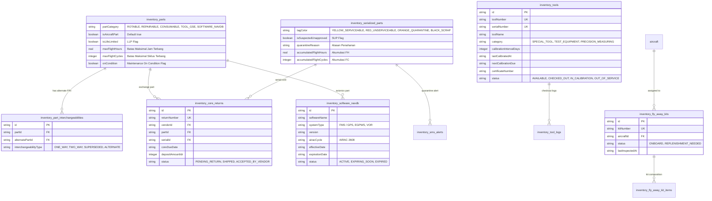
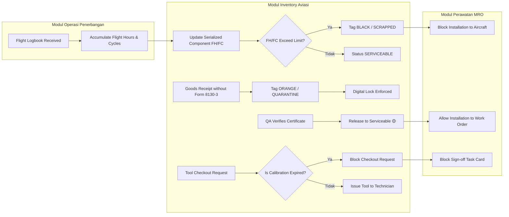

# Dokumentasi Teknis & Fungsional: Modul Inventory Aviasi (Standard DKPPU / FAA / EASA)

Dokumen ini berisi panduan lengkap teknis dan operasional untuk fitur-fitur gudang aviasi yang telah diimplementasikan pada sistem **PT AMA (Associated Mission Aviation)**. Fitur ini dirancang khusus untuk memenuhi standar keselamatan udara internasional (**DKPPU / FAA / EASA**).

---

## 📋 Daftar Isi

1. [Ringkasan Eksekutif & Standar Compliance](#1-ringkasan-eksekutif--standar-compliance)
2. [Arsitektur Skema Database](#2-arsitektur-skema-database)
3. [Klasifikasi Airworthiness Tagging Standar Penerbangan](#3-klasifikasi-airworthiness-tagging-standar-penerbangan)
4. [Modul & Fitur Baru (User Interface Guide)](#4-modul--fitur-baru-user-interface-guide)
   - [4.1 Digital Quarantine & SUP Management](#41-digital-quarantine--sup-management)
   - [4.2 Tool Control & GSE Calibration Management](#42-tool-control--gse-calibration-management)
   - [4.3 Vendor Core Return & Deposit Tracking](#43-vendor-core-return--deposit-tracking)
   - [4.4 Avionics Software & AIRAC 28-Day NavDB Tracker](#44-avionics-software--airac-28-day-navdb-tracker)
   - [4.5 Fly Away Kit (FAK) Pesawat Perintis](#45-fly-away-kit-fak-pesawat-perintis)
   - [4.6 LLP (Life-Limited Parts) & Part Interchangeability](#46-llp-life-limited-parts--part-interchangeability)
5. [Keterhubungan Antarmodul (Module Integration)](#5-keterhubungan-antarmodul-module-integration)
6. [Spesifikasi API Endpoints](#6-spesifikasi-api-endpoints)
7. [Pengujian & Verifikasi (Automated Test Suite)](#7-pengujian--verifikasi-automated-test-suite)

---

## 1. Ringkasan Eksekutif & Standar Compliance

Sistem Pengelolaan Gudang Aviasi PT AMA dikembangkan untuk menjamin **Airworthiness & Safety Compliance** sesuai regulasi:

- **DKPPU (Direktorat Kelaikudaraan dan Pengoperasian Pesawat Udara - CASR/PKPS)**
- **FAA (Federal Aviation Administration - FAR Part 145/121/135)**
- **EASA (European Union Aviation Safety Agency - Part M / Part 145)**

### Fitur Kunci Aviasi yang Ditambahkan:

1. **International Airworthiness Tagging**: Pemisahan tag warna internasional (🟡 Serviceable, 🔴 Unserviceable, 🟠 Quarantine, ⚪/⚫ Scrap).
2. **Digital Quarantine Lock**: Kuncian digital otomatis pada suku cadang tanpa sertifikat resmi (CoC / Form 8130-3 / EASA Form 1) atau dicurigai palsu (_Suspected Unapproved Parts / SUP_).
3. **Hard-Time & LLP Tracking**: Pelacakan jam terbang (_Flight Hours_) dan siklus pendaratan (_Flight Cycles_) untuk komponen berbatas waktu pakai.
4. **Tool Control & GSE Calibration Enforcement**: Pemblokiran otomatis terhadap peminjaman alat ukur/tool yang terlewat tanggal kalibrasinya.
5. **Vendor Core Return & Deposit Refund**: Pelacakan pengembalian _old core_ dari transaksi pembelian _exchange_.
6. **Avionics AIRAC 28-Day NavDB Control**: Pelacakan masa berlaku data navigasi penerbangan (Garmin G1000/FMS/EGPWS).
7. **Fly Away Kits (FAK)**: Audit kelengkapan suku cadang darurat bawaan pesawat untuk penerbangan ke daerah pedalaman/perintis.

---

## 2. Arsitektur Skema Database

Telah ditambahkan **7 Tabel Baru** serta penyempurnaan kolom pada tabel eksisting:



---

## 3. Klasifikasi Airworthiness Tagging Standar Penerbangan

| Tag & Warna          | Status          | Deskripsi & Aturan Penggunaan                                                                              |
| :------------------- | :-------------- | :--------------------------------------------------------------------------------------------------------- |
| 🟡 **YELLOW**        | `SERVICEABLE`   | Suku cadang laik terbang dengan sertifikat resmi (CoC / Form 8130-3). Dapat dipasang ke pesawat.           |
| 🔴 **RED**           | `UNSERVICEABLE` | Suku cadang rusak / butuh inspeksi & perbaikan di MRO / workshop. **Dilarang dipasang ke pesawat.**        |
| 🟠 **ORANGE**        | `QUARANTINE`    | Ditahan secara digital karena dokumen belum lengkap atau dicurigai SUP (_Suspected Unapproved Parts_).     |
| ⚪/⚫ **BLACK/GREY** | `SCRAPPED`      | Suku cadang yang telah melewati batas umur (_LLP Limit Exceeded_) atau rusak permanen. **Afkir permanen.** |

---

## 4. Modul & Fitur Baru (User Interface Guide)

### 4.1 Digital Quarantine & SUP Management

- **Halaman**: [app/pages/inventory/quarantine.vue](file:///home/mark/Development/project/AMA-Interface/app/pages/inventory/quarantine.vue)
- **Fungsi**: Memantau seluruh suku cadang yang berada dalam area Karantina fisik dan digital.
- **Kuncian Digital (_Digital Lock_)**: Part bermerek Tag Oranye di-block oleh sistem sehingga tidak dapat di-issue ke Work Order atau di-transfer.
- **Prosedur Quarantine Release**:
  1. Inspektor QA memeriksa fisik barang dan sertifikat resmi (Form 8130-3 / EASA Form 1).
  2. Klik tombol **Release to Available**.
  3. Masukkan nomor rujukan sertifikat kelaikan & tentukan target Serviceable Bin.
  4. Status otomatis berubah menjadi 🟡 **Yellow Tag (Serviceable)**.

### 4.2 Tool Control & GSE Calibration Management

- **Halaman**: [app/pages/inventory/tools.vue](file:///home/mark/Development/project/AMA-Interface/app/pages/inventory/tools.vue)
- **Fungsi**: Pelacakan peminjaman alat ukur (_Tool Check-Out/Check-In_) dan status sertifikat kalibrasi.
- **Aturan Pemblokiran Kalibrasi (_Calibration Enforcement Guard_)**:
  - Apabila `nextCalibrationDue` telah terlewat, status tool berubah menjadi `EXPIRED / BLOCKED`.
  - Tombol **Check-Out** otomatis hilang/didisable. Sistem backend melemparkan `DomainError` jika paksa di-checkout.
- **Fitur Update Kalibrasi**: Memungkinkan input tanggal kalibrasi baru & memasukkan nomor sertifikat kalibrasi dari laboratorium uji resmi.

### 4.3 Vendor Core Return & Deposit Tracking

- **Halaman**: [app/pages/inventory/core-returns.vue](file:///home/mark/Development/project/AMA-Interface/app/pages/inventory/core-returns.vue)
- **Fungsi**: Pelacakan tenggat pengembalian suku cadang bekas (_Old Core_) dari transaksi transaksi pembelian _Exchange_.
- **Alur Kerja Deposit Refund**:
  1. Pembelian _Exchange PO_ mencatat uang jaminan deposit (`depositAmountIdr`).
  2. Gudang mengirimkan _Old Core_ sebelum `coreDueDate` (Status: `SHIPPED`).
  3. Vendor menerima _Old Core_ dan mengembalikan deposit ke modul Finance (Status: `ACCEPTED_BY_VENDOR`).

### 4.4 Avionics Software & AIRAC 28-Day NavDB Tracker

- **Halaman**: [app/pages/inventory/software-navdb.vue](file:///home/mark/Development/project/AMA-Interface/app/pages/inventory/software-navdb.vue)
- **Fungsi**: Memantau masa berlaku database navigasi penerbangan (Garmin G1000 NXi, FMS, EGPWS) sesuai siklus 28-hari AIRAC ICAO/FAA.
- **Peringatan Dini**: Menampilkan hitungan sisa hari (`daysLeft`). Jika sisa $\le 7$ hari, indikator visual kuning (`EXPIRING_SOON`) ditampilkan.

### 4.5 Fly Away Kit (FAK) Pesawat Perintis

- **Halaman**: [app/pages/inventory/fly-away-kits.vue](file:///home/mark/Development/project/AMA-Interface/app/pages/inventory/fly-away-kits.vue)
- **Fungsi**: Mengelola kelengkapan kotak suku cadang darurat bawaan pesawat perintis (Pilatus PC-6, Cessna C208 Caravan) yang terbang ke bandara pedalaman tanpa gudang MRO.
- **Status Audit Kit**:
  - `COMPLETE & READY`: Seluruh komponen onboard sesuai jumlah minimum.
  - `REPLENISHMENT NEEDED`: Komponen terpakai saat AOG dan wajib diisi ulang di Home Base.

### 4.6 LLP (Life-Limited Parts) & Part Interchangeability

- **Halaman**: [app/pages/inventory/parts.vue](file:///home/mark/Development/project/AMA-Interface/app/pages/inventory/parts.vue)
- **Fungsi**:
  - Menandai suku cadang sebagai **Life-Limited Part (LLP)** dengan input batas maksimal jam terbang (`maxFlightHours`) dan siklus (`maxFlightCycles`).
  - Menentukan kategori penerbangan: `ROTABLE`, `REPAIRABLE`, `CONSUMABLE`, `EXPENDABLE`, `TOOL_GSE`, `SOFTWARE_NAVDB`, `MISSION_SPECIFIC`.

---

## 5. Keterhubungan Antarmodul (Module Integration)



---

## 6. Spesifikasi API Endpoints

### 🟢 Quarantine Management

- `GET /api/inventory/quarantine`: Mengambil daftar suku cadang yang dikunci di area karantina.
- `POST /api/inventory/quarantine/release`: Melepas kuncian digital karantina dengan verifikasi sertifikat.
  - **Body Payload**:
    ```json
    {
      "serialId": "inv-serial-brake-001",
      "targetBinId": "inv-bin-djj-usable",
      "certificateReference": "FAA-8130-2026-90412"
    }
    ```

### 🔧 Tool Control & Calibration

- `GET /api/inventory/tools`: Mengambil daftar master tool, lokasi, & status kalibrasi.
- `POST /api/inventory/tools`: Mendaftarkan tool/peralatan ukur baru.
- `POST /api/inventory/tools/checkout`: Peminjaman tool (Memblokir otomatis jika kalibrasi expired).
- `POST /api/inventory/tools/return`: Pengembalian tool (Catat kondisi laik / rusak / hilang).
- `POST /api/inventory/tools/calibrate`: Memperbarui data sertifikat & masa berlaku kalibrasi.

### 🔄 Core Returns & Exchange

- `GET /api/inventory/core-returns`: Mengambil daftar item core return ke vendor.
- `POST /api/inventory/core-returns`: Membuat pencatatan core return baru.
- `PUT /api/inventory/core-returns/:id/status`: Mengubah status (`PENDING_RETURN` -> `SHIPPED` -> `ACCEPTED_BY_VENDOR`).

### 🛰️ Avionics Software & NavDB

- `GET /api/inventory/software-navdb`: Mengambil daftar status database navigasi & AIRAC cycle.
- `POST /api/inventory/software-navdb`: Mendaftarkan/memperbarui versi AIRAC 28-day cycle baru.

### 🧰 Fly Away Kits (FAK)

- `GET /api/inventory/fly-away-kits`: Mengambil daftar kit onboard & status kelengkapan.
- `POST /api/inventory/fly-away-kits`: Mendaftarkan Fly Away Kit baru untuk armada pesawat.

---

## 7. Pengujian & Verifikasi (Automated Test Suite)

Seluruh pengujian otomatis dijalankan menggunakan **Vitest** dengan tingkat keberhasilan **100% PASS**:

- **File Test Main Inventory**: [tests/inventory/inventory-service.test.ts](file:///home/mark/Development/project/AMA-Interface/tests/inventory/inventory-service.test.ts) (30 Pass)
- **File Test Aviation Extensions**: [tests/inventory/aviation-inventory-service.test.ts](file:///home/mark/Development/project/AMA-Interface/tests/inventory/aviation-inventory-service.test.ts) (7 Pass)

### Perintah Menjalankan Test Suite:

```bash
# Jalankan test khusus fitur aviasi baru
NODE_OPTIONS="--max-old-space-size=4096" pnpm vitest run tests/inventory/aviation-inventory-service.test.ts

# Jalankan seluruh test suite modul inventory
NODE_OPTIONS="--max-old-space-size=4096" pnpm vitest run tests/inventory/
```
