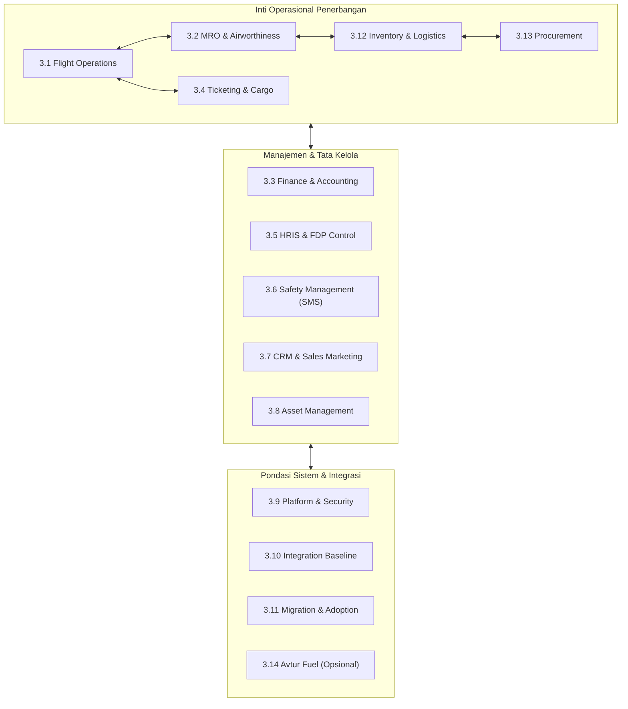

# DOKUMEN PERJANJIAN RUANG LINGKUP PEKERJAAN

## STATEMENT OF WORK (SOW) - IMPLEMENTASI SISTEM AMA OPS INTERFACE

**Nomor Dokumen**: SOW-AMA-MANTIQ-2026-001  
**Tanggal Penerbitan**: 14 Agustus 2026  
**Status**: Draft Final (Siap Tanda Tangan)

---

### PARA PIHAK

1. **PT ALFA TRANS PASIFIK / PT OPERATOR PENERBANGAN AMA (PT AMA)**  
   Maskapai Operator Penerbangan Rintis & Charter Komersial di Papua.  
   _(Selanjutnya disebut sebagai **"PEMILIK PROYEK / PIHAK PERTAMA"**)_

2. **PT MANTIK TEKNOLOGI NUSANTARA (MANTIQ TECHNOLOGY)**  
   Penyedia Solusi Teknologi Informasi & Pengembang Sistem Perangkat Lunak Penerbangan.  
   _(Selanjutnya disebut sebagai **"PELAKSANA PEKERJAAN / PIHAK KEDUA"**)_

---

## 1. Latar Belakang & Tujuan Proyek

PT AMA memerlukan transformasi digital operasional penerbangan secara menyeluruh (_End-to-End_) untuk mengintegrasikan manajemen operasi penerbangan (_Flight Operations_), perawatan pesawat (_Maintenance, Repair, and Overhaul - MRO_), pengelolaan keuangan & akuntansi (_Finance & Accounting_), komersial & reservasi tiket (_Ticketing & Cargo_), sumber daya manusia (_HRIS_), manajemen keselamatan penerbangan (_Safety Management System - SMS_), hubungan pelanggan (_CRM_), manajemen aset (_Asset Management_), serta inventaris suku cadang & pengadaan (_Inventory & Procurement_).

Tujuan utama dari proyek ini adalah:

1. Meningkatkan tingkat keselamatan dan kepatuhan regulasi penerbangan resmi (CASR Part 91, 92, 135, 145).
2. Memangkas hambatan manual dan mempercepat proses rilis penerbangan (_Flight Release_) serta pelepasan teknis pesawat (_Technical Release / CRS_).
3. Mencegah risiko kelalaian operasional melalui aturan pembatas otomatis sistem (_System Hard-Lock / Blocker Engine_).
4. Menyajikan transparansi data keuangan dan operasional secara _real-time_ dengan jejak audit imutabel (_Immutable Audit Trail_).

---

## 2. Metodologi Pelaksanaan Proyek

Pelaksanaan pekerjaan oleh PT Mantik Teknologi Nusantara menggunakan pendekatan bertahap (_Phased Delivery Approach_) dengan prinsip _Agile/Scrum_ terkelola, yang mencakup:

- **Backlog Terkontrol**: Seluruh kebutuhan dijabarkan dalam _Product Backlog_ yang diprioritaskan.
- **Requirement Traceability**: Setiap fitur yang dibangun dapat ditelusuri ke Kode Requirement (P0/P1) dan Aturan Bisnis.
- **Iterasi / Sprint**: Pengembangan dilaksanakan dalam sprint berkala (2 mingguan) disertai demonstrasi hasil secara rutin (_Sprint Demo_).
- **Quality Gate & Milestone Review**: Setiap hasil tahap wajib melalui verifikasi kualitas dan _sign-off_ formal sebelum melangkah ke tahap berikutnya.
- **Prosedur Change Request**: Perubahan material di luar baseline yang disetujui diproses terpisah melalui _Change Control Board (CCB)_.

---

## 3. Ruang Lingkup Pekerjaan (Scope of Work)

PT Mantik Teknologi Nusantara wajib melaksanakan tahapan _discovery_, analisis, desain arsitektur, pengembangan/konfigurasi perangkat lunak, integrasi sistem, pemindahan data (_data migration_), pengujian (_testing_), penguatan keamanan (_security hardening_), peluncuran (_deployment_), pelatihan pengguna (_user training_), uji coba operasional (_cutover & rehearsal_), peluncuran resmi (_go-live_), pendampingan intensif (_hypercare_), hingga penyerahan operasional (_handover_) untuk ruang lingkup pekerjaan yang dinyatakan dalam dokumen ini.

---

### 3.1 Flight Operations Module

Ruang lingkup modul _Flight Operations_ meliputi:

1. **Master Data Management**: Pengelolaan data induk pesawat (_aircraft fleet_), stasiun operasional (_stations_), bandara/pangkalan udara (_airports & airstrips_), rute penerbangan (_routes_), pelanggan (_customers_), pemasok (_suppliers_), dan data personel awak pesawat (_crew_).
2. **Flight Request & Flight Order**: Pengajuan penerbangan baru (_wizard request_) untuk kategori charter, rintis/subsidi, medevac, dan kargo, serta penerbitan perintah terbang resmi (_Flight Order_).
3. **Scheduling & Conflict Detection**: Penjadwalan penerbangan otomatis yang dilengkapi deteksi konflik jadwal pesawat dan jam kerja kru.
4. **Aircraft & Crew Assignment**: Penugasan armada spesifik dan penugasan kru (PIC/SIC) yang memenuhi kualifikasi rating dan jam terbang aman.
5. **Multi-Dimensional Readiness Engine**: Evaluasi kesiapan penerbangan 4 dimensi secara otomatis meliputi kesiapan Armada Pesawat (MRO status), Kru (FDP & Lisensi), Dokumen Penerbangan, dan Kesiapan Stasiun.
6. **Approval & Operational Release**: Alur persetujuan berjenjang dan penerbitan izin rilis penerbangan (_Flight Release_) yang mengunci manifes penerbangan secara otomatis.
7. **Passenger & Cargo Manifesting**: Penyusunan manifes penumpang dan barang kargo yang terhubung dengan penimbangan berat fisik.
8. **Passenger Lifecycle & Versioning**: Pelacakan status penumpang (_Check-in_, _Boarded_, _No-Show_, _Offloaded_) dan manajemen versi manifes.
9. **Fuel Planning & Management**: Perencanaan kebutuhan bahan bakar (_Fuel Planning_), pengajuan (_request_), konfirmasi pengisian (_fueling confirmation_), bukti foto nota fisik (_uplink actual evidence_), dan analisis selisih (_variance analysis_).
10. **Station Services**: Pencatatan layanan stasiun mencakup _ground handling_, _parking fee_, dan layanan pendukung darat lainnya.
11. **Departure & Arrival Actuals**: Pencatatan jam lepas landas aktual (_ATD_) dan jam mendarat aktual (_ATA_) stasiun.
12. **Flight Following & Live Tracking**: Pemantauan pergerakan pesawat secara _real-time_ berbasis peta dan integrasi pakan data posisi (GPS/Radar).
13. **Disruption Handling**: Penanganan kondisi khusus penerbangan mencakup keterlambatan (_delay_), pembatalan (_cancellation_), pengalihan mendarat (_diversion_), kembali ke pangkalan (_return-to-base_), dan skenario darurat.
14. **Station Completion & Handoff**: Penutupan aktivitas operasional stasiun (_Station Completion_), penyerahan data ke modul MRO (_Maintenance Handoff_), dan penyerahan data ke modul Keuangan (_Finance Handoff_).
15. **Flight Closure & Controlled Reopening**: Penutupan penerbangan resmi (_Flight Closure_) menjadi status imutabel dan prosedur pembukaan kembali terkontrol (_Controlled Reopening_) berbasis otorisasi persetujuan khusus.
16. **Notifications & Auditing**: Notifikasi otomatis (in-app/email/WA) dan pencatatan jejak audit (_Audit Trail_) penuh atas seluruh perubahan data dan transisi status penerbangan.
17. **Limited Connectivity Support**: Dukungan pengoperasian aplikasi di stasiun perintis dengan konektivitas internet terbatas atau _Offline-First Mode_.

---

### 3.2 Maintenance, Repair, and Overhaul (MRO) Module

Ruang lingkup modul MRO meliputi:

1. **Fleet & Aircraft Technical Status**: Dasbor pemantauan status kelaikan udara armada (_Serviceable_, _Maintenance_, _AOG_).
2. **Aircraft Utilization Tracking**: Pencatatan akumulasi penggunaan pesawat secara otomatis berbasis Jam Terbang (_Flight Hours - FH_), Siklus Pendaratan (_Flight Cycles - FC_), dan Hari Kalender.
3. **Maintenance Program & Due Control**: Pengelolaan program perawatan berkala (_Approved Aircraft Maintenance Program - AAMP_) dan pemantauan jatuh tempo inspeksi (_Due-Control Engine_).
4. **Airworthiness Directives (AD), Service Bulletins (SB), & LLP**: Pelacakan kepatuhan AD/SB dari regulator/pabrikan serta penelusuran batas umur komponen (_Life Limited Parts - LLP_).
5. **Approved Maintenance Data Registry**: Pendaftaran pustaka manual perawatan resmi (_AMM_, _IPC_, _WDM_, _wiring manual_).
6. **Defect & Finding Management**: Pencatatan laporan kerusakan pesawat (_Defect Record_) dari logbook penerbangan maupun inspeksi pra-terbang.
7. **Defect Assessment & Disposition**: Evaluasi keparahan defek dan penentuan tindakan (_Rectify_ vs _Defer_).
8. **Deferred Defect (MEL / CDL)**: Pengelolaan penundaan perbaikan defek yang diizinkan berdasarkan dokumen _Minimum Equipment List (MEL)_ atau _Configuration Deviation List (CDL)_ dengan pengunci tanggal kedaluwarsa (_Expiry Lock_).
9. **Work Package Management**: Penyusunan paket kerja perawatan (_Work Package_) berstatus _DRAFT_, _IN_PROGRESS_, _PENDING_RELEASE_, hingga _CLOSED_.
10. **Job Card & Task Execution**: Pendaftaran kartu kerja (_Job Cards_), alokasi prosedur teknis, dan eksekusi pekerjaan teknis di lapangan.
11. **Non-Routine Finding & Rework**: Pencatatan temuan non-rutin saat perawatan, pembuatan kartu kerja pengerjaan ulang (_Rework Job Card_), dan pengujian ulang.
12. **Material Requirement & Issue**: Pengajuan kebutuhan suku cadang, reservasi nomor seri, pengeluaran barang dari gudang, pencatatan pemasangan (_installation_), pelepasan (_removal_), dan pengembalian suku cadang bekas.
13. **Tool & GSE Allocation**: Alokasi peralatan teknis (_Tools_) dan peralatan darat (_Ground Support Equipment - GSE_).
14. **Tool Calibration & Expiry Control**: Penguncian otomatis (_Hard-Lock_) peminjaman alat ukur apabila tanggal kalibrasinya telah kedaluwarsa.
15. **Component & Rotable Traceability**: Penelusuran silsilah komponen berseri (_Rotable Parts Traceability_) dari penerimaan hingga pemasangan di pesawat.
16. **Personnel Licence & Authorization**: Verifikasi lisensi teknisi (AMEL) dan otorisasi internal perusahaan sebelum diizinkan melakukan pekerjaan teknis.
17. **Mechanic Sign-Off**: Penandatanganan digital kartu kerja oleh teknisi pelaksana yang mencatat identitas aktor, nomor lisensi, dan timestamp.
18. **Independent Inspection & Segregation**: Pelaksanaan inspeksi independen oleh Inspektur QA untuk kartu kerja tergolong kritikal, dengan penegakan pembatasan tegas (_Segregation of Duties_): Inspektur dilarang menginspeksi pekerjaannya sendiri.
19. **Technical Release (CRS)**: Penerbitan Sertifikat Izin Rilis Pesawat (_Certificate of Release to Service - CRS_) secara digital oleh _Certifying Staff_ yang sah, yang secara otomatis memajukan status jatuh tempo perawatan berikutnya (_Next Due Advancement_).
20. **Technical Records & Financial Cost Handoff**: Penyerahan berkas dokumen teknis ke arsip kelaikan dan penyerahan biaya pemeliharaan (_MRO Cost Handoff_) ke modul Keuangan.

---

### 3.3 Finance dan Accounting Module

Ruang lingkup modul _Finance & Accounting_ meliputi:

1. **Master Finance & Chart of Accounts (CoA)**: Pengelolaan struktur akun buku besar (_General Ledger Accounts_), pusat biaya (_Cost Center_), dan kategori transaksi.
2. **Fiscal & Accounting Period Control**: Pengaturan periode fiskal, penutupan periode akuntansi (_Period Closing_), dan prosedur pembukaan kembali terotorisasi (_Controlled Reopening_).
3. **Approval Limits & Segregation of Duties**: Matriks batas kewenangan persetujuan keuangan berdasarkan nilai transaksi dan penegakan pemisahan tugas (_Segregation of Duties_).
4. **Cash & Bank Management**: Pengelolaan akun kas stasiun, rekening bank perusahaan, dan transaksi kas kecil (_Petty Cash_).
5. **Bank Reconciliation**: Pengimporan rekening koran bank (_Bank Statement Import_) dan pencocokan otomatis (_Auto-Reconciliation_).
6. **Account Receivable (AR)**: Pengelolaan piutang pelanggan, komersial, agen tiket, dan penagihan penerbangan subsidi.
7. **Account Payable (AP)**: Pengelolaan utang usaha kepada pemasok suku cadang, vendor avtur, stasiun bandara, dan penyedia jasa.
8. **Customer Invoicing & Supplier Billing**: Penerbitan faktur tagihan pelanggan (_Customer Invoice_) dan pencatatan tagihan pemasok (_Supplier Bill_).
9. **Receipt & Payment Processing**: Pencatatan penerimaan pembayaran kas/bank dan pencairan pembayaran beban.
10. **Aviation Revenue & Cost Accounting**: Pembukuan otomatis pendapatan penerbangan (_Aviation Revenue_) dan biaya operasional langsung (_Flight Cost_ mencakup fuel, handling, parking, landing fee, dan maintenance).
11. **General Ledger & Auto-Journaling**: Pembukuan otomatis (_Auto-Journal_) dari modul Flight, Ticketing, MRO, Inventory, dan HRIS ke General Ledger dengan penegakan entri ganda seimbang (_Balanced Double-Entry Journal: Debit = Credit_).
12. **Immutability & Reversal Journal**: Penegakan aturan imutabilitas jurnal berstatus `POSTED` (tidak dapat diedit/dihapus) dan penyediaan prosedur Jurnal Pembalik (_Reversal Journal_) untuk koreksi pembukuan.
13. **Financial Reporting**: Penyajian Neraca Saldo (_Trial Balance_), Laporan Laba Rugi (_Profit & Loss_), Laporan Posisi Keuangan (_Balance Sheet_), Laporan Arus Kas (_Cash Flow_), dan Laporan Manajemen.
14. **Drill-Down & Source Traceability**: Kemampuan penelusuran dua arah (_Bi-directional Traceability_) dari angka laporan keuangan langsung ke dokumen sumber transaksi (AWB, Tiket, Work Package, Nota Fuel).
15. **Tax Support & Fixed Assets**: Dukungan perhitungan pajak sesuai ketentuan hukum yang berlaku serta pencatatan aset tetap (_Fixed Asset Register_) dan penyusutan akuntansi.

---

### 3.4 Ticketing System Module

Ruang lingkup modul _Ticketing System_ meliputi:

1. **Sales Opening & Scheme Management**: Pengelolaan pembukaan skema penjualan penerbangan untuk penumpang reguler, penerbangan sewa (_charter_), kargo umum, dan kargo per-kilogram.
2. **Passenger Booking & Manifesting**: Manajemen pemesanan tiket penumpang, denah tempat duduk (_Seat Map_), batas bagasi gratis & kelebihan bagasi (_Excess Baggage_), serta penerbitan _E-Ticket_ dilengkapi _QR Code_.
3. **Agent Commercial & Commission**: Pengelolaan mitra agen komersial, penetapan batas kredit (_Credit Limit_), penegakan penghentian kredit (_Credit Hold Enforcement_), dan perhitungan komisi agen.
4. **Passenger Reschedule & Rebooking**: Fitur penjadwalan ulang tiket penumpang dengan kalkulasi otomatis ketersediaan penerbangan pengganti dan selisih tarif komersial.
5. **Cargo Booking & Airway Bill (AWB)**: Pemesanan dan pengangkutan kargo udara, penerbitan Surat Muatan Kargo (_Airway Bill - AWB_), dan penentuan tarif berdasarkan _Chargeable Weight_ (nilai tertinggi antara berat aktual vs berat volumetrik).
6. **Dangerous Goods (DG) Management**: Klasifikasi kargo berbahaya sesuai regulasi CASR 92, pemeriksaan lembar _Shipper's Declaration_, penerapan biaya tambahan (_DG Surcharge_), dan penguncian persetujuan petugas bersertifikat DG.
7. **Cargo Shipment Tracking**: Pelacakan status pengiriman kargo secara _real-time_ dari status _Booked_, _Received at Warehouse_, _Loaded_, _In-Transit_, _Arrived_, hingga _Delivered_.
8. **Ticket Refund & Cancellation Workflow**: Alur pengajuan dan persetujuan pengembalian dana tiket penumpang dan kargo, disertai pembalikan otomatis (_reversal_) pada jurnal akuntansi pendapatan.
9. **Ticketing Ledger Consolidation**: Konsolidasi buku besar keuangan tiket yang mengintegrasikan transaksi pendapatan penumpang, kargo, piutang agen, dan refund ke modul _General Ledger_.

---

### 3.5 Human Resource Information System (HRIS) Module

Ruang lingkup modul _HRIS_ meliputi:

1. **Master Data Kepegawaian**: Pengelolaan data pribadi karyawan, kontak darurat, alamat, BPJS Kesehatan/Ketenagakerjaan, status perpajakan PPh 21, rekening bank, dan riwayat status kepegawaian (_PKWT_, _PKWTT_, _Outsource_, _Probation_).
2. **Organizational Structure & Hierarchy**: Pengelolaan struktur organisasi perusahaan (_Org Tree_), hirarki departemen, dan penunjukan Kepala Departemen (_Head of Department_).
3. **Flight Personnel Certification & Expiry Monitoring**: Pelacakan dan pemantauan lisensi personel penerbangan (Pilot License CPL/ATPL, Type Rating, Medical Certificate Class 1/2, FOO Dispatcher, AMEL Technician, DG Certificate) dilengkapi peringatan otomatis (_Expiry Warning_ H-60, H-30, H-7) dan pengunci otomatis (_Hard-Lock_) penugasan jika kedaluwarsa.
4. **Shift Patterns & Flight Duty Period (FDP) Monitoring**: Pengaturan pola shift kerja, penataan jadwal tugas (_Roster_), dan pemantauan akumulasi jam terbang penerbang (_FDP CASR Control_: maks 100 jam/30 hari dan 1000 jam/365 hari).
5. **Attendance Tracking & ESS Portal**: Pencatatan presensi harian karyawan melalui _Employee Self-Service (ESS) Portal_ yang dilengkapi verifikasi lokasi GPS dan foto (_photo evidence_), serta fitur pengajuan koreksi presensi.
6. **Leave & Overtime Management**: Pengajuan dan alur persetujuan cuti berjenjang dengan pelacakan sisa kuota cuti tahunan, serta pengajuan lembur yang terhubung ke kalkulasi penggajian.
7. **Payroll Engine**: Pemrosesan penggajian bulanan dan THR, pengawasan tarif tunjangan penerbangan (_Flight Allowance Rates_), kalkulasi otomatis Pajak PPh 21 TER (Tarif Efektif Rata-rata 2024), serta penerbitan Slip Gaji digital (_Payslip Viewer_).
8. **Recruitment & Applicant Tracking System (ATS)**: Pengelolaan pengumuman lowongan kerja (_Job Postings_) dan penanganan tahapan seleksi pelamar (_Screening_, _Interview_, _Offered_, _Hired_).
9. **Performance Appraisal & KPI**: Manajemen penilaian kinerja karyawan berdasarkan Indikator Kinerja Utama (KPI) terukur, bobot nilai, dan evaluasi periodik.
10. **Executive HR Dashboard & ESS Security**: Dasbor eksekutif kepegawaian dan portal mandiri karyawan yang terlindungi sistem enkripsi data dan otentikasi berbasis peran (_RBAC_).

---

### 3.6 Safety Management System (SMS) Module

Ruang lingkup modul _SMS_ meliputi:

1. **Safety Policy & Just Culture**: Penyediaan platform kebijakan keselamatan dan penegakan budaya pelaporan yang adil (_Just Culture_).
2. **Hazard, Occurrence, & Finding Reporting**: Pelaporan bahaya, kejadian penerbangan (_occurrence_), dan temuan teknis dari seluruh staf operasional.
3. **Voluntary & Confidential Reporting**: Fitur pelaporan sukarela dan rahasia yang mengenkripsi identitas pelapor untuk perlindungan penuh.
4. **Flight Risk Assessment Tool (FRAT)**: Penilaian dan kalkulasi skor risiko pra-penerbangan berbasis matriks probabilitas dan keparahan.
5. **Fatigue Risk Integration**: Pengintegrasian skor kelelahan kru (_Crew Fatigue Score_) dari modul HRIS ke dalam kalkulasi risiko pra-terbang.
6. **FRAT Hard-Lock & Special Override Workflow**: Penguncian otomatis (_Hard-Lock_) pelepasan penerbangan untuk kategori risiko Tinggi (_Red/High Risk_ skor > 75), yang hanya dapat dibuka melalui persetujuan khusus (_Override Sign-Off_) tertulis dari Chief Pilot.
7. **Corrective & Preventive Action (CAPA)**: Pengelolaan alur kerja tindakan korektif dan preventif atas temuan bahaya, pemantauan tenggat waktu (_due date_), pengingat otomatis, dan eskalasi hierarkis.
8. **One-Click Emergency Response Plan (ERP)**: Pemicu darurat satu-klik untuk menyebarkan notifikasi insiden secara instan via WhatsApp API, Email, dan SMS ke tim tanggap darurat.
9. **Safety Performance Indicators (SPI) & Analytics**: Dasbor analitik indikator kinerja keselamatan penerbangan dan visualisasi tren risiko.
10. **Mandatory Occurrence Report (MOR) Draft Generator**: Penyiapan draf otomatis laporan kepatuhan regulasi resmi (_MOR Report_) untuk disampaikan ke DKUPPU/DGCA.
11. **EFB Offline-First & Mobile Sync**: Penyimpanan data lokal terenkripsi pada aplikasi mobile/EFB dan sinkronisasi data otomatis saat terhubung jaringan internet.
12. **Safety Communication, Feedback, & Training Tracking**: Publikasi buletin keselamatan (_Safety Flash_), umpan balik otomatis kepada pelapor (_Reporter Feedback Loop_), pemantauan pelatihan keselamatan personel, dokumentasi rapat komite keselamatan (_SRB/SAG_), dan publikasi ringkasan tindakan keselamatan internal.

---

### 3.7 CRM, Sales & Marketing Module

Ruang lingkup modul _CRM, Sales & Marketing_ meliputi:

1. **Master Customer & PIC Management**: Pengelolaan data induk calon pelanggan (_Leads_), pelanggan aktif (_Customers_), profil perusahaan, kontak PIC, sektor bisnis, dan penugasan _Sales Representative_.
2. **Lead Management & Conversion**: Pelacakan prospek penjualan dan prosedur konversi status dari _Lead_ menjadi _Customer_.
3. **Sales Opportunity & Pipeline**: Pengelolaan peluang penjualan (_Sales Opportunity_) dan pemantauan tahapan corong penjualan (_Sales Pipeline_).
4. **Tender Management**: Pengelolaan proses tender untuk sektor Pemerintah (_Government_) dan Lembaga Keagamaan/Gereja (_Church Sector_), mencakup penyusunan proposal, estimasi anggaran, evaluasi, dan pencatatan status _Won/Lost Tender_.
5. **Promotion & Campaign Management**: Pengelolaan kampanye promosi sektor komersial, penetapan target pasar, saluran media promosi, anggaran, periode kampanye, dan pengukuran hasil efektivitas promosi.
6. **Social Media & Activity Tracking**: Pencatatan aktivitas harian sales (_Meeting_, _Follow-up_, _Site Survey_, _Presentation_, _Phone Call_), pengingat aksi lanjutan (_Next Action Reminder_), dan integrasi akun media sosial komersial.
7. **Sales Forecasting & Project Financing**: Penentuan target penutupan (_Target Closing_), estimasi probabilitas sukses, prakiraan pendapatan (_Sales Forecast_), dan integrasi pembiayaan proyek dengan modul Keuangan.
8. **CRM Approval Workflow & Analytics**: Alur persetujuan berjenjang untuk Tender, Kampanye, dan Pembiayaan Proyek, serta penyediaan Dasbor Eksekutif CRM dan audit trail lengkap.

---

### 3.8 Asset Management Module

Ruang lingkup modul _Asset Management_ meliputi:

1. **Master Asset & Location Tracking**: Pengelolaan data induk aset perusahaan, klasifikasi aset, nomor seri, lokasi fisik, departemen penanggung jawab, nilai perolehan, dan penunjukan PIC aset.
2. **Asset Receipt, Transfer, & Custody History**: Pencatatan penerimaan aset baru, serah terima penggunaan, dan pemantauan riwayat mutasi perpindahan aset antar lokasi/departemen.
3. **Asset Condition & Maintenance**: Pemantauan kondisi fisik dan status operasional aset (termasuk pencatatan kerusakan/kehilangan), serta perencanaan perawatan preventif (_Preventive Maintenance_) dan perbaikan (_Corrective Maintenance_).
4. **Depreciation & Finance Integration**: Perhitungan penyusutan nilai aset (_Asset Depreciation_) secara otomatis yang terintegrasi langsung dengan modul Keuangan.
5. **Asset Insurance & Claim Management**: Pengelolaan data asuransi aset, masa berlaku polis, nilai pertanggungan, dan pencatatan klaim asuransi.
6. **Disposal, Stock Opname, & Auditing**: Prosedur penghapusan aset (_Disposal_) melalui penjualan, pemusnahan, atau hibah, pelaksanaan _Stock Opname_ fisik aset, penyediaan dasbor aset, dan jejak audit (_Audit Trail_).

---

### 3.9 Platform Pendukung & Infrastruktur Dasar

Ruang lingkup platform pendukung meliputi:

1. **Identity, Authentication, & Access Control**: Sistem otentikasi pengguna, manajemen hak akses berbasis peran (_Role-Based Access Control - RBAC_), isolasi wewenang berbasis stasiun/departemen (_Station Scope Isolation_), dan penegakan pemisahan tugas (_Segregation of Duties_).
2. **Delegation & Temporary Authority**: Fasilitas pelimpahan wewenang sementara untuk proses persetujuan saat pejabat berwenang berhalangan.
3. **Audit Logging & Document Management**: Layanan pencatatan jejak audit imutabel (_Immutable Audit Trail_) atas seluruh transaksi kritis, serta pengelolaan lampiran berkas terenkripsi menggunakan _Presigned URL_ (masa berlaku 15 menit).
4. **Database & Object Storage**: Penggunaan basis data relasional PostgreSQL dan penyimpanan objek cloud S3-compatible / Cloudflare R2.
5. **Environment & CI/CD Pipeline**: Penyediaan 3 lingkungan sistem terpisah (_Development_, _Staging/UAT_, dan _Production_) dilengkapi alur integrasi dan peluncuran otomatis (_CI/CD Pipeline_).
6. **Backup, Disaster Recovery, & Hardening**: Pelaksanaan salinan cadangan otomatis (_Automated Daily Backup_), pengujian pemulihan data (_Restoration Test_), penguatan keamanan server (_Security Hardening_), pemantauan kesehatan sistem (_Monitoring, Logging, Tracing, Alerting_), dan penyusunan buku panduan penanganan insiden (_Operational Runbook_).

---

### 3.10 Integration Baseline

Cakupan integrasi sistem baseline meliputi:

1. **Flight Tracking Feed**: Integrasi **satu provider** pakan data posisi pesawat (GPS/Satellite/Radar feed seperti SITA, Spidertracks, atau FlightRadar24) melalui API/Webhook, dilengkapi normalisasi data, proteksi _replay_, deteksi data usang (_stale detection_), dan riwayat posisi.
2. **Notification Provider**: Integrasi notifikasi dalam aplikasi (_In-App Notification_), notifikasi email, dan **satu provider eksternal** untuk saluran SMS / WhatsApp Gateway API.
3. **Banking & Financial Integration**: Integrasi **satu format** berkas rekening koran bank (_Bank Statement MT940/CAMT_) dan **satu adapter** kanal pembayaran bank / payment provider (apabila API sandbox eksternal tersedia).
4. **External Device Hardware**: Integrasi **satu keluarga perangkat eksternal** untuk setiap skenario yang disepakati (misal: pemindai kode batang / barcode scanner gudang).
5. **Mock / Simulator Integration**: Penyediaan simulator/mock integrasi apabila perangkat hardware atau provider produksi belum tersedia pada jadwal tahap pengembangan.
6. _Catatan_: Penambahan provider eksternal atau antarmuka integrasi di luar baseline ini wajib diproses melalui permohonan _Change Request_.

---

### 3.11 Migrasi Data, Pelatihan, & Adopsi Sistem

Ruang lingkup migrasi data dan pengadopsian sistem meliputi:

1. **Data Migration Pipeline**: Inventarisasi sumber data lama (_Source Inventory_), pemetaan data (_Data Mapping_), penetapan aturan pembersihan (_Cleansing Rules_), pembuatan skrip pemindahan data (_Migration Scripts_), pelaksanaan minimal 2 kali uji coba pemindahan (_Migration Dry Run_), rekonsiliasi saldo/stok, dan pelaporan pengecualian (_Exception Reporting_).
2. **User Acceptance Testing (UAT)**: Penyelenggaraan pengujian UAT bersama _Key User_ PT AMA berbasis skenario _Requirements-Based Testing_ P0 hingga penandatanganan Berita Acara UAT.
3. **Training & Change Management**: Pelaksanaan pelatihan berbasis peran (_Role-Based Training_) untuk 12 kategori pengguna, penyediaan buku panduan pengguna (_User Manuals_), dan pendampingan _Key User_.
4. **Cutover & Go-Live**: Penyelenggaraan simulasi peluncuran (_Cutover Rehearsal_), rapat keputusasaan _Go/No-Go_, eksekusi pemindahan data resmi (_Production Cutover_), dan peluncuran resmi (_Go-Live_).
5. **Hypercare & Handover**: Pendampingan intensif 24/7 di lokasi stasiun Sentani dan _remote support_ selama 2–4 minggu pasca _Go-Live_, evaluasi _Post-Implementation Review (PIR)_, dan penyerahan operasional penuh (_Handover_) menuju masa garansi.

---

### 3.12 Inventory Management Module

Ruang lingkup modul _Inventory Management_ meliputi:

1. **Inventory Dashboard**: Dasbor indikator persediaan yang menampilkan _Available Parts_, _Low Stock Warning_, _Expiring Lots_, _Certificate Alerts_, _Quarantine Stock_, _Open PR/PO_, dan penilaian persediaan FIFO.
2. **Item Master & Classification**: Pengelolaan data induk barang, klasifikasi suku cadang pesawat (_Spare Parts_, _Rotables_, _Repairables_, _Expendables_, _Consumables_, _Tools_, _Chemicals_, _GSE_), satuan ukuran (UOM), dan lokasi gudang/stasiun.
3. **Part Traceability & Interchangeability**: Pelacakan Nomor Part (_P/N_), Nomor Seri (_S/N_), Nomor Batch/Lot, siklus hidup komponen, tingkat kepetingan (_Criticality_), dan tabel komponen pengganti yang diizinkan (_Interchangeability / Alternates_).
4. **Airworthiness Document Compliance**: Pengelolaan penerimaan, verifikasi, dan pengarsipan sertifikat kelaikan udara resmi (_EASA Form 1_, _FAA Form 8130-3_, _DGCA Form 21-18_, dan _Certificate of Conformance_).
5. **Shelf-Life & Expiry Hard-Lock**: Pemantauan masa simpan material sensitif, peringatan kedaluwarsa, dan penguncian otomatis (_Hard-Lock_) sistemik yang menolak pengeluaran suku cadang yang telah melewati batas kedaluwarsa.
6. **Goods Receipt & Receiving Inspection**: Penerimaan fisik barang dari pengadaan/pemasok, verifikasi kuantitas, dan pemeriksaan kelaikan teknis (_Receiving Inspection_).
7. **Stock Status & Warehouse Management**: Pengelolaan stok berdasarkan lokasi rak (_Bin Location_), lot/expiry, kondisi fisik, kuantitas _On-Hand_, kuantitas _Available_, dan status persediaan (_Quarantine_, _Repair_, _Transit_, _Usable/Serviceable_).
8. **Inventory Movement & Issue**: Pengelolaan pemindahan barang antar-gudang/stasiun, peminjaman peralatan teknis (_Tool Loan_), dan pengeluaran suku cadang (_Material Issue_) untuk kebutuhan pengerjaan _Work Package_.
9. **Material Return & Repair Routing**: Pengelolaan pengembalian suku cadang sisa, pencatatan komponen bekas lepas (_Removed Parts_), dan pengiriman komponen rusak ke bengkel perbaikan luar (_Repair Agency_).
10. **AOG Readiness & Reorder Control**: Pengaturan batas stok Minimum-Maksimum, Titik Pemesanan Ulang (_Reorder Point - ROP_), serta peringatan risiko armada tidak beroperasi (_AOG Risk Warning_) untuk suku cadang kritis.
11. **Stock Opname & Adjustment**: Pelaksanaan penghitungan fisik stok (_Stock Opname_), pencatatan selisih stok (_Stock Discrepancy_), berita acara penyesuaian (_Inventory Adjustment_), dan pengelolaan pemusnahan barang rusak/kadaluarsa (_Disposal Workflow_).
12. **Quarantine & Suspected Unapproved Parts (SUP)**: Penguncian otomatis sistemik (_Systemic Lock_) untuk barang baru datang yang belum diinspeksi, barang lepasan rusak (_Unserviceable_), dan suku cadang terindikasi tanpa dokumen sah (_Suspected Unapproved Parts / SUP_).
13. **Tool Calibration Hard-Lock**: Penguncian otomatis (_Hard-Lock_) yang menolak peminjaman peralatan ukur/khusus (misal: _Torque Wrench_, _Multimeter_) apabila tanggal kalibrasinya telah kedaluwarsa.
14. **Core Unit Tracking**: Pelacakan masa tenggat pengembalian komponen lama (_Removed Core Parts_) ke penyedia perbaikan untuk menghindari denda keterlambatan (_Late Core Fee_).
15. **Emergency Parts Borrowing & Kitting**: Pencatatan peminjaman suku cadang darurat antar-operator di stasiun pedalaman (_Parts Borrowing_) dan penyiapan paket material/suku cadang (_Parts Kitting/Staging_) khusus untuk kebutuhan _Scheduled Maintenance_.

---

### 3.13 Procurement Module

Ruang lingkup modul _Procurement_ meliputi:

1. **Supplier Master & Approved Vendor List (AVL)**: Pengelolaan data induk pemasok/vendor, kualifikasi izin usaha, sertifikasi penerbangan, dan pendaftaran Vendor Terverifikasi (_Approved Vendor List - AVL_).
2. **Purchase Requisition (PR)**: Pengajuan permohonan pembelian dari modul MRO, Operations, General Affairs (GA), dan departemen lainnya, mencakup pemeriksaan ketersediaan anggaran dan alur persetujuan berjenjang.
3. **Purchase Order (PO)**: Penerbitan dan pengelolaan PO resmi untuk suku cadang pesawat, _rotables_, _consumables_, avtur, _ground handling_, dan jasa pemeliharaan luar.
4. **Quotation & Tender Evaluation**: Pengelolaan penawaran harga (_Quotation/RFQ_), perbandingan penawaran beberapa vendor, evaluasi teknis/harga, dan penetapan vendor terpilih.
5. **Vendor Lead Time & Order Tracking**: Pemantauan estimasi waktu pengiriman (_Vendor Lead Time_), tanggal kedatangan rencana, status pengiriman cargo, dan pemantauan PO yang masih terbuka (_Outstanding PO_).
6. **Goods Receipt Integration**: Integrasi proses penerimaan barang dengan modul Inventory, mencakup verifikasi fisik kuantitas dan kelengkapan sertifikat kelaikan udara (_Form 1 / 8130-3 / CoC_).
7. **Purchase Return & Vendor Claim**: Pengelolaan retur barang ke vendor, penerbitan _Credit Note_, klaim garansi suku cadang rusak, dan penanganan ketidaksesuaian spesifikasi.
8. **Three-Way Matching**: Pencocokan 3 arah secara otomatis antara Pesanan Pembelian (_Purchase Order_), Bukti Penerimaan Barang (_Goods Receipt_), dan Tagihan Pemasok (_Supplier Invoice_) sebelum pembayaran diproses oleh modul Keuangan/AP.
9. **Vendor Performance Management**: Evaluasi kinerja vendor secara berkala berbasis indikator ketepatan waktu pengiriman, kualitas barang/jasa, harga, dan kelengkapan dokumen teknis.

---

### 3.14 Avtur Fuel Management System (Modul Opsional)

_Catatan: Modul ini bersifat opsional dan akan dilaksanakan apabila dinyatakan termasuk dalam Order Form atau Kesepakatan Opsional._

Ruang lingkup modul _Avtur Fuel Management System_ meliputi:

1. **Master Fuel Facilities & Assets**: Pengelolaan data induk fasilitas dan peralatan bahan bakar, mencakup tangki timbun (_Storage Tank_), drum 200 Liter, dispenser/hydrant DPPU Pertamina, pompa transfer, _flowmeter_, _smart nozzle_, dan identitas drum (_RFID Tag_).
2. **Field Hardware Integration**: Integrasi perangkat keras lapangan berstandar keselamatan penerbangan & K3 (_Ex-Proof Ultrasonic Level Sensor_, _Flowmeter_, _RFID Reader_, _Grounding Clamp_, dan _Smart Nozzle_ dengan sistem _Auto Cut-Off_).
3. **Offline-First Rugged Tablet Application**: Pengembangan aplikasi tablet tahan banting (_rugged tablet_) berbasis _Offline-First_ (SQLite terenkripsi) untuk operator bahan bakar di stasiun/pangkalan perintis pedalaman, dilengkapi fitur _Airplane Mode Guard_ di Zona Avtur dan konektivitas BLE 5.0.
4. **Store-and-Forward Data Sync**: Mekanisme antrean dan sinkronisasi data otomatis (_Store-and-Forward Queue_) dari perangkat mobile ke server backend ERP saat perangkat terhubung ke jaringan internet (4G/Wi-Fi/VSAT).
5. **End-to-End Fuel Dispensing Workflows**: Pencatatan transaksi penuangan avtur pada 5 alur utama: (1) Pengisian DPPU Pertamina ke Pesawat, (2) Pengisian DPPU ke Drum 200L, (3) Transfer Avtur Antar-Drum/Bandara, (4) Penuangan Drum ke Pesawat Perintis, dan (5) Konsolidasi ERP.
6. **Digital K3 & Quality Control Checklists**: Pengelolaan checklist digital K3 dan mutu avtur di lapangan, mencakup Uji Kadar Air (_Shell Water Detector - SWD Test_), pengukuran berat jenis/suhu, verifikasi _Batch/Certificate of Analysis (CoA)_, serta pemeriksaan fisik segel (_Seal Tamper Proof_).
7. **Flight Operations Integration**: Integrasi dengan modul _Flight Operations_ untuk validasi Nomor Registrasi Pesawat (_Tail Number_), ID Misi Penerbangan (_Flight Mission ID_), dan analisis konsumsi aktual bahan bakar (_Actual Fuel Burn vs Planned Fuel_).
8. **Multi-Station Stock & Fuel Reconciliation**: Pemantauan stok avtur secara _real-time_ di gudang Hub maupun pangkalan pedalaman, serta rekonsiliasi bahan bakar (_Fuel Reconciliation & Variance Analysis_) yang mencocokkan transaksi pengisian dengan tagihan vendor Pertamina/lokal.
9. **General Ledger & Fuel Costing**: Pengintegrasian otomatis biaya pemakaian avtur (_Fuel Costing_) ke modul Keuangan & Akuntansi untuk pencatatan General Ledger dan HPP operasional penerbangan.
10. **Regulatory Compliance & Safety Dashboards**: Dashboard analitik, pelaporan kepatuhan regulasi (_JIG_, _ICAO Annex 14/19_, _NFPA 407/77_), serta jejak audit imutabel atas seluruh transaksi dan mutasi avtur.

---

## 4. Di Luar Ruang Lingkup Pekerjaan (Out of Scope)

Hal-hal berikut **TIDAK TERMASUK** dalam ruang lingkup pekerjaan dasar (_base scope_), kecuali apabila dinyatakan secara eksplisit dan tertulis dalam _Order Form_ atau kesepakatan _Change Request_ terpisah:

1. **Hardware Pesawat & Avionik**: Pengadaan perangkat fisik pesawat, komputer avionik, alat pemancar sinyal (ELT/Transponder), atau perangkat keras _Flight Data Recorder / Cockpit Voice Recorder_.
2. **Sertifikasi Fisik Pesawat & Avionik**: Pekerjaan instalasi fisik, modifikasi teknis pesawat, kalibrasi alat avionik onboard, penyusunan _Supplemental Type Certificate (STC)_, dan sertifikasi perawatan fisik pada pesawat.
3. **Sertifikasi Regulatori Maskapai**: Proses pengurusan sertifikasi hukum operator penerbangan (AOC Part 135/121), sertifikasi organisasi perawatan (_AMO Part 145_), lisensi pribadi personel, atau pengurusan persetujuan regulasi ke Kemenhub/DKUPPU.
4. **Portal Rekrutmen Pihak Ketiga Eksternal**: Pengadaan atau biaya langganan portal iklan lowongan kerja pihak ketiga (_Third-party Job Board Ads/Integration_ seperti JobStreet/LinkedIn Paid Ads). _Catatan: Modul ATS native internal tetap termasuk dalam ruang lingkup HRIS (3.5)._
5. **General E-Procurement Portal Luar**: Pengadaan platform _e-procurement_ lelang umum terbuka untuk publik di luar kebutuhan pengadaan internal MRO, GA, dan Keuangan PT AMA.
6. **Manufaktur & Produksi Suku Cadang**: Sistem pengelolaan proses manufaktur atau pabrikasi suku cadang pesawat.
7. **Biaya Infrastruktur & Pihak Ketiga**: Biaya langganan layanan cloud (AWS/Cloudflare), nama domain, lisensi perangkat lunak pihak ketiga, biaya _airtime_ satelit/internet, perangkat keras (_tablets, servers, scanners_), biaya API notifikasi WhatsApp/SMS provider, biaya jasa pengujian penetrasi (_penetration test_) pihak ketiga, pajak-pajak transaksi, biaya perjalanan dinas (_travel/official trip expenses_), dan premi asuransi, kecuali dinyatakan termasuk dalam dokumen _Order Form_.
8. **Pembersihan Data Tanpa Batas**: Pembersihan dan perbaikan data lama milik PT AMA yang rusak/tidak lengkap tanpa batasan (_unlimited data cleansing_).
9. **Digitalisasi Massal Arsip Kertas**: Pekerjaan pemindaian fisik (_scanning_) dan pengetikan manual massal atas berkas arsip kertas bersejarah milik PT AMA.
10. **Migrasi Sumber Data di Luar Inventaris**: Migrasi dari sumber basis data atau berkas lama yang tidak terdaftar dalam dokumen resmi _Source Inventory_ yang ditandatangani bersama.
11. **Integrasi Tambahan di Luar Baseline**: Integrasi dengan aplikasi, penyedia data, atau perangkat keras tambahan di luar daftar yang tercantum pada Bagian 3.10 (_Integration Baseline_).
12. **Laporan Custom Tambahan**: Pembuatan format laporan kustom di luar katalog laporan standar P0 yang disetujui dalam dokumen baseline.
13. **Perubahan Regulasi / Kebijakan Material**: Penyesuaian sistem akibat adanya perubahan aturan regulasi penerbangan atau kebijakan pemerintah yang bersifat material setelah tahap pembekuan desain (_Design Freeze_).

---

## 5. Kebutuhan Sumber Daya Proyek (Project Resource Requirements)

Untuk menjamin kelancaran pelaksanaan pekerjaan, pencapaian _milestone_, dan kualitas hasil akhir sistem **AMA Ops Interface**, Pihak Kedua (Mantiq Technology) dan Pihak Pertama (PT AMA) menyediakan kebutuhan sumber daya manusia dan sumber daya non-personel sesuai alokasi resmi di bawah ini.

---

### 5.1 Sumber Daya Manusia / Personel Kunci (Key Personnel)

Personel kunci wajib memiliki pengalaman, kualifikasi teknis, dan kompetensi yang relevan dengan tanggung jawab proyek. CV atau resume resmi personel kunci disediakan apabila diminta dalam proses evaluasi atau sesuai dokumen _Order Form_.

Tim Pelaksana dari Mantiq Technology terdiri dari **10 Personel Utama**:

| Peran dalam Proyek                    | Jumlah  | Pengetahuan / Keahlian & Tanggung Jawab Utama                                                                                                                                                                                                                                                                                                                                                 |
| ------------------------------------- | ------- | --------------------------------------------------------------------------------------------------------------------------------------------------------------------------------------------------------------------------------------------------------------------------------------------------------------------------------------------------------------------------------------------- |
| **Project Manager (PM)**              | 1 Orang | Pengelolaan proyek implementasi teknologi penerbangan, perencanaan jadwal, manajemen _milestone_, pengawasan risiko, pengelolaan ketergantungan (_dependencies_), komunikasi antar-pihak, fasilitasi persetujuan (_acceptance_), dan penanganan eskalasi. Memiliki pengalaman relevan (sertifikasi PMP/Agile menjadi nilai tambah).                                                           |
| **Solution Architect**                | 1 Orang | Perancangan arsitektur aplikasi _enterprise_, pengorganisasian basis data PostgreSQL, _object storage_ (R2/S3), perancangan API & kontrak integrasi, penguatan keamanan (_security hardening_), pemenuhan kebutuhan non-fungsional (NFR), _deployment environment_, _backup/restore_, _monitoring_, serta penjaminan konsistensi data lintas modul _Flight Operations_, _MRO_, dan _Finance_. |
| **Business / System Analyst (BA/SA)** | 1 Orang | Analisis alur bisnis penerbangan rintis/charter, penerjemahan kebutuhan BRD ke dalam spesifikasi sistem terperinci, penyusunan _User Stories_ & _Functional Specifications_, penelusuran _Requirement Traceability Matrix (RTM)_, pendampingan uji coba _User Acceptance Testing (UAT)_, dan penyusunan buku panduan pengguna (_User Manuals_).                                               |
| **Fullstack Engineers**               | 6 Orang | Pengembangan alur kerja logika bisnis _backend_ (Node.js/TypeScript/PostgreSQL/Drizzle ORM), pembuatan komponen antarmuka _frontend_ web/mobile (React/Next.js/React Native), implementasi moda _Offline-First_ & sinkronisasi SQLite terenkripsi, integrasi API pihak ketiga, unit testing, dan perbaikan _bugs/defects_.                                                                    |
| **Quality Assurance (QA) Specialist** | 1 Orang | Penyusunan _Test Plan_, skenario pengujian fungsional & non-fungsional (Unit, Integration, API, Permission, State Machine), pengawasan pengujian keamanan & performa, verifikasi kriteria kelulusan UAT P0, dan manajemen pelaporan _defects_.                                                                                                                                                |

---

### 5.3 Sumber Daya yang Disediakan Klien (Client-Provided Resources)

Untuk mendukung ketercapaian target proyek, Pihak Pertama (PT AMA) bertanggung jawab menyediakan sumber daya dan data pendukung berikut:

1. **Subject Matter Experts (SME) Berwenang**: Menyediakan perwakilan resmi yang memiliki kewenangan keputusan dari 6 bidang utama: _Operations_, _MRO / Airworthiness_, _Finance_, _HRD_, _Safety Manager / SMS Officer_, dan _Ticketing / Commercial_.
2. **Dokumen Manual & SOP Resmi**: Dokumen SOP bisnis, _Safety Management System Manual (SMSM)_, _Emergency Response Plan (ERP)_, dan manual pengoperasian penerbangan yang berlaku di PT AMA.
3. **Data Master & Data Historis**: Data induk operasional, data log hazard/insiden historis, rekaman FRAT historis, serta data lisensi & _fatigue/FDP_ jam terbang kru.
4. **Sampel Dokumen & Akses Sistem Sumber**: Sampel berkas transaksi fisik, hak akses terverifikasi ke sistem sumber lama, serta data pengujian yang telah disanitasi (_sanitized test data_).
5. **Matriks Persetujuan & Otorisasi**: Matriks kewenangan persetujuan (_Approval and Authorization Matrix_) resmi per tingkat jabatan.
6. **Akses Sandbox & Production Provider**: Hak akses lingkungan _sandbox_ atau produksi untuk provider eksternal yang dipilih (_GPS tracking feed, WhatsApp/SMS Gateway API, payment gateway_).
7. **Perangkat Keras Pengguna (End-User Hardware)**: Komputer desktop, laptop, perangkat EFB (_Electronic Flight Bag_) / _mobile devices_, serta pemindai kode batang gudang.
8. **Infrastruktur & Fasilitas Pengujian**: Jaringan internet stasiun perintis, fasilitas ruang kelas pelatihan & ruang UAT, pelaksana uji coba UAT yang berdedikasi, serta umpan balik tersentralisasi (_Consolidated Feedback_).
9. **Keputusan Peluncuran**: Keputusan resmi _Cutover_ dan _Go-Live_.
10. **Akses Terbatas & Keamanan Fasilitas**: Penetapan periode akses terbatas (_Restricted Access Window_), pembekuan perubahan (_Change Freeze_), aturan keamanan fasilitas fisik, serta penunjukan PIC resmi untuk _legal, compliance, privacy, safety/flight safety audit, incident response_, dan _cyber insurance_.

---

## 6. Pembagian Tanggung Jawab Para Pihak (Responsibility Matrix)

### 6.1 Tanggung Jawab Pelaksana Pekerjaan (Vendor Responsibilities)

Pihak Kedua (Mantiq Technology) bertanggung jawab untuk:

1. Menyediakan solusi perangkat lunak sistem **AMA Ops Interface** dan alokasi personel kunci berdedikasi sesuai dengan ruang lingkup pekerjaan yang disepakati.
2. Menjaga kualitas _source code_, arsitektur sistem, dan konfigurasi agar memenuhi standar kinerja dan keandalan industri IT.
3. Menerapkan Siklus Hidup Pengembangan Perangkat Lunak Aman (_Secure Software Development Lifecycle - SSDLC_).
4. Mengelola _product backlog_, ketergantungan (_dependencies_), pengawasan risiko, penanganan cacat (_defect_), penerbitan _release notes_, skrip migrasi basis data (_database migration scripts_), dan peluncuran (_deployment_) secara transparan dan dapat diaudit (_auditable_).
5. Memastikan fungsionalitas **Hard-Lock rilis penerbangan pada kondisi Kategori Risiko Tinggi (High Risk FRAT) / Lisensi Expired / Overdue Maintenance / Overdue Kalibrasi Tool** beroperasi secara konsisten dan imutabel.
6. Melindungi data Klien dan mematuhi kewajiban kerahasiaan (_confidentiality obligation_).
7. Menyediakan dokumentasi sistem terperinci (_User Manuals_, spesifikasi arsitektur, _Runbooks_) dan menyelenggarakan pelatihan berbasis peran (_Role-Based Training_).
8. Melaksanakan pengalihan pengetahuan (_Knowledge Transfer_) kepada tim teknis internal PT AMA.
9. Mendukung proses migrasi data, pengujian, UAT, _cutover rehearsal_, _go-live_, pendampingan intensif _hypercare_ 24/7, hingga penyerahan operasional resmi (_handover_).
10. Memberikan pemberitahuan insiden siber/sistem dan dukungan penanganan insiden (_Incident Response Support_) sesuai SLA yang disepakati.

### 6.2 Tanggung Jawab Pemilik Proyek (Client Responsibilities)

Pihak Pertama (PT AMA) bertanggung jawab untuk:

1. Menyediakan hak akses sistem, data historis, dokumen manual, fasilitas fisik, perwakilan SME berwenang, dan pelaksana UAT secara tepat waktu.
2. Menyampaikan keputusan resmi, umpan balik tersentralisasi (_Consolidated Feedback_), review _milestone_, dan persetujuan formal secara tepat waktu.
3. Memastikan legalitas hukum dari sumber data historis dan keabsahan instruksi pemrosesan data.
4. Menetapkan dan mengonfirmasi kebijakan resmi operasional penerbangan, _maintenance_, _airworthiness_, _finance_, _accounting_, _taxation_, _approval matrix_, _retention_, dan keamanan informasi.
5. Mengadakan dan menanggung biaya layanan provider pihak ketiga (provider GPS tracking, provider notifikasi WA/SMS, payment gateway, konektivitas EFB & internet stasiun) serta perangkat keras pengguna (_end-user hardware_) sesuai model komersial.
6. Melaksanakan manajemen perubahan internal (_Internal Change Management_), mendorong adopsi pengguna, menjaga pengamanan perangkat pengguna (_endpoint security_), serta menerbitkan keputusan persetujuan _Cutover_ dan _Go-Live_.

---

## 7. Standar & Regulasi yang Berlaku (Applicable Standards & Regulations Baseline)

Pelaksanaan proyek dan hasil sistem **AMA Ops Interface** mengacu pada standar, regulasi, dan ketentuan hukum baseline berikut:

1. **Regulasi Penerbangan Sipil**:
   - **Undang-Undang Nomor 1 Tahun 2009** tentang Penerbangan.
   - **Peraturan Pemerintah Nomor 32 Tahun 2021** tentang Penyelenggaraan Bidang Penerbangan.
   - Peraturan Keselamatan Penerbangan Sipil (CASR / PKPS) yang berlaku: **CASR Part 91** (_General Operating and Flight Rules_), **CASR Part 43** (_Maintenance & Alteration_), **CASR Part 145** (_Approved Maintenance Organizations_), serta **CASR Part 135** atau Part 121 apabila _applicable_.
   - Manual Resmi PT AMA yang telah disetujui regulator (_Approved Company Manuals_).
   - Standar ICAO Annex 19 tentang _Safety Management_.
2. **Standar K3 & Sistem Manajemen Mutu**:
   - **ISO 45001** (Sistem Manajemen Kesehatan & Keselamatan Kerja) & **ISO 45003** (Manajemen Risiko Psikososial).
   - **ISO 9001:2015** (Sistem Manajemen Mutu).
   - Format standar pelaporan kepatuhan regulasi Direktorat Kelaikudaraan dan Pengoperasian Pesawat Udara (DKUPPU / DGCA).
3. **Regulasi Perlindungan Data & Transaksi Elektronik**:
   - **Undang-Undang Nomor 27 Tahun 2022** tentang Perlindungan Data Pribadi (UU PDP).
   - **Peraturan Pemerintah Nomor 71 Tahun 2019** tentang Penyelenggaraan Sistem dan Transaksi Elektronik (PP PSTE).
4. **Standar Akuntansi Keuangan & Perpajakan**:
   - Standar Akuntansi Keuangan (SAK / PSAK) yang berlaku di Indonesia.
   - Ketentuan hukum perpajakan Indonesia mencakup Aturan Pajak **PPh 21 TER 2024** (Tarif Efektif Rata-rata) dan PPN.
5. **Standar Keamanan Informasi & IT**:
   - **OWASP Application Security Verification Standard (OWASP ASVS) Level 2** sebagai baseline pengamanan aplikasi web dan API.
   - **NIST Cybersecurity Framework 2.0 (NIST CSF 2.0)** sebagai referensi tata kelola keamanan informasi.
   - **ISO/IEC 27001:2022** apabila ditetapkan sebagai target kualifikasi keamanan.
   - **Web Content Accessibility Guidelines (WCAG) 2.2 Level AA** untuk komponen antarmuka pengguna yang relevan.

> [!NOTE]
> **Penetapan Applicability Final**:
> Applicability final dari seluruh regulasi dan standar di atas ditentukan secara eksplisit oleh tim _Legal_, _Compliance_, _Operations_, _Maintenance/Airworthiness_, _Finance_, _Tax_, _Safety/SMS_, _HRD_, _Inventory_, _Asset Management_, _Procurement_, _Marketing_, dan Pihak Berwenang PT AMA.

---

## 8. Manajemen Risiko Proyek (Project Risk Management)

Pelaksanaan proyek transformasi sistem operasional penerbangan mengandung potensi risiko teknis, operasional, regulasi, dan manajerial. Pihak Kedua (Mantiq Technology) dan Pihak Pertama (PT AMA) sepakat untuk mengidentifikasi dan mengelola risiko tersebut melalui strategi mitigasi terstruktur di bawah ini:

| Kategori Risiko             | Identifikasi Risiko Proyek                                                        | Dampak Proyek                                          | Strategi Mitigasi Terstruktur                                                                                                                                     |
| --------------------------- | --------------------------------------------------------------------------------- | ------------------------------------------------------ | ----------------------------------------------------------------------------------------------------------------------------------------------------------------- |
| **Scope & Complexity**      | Luasnya ruang lingkup sistem produksi (14 modul terintegrasi).                    | Pembengkakan jadwal & alokasi sumber daya.             | Penerapan sistem kelulusan _Phase Gate Review_, pembekuan desain (_Design Freeze_), dan pengelolaan backlog terprioritas.                                         |
| **SOP & Authority**         | SOP atau struktur kewenangan persetujuan MRO/Keuangan yang belum final.           | Kelambatan konfirmasi alur kerja (_workflow_).         | Pencatatan resmi pada _Decision Log_, review berkala bersama _Subject Matter Expert (SME)_, dan kebijakan ber-tanggal berlaku (_Effective-Dated Policy_).         |
| **Data Quality**            | Kualitas dan keutuhan data historis lama milik PT AMA yang rusak atau duplikat.   | Kegagalan impor data & selisih saldo/stok.             | Pelaksanaan inventarisasi data (_Source Inventory_), skrip pembersihan (_Data Cleansing_), serta uji coba pemindahan data (_Migration Dry Run & Reconciliation_). |
| **Connectivity**            | Keterbatasan konektivitas internet di stasiun perintis pedalaman Papua.           | Pengguna di stasiun perintis tidak dapat bertransaksi. | Penerapan arsitektur _Offline-First Mode_ berbasis SQLite terenkripsi dan antrean pemrosesan otomatis (_Store-and-Forward Data Sync_).                            |
| **Integration & Hardware**  | Keterlambatan penyediaan provider eksternal (GPS/SMS/WA) atau hardware lapangan.  | Terhambatnya pengujian integrasi akhir.                | Pembuatan _Integrasi Simulator/Mock Adapter_ agar pengembangan sistem tetap berjalan sesuai jadwal tanpa tergantung perangkat fisik.                              |
| **Compliance & Regulation** | Perbedaan interpretasi aturan kepatuhan regulasi MRO (CASR Part 145/39).          | Potensi penolakan saat audit regulator.                | Review teknis bersama _Quality Assurance / Airworthiness SME_ PT AMA dan penguncian aturan kepatuhan otomatis (_Explicit Backend Control_).                       |
| **Finance & Tax Policy**    | Perubahan kebijakan keuangan atau mekanisme pajak PPh 21 TER di tengah proyek.    | Perubahan rumus pembukuan & penggajian.                | Penerapan fleksibilitas konfigurasi aturan (_Configurable Policy Rules_) dan prosedur _Change Request_ jika terjadi perubahan kebijakan material.                 |
| **Cybersecurity Incident**  | Kebocoran data, akses tidak sah, atau insiden siber pada server produksi.         | Risiko keamanan data & terganggunya operasional.       | Penerapan _Multi-Factor Authentication (MFA)_, penguatan keamanan server (_Security Hardening_), enkripsi data, dan uji coba pemulihan _Backup & Recovery Drill_. |
| **User Adoption**           | Resistensi atau kesalahan pengoperasian oleh pengguna akhir di stasiun.           | Rendahnya penggunaan sistem & kesalahan data.          | Pelaksanaan pelatihan berorientasi peran (_Role-Based Training_), pendampingan intensif _Key User_, serta penyediaan buku panduan pengguna (_User Manuals_).      |
| **Personnel Dependency**    | Ketergantungan pada personel kunci tertentu di tim pelaksana maupun tim pengguna. | Hambatan pengetahuan saat personel berhalangan.        | Pelaksanaan _Cross-Training_ antar-anggota tim, dokumentasi arsitektur terperinci, dan pengelolaan kepemilikan tugas berbasis peran.                              |

---

## 9. Asumsi Proyek & Prasyarat Pelaksanaan (Project Assumptions & Prerequisites)

Dokumen Ruang Lingkup Pekerjaan (SOW) ini disusun berdasarkan asumsi-asumsi dan prasyarat operasional berikut:

1. **Struktur Organisasi Baseline**: SOW dan penawaran biaya ditujukan untuk **satu entitas organisasi tunggal** (PT AMA).
2. **Penunjukan Decision Owner**: PT AMA menunjuk pemilik keputusan (_Decision Owner_) yang berwenang memberikan keputusan resmi dan umpan balik tersentralisasi (_Consolidated Feedback_) sesuai jadwal proyek.
3. **Penyediaan Akses & Data Sah**: PT AMA menjamin penyediaan data historis yang sah, dokumentasi SOP/manual yang berlaku, serta pemberian hak akses lingkungan kerja (_environment & system access_) yang diperlukan oleh tim Mantiq Technology secara tepat waktu.
4. **Ketersediaan SME & Tim UAT**: PT AMA menyediakan _Subject Matter Expert (SME)_ dan tim eksekutor _User Acceptance Testing (UAT)_ yang berdedikasi selama tahap analisis, review milestone, dan pengujian UAT.
5. **Ketersediaan Provider & Perangkat Pihak Ketiga**: PT AMA menyediakan akun layanan provider eksternal (GPS tracking, SMS/WA gateway, bank sandbox) dan perangkat keras lapangan (_end-user hardware_) sesuai jadwal integrasi yang disepakati.
6. **Penetapan Baseline Pasca-Discovery**: Rincian jumlah pengguna terdaftar, jumlah armada pesawat, daftar stasiun aktif, proyeksi volume transaksi, alokasi _object storage_, kapasitas _concurrent users_, provider eksternal, dan antarmuka akhir ditetapkan secara definitif setelah tahap analisis mendalam (_Discovery Phase_) selesai.
7. **Prosedur Perubahan Material**: Perubahan material terhadap baseline kebutuhan atau desain sistem setelah tahap pembekuan desain (_Design Freeze_) disetujui wajib diproses melalui prosedur _Change Request_ resmi.

---

## 10. Kriteria Penyelesaian Proyek & Penerimaan (Completion & Acceptance Criteria)

Suatu fase pekerjaan atau keseluruhan proyek **AMA Ops Interface** dinyatakan selesai dan diterima secara formal apabila memenuhi kriteria penerimaan (_Acceptance Criteria_) berikut:

1. **Penyerahan Deliverable**: Seluruh hasil kerja (_deliverables_) yang tercantum dalam milestone telah diserahkan dan diterima resmi oleh PT AMA, atau memiliki dokumen pengecualian yang disetujui (_Approved Exception_).
2. **Bukti Penelusuran Kebutuhan (Requirements Traceability)**: Seluruh kebutuhan dalam lingkup P0 memiliki bukti penelusuran utuh mencakup dokumen desain (_Design_), kode program (_Implementation_), skenario pengujian (_Test Evidence_), dan bukti penerimaan (_Acceptance Evidence_).
3. **Kelulusan UAT Kritis**: Pengujian _User Acceptance Testing (UAT)_ untuk seluruh skenario alur kerja utama P0 dinyatakan **LULUS** dan ditandatangani dalam Berita Acara UAT.
4. **Bebas Defect Kritis (Zero Open Severity 1 & 2)**: Tidak terdapat cacat fungsi berkatagori Kritis (_Severity 1_) maupun Besar (_Severity 2_) yang masih terbuka pada saat peluncuran resmi (_Go-Live_). Cacat kategori Minor (_Severity 3_) yang tersisa dapat diterima dengan jadwal penyelesaian yang disepakati bersama.
5. **Persetujuan Migrasi & Rekonsiliasi Data**: Pemindahan data historis resmi telah selesai dieksekusi dan hasil rekonsiliasi data (saldo keuangan, jam terbang pesawat, stok gudang) disetujui tertulis oleh tim PT AMA.
6. **Kelulusan Security & Production Gate**: Sistem lulus pengujian keamanan (_Security Hardening Review_) dan memenuhi kriteria kesiapan lingkungan produksi (_Production Readiness Gate_).
7. **Terbuktinya Prosedur Backup & Restore**: Pelaksanaan salinan cadangan otomatis (_Automated Backup_) telah aktif dan prosedur pemulihan data (_Restoration Test_) terbukti berhasil dijalankan.
8. **Penyelesaian Pelatihan & Dokumentasi**: Seluruh materi pelatihan, buku panduan pengguna (_User Manuals_), dan sesi pelatihan _Key User_ telah selesai dilaksanakan.
9. **Penyerahan & Exit Hypercare**: Berita Acara Serah Terima Operasional (_Operational Handover_) telah ditandatangani dan kriteria keluar masa pendampingan intensif (_Hypercare Exit Criteria_) telah terpenuhi.

---

## 11. Prosedur Pengendalian Perubahan (Change Control Procedure)

Untuk menjaga kepastian cakupan, jadwal, dan anggaran proyek, setiap perubahan terhadap baseline yang telah disetujui wajib dikelola melalui Prosedur Pengendalian Perubahan (_Change Control Procedure_) resmi:

1. **Cakupan Perubahan**: Setiap usulan perubahan yang mempengaruhi ruang lingkup pekerjaan, jadwal pelaksanaan, biaya proyek, pemilihan provider eksternal, antarmuka integrasi, sumber data migrasi, kriteria penerimaan (_acceptance criteria_), kebutuhan non-fungsional (NFR), volume kapasitas, atau pembagian tanggung jawab wajib diajukan melalui formulir **Change Request (CR)** tertulis.
2. **Kelengkapan Dokumen CR**: Dokumen Change Request wajib memuat rincian: (1) Alasan & latar belakang kebutuhan perubahan, (2) Alternatif solusi, (3) Analisis dampak teknis, keamanan, dan kepatuhan regulasi, (4) Estimasi bobot kerja (_effort dalam Man-Days_), (5) Dampak biaya (_additional cost_), (6) Dampak terhadap jadwal milestone, (7) Risiko yang ditimbulkan, dan (8) Kolom keputusan persetujuan.
3. **Kewajiban Pelaksanaan**: Pihak Kedua (Mantiq Technology) **tidak diwajibkan memulai pekerjaan perubahan** sebelum dokumen Change Request memperoleh persetujuan tertulis dan ditandatangani oleh pejabat berwenang (_Authorized PIC_) dari kedua belah pihak.
4. **Klarifikasi Non-Material**: Klarifikasi teknis minor atau penyesuaian detail antarmuka yang tidak mengubah hasil _outcome_, biaya, maupun desain arsitektur material tidak memerlukan dokumen CR formal, melainkan cukup dicatat dalam _Product Backlog_ dan _Decision Log_ proyek.

---

## 12. Jenis Kontrak & Tata Cara Penagihan (Contract Model & Invoicing Terms)

Model perikatan hukum dan tata cara penagihan biaya proyek diatur dengan ketentuan sebagai berikut:

1. **Model Kontrak Implementasi**: Biaya pelaksanaan proyek implementasi sistem disepakati menggunakan model **Kontrak Berbasis Milestone** (_Milestone-Based Fixed Price Contract_) yang ditagih secara bertahap berdasarkan pencapaian hasil kerja (_deliverables_) yang disetujui pada setiap milestone.
2. **Biaya Berulang Pasca Go-Live**: Biaya berulang (_Recurring Fees_) untuk langganan infrastruktur cloud, layanan terkelola (_Managed Services_), pemeliharaan sistem (_System Maintenance_), atau dukungan teknis (_Technical Support_) setelah masa garansi/go-live diatur dalam perikatan terpisah sesuai kesepakatan Para Pihak.
3. **Pencantuman dalam Order Form**: Nilai total investasi implementasi, pengenaan pajak (PPN/PPh sesuai ketentuan hukum), jadwal pembayaran termin, syarat pembayaran (_payment terms_), estimasi biaya provider pihak ketiga, pengadaan perangkat keras, biaya perjalanan dinas, dan layanan pihak ketiga dicantumkan secara mengikat dalam dokumen **Order Form** yang menjadi satu kesatuan tak terpisahkan dari SOW ini.
4. **Pengendalian Penambahan Biaya**: Penambahan biaya di luar nilai yang tercantum dalam _Order Form_ hanya dapat dilakukan melalui persetujuan resmi dokumen _Order Form Tambahan_ atau dokumen _Change Request_ yang disahkan kedua belah pihak.

---

## 13. Kebutuhan Keamanan & Hak atas Data (Security & Data Ownership)

Keamanan data operasional penerbangan dan perlindungan hak atas kekayaan intelektual diatur berdasarkan ketentuan hukum dan arsitektur teknis berikut:

### 13.1 Pengelolaan Akses & Kepatuhan Keamanan

1. **Identifikasi Pengguna & Hak Akses Minimal**: Seluruh akses ke sistem wajib menggunakan identitas pengguna yang unik (_Unique User ID_), penegakan prinsip hak akses minimal (_Least Privilege Access_), Manajemen Akses Berbasis Peran (_Role-Based Access Control - RBAC_), dan penegakan pemisahan tugas (_Segregation of Duties - SoD_).
2. **Autentikasi Multi-Faktor (MFA)**: Autentikasi Multi-Faktor (_Multi-Factor Authentication - MFA_) diwajibkan untuk seluruh pengguna berakses khusus (_Privileged Remote Access_), mencakup Administrator Sistem, Pemberi Persetujuan (_Approver_), dan Personel Pelepas Teknis Pesawat (_Certifying Staff / CRS Issuers_).
3. **Mekanisme Akses Lingkungan & Audit**: Akses remote ke lingkungan server atau fasilitas komputasi wajib melalui mekanisme terverifikasi seperti jaringan VPN terenkripsi, daftar IP terdaftar (_IP Allow-List_), verifikasi otorisasi (_Security Clearance_), dan pencatatan jejak audit komprehensif (_Comprehensive Audit Logging_).

### 13.2 Perlindungan Data & Penanganan Insiden

1. **Enkripsi Data**: Seluruh data operasional dilindungi dengan enkripsi saat transit (_Encryption in Transit - TLS 1.3_) dan saat tersimpan dalam basis data/storage (_Encryption at Rest - AES-256_).
2. **Secret Management & Export Control**: Pengelolaan kredensial/kunci API menggunakan sistem _Secret Management_ khusus, pembatasan ketat atas fitur ekspor data (_Controlled Data Export_), serta pelaksanaan pemindaian celah keamanan (_Vulnerability Management & Security Hardening Review_).
3. **Penyimpanan Cadangan & Tanggap Insiden**: Pelaksanaan salinan cadangan otomatis (_Automated Daily Backup_), pengujian pemulihan data (_Backup Recovery Drill_), dan penyediaan prosedur tanggap insiden siber (_Cybersecurity Incident Response Plan_).

### 13.3 Hak Kepemilikan Data (Data Ownership)

1. **Kepemilikan Penuh Klien**: Pihak Pertama (PT AMA) **tetap memegang hak kepemilikan mutlak dan penuh** atas seluruh data operasional penerbangan, data personal pegawai, data pemeliharaan pesawat (MRO), data keuangan & akuntansi, berkas lampiran (_attachments_), konfigurasi bisnis, serta berkas ekspor yang dimasukkan atau dihasilkan dari pengoperasian sistem ini.
2. **Kewajiban Kerahasiaan Vendor**: Pihak Kedua (Mantiq Technology) hanya memproses data Klien strictly berdasarkan instruksi tertulis Klien untuk kepentingan pelaksanaan proyek, dan **wajib menjaga kerahasiaan data tersebut (_Confidentiality Obligation_)** dari pihak manapun yang tidak berwenang.

### 13.4 Hak Kekayaan Intelektual (Intellectual Property)

1. **Kepemilikan Aset Pra-Eksisting**: Hak atas _framework_, _libraries_, _developer tools_, komponen terpakai ulang (_reusable components_), dan pengetahuan (_know-how_) pra-eksisting yang dikembangkan oleh Mantiq Technology sebelum atau di luar proyek ini tetap menjadi hak milik intelektual Pihak Kedua (Mantiq Technology) sesuai Perjanjian Induk atau _Order Form_.

### 13.5 Pengakhiran Kerjasama & Siklus Hidup Data

1. **Ekspor & Pemusnahan Data**: Setelah masa kerja sama berakhir atau dibatalkan, seluruh data milik PT AMA akan diekspor dalam format standar terbuka (_JSON/CSV/PostgreSQL Dump_), dipertahankan, atau dihapus secara permanen berdasarkan instruksi tertulis Klien, aturan penahanan data (_Retention Policy_), perintah penahanan hukum (_Legal Hold_), serta kebijakan siklus hidup salinan cadangan (_Backup Lifecycle Policy_) yang berlaku.

---

## 14. Kebijakan Perjalanan Dinas (Official Travel & Expenses)

Pelaksanaan tugas lapangan dan perjalanan dinas oleh personel Mantiq Technology diatur dengan ketentuan sebagai berikut:

1. **Tujuan Perjalanan Dinas**: Perjalanan dinas dilakukan untuk mendukung kegiatan penelusuran kebutuhan (_Discovery Phase_), pengujian UAT (_User Acceptance Testing_), pelatihan langsung pengguna (_On-Site User Training_), uji coba dan pelaksanaan _Cutover_, pendampingan peluncuran (_Go-Live & Hypercare_), atau verifikasi operasional stasiun (_Station On-Site Audit_) apabila diperlukan dan disetujui sebelumnya.
2. **Otorisasi & Rincian Biaya**: Lokasi tujuan perjalanan dinas (misal: Stasiun Hub Sentani/Jayapura, Wamena, Timika, dll.), jumlah personel yang ditugaskan, durasi hari kerja, estimasi komponen biaya (tiket pesawat PP, akomodasi hotel, uang saku/harian, dan transportasi lokal), serta metode penggantian biaya (_Reimbursement at Cost_ atau _Fixed Rate Allowance_) ditetapkan secara transparan pada dokumen **Order Form** atau surat persetujuan tertulis terpisah sebelum perjalanan dilaksanakan.
3. **Kepatuhan Keselamatan & Izin Akses**: Personel yang melaksanakan perjalanan dinas wajib mematuhi seluruh standar keselamatan penerbangan, aturan keamanan tempat kerja, prosedur akses fasilitas bandara/stasiun, serta memperoleh izin masuk resmi dari PT AMA.

---

## 15. Ringkasan Kematangan Ruang Lingkup (Scope Completeness Summary)

Dokumen Ruang Lingkup Pekerjaan (SOW) ini telah mencakup seluruh kebutuhan operasional bisnis PT AMA secara utuh dan terintegrasi:

---

### LEMBAR PENGESAHAN DOKUMEN SOW

Dokumen Ruang Lingkup Pekerjaan (_Statement of Work_) ini disetujui dan disahkan oleh perwakilan resmi dari kedua belah pihak:

| Untuk dan Atas Nama  **PT ALFA TRANS PASIFIK (PT AMA)**                                | Untuk dan Atas Nama  **PT MANTIK TEKNOLOGI NUSANTARA**                                      |
| ----------------------------------------------------------------------------------------- | ---------------------------------------------------------------------------------------------- |
|    ____________________________________ **Direktur Utama PT AMA** Tanggal: |    ____________________________________ **Direktur Mantiq Technology** Tanggal: |
