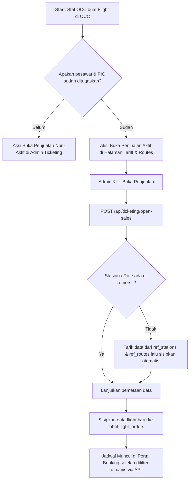
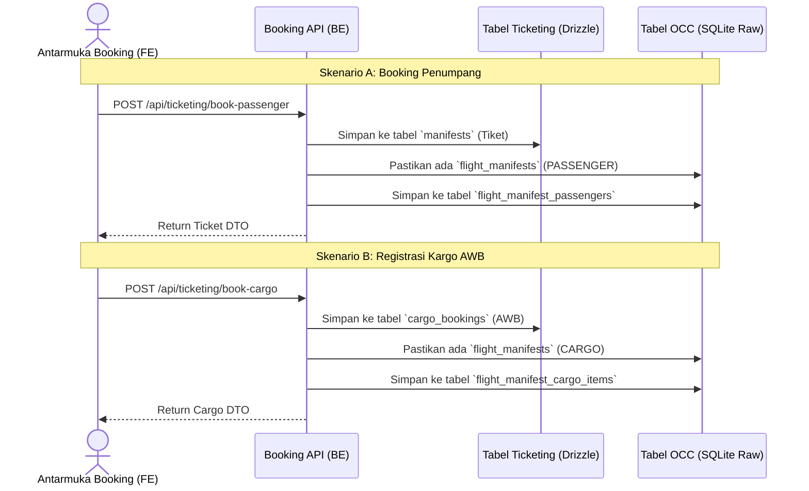
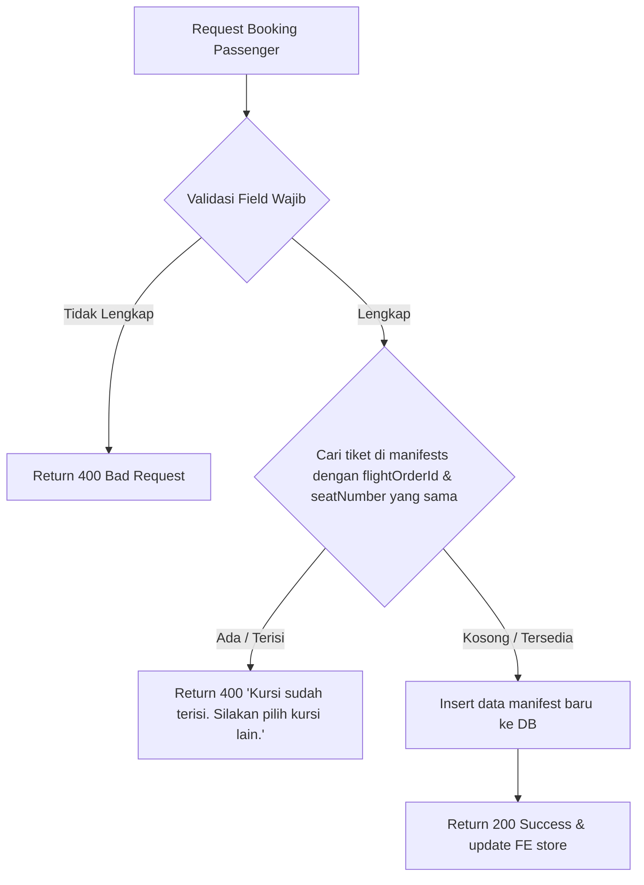
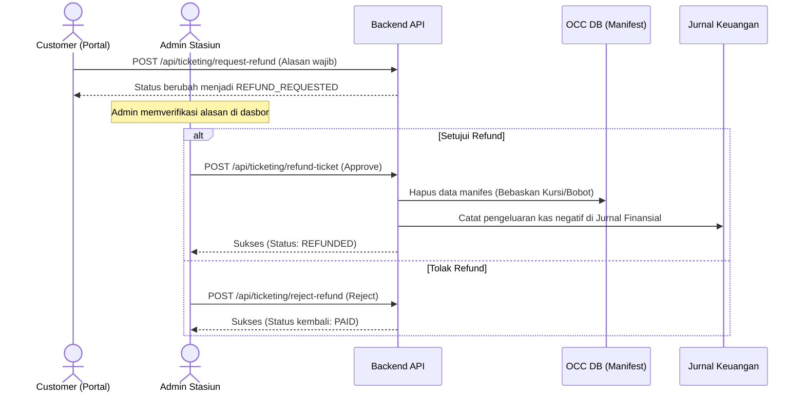

# Alur Fitur Sistem Ticketing (Ticketing System Flows)

Dokumentasi ini menjelaskan alur kerja, arsitektur, dan validasi dari fitur-fitur baru yang ditambahkan pada modul Ticketing PT AMA.

---

## 1. Alur Pembuatan Jadwal Tiket Komersial dari Penerbangan OCC (Commercial Ticket Schedule Creation Flow)

Tiket komersial (baik penumpang maupun kargo) diterbitkan berdasarkan jadwal penerbangan operasional aktual yang dikelola oleh OCC.

### Alur Kerja Pembukaan Penjualan Tiket

1. **Pembuatan Penerbangan di OCC**: Staf OCC membuat pengajuan penerbangan (flight request) baru di Operations Command Center dengan menentukan rute, tanggal, penugasan pesawat (`aircraft_id`), dan pilot utama (`pilot_in_command_id`).
2. **Pengelolaan di Tariff & Routes**: Admin Ticketing dapat membuka tab **"Jadwal Penerbangan OCC"** pada halaman admin [Tariff & Routes](/ticketing/management).
3. **Validasi Persiapan OCC**:
   - Jika pesawat dan pilot belum ditugaskan di OCC, aksi dibatasi (tombol disabled) dan muncul peringatan _"Pesawat/Pilot belum siap di OCC"_.
   - Jika penugasan sudah lengkap, tombol **"Buka Penjualan"** aktif.
4. **Pembukaan Penjualan (Sync ke Komersial & Pembuatan Rute Dinamis)**:
   - Admin menekan **"Buka Penjualan"**, yang memicu endpoint `POST /api/ticketing/open-sales` dengan parameter `flightOperationId`.
   - **Verifikasi & Sinkronisasi Stasiun**: Backend mendeteksi stasiun asal & tujuan penerbangan OCC. Jika stasiun perintis tersebut belum terdaftar di tabel komersial `stations` (misal Oksibil `OKS`/`WAJO`), backend secara otomatis mengambil detail data dari tabel OCC `ref_stations` dan menyisipkannya langsung ke tabel komersial `stations`.
   - **Verifikasi & Sinkronisasi Rute**: Jika rute penerbangan komersial belum ada (misal `rt-wamena-oks`), backend akan menarik data jarak dan estimasi durasi dari tabel OCC `ref_routes` lalu membuat rute tersebut secara dinamis di tabel komersial `routes` agar terpetakan dengan tepat tanpa menggunakan rute cadangan (_default backup_).
5. **Pemesanan di Portal (Penyaringan Berbasis Server & Jenis Tiket)**:
   - Halaman portal booking ([booking.vue](/ticketing/booking)) mengambil daftar stasiun asal & tujuan langsung dari data master rute.
   - Ketika pengguna memilih rute (Asal & Tujuan) di antarmuka, aplikasi mengirim kueri API reaktif ke backend `/api/flights` dengan parameter `origin`, `destination`, dan `type` (bernilai `passenger` atau `cargo` sesuai tab yang aktif).
   - Backend memproses filter ini secara langsung di database menggunakan kueri SQL `WHERE` sehingga pencarian tiket selalu segar, sinkron, dan memisahkan penerbangan penumpang (penumpang & charter) dengan penerbangan kargo logistik secara tegas.

### Diagram Alur Pembukaan Penjualan

---

## 2. Alur Sinkronisasi Real-Time ke OCC Manifest (Real-Time OCC Manifest Sync Flow)

Untuk menjaga akurasi berat muatan pesawat (Weight and Balance) yang dievaluasi di Operations Command Center (OCC), setiap pemesanan tiket komersil maupun registrasi kargo udara secara otomatis tersinkronisasi ke tabel manifes operasional penerbangan.

### Perbedaan Struktur Komersial vs Kargo

Sistem membedakan pencatatan dan pengelolaan manifes antara Penumpang Komersial dan Kargo Udara baik di basis data maupun antarmuka manajemen admin:

- **Penumpang Komersial (Komersil)**:
  - Tabel Ticketing: `manifests` (menyimpan rincian harga tiket, status pembayaran, nomor kursi, status check-in).
  - Tabel OCC Sync: `flight_manifests` (tipe `PASSENGER`) & `flight_manifest_passengers` (menyimpan data berat penumpang & nomor kursi untuk perhitungan bobot).
  - Halaman Admin: **Passenger Manifest** (`/ticketing/passenger`).
- **Kargo Udara (Cargo)**:
  - Tabel Ticketing: `cargo_bookings` (menyimpan nomor AWB kargo, dimensi, status barang berbahaya/DG, total tarif).
  - Tabel OCC Sync: `flight_manifests` (tipe `CARGO`) & `flight_manifest_cargo_items` (menyimpan berat aktual, berat volumetrik, berat bayar, status persetujuan barang berbahaya/DG).
  - Halaman Admin: **Cargo Tracking** (`/ticketing/cargo`).

### Diagram Alur Sinkronisasi

---

## 3. Alur Pemilihan & Pemetaan Kursi (Seatmap Mapping Flow)

Fitur ini memetakan status kursi pesawat secara dinamis dari database untuk mencegah pemilihan kursi ganda oleh pengguna.

### Detail Teknis

- **Backend API**: `GET /api/ticketing/occupied-seats` menerima parameter query `flightOrderId`, lalu mengkueri tabel `manifests` untuk mendapatkan seluruh kursi yang sudah dipesan pada penerbangan tersebut.
- **Frontend Reactive State**: Menggunakan watcher `watch(paxFlightId)` pada [booking.vue](file:///home/mark/Development/project/AMA-Interface/app/pages/ticketing/booking.vue) untuk melakukan _re-fetch_ setiap kali pengguna mengubah pilihan penerbangan, sehingga seatmap selalu sinkron.

---

## 4. Alur Pencegahan Double Booking (Double-Booking Prevention Flow)

Perlindungan berlapis di sisi backend untuk menolak transaksi pemesanan baru jika kursi yang diinginkan telah terisi oleh transaksi lain yang terjadi secara bersamaan.

### Diagram Validasi Backend

---

## 5. Alur Pembuatan & Unduh Tiket PDF (PDF Generation & Export Flow)

Pengguna dapat mengunduh tiket/AWB kargo dalam format PDF A5 berkualitas tinggi yang berisi data perjalanan lengkap, rincian pembayaran, serta waktu keberangkatannya dan batas waktu check-in.

---

## 6. Perbaikan Kompatibilitas Vuetify 3 & SSR Hydration

Mengatasi peringatan konsol dan masalah fungsionalitas UI yang disebabkan oleh penggunaan kode usang (_deprecated_) dan ketidakcocokan render antara server (SSR) dan browser (client).

---

## 7. Alur Refund & Reschedule (Refund & Reschedule Flow)

Modul ini mendukung proses pengembalian dana (refund) dan perubahan jadwal penerbangan (reschedule) bagi tiket penumpang komersial serta dokumen AWB kargo.

### A. Alur Refund Berbasis Persetujuan (Approval-Based Refund Flow)

Proses refund melibatkan pengajuan oleh sisi customer melalui portal pencarian dan verifikasi oleh sisi admin stasiun:

1. **Pengajuan Refund oleh Customer**:
   - Customer mencari tiket atau kargo mereka di menu **Pencarian Tiket & AWB** di [Portal Booking](/ticketing/booking).
   - Tombol **"Ajukan Refund"** aktif hanya untuk tiket/kargo berstatus `PAID` yang memenuhi syarat (misal: tiket belum check-in, kargo belum berstatus `DELIVERED`).
   - Customer menginput **Alasan Refund** yang bersifat wajib.
   - Mengirim request ke endpoint `POST /api/ticketing/request-refund`, mengubah status pembayaran menjadi `REFUND_REQUESTED` dan mencatat alasan refund di database.
2. **Review & Approval oleh Admin**:
   - Admin stasiun memantau dasbor **Passenger Manifest** (`/ticketing/passenger`) dan **Cargo Tracking** (`/ticketing/cargo`).
   - Tiket/kargo berstatus `REFUND_REQUESTED` ditandai dengan warna kuning mencolok dan menampilkan alasan pembatalan dari customer.
   - Admin dapat menekan tombol **"Approve Refund"** (mengeksekusi `POST /api/ticketing/refund-ticket` atau `/refund-cargo` untuk mengosongkan kursi/bobot kargo di OCC serta mencatat pengembalian dana negatif di Jurnal Finansial) atau menekan tombol **"Reject"** (mengeksekusi `POST /api/ticketing/reject-refund` untuk memulihkan status ke `PAID` semula).

### B. Alur Reschedule Mandiri (Direct Reschedule Flow)

Customer dapat melakukan reschedule tiket penumpang komersial secara langsung tanpa membutuhkan persetujuan bertahap dari admin:

1. **Pemilihan Penerbangan & Kursi**:
   - Customer mengklik tombol **"Reschedule"** pada detail tiket lunas di Portal Booking.
   - Memilih penerbangan alternatif yang tersedia pada rute yang sama.
   - Menentukan nomor kursi baru melalui diagram peta kursi (seatmap) Caravan.
2. **Eksekusi Reschedule**:
   - Sistem mengirim request ke `POST /api/ticketing/reschedule-ticket`.
   - Sistem memvalidasi ketersediaan kapasitas penerbangan baru di backend.
   - Jika tersedia, status penerbangan komersial dipindahkan ke penerbangan baru, kursi lama dibebaskan, kursi baru dipesan, dan data penumpang di manifes OCC disinkronisasikan secara instan.
