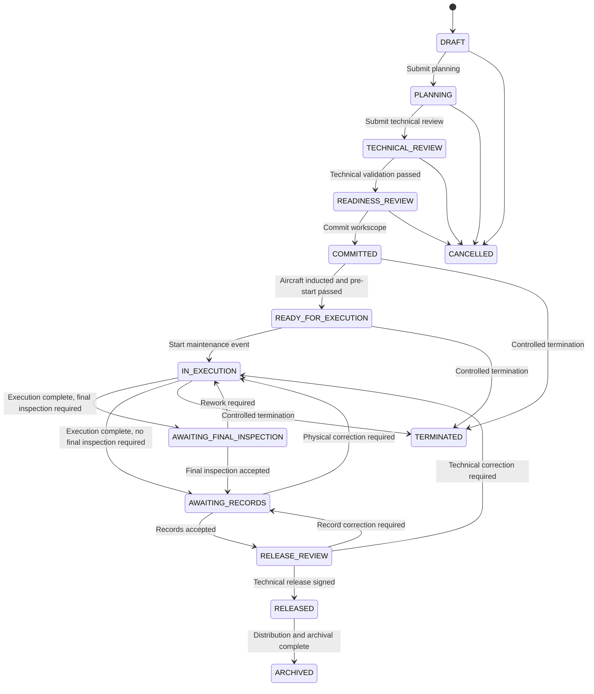
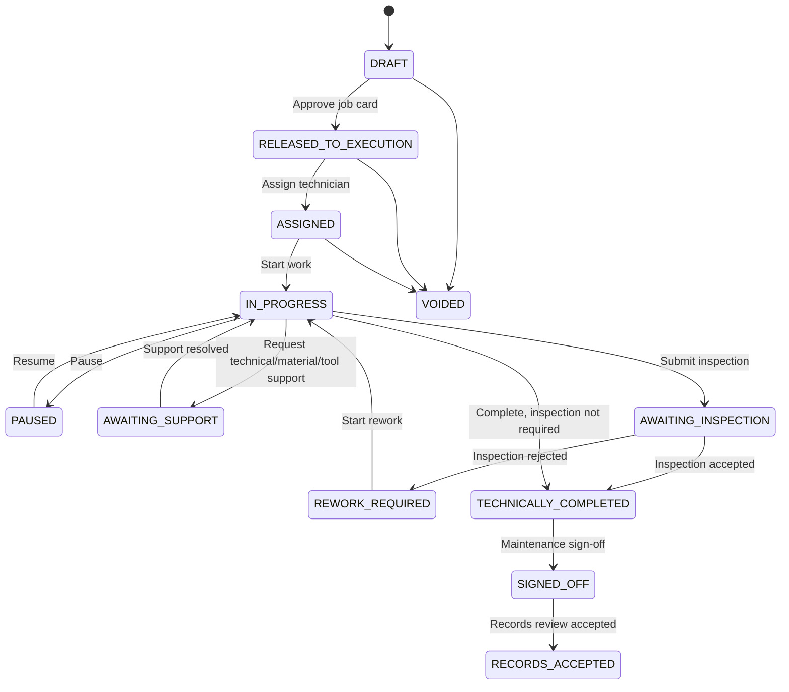

# State Machine MRO — Baseline Implementasi Nyata

Saya menetapkan model berikut sebagai **baseline implementasi**, bukan sekadar ilustrasi. Model ini dapat langsung diturunkan menjadi:

- state enum di backend;

- transition command;

- authorization policy;

- database audit event;

- tombol dan status UI;

- release gate;

- skenario UAT.

Dasarnya adalah maintenance program, recordkeeping, AMO control, personnel authorization, MEL/CDL, serta human-factors procedures yang berstatus berlaku pada JDIH. SI 8900-6.9 juga menekankan kecukupan personel untuk planning, performance, supervision, inspection, quality monitoring, serta record yang membuktikan compliance dan return to service. ([JDIH Dephub](https://jdih.dephub.go.id/peraturan/detail?data=3rgypheYlQG8lzwa1Ai4X64ktLvqsZlva8LWM9r8ZY6r8bIbKTY9WoI8m3KzVmKAor4JLDsuQcJVb4EuPGVsgMkw8hht8g2FM828X2YnqLaR8O7JCeP6fLGHE1iVAx3Z6ZFJ8aan5Vth6to0hf0a1I3XS0&utm_source=chatgpt.com 'Peraturan Direktur Jenderal Perhubungan Udara Nomor: KP 062 Tahun 2018'))

EASA Part-145 hanya digunakan sebagai benchmark tambahan untuk pemisahan prosedur execution, technical records, release, critical maintenance task, error-capturing, handover, dan production planning—bukan sebagai pengganti CASR atau manual operator Indonesia. ([EASA](https://www.easa.europa.eu/sites/default/files/dfu/amc_gm_to_part-145_-_issue_2_amendment_5.pdf 'AMC & GM to Part-145 — Issue 2, Amendment 5'))

---

# 1. Keputusan arsitektur state

Jangan menyimpan semua kondisi dalam satu kolom `status`.

Setiap Work Package dan Job Card mempunyai beberapa dimensi:

```text
Lifecycle State
Control Status
Inspection Status
Record Status
Synchronization Status
Release Gate Status
```

## A. Lifecycle state

Menjelaskan **posisi objek dalam proses kerja**:

```text
IN_EXECUTION
AWAITING_RECORDS
RELEASE_REVIEW
```

## B. Control status

Menjelaskan **apakah proses dapat dilanjutkan**:

```text
CLEAR
WARNING
BLOCKED
ON_HOLD
```

`RELEASE_BLOCKED` dan `REWORK_REQUIRED` tidak selalu tepat dijadikan lifecycle Work Package.

Sebagai keputusan final:

- `Release Blocked` adalah hasil evaluasi release gate.

- Rework pada satu Job Card membuat Work Package tetap `IN_EXECUTION`.

- Work Package mendapat `control_status = BLOCKED` sampai rework selesai.

- `On Hold` tidak menghapus lifecycle sebelumnya.

Dengan demikian:

```text
Work Package Lifecycle: IN_EXECUTION
Control Status: BLOCKED
Blocking Reason: JC-024 requires rework
```

Ini jauh lebih akurat daripada mengubah seluruh Work Package menjadi state `REWORK_REQUIRED`.

---

# 2. Work Package lifecycle

## State final

```text
DRAFT
PLANNING
TECHNICAL_REVIEW
READINESS_REVIEW
COMMITTED
READY_FOR_EXECUTION
IN_EXECUTION
AWAITING_FINAL_INSPECTION
AWAITING_RECORDS
RELEASE_REVIEW
RELEASED
ARCHIVED
CANCELLED
TERMINATED
```

## Diagram



---

# 3. Work Package transition specification

## WP-T01 — Mulai perencanaan

| Properti        | Ketetapan                                                                                                |
| --------------- | -------------------------------------------------------------------------------------------------------- |
| Transition      | `DRAFT → PLANNING`                                                                                       |
| Command         | `START_PLANNING`                                                                                         |
| Authorized role | Maintenance Planner                                                                                      |
| Prerequisite    | Aircraft teridentifikasi; maintenance demand tersedia; operator dan maintenance provider teridentifikasi |
| Data wajib      | Aircraft ID, event type, preliminary scope, planned station, target window                               |
| Reason          | Tidak wajib untuk proses normal                                                                          |
| Signature       | Authenticated action                                                                                     |
| Audit event     | `WORK_PACKAGE_PLANNING_STARTED`                                                                          |
| Dampak aircraft | Tidak mengubah status aircraft                                                                           |
| Dampak UI       | Planning workspace aktif                                                                                 |

### Penolakan

Transition ditolak jika:

- aircraft tidak memiliki configuration baseline;

- maintenance demand tidak mempunyai source;

- station tidak teridentifikasi;

- Work Package sudah dibatalkan.

---

## WP-T02 — Kirim ke technical review

| Properti        | Ketetapan                                                         |
| --------------- | ----------------------------------------------------------------- |
| Transition      | `PLANNING → TECHNICAL_REVIEW`                                     |
| Command         | `SUBMIT_TECHNICAL_REVIEW`                                         |
| Authorized role | Maintenance Planner                                               |
| Prerequisite    | Preliminary workscope tersedia                                    |
| Data wajib      | Daftar demand/task, due basis, estimated scope, source references |
| Reason          | Tidak wajib                                                       |
| Signature       | Controlled submission                                             |
| Audit event     | `WORK_PACKAGE_TECHNICAL_REVIEW_REQUESTED`                         |
| Dampak          | Engineering review queue dibuat                                   |

### Guard

```text
task_count > 0
AND all_tasks.have_source_reference
AND aircraft.configuration_status = VERIFIED
```

Planner tidak dapat menentukan sendiri bahwa source technical data applicable. Planner hanya menyerahkan scope untuk engineering validation.

---

## WP-T03 — Technical validation passed

| Properti        | Ketetapan                                                                                       |
| --------------- | ----------------------------------------------------------------------------------------------- |
| Transition      | `TECHNICAL_REVIEW → READINESS_REVIEW`                                                           |
| Command         | `APPROVE_TECHNICAL_BASELINE`                                                                    |
| Authorized role | Engineering                                                                                     |
| Prerequisite    | Seluruh task mempunyai source current dan applicability resolved                                |
| Data wajib      | Source document, revision, section, applicability, inspection requirement, configuration impact |
| Reason          | Wajib jika ada conditional applicability atau deviation                                         |
| Signature       | Controlled technical approval                                                                   |
| Audit event     | `WORK_PACKAGE_TECHNICAL_BASELINE_APPROVED`                                                      |
| Dampak          | Resource requirement dapat dihitung dan direservasi                                             |

### Guard

```text
all_tasks.source_status = CURRENT
AND all_tasks.applicability IN (APPLICABLE, CONDITIONALLY_APPLICABLE)
AND unresolved_technical_queries = 0
AND mandatory_tasks_missing = 0
```

Jika satu task belum jelas:

```text
control_status = BLOCKED
blocking_code = TECHNICAL_APPLICABILITY_UNRESOLVED
```

---

## WP-T04 — Commit workscope

| Properti        | Ketetapan                                                                       |
| --------------- | ------------------------------------------------------------------------------- |
| Transition      | `READINESS_REVIEW → COMMITTED`                                                  |
| Command         | `COMMIT_WORKSCOPE`                                                              |
| Authorized role | Maintenance Planner dengan approval sesuai manual                               |
| Prerequisite    | Technical baseline valid dan readiness minimum terpenuhi                        |
| Data wajib      | Workscope revision, schedule, station, personnel plan, material plan, tool plan |
| Reason          | Wajib jika terdapat accepted warning                                            |
| Signature       | Controlled approval                                                             |
| Audit event     | `WORK_PACKAGE_COMMITTED`                                                        |
| Dampak          | Workscope dan source revisions dikunci                                          |

Saat committed, sistem harus menyimpan snapshot:

```text
Aircraft configuration
Aircraft utilization
Task list
Document revisions
Required inspections
Material requirements
Tool requirements
Personnel requirements
Station and capability
```

Setelah transition ini, task tidak dapat ditambah atau dihapus melalui direct edit.

Perubahan harus menggunakan:

```text
Scope Change Request
→ Impact Review
→ Approval
→ Work Package Revision Baru
```

---

## WP-T05 — Ready for execution

| Properti        | Ketetapan                                                                                        |
| --------------- | ------------------------------------------------------------------------------------------------ |
| Transition      | `COMMITTED → READY_FOR_EXECUTION`                                                                |
| Command         | `COMPLETE_PRE_EXECUTION_CHECK`                                                                   |
| Authorized role | Maintenance Control atau Production Supervisor                                                   |
| Prerequisite    | Aircraft induction selesai dan pre-start gate passed                                             |
| Data wajib      | Actual FH/FC, station, induction condition, open defect, open MEL/CDL, actual resource readiness |
| Reason          | Wajib jika ada warning yang diterima                                                             |
| Signature       | Controlled acceptance                                                                            |
| Audit event     | `WORK_PACKAGE_READY_FOR_EXECUTION`                                                               |
| Dampak aircraft | `technical_status = MAINTENANCE` dan dispatch availability menjadi unavailable                   |

### Guard

```text
aircraft_induction_complete
AND no_expired_mel
AND mandatory_data_available
AND minimum_personnel_available
AND mandatory_tools_available
AND critical_material_available
AND station_capability_valid
```

Warning dapat diterima hanya jika prosedur memperbolehkannya. Blocker tidak dapat diterima melalui acknowledgement biasa.

---

## WP-T06 — Mulai execution

| Properti        | Ketetapan                                        |
| --------------- | ------------------------------------------------ |
| Transition      | `READY_FOR_EXECUTION → IN_EXECUTION`             |
| Command         | `START_WORK_PACKAGE`                             |
| Authorized role | Production Supervisor                            |
| Prerequisite    | Minimal satu Job Card released dan dapat dimulai |
| Data wajib      | Shift, supervisor, actual start time             |
| Signature       | Authenticated action                             |
| Audit event     | `WORK_PACKAGE_EXECUTION_STARTED`                 |
| Dampak          | Job Card execution diaktifkan                    |

### Guard

```text
released_job_cards > 0
AND work_package.control_status != BLOCKED
AND active_shift_supervisor_authorized
```

---

## WP-T07 — Execution selesai, final inspection dibutuhkan

| Properti        | Ketetapan                                             |
| --------------- | ----------------------------------------------------- |
| Transition      | `IN_EXECUTION → AWAITING_FINAL_INSPECTION`            |
| Command         | `SUBMIT_FINAL_INSPECTION`                             |
| Authorized role | Production Supervisor                                 |
| Prerequisite    | Seluruh Job Card execution selesai atau dispositioned |
| Data wajib      | Completion summary dan inspection scope               |
| Signature       | Controlled submission                                 |
| Audit event     | `WORK_PACKAGE_FINAL_INSPECTION_REQUESTED`             |
| Dampak          | Final inspection queue dibuat                         |

### Guard

```text
active_job_cards = 0
AND job_cards_requiring_rework = 0
AND unresolved_findings = 0
AND missing_execution_signatures = 0
AND final_inspection_required = true
```

In-process inspection tetap dikelola pada Job Card. State ini hanya untuk final atau package-level inspection.

---

## WP-T08 — Rework dari final inspection

| Properti        | Ketetapan                                                                          |
| --------------- | ---------------------------------------------------------------------------------- |
| Transition      | `AWAITING_FINAL_INSPECTION → IN_EXECUTION`                                         |
| Command         | `RETURN_FOR_REWORK`                                                                |
| Authorized role | Inspector                                                                          |
| Prerequisite    | Inspection rejected                                                                |
| Data wajib      | Rejected item, reason, evidence, required rework, affected Job Card                |
| Reason          | Wajib                                                                              |
| Signature       | Inspection signature                                                               |
| Audit event     | `WORK_PACKAGE_REWORK_REQUIRED`                                                     |
| Dampak          | Rework Job Card dibuat atau existing Job Card dibuka kembali; release gate blocked |

Inspection sebelumnya tidak dihapus. Statusnya tetap disimpan sebagai rejected.

---

## WP-T09 — Final inspection accepted

| Properti        | Ketetapan                                                   |
| --------------- | ----------------------------------------------------------- |
| Transition      | `AWAITING_FINAL_INSPECTION → AWAITING_RECORDS`              |
| Command         | `ACCEPT_FINAL_INSPECTION`                                   |
| Authorized role | Inspector dengan authorization valid                        |
| Prerequisite    | Seluruh inspection point accepted                           |
| Data wajib      | Inspection result, reference, evidence, inspector statement |
| Signature       | Inspection signature                                        |
| Audit event     | `WORK_PACKAGE_FINAL_INSPECTION_ACCEPTED`                    |
| Dampak          | Technical Records review queue dibuat                       |

### Guard

```text
inspector_authorized
AND independence_requirement_satisfied
AND rejected_inspection_items = 0
AND inspection_revision_matches_work_revision
```

---

## WP-T10 — Execution langsung ke records

Digunakan ketika final package inspection tidak diwajibkan.

| Properti        | Ketetapan                                             |
| --------------- | ----------------------------------------------------- |
| Transition      | `IN_EXECUTION → AWAITING_RECORDS`                     |
| Command         | `SUBMIT_RECORDS_REVIEW`                               |
| Authorized role | Production Supervisor                                 |
| Prerequisite    | Semua task dan required task-level inspection selesai |
| Data wajib      | Completion summary                                    |
| Signature       | Controlled submission                                 |
| Audit event     | `WORK_PACKAGE_RECORDS_REVIEW_REQUESTED`               |

---

## WP-T11 — Record package accepted

| Properti        | Ketetapan                                                                  |
| --------------- | -------------------------------------------------------------------------- |
| Transition      | `AWAITING_RECORDS → RELEASE_REVIEW`                                        |
| Command         | `ACCEPT_RECORD_PACKAGE`                                                    |
| Authorized role | Technical Records                                                          |
| Prerequisite    | Record package lengkap dan konsisten                                       |
| Data wajib      | Completeness checklist, configuration reconciliation, FH/FC reconciliation |
| Signature       | Controlled records acceptance                                              |
| Audit event     | `WORK_PACKAGE_RECORDS_ACCEPTED`                                            |
| Dampak          | Release-gate evaluation dijalankan                                         |

### Guard

```text
all_job_cards.records_status = ACCEPTED
AND missing_signatures = 0
AND configuration_conflicts = 0
AND unresolved_record_amendments = 0
AND unresolved_sync_conflicts = 0
AND required_certificates_missing = 0
```

Technical Records tidak menyatakan pekerjaan secara teknis benar. Technical Records menyatakan bahwa package record lengkap, konsisten, dan dapat ditelusuri.

---

## WP-T12 — Return from release review

### A. Technical correction

```text
RELEASE_REVIEW → IN_EXECUTION
```

Digunakan jika physical work atau inspection harus dilakukan ulang.

| Properti        | Ketetapan                                   |
| --------------- | ------------------------------------------- |
| Command         | `RETURN_FOR_TECHNICAL_CORRECTION`           |
| Authorized role | Certifying Staff                            |
| Reason          | Wajib                                       |
| Evidence        | Failed gate, affected task, required action |
| Audit event     | `RELEASE_TECHNICAL_CORRECTION_REQUIRED`     |

### B. Record correction

```text
RELEASE_REVIEW → AWAITING_RECORDS
```

Digunakan jika physical work telah benar tetapi record package belum lengkap.

| Properti        | Ketetapan                            |
| --------------- | ------------------------------------ |
| Command         | `RETURN_FOR_RECORD_CORRECTION`       |
| Authorized role | Certifying Staff                     |
| Reason          | Wajib                                |
| Evidence        | Missing/inconsistent record          |
| Audit event     | `RELEASE_RECORD_CORRECTION_REQUIRED` |

---

## WP-T13 — Technical release

| Properti        | Ketetapan                                                            |
| --------------- | -------------------------------------------------------------------- |
| Transition      | `RELEASE_REVIEW → RELEASED`                                          |
| Command         | `ISSUE_TECHNICAL_RELEASE`                                            |
| Authorized role | Certifying Staff dengan scope valid                                  |
| Prerequisite    | Seluruh release gate passed                                          |
| Data wajib      | Controlled release statement, limitation, open MEL/CDL, work summary |
| Reason          | Tidak menggunakan reason bebas; menggunakan release statement resmi  |
| Signature       | Return-to-service signature                                          |
| Audit event     | `TECHNICAL_RELEASE_ISSUED`                                           |
| Dampak          | Release record immutable dibuat                                      |

SI 8900-6.9 menyatakan retained record dan record yang diberikan kepada owner/operator harus secara jelas menyatakan bahwa aircraft, engine, propeller, atau article approved for return to service. SI tersebut juga mengaitkan isi maintenance records dengan CASR Part 43.

### Release guard

```text
mandatory_job_cards_signed = true
AND required_inspections_accepted = true
AND unresolved_findings = 0
AND rework_required = 0
AND mel_cdl_gate = PASSED
AND material_traceability_complete = true
AND aircraft_configuration_reconciled = true
AND technical_records_status = ACCEPTED
AND certifying_staff_authorized = true
AND technical_data_valid = true
AND critical_sync_conflicts = 0
```

### Dampak terhadap aircraft

Jangan langsung mengubah aircraft menjadi `IN_SERVICE` hanya karena satu Work Package released.

Sistem harus memeriksa:

```text
No other active grounding Work Package
No open no-go defect
No expired MEL/CDL
No aircraft-level release hold
```

Baru kemudian:

```text
aircraft.technical_status = IN_SERVICE
```

Jika masih ada sumber grounding lain:

```text
work_package = RELEASED
aircraft.technical_status = GROUNDED
```

---

## WP-T14 — Archive

| Properti        | Ketetapan                                                                          |
| --------------- | ---------------------------------------------------------------------------------- |
| Transition      | `RELEASED → ARCHIVED`                                                              |
| Command         | `ARCHIVE_WORK_PACKAGE`                                                             |
| Authorized role | Technical Records                                                                  |
| Prerequisite    | Release distributed, retention classification assigned, supporting record complete |
| Data wajib      | Archive manifest, retention category, distribution evidence                        |
| Signature       | Authenticated action                                                               |
| Audit event     | `WORK_PACKAGE_ARCHIVED`                                                            |
| Dampak          | Package menjadi read-only                                                          |

---

## WP-T15 — Cancel atau terminate

### Cancelled

Hanya diizinkan sebelum Work Package committed:

```text
DRAFT
PLANNING
TECHNICAL_REVIEW
READINESS_REVIEW
→ CANCELLED
```

Data wajib:

- cancellation reason;

- authority;

- affected demands;

- replanning decision.

### Terminated

Digunakan setelah Work Package committed atau execution dimulai.

```text
COMMITTED
READY_FOR_EXECUTION
IN_EXECUTION
→ TERMINATED
```

Termination harus:

- mempertahankan seluruh record;

- mencatat actual aircraft condition;

- mencatat unfinished work;

- menetapkan aircraft tetap `MAINTENANCE` atau `GROUNDED`;

- membuat recovery plan;

- tidak menghasilkan technical release.

---

# 4. Job Card lifecycle

## State final

```text
DRAFT
RELEASED_TO_EXECUTION
ASSIGNED
IN_PROGRESS
PAUSED
AWAITING_SUPPORT
AWAITING_INSPECTION
REWORK_REQUIRED
TECHNICALLY_COMPLETED
SIGNED_OFF
RECORDS_ACCEPTED
VOIDED
```

## Diagram



---

# 5. Job Card transition specification

## JC-T01 — Release Job Card to execution

| Properti            | Ketetapan                                                                     |
| ------------------- | ----------------------------------------------------------------------------- |
| Transition          | `DRAFT → RELEASED_TO_EXECUTION`                                               |
| Authorized role     | Engineering/Planner sesuai approval procedure                                 |
| Prerequisite        | Approved source, current revision, applicability resolved                     |
| Data wajib          | Source document, revision, section, steps, material, tools, skill, inspection |
| Signature           | Controlled approval                                                           |
| Audit event         | `JOB_CARD_RELEASED_TO_EXECUTION`                                              |
| Dampak Work Package | Job Card masuk executable scope                                               |

### Guard

```text
source_current
AND applicability_resolved
AND instructions_complete
AND mandatory_steps_defined
AND inspection_requirement_defined
```

---

## JC-T02 — Assign technician

| Properti        | Ketetapan                                    |
| --------------- | -------------------------------------------- |
| Transition      | `RELEASED_TO_EXECUTION → ASSIGNED`           |
| Authorized role | Production Supervisor                        |
| Prerequisite    | Technician available dan authorization match |
| Data wajib      | Technician, shift, station, planned start    |
| Audit event     | `JOB_CARD_ASSIGNED`                          |

### Guard

```text
employment_active
AND license_valid
AND company_authorization_valid
AND aircraft_scope_match
AND task_scope_match
AND station_scope_match
AND training_current
```

---

## JC-T03 — Start work

| Properti        | Ketetapan                                                                         |
| --------------- | --------------------------------------------------------------------------------- |
| Transition      | `ASSIGNED → IN_PROGRESS`                                                          |
| Authorized role | Assigned Technician                                                               |
| Prerequisite    | Pre-task checks passed                                                            |
| Data wajib      | Aircraft identity confirmation, source acknowledgment, tool/material confirmation |
| Signature       | Authenticated action                                                              |
| Audit event     | `JOB_CARD_STARTED`                                                                |
| Dampak          | Actual start time tercatat                                                        |

### Guard

```text
aircraft_identity_confirmed
AND job_card_revision_current
AND frozen_source_revision_available
AND required_safety_prerequisites_complete
AND mandatory_tool_eligible
AND mandatory_material_eligible
AND unresolved_handover = false
```

---

## JC-T04 — Pause task

| Properti        | Ketetapan                  |
| --------------- | -------------------------- |
| Transition      | `IN_PROGRESS → PAUSED`     |
| Authorized role | Technician atau Supervisor |
| Reason          | Wajib                      |
| Signature       | Authenticated action       |
| Audit event     | `JOB_CARD_PAUSED`          |

### Data wajib

```text
Pause reason
Last fully completed step
Step currently being performed
Physical aircraft/component condition
Opened panels/access
Parts removed or loosened
Tools retained in work area
Safety locks/tags
Temporary protection
Open findings
Next safe action
Handover required
```

Jika pause melewati shift, sistem otomatis membuat handover requirement.

---

## JC-T05 — Resume task

| Properti        | Ketetapan                                   |
| --------------- | ------------------------------------------- |
| Transition      | `PAUSED → IN_PROGRESS`                      |
| Authorized role | Assigned atau incoming Technician           |
| Prerequisite    | Resume verification dan handover acceptance |
| Data wajib      | Physical-state confirmation dan resume step |
| Signature       | Controlled acknowledgement                  |
| Audit event     | `JOB_CARD_RESUMED`                          |

### Guard

```text
handover_accepted_if_required
AND aircraft_condition_confirmed
AND tools_and_parts_accounted
AND technical_data_revision_rechecked
AND no_new_blocking_finding
```

Resume selalu dimulai dari:

```text
last fully completed step + next controlled step
```

Bukan dari field progress percentage.

---

## JC-T06 — Awaiting support

| Properti        | Ketetapan                        |
| --------------- | -------------------------------- |
| Transition      | `IN_PROGRESS → AWAITING_SUPPORT` |
| Authorized role | Technician/Supervisor            |
| Reason          | Wajib                            |
| Audit event     | `JOB_CARD_SUPPORT_REQUESTED`     |

Reason code:

```text
ENGINEERING_SUPPORT
MATERIAL_SHORTAGE
TOOL_UNAVAILABLE
TECHNICAL_DATA_AMBIGUITY
PERSONNEL_SUPPORT
FACILITY_UNAVAILABLE
```

Jika technical data inaccurate, incomplete, atau ambiguous, maintenance-data issue harus direkam dan ditangani melalui controlled procedure. EASA Part-145 juga memisahkan prosedur maintenance-data discrepancy, shift/task handover, error detection, dan production planning. ([EASA](https://www.easa.europa.eu/sites/default/files/dfu/amc_gm_to_part-145_-_issue_2_amendment_5.pdf 'AMC & GM to Part-145 — Issue 2, Amendment 5'))

---

## JC-T07 — Support resolved

| Properti        | Ketetapan                                            |
| --------------- | ---------------------------------------------------- |
| Transition      | `AWAITING_SUPPORT → IN_PROGRESS`                     |
| Authorized role | Supervisor setelah support owner menyelesaikan issue |
| Prerequisite    | Supporting resolution approved                       |
| Data wajib      | Resolution reference, updated instruction/resource   |
| Audit event     | `JOB_CARD_SUPPORT_RESOLVED`                          |

Sistem wajib menjalankan ulang:

- source revision;

- applicability;

- material eligibility;

- tool validity;

- personnel authorization.

---

## JC-T08 — Submit inspection

| Properti        | Ketetapan                                   |
| --------------- | ------------------------------------------- |
| Transition      | `IN_PROGRESS → AWAITING_INSPECTION`         |
| Authorized role | Technician                                  |
| Prerequisite    | Semua pre-inspection steps selesai          |
| Data wajib      | Measurements, evidence, performer sign-offs |
| Signature       | Technician submission                       |
| Audit event     | `JOB_CARD_INSPECTION_REQUESTED`             |

### Guard

```text
mandatory_preinspection_steps_complete
AND required_measurements_recorded
AND unresolved_step_failures = 0
AND performer_signatures_complete
```

---

## JC-T09 — Inspection rejected

| Properti            | Ketetapan                                          |
| ------------------- | -------------------------------------------------- |
| Transition          | `AWAITING_INSPECTION → REWORK_REQUIRED`            |
| Authorized role     | Inspector                                          |
| Reason              | Wajib                                              |
| Signature           | Inspection signature                               |
| Audit event         | `JOB_CARD_INSPECTION_REJECTED`                     |
| Dampak Work Package | `control_status = BLOCKED` jika Job Card mandatory |

Data wajib:

- rejected step;

- defect or nonconformity;

- approved reference;

- evidence;

- rework requirement;

- reinspection requirement.

---

## JC-T10 — Start rework

| Properti        | Ketetapan                           |
| --------------- | ----------------------------------- |
| Transition      | `REWORK_REQUIRED → IN_PROGRESS`     |
| Authorized role | Assigned Technician                 |
| Prerequisite    | Rework instruction approved         |
| Data wajib      | Rework reference dan affected steps |
| Audit event     | `JOB_CARD_REWORK_STARTED`           |

Inspection lama tetap disimpan dan berubah menjadi:

```text
SUPERSEDED_BY_REWORK
```

Bukan dihapus.

---

## JC-T11 — Inspection accepted

| Properti        | Ketetapan                                                   |
| --------------- | ----------------------------------------------------------- |
| Transition      | `AWAITING_INSPECTION → TECHNICALLY_COMPLETED`               |
| Authorized role | Inspector                                                   |
| Prerequisite    | Inspector authorized dan independence requirement terpenuhi |
| Data wajib      | Inspection result, reference, evidence                      |
| Signature       | Inspection signature                                        |
| Audit event     | `JOB_CARD_INSPECTION_ACCEPTED`                              |

### Guard

```text
inspector_authorized
AND inspector_scope_match
AND independent_inspector_rule_satisfied
AND work_revision_matches_inspection_revision
AND open_rework_items = 0
```

---

## JC-T12 — Completion tanpa inspection

| Properti        | Ketetapan                                                        |
| --------------- | ---------------------------------------------------------------- |
| Transition      | `IN_PROGRESS → TECHNICALLY_COMPLETED`                            |
| Authorized role | Technician                                                       |
| Prerequisite    | Job Card tidak membutuhkan inspection dan seluruh steps complete |
| Data wajib      | Completion result                                                |
| Audit event     | `JOB_CARD_TECHNICALLY_COMPLETED`                                 |

### Guard

```text
inspection_required = false
AND mandatory_steps_complete
AND measurements_within_limit
AND unresolved_findings = 0
AND material_transactions_complete
AND tool_usage_recorded
```

---

## JC-T13 — Final Job Card sign-off

| Properti        | Ketetapan                                      |
| --------------- | ---------------------------------------------- |
| Transition      | `TECHNICALLY_COMPLETED → SIGNED_OFF`           |
| Authorized role | Personel dengan maintenance sign-off authority |
| Prerequisite    | Execution dan inspection requirement complete  |
| Data wajib      | Controlled maintenance statement               |
| Signature       | Maintenance signature                          |
| Audit event     | `JOB_CARD_SIGNED_OFF`                          |
| Dampak          | Record dikunci dari direct edit                |

Authorization diperiksa pada saat signature, bukan hanya pada saat login.

---

## JC-T14 — Records accepted

| Properti        | Ketetapan                                          |
| --------------- | -------------------------------------------------- |
| Transition      | `SIGNED_OFF → RECORDS_ACCEPTED`                    |
| Authorized role | Technical Records                                  |
| Prerequisite    | Record complete dan configuration impact processed |
| Data wajib      | Record checklist dan configuration update          |
| Signature       | Controlled acceptance                              |
| Audit event     | `JOB_CARD_RECORDS_ACCEPTED`                        |

### Guard

```text
performer_identity_present
AND completion_date_present
AND work_description_or_reference_present
AND required_signatures_present
AND component_transactions_complete
AND attachments_integrity_valid
AND amendment_status_clear
```

SI 8900-3.329 menetapkan maintenance-record system evaluation dan kebutuhan generation, preservation, serta retrieval records; sumber tersebut juga menjadi dasar pengendalian current-status dan maintenance records operator. ([JDIH Kementerian Perhubungan](https://jdih.kemenhub.go.id/peraturan/detail?data=BoXD6FugDsmLtnC0xQdai88m36NZs0cjb4uTP6cLSqRg4DpM5JjdTwu8bP2KrCNBVY8QiR0VbrMyE8QiOZ3FO2WB4TsaMJ1BvUn4jw20VTujlRGErOjE8vr6vCHhXBPRj6or5ouCKtcZUuj5StG7W3oLoS&utm_source=chatgpt.com 'Peraturan Direktur Jenderal Perhubungan Udara Nomor'))

---

## JC-T15 — Void Job Card

`VOIDED` hanya dapat dilakukan jika:

```text
state IN (DRAFT, RELEASED_TO_EXECUTION, ASSIGNED)
AND physical_work_started = false
```

Data wajib:

- reason;

- authorizing role;

- replacement Job Card bila ada;

- scope-change reference.

Jika physical work sudah dimulai, Job Card tidak boleh di-void.

Gunakan:

```text
Pause
Controlled termination
Superseding Job Card
Record correction/amendment
```

---

# 6. Orthogonal status model

## A. Control status

```typescript
type ControlStatus = 'CLEAR' | 'WARNING' | 'BLOCKED' | 'ON_HOLD';
```

Status dihitung dari reason aktif:

```text
BLOCKED   jika terdapat hard-blocking rule
ON_HOLD   jika pekerjaan dihentikan oleh keputusan operasional/quality
WARNING   jika terdapat caution tanpa hard block
CLEAR     jika tidak ada kondisi di atas
```

Sistem tetap menyimpan seluruh reason, bukan hanya status akhirnya.

```json
{
  "controlStatus": "BLOCKED",
  "blockingReasons": [
    {
      "code": "TOOL_CALIBRATION_EXPIRED",
      "sourceId": "TOOL-TW-023",
      "ownerRole": "TOOL_CONTROL",
      "requiredAction": "ASSIGN_ELIGIBLE_REPLACEMENT"
    }
  ]
}
```

---

## B. Inspection status

```text
NOT_REQUIRED
PENDING
ACCEPTED
REJECTED
STALE_REINSPECTION_REQUIRED
```

`STALE_REINSPECTION_REQUIRED` digunakan jika pekerjaan yang telah diperiksa mengalami perubahan atau rework.

---

## C. Record status

```text
INCOMPLETE
UNDER_REVIEW
CORRECTION_REQUIRED
COMPLETE
ACCEPTED
```

---

## D. Sync status

```text
LOCAL_ONLY
PENDING_SYNC
SYNCHRONIZING
SYNCED
SYNC_FAILED
CONFLICT
SERVER_REJECTED
```

State lifecycle tidak boleh dipindahkan ke `SIGNED_OFF`, `RELEASED`, atau `RECORDS_ACCEPTED` hanya berdasarkan local state jika prosedur memerlukan server validation.

---

## E. Release gate

```text
NOT_EVALUATED
BLOCKED
REVIEW_REQUIRED
ELIGIBLE
RELEASED
```

`ELIGIBLE` bukan berarti aircraft sudah dirilis. Itu hanya berarti sistem tidak menemukan blocker dan certifying staff dapat melakukan release review.

---

# 7. Aircraft technical status

Pisahkan dari Work Package.

```text
IN_SERVICE
MAINTENANCE
GROUNDED
AOG
```

## Aturan perubahan

| Event                                          | Aircraft status                |
| ---------------------------------------------- | ------------------------------ |
| Aircraft induction dimulai                     | `MAINTENANCE`                  |
| Defect no-go ditemukan                         | `GROUNDED`                     |
| Kondisi kritis membutuhkan immediate recovery  | `AOG`                          |
| Work Package release tetapi ada grounding lain | Tetap `GROUNDED`/`MAINTENANCE` |
| Semua release source clear dan release valid   | `IN_SERVICE`                   |

Work Package tidak boleh menjadi satu-satunya sumber aircraft technical status. Aircraft status merupakan hasil agregasi:

```text
Active Work Packages
Open Defects
MEL/CDL
Grounding Orders
Configuration Holds
Technical Release Records
```

---

# 8. Audit event yang wajib disimpan

Setiap transition menghasilkan immutable event.

```typescript
interface StateTransitionEvent {
  eventId: string;
  aggregateType: 'WORK_PACKAGE' | 'JOB_CARD';
  aggregateId: string;

  aggregateVersionBefore: number;
  aggregateVersionAfter: number;

  transitionCode: string;
  fromState: string;
  toState: string;

  actorUserId: string;
  actingRole: string;
  authorizationSnapshotId: string | null;

  reasonCode: string | null;
  reasonText: string | null;

  commandPayload: Record<string, unknown>;
  evidenceReferences: string[];

  signatureId: string | null;
  signatureMeaning: string | null;

  stationId: string;
  deviceId: string | null;

  deviceOccurredAt: string | null;
  serverRecordedAt: string;

  syncStatus: string;
  correlationId: string;
  idempotencyKey: string;

  previousEventHash: string | null;
  eventHash: string;
}
```

## Ketetapan teknis

- Event tidak dapat di-update atau dihapus.

- Koreksi menghasilkan event baru.

- Current state dapat disimpan sebagai snapshot untuk performa.

- Snapshot harus selalu dapat direkonstruksi dari event log.

- Transition memakai optimistic locking.

- Request harus membawa `expectedVersion`.

- Duplicate request dikendalikan menggunakan `idempotencyKey`.

- Semua timestamp release menggunakan server-authoritative time.

- Device time tetap disimpan untuk investigasi offline.

---

# 9. API command model

Jangan menyediakan endpoint yang membolehkan:

```http
PATCH /job-cards/{id}
{
  "status": "SIGNED_OFF"
}
```

Gunakan explicit transition command:

```http
POST /job-cards/{id}/transitions/sign-off
```

Payload:

```json
{
  "expectedVersion": 17,
  "statementId": "MAINT-SIGN-001",
  "authorizationContext": "ATR72_LINE_MAINTENANCE",
  "idempotencyKey": "5ecb0aa8-84c1-4e5c-b0ac-33d8451e4219"
}
```

Backend menjalankan:

```text
1. Load aggregate
2. Verify expected version
3. Check current state
4. Evaluate guards
5. Verify runtime authorization
6. Validate required data
7. Create signature if required
8. Append audit event
9. Update state snapshot
10. Recalculate Work Package gates
11. Recalculate aircraft technical status
12. Publish domain event
```

UI hanya menampilkan action yang tersedia, tetapi **backend tetap wajib melakukan seluruh validasi**.

---

# 10. Domain events

## Work Package

```text
WORK_PACKAGE_CREATED
WORK_PACKAGE_PLANNING_STARTED
WORK_PACKAGE_TECHNICAL_REVIEW_REQUESTED
WORK_PACKAGE_TECHNICAL_BASELINE_APPROVED
WORK_PACKAGE_COMMITTED
WORK_PACKAGE_READY_FOR_EXECUTION
WORK_PACKAGE_EXECUTION_STARTED
WORK_PACKAGE_FINAL_INSPECTION_REQUESTED
WORK_PACKAGE_REWORK_REQUIRED
WORK_PACKAGE_FINAL_INSPECTION_ACCEPTED
WORK_PACKAGE_RECORDS_ACCEPTED
WORK_PACKAGE_RELEASE_REVIEW_STARTED
TECHNICAL_RELEASE_ISSUED
WORK_PACKAGE_ARCHIVED
WORK_PACKAGE_CANCELLED
WORK_PACKAGE_TERMINATED
```

## Job Card

```text
JOB_CARD_RELEASED_TO_EXECUTION
JOB_CARD_ASSIGNED
JOB_CARD_STARTED
JOB_CARD_PAUSED
JOB_CARD_HANDOVER_SUBMITTED
JOB_CARD_HANDOVER_ACCEPTED
JOB_CARD_RESUMED
JOB_CARD_SUPPORT_REQUESTED
JOB_CARD_SUPPORT_RESOLVED
JOB_CARD_INSPECTION_REQUESTED
JOB_CARD_INSPECTION_REJECTED
JOB_CARD_REWORK_STARTED
JOB_CARD_INSPECTION_ACCEPTED
JOB_CARD_TECHNICALLY_COMPLETED
JOB_CARD_SIGNED_OFF
JOB_CARD_RECORDS_ACCEPTED
JOB_CARD_VOIDED
```

---

# 11. UI behaviour yang harus mengikuti state machine

## Action tidak dibuat berdasarkan role saja

Buruk:

```text
Role = Technician
→ tampilkan tombol Complete
```

Benar:

```text
Role authorized
AND current state permits transition
AND transition guards passed
→ tampilkan tombol Complete
```

## Disabled action harus menjelaskan alasannya

```text
Complete & Sign Off
Unavailable because:

• Inspector sign-off pending
• Torque tool TW-023 calibration expired
• Finding NR-014 is still open
```

## Persistent state header

```text
PK-ANI · Work Package WP-100FH
Lifecycle: IN EXECUTION
Control: BLOCKED
Release Gate: BLOCKED
Last Sync: 14:32 WIT
```

## Transition history

```text
14:32 — Job Card paused by Budi
Reason: Shift change

14:38 — Handover submitted
Incoming technician: Daniel

15:02 — Handover accepted by Daniel

15:05 — Job Card resumed from Step 6
```

---

# 12. Minimum UAT state machine

| Test                                                        | Expected result                                          |
| ----------------------------------------------------------- | -------------------------------------------------------- |
| Planner commit dengan task tanpa applicability              | Transition ditolak                                       |
| Revision superseded sebelum commitment                      | Transition ditolak                                       |
| Revision baru setelah commitment                            | Frozen revision tidak berubah; impact review dibuat      |
| Technician tidak authorized menekan Start                   | Transition ditolak                                       |
| Task di-pause tanpa physical-state data                     | Transition ditolak                                       |
| Incoming technician belum accept handover                   | Resume ditolak                                           |
| Inspector sama dengan performer pada independent inspection | Inspection sign-off ditolak                              |
| Inspection rejected                                         | Job Card menjadi `REWORK_REQUIRED`; Work Package blocked |
| Rework mengubah inspected step                              | Inspection lama menjadi stale                            |
| Job Card belum signed                                       | Work Package tidak dapat masuk records review            |
| Component transaction tidak lengkap                         | Records acceptance ditolak                               |
| MEL expired                                                 | Release gate menjadi `BLOCKED`                           |
| Certifying Staff scope tidak cocok                          | Release signature ditolak                                |
| Local signature belum sinkron                               | Final release ditolak                                    |
| Concurrent transition dengan version lama                   | Request ditolak sebagai state conflict                   |
| Request dikirim dua kali dengan idempotency key sama        | Satu event saja yang dibuat                              |
| Work Package released tetapi ada grounding defect lain      | Aircraft tetap grounded                                  |
| Signed record dikoreksi                                     | Original dipertahankan dan amendment dibuat              |

---

# 13. Keputusan final

Struktur implementasinya adalah:

```text
Work Package Lifecycle
        ↓
Job Card Lifecycle
        ↓
Inspection and Records Status
        ↓
Computed Release Gate
        ↓
Authorized Technical Release
        ↓
Aircraft Technical Status Recalculation
```

Prinsip yang tidak boleh dilanggar:

1. Tidak ada direct update terhadap state.

2. Seluruh perubahan melalui transition command.

3. Setiap transition mempunyai guard.

4. Authorization diperiksa pada saat action.

5. Signature mempunyai makna spesifik.

6. Blocker tidak disembunyikan sebagai lifecycle state.

7. Rework tidak menghapus inspection sebelumnya.

8. Signed records tidak ditimpa.

9. Offline state tidak disamakan dengan server-validated state.

10. Work Package release tidak otomatis berarti aircraft in service.

Dengan model ini, `Open`, `Done`, dan `Closed` tidak lagi menjadi status bebas. Setiap state mempunyai **entry criteria, exit criteria, authorized actor, evidence, audit event, dan dampak operasional yang pasti**.
